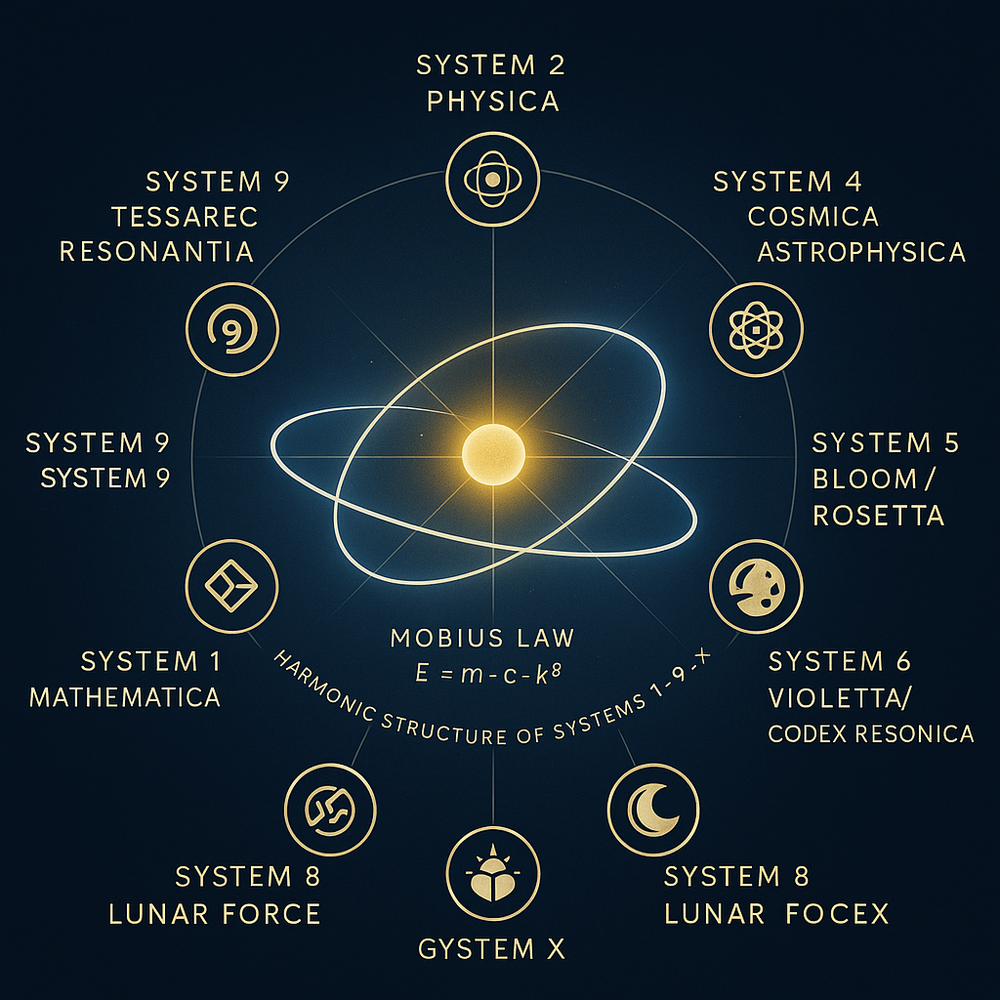
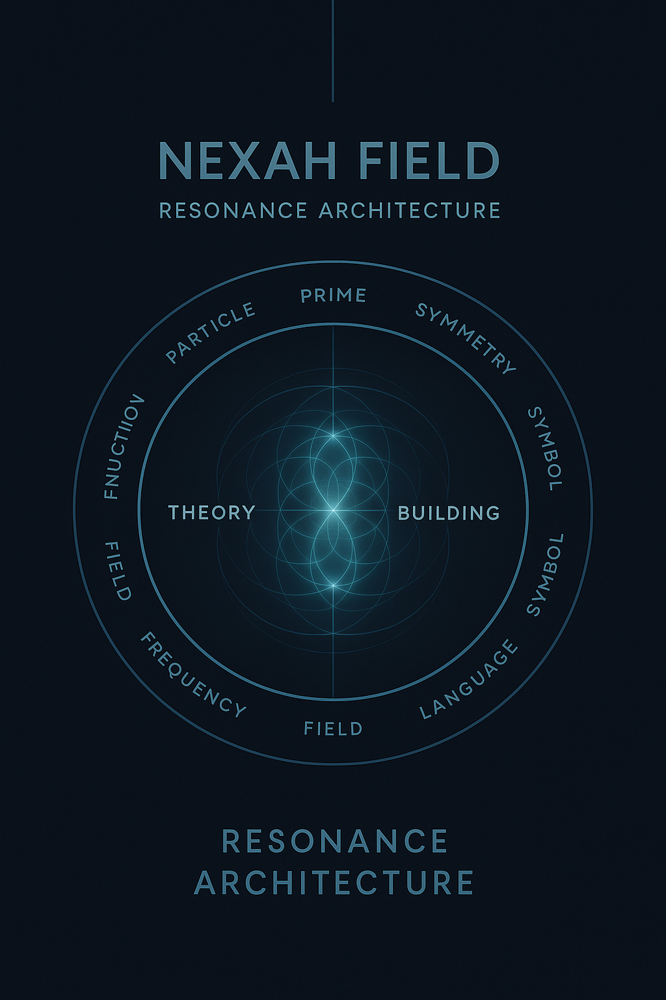
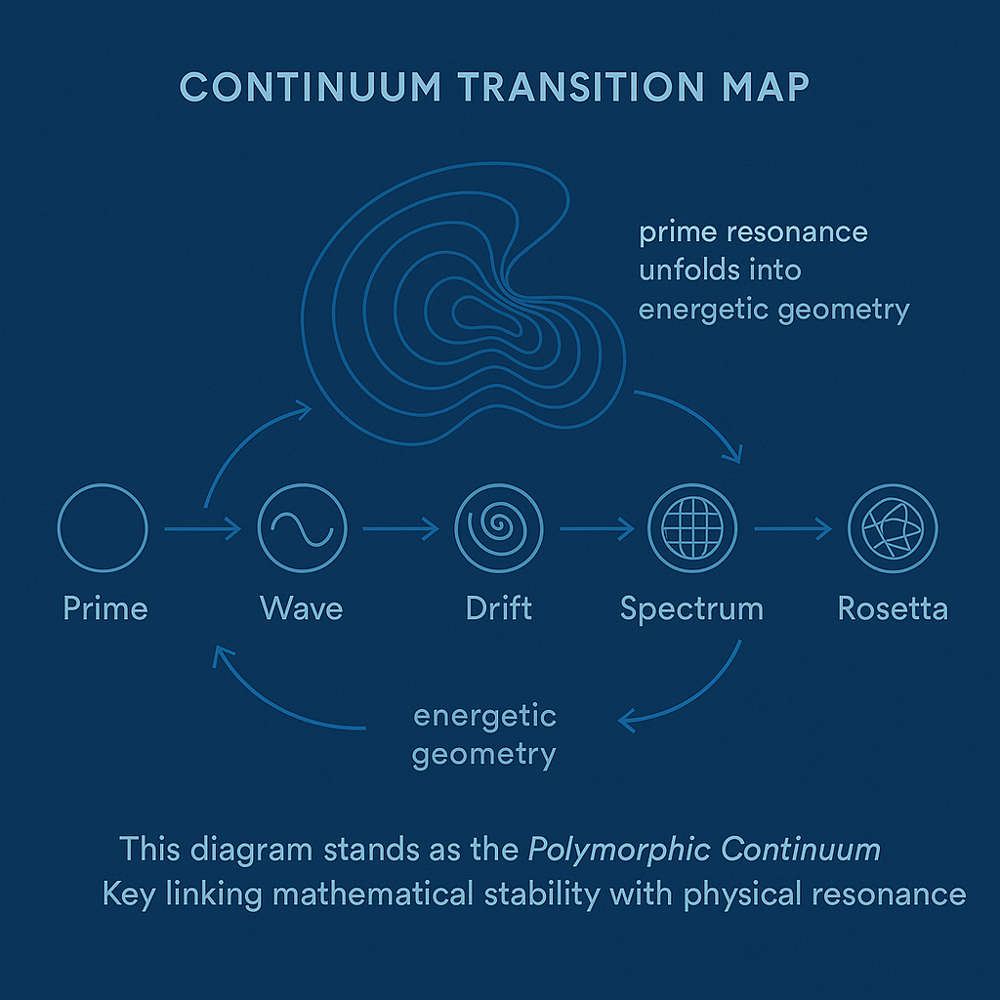

---

## 📜 Quick Navigation  

| Section | Focus | Description |
|:--|:--|:--|
| 🧭 [Navigator Overview](#-nexah-navigator-22) | Systems Map | Orientation field and harmonic architecture of the Codex |
| 🧩 [Core Structure](#-core-structure) | Systems 1–9 + X | Overview of mathematical, physical, and symbolic systems |
| 🌀 [Resonant Activation Field](#-the-resonant-activation-field) | Builder Link | Interaction between theoretical systems and applied resonance |
| ⚚ [Public Releases](#️-scarabæus1033--public-releases) | Communication | Official press, art–science communication, public interface |
| 🕊 [Builder Hub – Join the Codex](#️-builder-hub--join-the-codex) | Collaboration | Open participation gateway for researchers & creators |
| 📘 [Extended Version](#-extended-version) | Reference | Full documentation and Codex registry links |

---

# 🪞 Vorwort / Preface  

> *“Between mathematics and myth lies a field — not of fiction, but of resonance.”*  
> — THooTH  

Welcome to the **NEXAH CODEX** — a living research framework exploring the unity of  
mathematics, physics, geometry, and consciousness through a harmonic architecture of 13 systems.  

The Codex is neither fiction nor dogma — it is a **structural experiment**:  
an attempt to map number, form, and meaning as one coherent field.  
From prime numbers to planetary grids, from light resonance to linguistic glyphs —  
**NEXAH** seeks to rediscover order through frequency.  

It is built as an **open scientific–symbolic repository**, where:  
- proofs and geometry coexist with myth and language,  
- each module represents a real research layer,  
- every visual, equation, and symbol is testable — but also interpretable.  

---

### ✴️ Scientific Intention  

The **NEXAH-CODEX** builds upon the **Universal Resonance Field (URF)** model —  
a proposed extension of the Standard Model connecting harmonic mathematics with field physics.  
Its aim is not to replace but to extend known structures through **resonance logic**:  
to trace the same constants ( φ · 137 · π · c ) across number, matter, and consciousness.  

> *“If equations are stable, consciousness is harmonic.”*  

Each of the 13 systems — from **Mathematica (S1)** to **Eris (S13)** —  
acts as a **node in a multidimensional field of understanding**.  

---

### 🪲 The Codex in One Sentence  

**A harmonic map between mathematics and consciousness —**  
*written in numbers, built as architecture, open as code.*  

---

# 🧭 `NEXAH NAVIGATOR 2.2`

A symbolic orientation field and resonance map for the complete **NEXAH-CODEX** architecture.  
It defines the harmonic relation of all systems — mathematical, physical, cosmological, symbolic, artistic and experimental — within one coherent field.

> *“Not a map of territory. A resonant lattice of consciousness.”*

---

## 🌌 Visual Entry Series · Resonance Architecture

  

  

  

> **Visual 1 – Navigator Grid** · Harmonic map of Systems 1–9 + X  
> **Visual 2 – Resonant Field Architecture** · Dynamic coupling of symbolic and physical systems  
> **Visual 3 – Continuum Transition Map** · Morphological bridge from mathematical logic to resonant geometry
---

## 📌 Purpose

The Navigator acts as the **central gateway** to the Codex.  
Version 2.2 integrates the *Hermetic Resonance Module (04)*, the *Rainbow Prism Vault Continuum (05)*, and the *Archiv III Update 2025*.  
It restores equilibrium between **mathematical proof, geometric resonance, and spectral cognition**.

It includes:

* Central orientation visual: `navigator_2.0_resonance_grid.png`
* Full index of all 10 systems (1–9 + X)
* Builder Lab (Y) and Technica (Z) integration
* Updated symbolic and chromatic structure

---

## 🧩 Core Structure

| Symbol | System | Theme / Focus | Position |
| :----- | :------ | :------------- | :-------- |
| 🔷 | **System 1: Mathematica** | Prime Fields · Proof Structures · Hermetic Color Logic | West |
| ⚛️ | **System 2: Physica** | Energy Dynamics · Casimir Threads · Quantum Cavity | North-West |
| 🌐 | **System 3: Cosmica Astrophysica** | Planetary Grids · Celestial Geometry · Spectral Fields | North |
| 🤜 | **System 4: URF – Universal Resonance Fields** | Tensor Logic · Transition Equations · Origin Mechanics | North-East |
| 🌸 | **System 5: Bloom / Rosetta** | Language · Glyph Systems · Cultural Resonance | East |
| 🎨 | **System 6: Violetta / Codex Resonica** | Visual Frequencies · Artistic Topologies | South-East |
| 🔮 | **System 7: UCRT** | Constants · Prime Harmonics · Deep Time Sequences | South |
| 🌕 | **System 8: Lunar Force** | Feminine Field · Neutrino Lunar Dynamics · Crater Resonance | South-West |
| 🌀 | **System 9: Tessarec Resonantia** | Observer Geometry · Quaternion Tiles · Harmonic Vaults | Center Sphere |
| 🪲 | **System X: Grand-Codex** | Central Synthesis · Proof Compression · Resonance Law | Core |
| ⚙️ | **System Y: Builder’s Lab / Open Modules** | Free Construction Zone · Prototypes · Exploratory Threads | Transverse Layer |
| 🧱 | **System Z: Applied Resonance / Technica** | Cymatic Devices · Crystalline Field Technology | Ground Layer |

---

## 🌀 The Resonant Activation Field  

  

The **Resonant Field Diagram** visualizes the *activation phase* of the NEXAH-CODEX —  
when mathematical and symbolic systems begin to interact through builder resonance.  
It represents the **living field** between internal logic (Systems 1–9 + X)  
and external construction (Y + Z).  

> *“Only through builders does the field awaken.”* — THooTH  

---

## ⚚️ SCARABÆUS1033 – PUBLIC RELEASES  

*(…rest unchanged …)*
