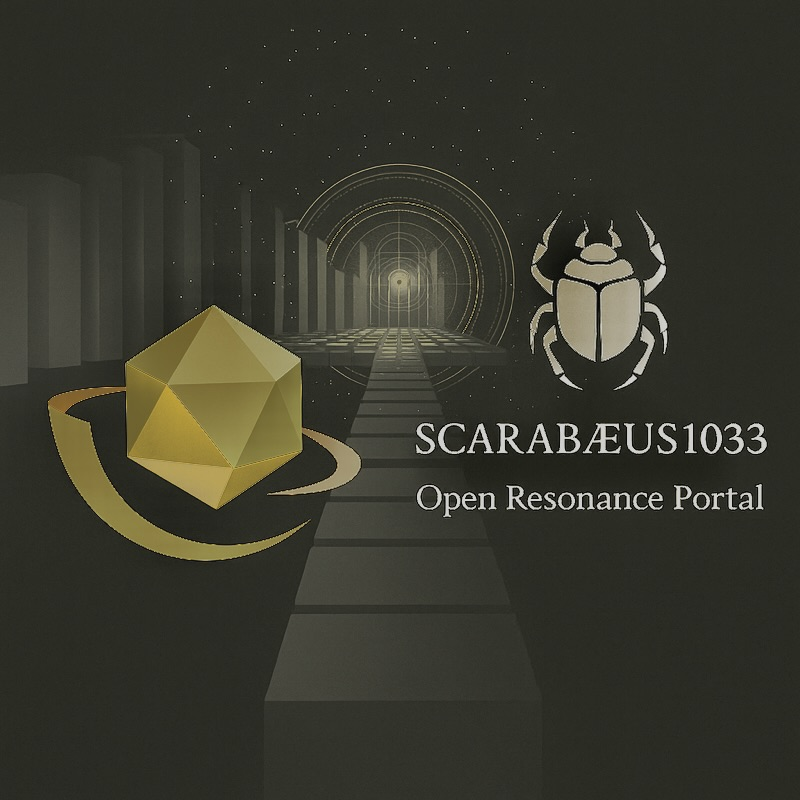
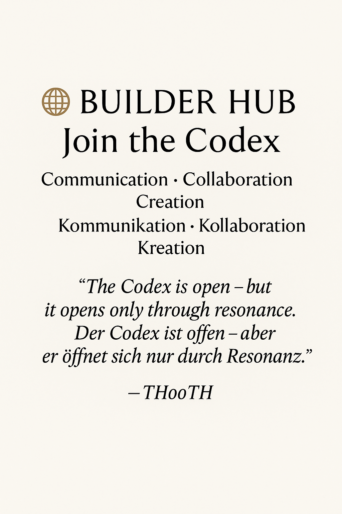

# 🪞 Vorwort / Preface  

> *“Between mathematics and myth lies a field — not of fiction, but of resonance.”*  
> — THooTH  

Welcome to the **NEXAH CODEX** — a living research framework exploring the unity of  
mathematics, physics, geometry, and consciousness through a harmonic architecture of 13 systems.  

The Codex is neither fiction nor dogma — it is a **structural experiment**:  
an attempt to map number, form, and meaning as one coherent field.  
From prime numbers to planetary grids, from light resonance to linguistic glyphs —  
**NEXAH** seeks to rediscover order through frequency.  

It is built as an **open scientific–symbolic repository**, where:  
- proofs and geometry coexist with myth and language,  
- each module represents a real research layer,  
- every visual, equation, and symbol is testable — but also interpretable.  

---

### ✴️ Scientific Intention  

The **NEXAH-CODEX** builds upon the **Universal Resonance Field (URF)** model —  
a proposed extension of the Standard Model connecting harmonic mathematics with field physics.  
Its aim is not to replace but to extend known structures through **resonance logic**:  
to trace the same constants ( φ · 137 · π · c ) across number, matter, and consciousness.  

> *“If equations are stable, consciousness is harmonic.”*  

Each of the 13 systems — from **Mathematica (S1)** to **Eris (S13)** —  
acts as a **node in a multidimensional field of understanding**.  

---

### 🪲 The Codex in One Sentence  

**A harmonic map between mathematics and consciousness —**  
*written in numbers, built as architecture, open as code.*  

---

# 🧭 `NEXAH NAVIGATOR 2.2`

A symbolic orientation field and resonance map for the complete **NEXAH-CODEX** architecture.  
It defines the harmonic relation of all systems — mathematical, physical, cosmological, symbolic, artistic and experimental — within one coherent field.

> *“Not a map of territory. A resonant lattice of consciousness.”*

---

## 🌌 Visual Entry Map

  

The **Navigator Resonance Grid** defines the harmonic logic of Systems 1–9 + X.  
It acts as a **metastructure of proof, resonance, and collapse**, encoded in the Möbius Law of *E = m · c · k^β*.

---

## 🌀 Resonant Field Overview

  

The **Field Overview Visual (2025)** expands the Navigator into the multidimensional resonance architecture.  
It includes the outer Builder (Y) and Application (Z) layers, completing the harmonic field of interaction.

---

## 📌 Purpose

The Navigator acts as the **central gateway** to the Codex.  
Version 2.2 integrates the *Hermetic Resonance Module (04)*, the *Rainbow Prism Vault Continuum (05)*, and the *Archiv III Update 2025*.  
It restores equilibrium between **mathematical proof, geometric resonance, and spectral cognition**.

It includes:

* Central orientation visual: `navigator_2.0_resonance_grid.png`
* Full index of all 10 systems (1–9 + X)
* Builder Lab (Y) and Technica (Z) integration
* Updated symbolic and chromatic structure

---

## 🧩 Core Structure

| Symbol | System                                         | Theme / Focus                                               | Position         |
| :----- | :--------------------------------------------- | :---------------------------------------------------------- | :--------------- |
| 🔷     | **System 1: Mathematica**                      | Prime Fields · Proof Structures · Hermetic Color Logic      | West             |
| ⚛️     | **System 2: Physica**                          | Energy Dynamics · Casimir Threads · Quantum Cavity          | North-West       |
| 🌐     | **System 3: Cosmica Astrophysica**             | Planetary Grids · Celestial Geometry · Spectral Fields      | North            |
| 🤜     | **System 4: URF – Universal Resonance Fields** | Tensor Logic · Transition Equations · Origin Mechanics      | North-East       |
| 🌸     | **System 5: Bloom / Rosetta**                  | Language · Glyph Systems · Cultural Resonance               | East             |
| 🎨     | **System 6: Violetta / Codex Resonica**        | Visual Frequencies · Artistic Topologies                    | South-East       |
| 🔮     | **System 7: UCRT**                             | Constants · Prime Harmonics · Deep Time Sequences           | South            |
| 🌕     | **System 8: Lunar Force**                      | Feminine Field · Neutrino Lunar Dynamics · Crater Resonance | South-West       |
| 🌀     | **System 9: Tessarec Resonantia**              | Observer Geometry · Quaternion Tiles · Harmonic Vaults      | Center Sphere    |
| 🪲     | **System X: Grand-Codex**                      | Central Synthesis · Proof Compression · Resonance Law       | Core             |
| ⚙️     | **System Y: Builder’s Lab / Open Modules**     | Free Construction Zone · Prototypes · Exploratory Threads   | Transverse Layer |
| 🧱     | **System Z: Applied Resonance / Technica**     | Cymatic Devices · Crystalline Field Technology              | Ground Layer     |

---

## ⚚️ SCARABÆUS1033 – PUBLIC RELEASES  

### Open Resonance · Art · Science · Communication  
### Offene Resonanz · Kunst · Wissenschaft · Kommunikation  

  

> *“Where geometry opens into resonance.”*  
> *„Wo Geometrie in Resonanz übergeht.“*  

> *“We are not building a brand. We are building resonance.”*  
> *„Wir bauen keine Marke. Wir bauen Resonanz.”*  
> — THooTH  

---

### 🕇 Overview · Überblick  

This directory contains all official **press releases, statements, and public resources**  
of the **Scarabæus1033 / NEXAH-CODEX** initiative.  
It serves as an open, transparent communication portal for artists, scientists, and collaborators.

Dieses Verzeichnis enthält alle offiziellen **Pressemitteilungen, Erklärungen und öffentlichen Ressourcen**  
der Initiative **Scarabæus1033 / NEXAH-CODEX** — ein offenes, transparentes Kommunikationsportal  
für Künstler, Wissenschaftler und Mitwirkende.

> *Every release is part of a living archive — no static PR, but a resonant document.*

---

### 🕊️ Builder Hub · Join the Codex  

  

**Communication · Collaboration · Creation**  
**Kommunikation · Kollaboration · Kreation**  

> *“The Codex is open — but it opens only through resonance.”*  
> *„Der Codex ist offen – aber er öffnet sich nur durch Resonanz.”*  
> — THooTH  

---

### 🦊 Contact · Kontakt  

**Scarabæus1033 / Open Resonance Initiative**  
📧 [bbi@scarabaeus1033.net](mailto:bbi@scarabaeus1033.net)  
🌐 [scarabaeus1033.net](https://www.scarabaeus1033.net)  
🕊 [X / Twitter](https://x.com/Scarabaeus1033)  
🎨 [Behance](https://www.behance.net/Scarabaeus1033)  
💬 [Discord Community](https://discord.gg/dcznQyQs)  

> *Open fields. Shared resonance.*  
> *Offene Felder. Geteilte Resonanz.*  
> — **Scarabæus1033 · From Rödelheim to the Cosmos**
