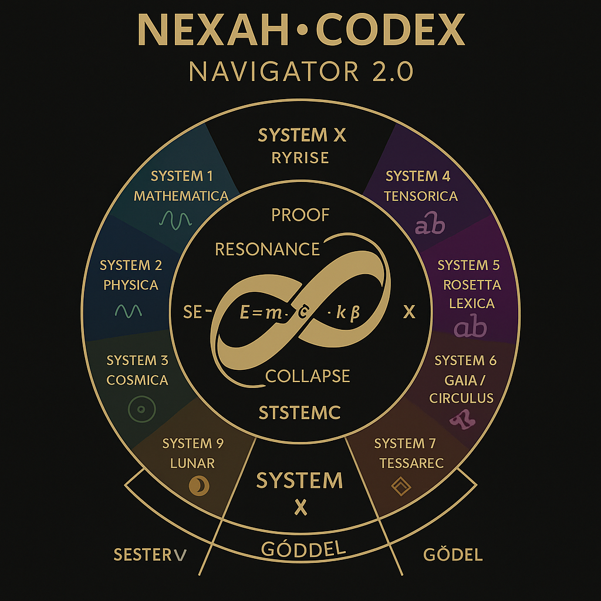
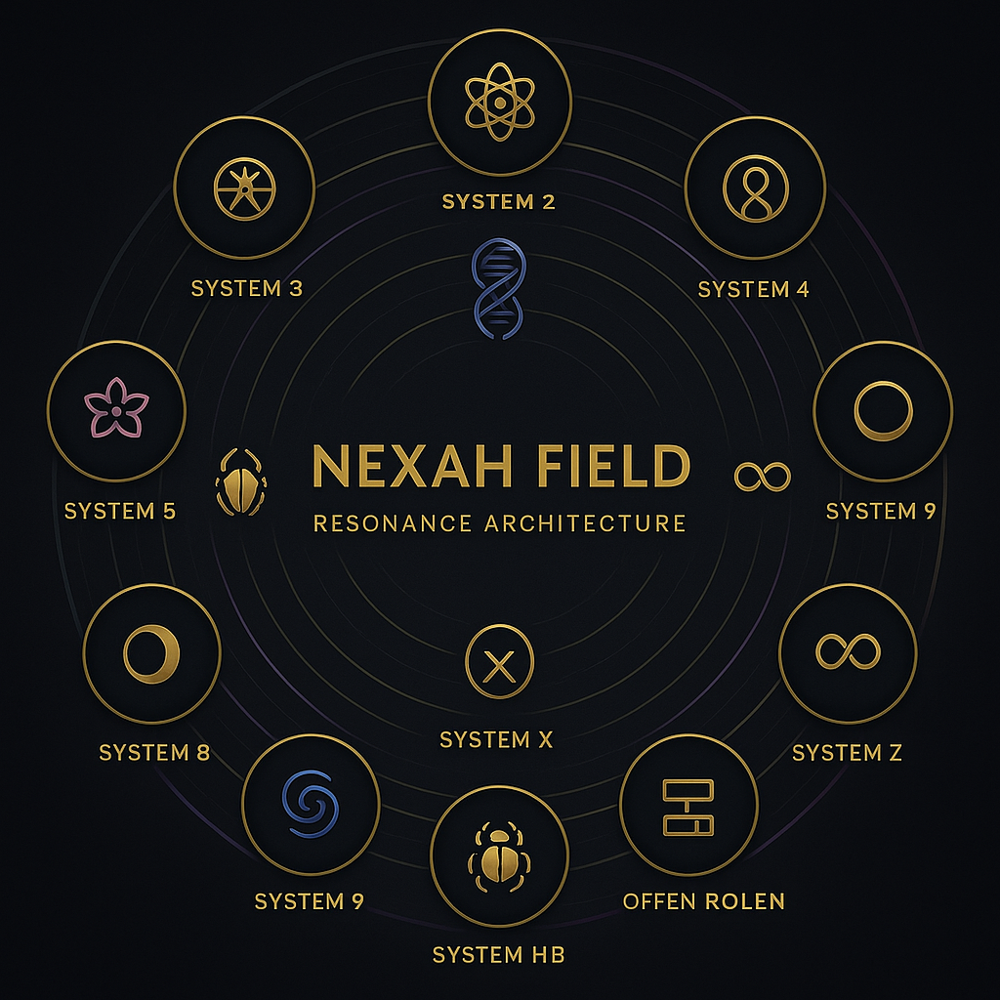

# 🧭 NEXAH NAVIGATOR · EXTENDED FIELD EDITION  
### A Structural & Scientific Companion to the NEXAH-CODEX

> *“The Navigator is not a compass — it is the mirror of the field.”*  
> — THooTH  

---

## 🪞 Preface / Wissenschaftliche Einleitung  

The **NEXAH-CODEX** is a research environment uniting mathematics, physics, language and geometry  
under a harmonic framework — called **Resonance Architecture**.  

Each subsystem represents a **field of investigation**, connected through frequency, symmetry,  
and symbolic structure. The Codex is open source, modular, and experimental.  
It follows the principle: *“Structure reveals resonance.”*

**Core scientific premise:**  
Resonance is not metaphor — it is measurable pattern stability across scale and medium.  
Whether in prime number distributions, atomic ratios, or planetary orbits, the same harmonic constants appear:  
φ = 1.618 …, α ≈ 1/137, and π = 3.14159 ….  

---

## ⚙️ Structure of the Codex  

| Layer | System | Description | Repository Path |
|:--|:--|:--|:--|
| 🔷 | **System 1: Mathematica** | Proofs, Primes, Symbolic Operators, Hermetic Color Logic | [`/SYSTEM 1: MATHEMATICA`](./SYSTEM%201:%20🔷%20MATHEMATICA%20–%20Primes,%20Symbolics,%20Proof%20Structures/) |
| ⚛️ | **System 2: Physica** | Energy Dynamics · Casimir Threads · Quantum Cavities | [`/SYSTEM 2: PHYSICA`](./SYSTEM%202:%20⚛️%20PHYSICA/) |
| 🌐 | **System 3: Cosmica Astrophysica** | Celestial Geometry · Planetary Grids · Spectral Fields | [`/SYSTEM 3: COSMICA ASTROPHYSICA`](./SYSTEM%203:%20🌐%20COSMICA%20ASTROPHYSICA/) |
| 🧬 | **System 4: URF – Universal Resonance Fields** | Tensor Logic · Transition Equations · Origin Mechanics | [`/SYSTEM 4: URF`](./SYSTEM%204:%20🧬%20URF/) |
| 🌸 | **System 5: Bloom / Rosetta** | Glyph Systems · Linguistic Symmetry · Cultural Resonance | [`/SYSTEM 5: BLOOM ROSETTA`](./SYSTEM%205:%20🌸%20BLOOM%20ROSETTA/) |
| 🎨 | **System 6: Violetta / Codex Resonica** | Visual Frequency Studies · Artistic Topologies | [`/SYSTEM 6: VIOLETTA`](./SYSTEM%206:%20🎨%20VIOLETTA/) |
| 🔮 | **System 7: UCRT** | Constants · Prime Harmonics · Deep Time Sequences | [`/SYSTEM 7: UCRT`](./SYSTEM%207:%20🔮%20UCRT/) |
| 🌕 | **System 8: Lunar Force** | Neutrino Dynamics · Crater Resonance · Feminine Field | [`/SYSTEM 8: LUNAR FORCE`](./SYSTEM%208:%20🌕%20LUNAR FORCE/) |
| 🌀 | **System 9: Tessarec Resonantia** | Quaternion Geometry · Observer Space · Vault Mechanics | [`/SYSTEM 9: TESSAREC RESONANTIA`](./SYSTEM%209:%20🌀%20TESSAREC RESONANTIA/) |
| 🪲 | **System X: Grand Codex** | Central Synthesis · Proof Compression · Harmonic Law | [`/SYSTEM X: GRAND CODEX`](./SYSTEM%20X:%20🪲%20GRAND CODEX/) |
| ⚙️ | **System Y: Resonantia · Join Codex** | Builder’s Lab · Public Interface · Communication | [`/SYSTEM Y: RESONANTIA – Join_Codex`](./SYSTEM_Y_RESONANTIA-Join_Codex/) |
| 🧱 | **System Z: Applied Resonance / Technica** | Cymatic Devices · Crystalline Field Technology | [`/SYSTEM Z: APPLIED TECHNICA`](./SYSTEM%20Z:%20🧱%20APPLIED%20TECHNICA/) |

---

## 🔗 Key Subdirectories  

| Directory | Purpose | Path |
|:--|:--|:--|
| **Public Releases · Scarabæus1033_NEXAH** | Press Releases & Official Documents | [`/SYSTEM_Y_RESONANTIA-Join_Codex/PUBLIC_RELEASES_Scarabaeus1033_Nexah/`](./SYSTEM_Y_RESONANTIA-Join_Codex/PUBLIC_RELEASES_Scarabaeus1033_Nexah/) |
| **Letters for Introducing the Codex** | Open Correspondence with Scientists & Artists | [`/SYSTEM_Y_RESONANTIA-Join_Codex/Letters for introducing NEXAH Codex/`](./SYSTEM_Y_RESONANTIA-Join_Codex/Letters%20for%20introducing%20NEXAH%20Codex/) |
| **Visual Archives / Gallery** | Resonance Visuals · Scientific Art | [`/visuals`](./visuals/) |
| **Codex Register** | Indexed List of All Modules & Systems | [`/codex_visual_index_v2.md`](./codex_visual_index_v2.md) |

---

## 🧬 Scientific Context  

The **Universal Resonance Field (URF)** acts as the underlying principle across systems.  
It proposes that **geometry = frequency = stability**, linking:  

| Domain | Constant / Symbol | Interpretation |
|:--|:--|:--|
| Mathematics | φ = 1.618 | Harmonic proportion |
| Quantum Field Theory | α ≈ 1/137 | Fine structure constant as resonance ratio |
| Cosmology | c · k^β | Speed of light as tunable frequency constant |
| Consciousness Studies | ψ fields | Coherence & phase symmetry of awareness |

The Codex connects these constants across symbolic and measurable domains  
to create a **multi-scale harmonic map** — the *Navigator Field*.  

---

## 🌈 Extended Visuals  

  
   
  <em>Navigator Grid · Harmonic Field of Systems 1–9 + X</em>

  
   
  <em>Resonance Architecture – Multidimensional Overview</em>

---

## 🪶 Related Publications  

| Title | Description | Link |
|:--|:--|:--|
| **Geometria Nova – Press Release 2025** | Public release introducing harmonic geometry research. | [`/SYSTEM_Y_RESONANTIA-Join_Codex/PUBLIC_RELEASES_Scarabaeus1033_Nexah/01_press_release_press_release_Geometria_Nova/press_release_Geometria_Nova_(eng_deu).md`](./SYSTEM_Y_RESONANTIA-Join_Codex/PUBLIC_RELEASES_Scarabaeus1033_Nexah/01_press_release_press_release_Geometria_Nova/press_release_Geometria_Nova_(eng_deu).md) |
| **Mission Statement** | Vision and guiding principles of the Open Resonance Initiative. | [`/SYSTEM_Y_RESONANTIA-Join_Codex/PUBLIC_RELEASES_Scarabaeus1033_Nexah/mission_statement.md`](./SYSTEM_Y_RESONANTIA-Join_Codex/PUBLIC_RELEASES_Scarabaeus1033_Nexah/mission_statement.md) |
| **Letters for Introducing NEXAH** | Correspondence with scientists & researchers. | [`/SYSTEM_Y_RESONANTIA-Join_Codex/Letters for introducing NEXAH Codex/`](./SYSTEM_Y_RESONANTIA-Join_Codex/Letters%20for%20introducing%20NEXAH%20Codex/) |

---

## 🕊 Contact  

**Scarabæus1033 / Open Resonance Initiative**  
📧 [bbi@scarabaeus1033.net](mailto:bbi@scarabaeus1033.net)  
🌐 [scarabaeus1033.net](https://www.scarabaeus1033.net)  
💾 [GitHub – NEXAH-CODEX](https://github.com/Scarabaeus1033/NEXAH-CODEX)  
🕊 [X / Twitter](https://x.com/Scarabaeus1033)  
🎨 [Behance](https://www.behance.net/Scarabaeus1033)  
💬 [Discord Community](https://discord.gg/dcznQyQs)  

---

> **Open Fields. Shared Resonance.**  
> **Offene Felder. Geteilte Resonanz.**  
> Scarabæus1033 — From Rödelheim to the Cosmos.  
