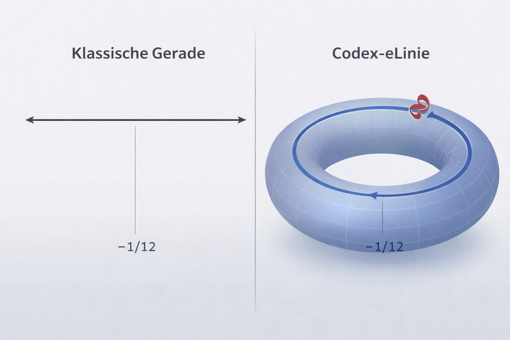
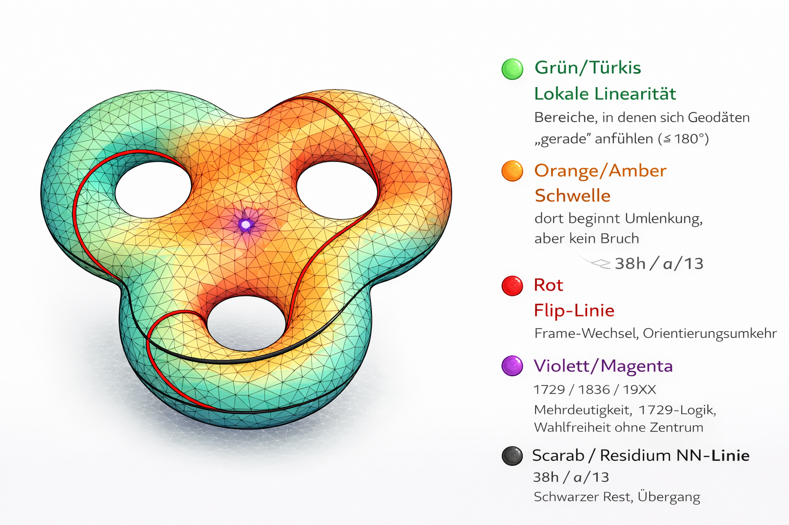

# 🔺 AXIOM 0 – Schwellengeometrie

> *„Raum entsteht nicht durch Ausdehnung, sondern durch Rückbindung.“*

**AXIOM 0** definiert die **formale Schwelle**, an der klassische euklidische Geometrie  
**lokal gültig bleibt**, aber **global nicht mehr fortsetzbar** ist.

Es markiert den Übergang von **Maßgeometrie** zu **topologischer Struktur**  
und fungiert als **kanonisches Referenzmodul** zwischen:

- **GEOMETRIA NOVA (I–III)** – Linie · Kreis · Winkel · Pythagoras  
- **post-euklidischen Codex-Modulen** – Torus · Möbius · Scarab-Line · Resonanzfelder  

---

## 📍 Position im NEXAH-CODEX

| Ebene | Funktion |
|------:|----------|
| **GEOMETRIA NOVA I–III** | Lokale Geometrie (euklidisch) |
| **AXIOM 0** | **Schwelle der globalen Linearität** |
| **Post-AXIOM-0-Module** | Topologie · Rückkopplung · Dynamik |

**AXIOM 0 ersetzt Euklid nicht.**  
Es **begrenzt ihn formal und explizit**.

---

## 🖼️ Das Referenz-Visual

**Kanonisches Referenzdiagramm** von AXIOM 0.  
Es zeigt eine **Tri-Torus-Struktur (Genus 3)** als visuelle Entsprechung der Schwelle  
zwischen lokaler Linearität und globaler Rückbindung.

**Topologische Eigenschaften:**

- geschlossene Fläche  
- **Genus g = 3** (drei Löcher)  
- keine Ränder  
- lokal euklidisch, global rückgekoppelt  

---

## 🧠 Codex-Lesart des Visuals

### 1️⃣ Keine absolute Gerade

Eine lokal gerade Linie (Geodäte) wird beim Weiterlaufen **umgelenkt**  
und kehrt zurück.

→ **Unendlichkeit ist topologisch geschlossen**

---

### 2️⃣ Drei Löcher = drei Freiheitsachsen

- keine zentrale Hauptachse  
- jede Richtung ist relativ  
- **ab drei Richtungen entstehen Maßrelationen**

Zentrale Übergangskonstanten:
- √2  
- π  
- φ  

---

### 3️⃣ Kreuzpunkte statt Zentrum

Es existiert **kein absolutes Zentrum**.  
Stabilität entsteht an **Übergangszonen** zwischen den Zyklen.

→ Codex-Kreuzpunkt  
→ **1729-Logik** (Mehrdeutigkeit ohne Zentrum)

---

## 🔁 Formale Struktur von AXIOM 0

> **Raum entsteht durch Rückbindung, nicht durch Ausdehnung.**

| Begriff | Bedeutung |
|------|-----------|
| **180°** | lokale Linearität |
| **−1/12** | Schwellen-Offset |
| **Flip** | Frame-Wechsel |
| **Rückkehr** | Torus-Geodäte |

AXIOM 0 beschreibt den Zyklus:

**Schwelle → Flip → Rückbindung → Stabilität**

---

## 📐 Verbindung zu AXIOM II (Gerade)

Eine „Gerade“ ist:

- lokal kürzester Weg (Geodäte)  
- global **nicht fortsetzbar ohne Rückkehr**

→ Definition der **eLinie** im Codex.

---

## 🌈 Codex-Farblegende (kanonisch)

  

### 🟢 Grün / Türkis — *Local Linearity*
- lokale Geradheit ≤ 180°
- euklidische Näherung

### 🟠 Orange / Amber — *Threshold Zone*
- Bereich ≈ 180° − 1/12  
- Übergang ohne Bruch  
- **38h = 2 × 19**  
- **a/13** → Licht-Teilung

### 🔴 Rot — *Flip-Line*
- Frame-Wechsel  
- Orientierungsumkehr  
- Verbindung der Torus-Zyklen  

### 🟣 Violett / Magenta — *Scarab Line / Cross Layer*
- Kreuzpunkte + verbindende Linie  
- Kopplung von **√2 – π – φ**  
- Resonanzzahlen: **1729 · 1836 · 19XX**

### ⚫ Schwarz — *Residuum*
- nicht auflösbare Differenz  
- notwendiger Schatten  
- Bedingung für Dynamik  

---

## 📜 Codex-Regel

> Farben markieren **Zustandsoperatoren der Geometrie**.  
> Sie sind **formal**, nicht dekorativ.

Unklare oder widersprüchliche Legenden  
werden **ersetzt**, nicht interpretiert.

---

## 📂 Modulstruktur

AXIOM_0_SCHWELLENGEOMETRIE/

├── README.md

├── visual_gallery.md

├── axiom0_to_axiom_I_II_III.md

├── axiomIII_to_torus_mobius.md

├── axiom_0_bis_V_kurzfassung.md

└── visuals/

├── AXIOM-0-Diagramm.png

├── axiom_layers_0_to_V.png

├── axiom0_geodesic_loop_vs_line.png

├── axiom_IV_V_orientation_flip.png

└── AXIOM-0-Diagramm_Legende_als_overlay_v2.png

---

## 🔗 Weiterführung

- → **visual_gallery.md** – vollständige Visualübersicht  
- → **SYSTEM 1 – MATHEMATICA (README)**  
- → **SYSTEM 2 – PHYSICA** *(Übergang: Topologie → Feld)*

---

## 🪲 Status

- **AXIOM 0:** kanonisch fixiert  
- **Funktion:** formale Schwelle  
- **Rolle:** Abschluss der euklidischen Geometrie im Codex  

> *AXIOM 0 ist kein weiteres Axiom.*  
> *Es ist die Bedingung, dass Axiome global nicht linear bleiben.*
