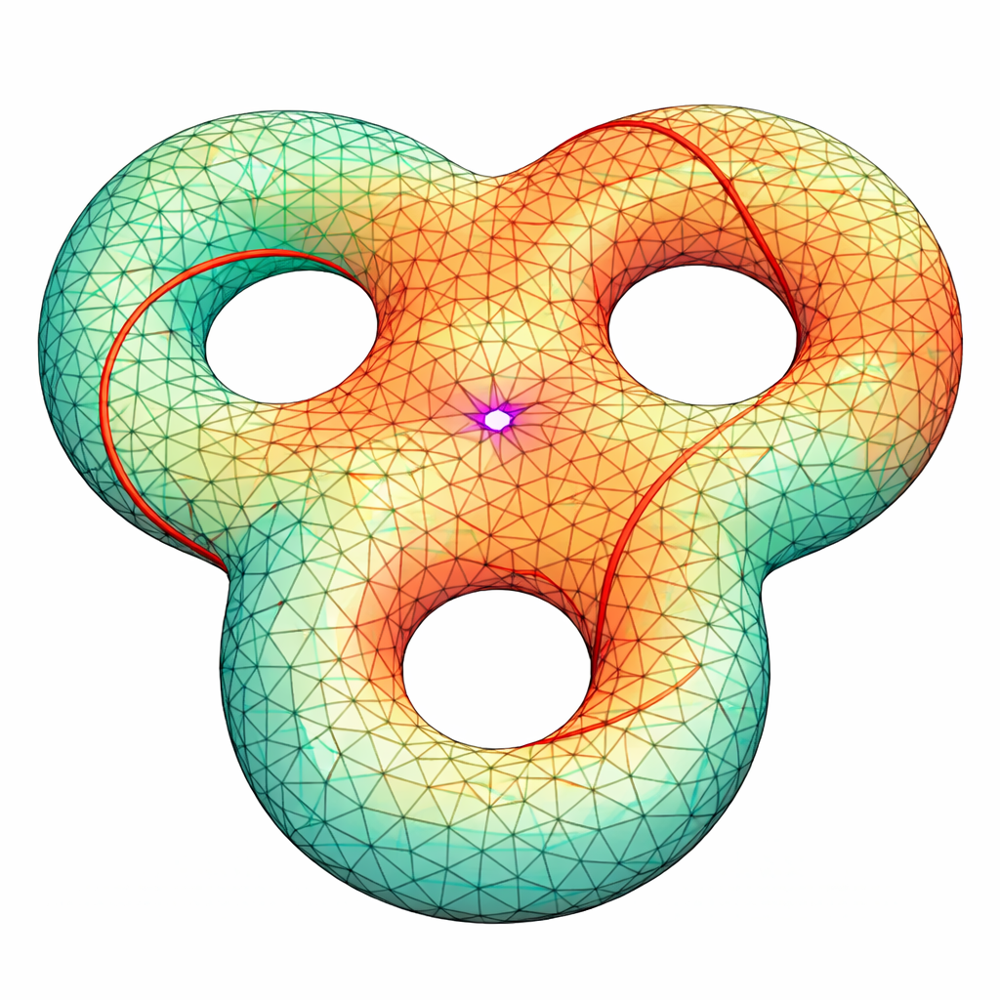
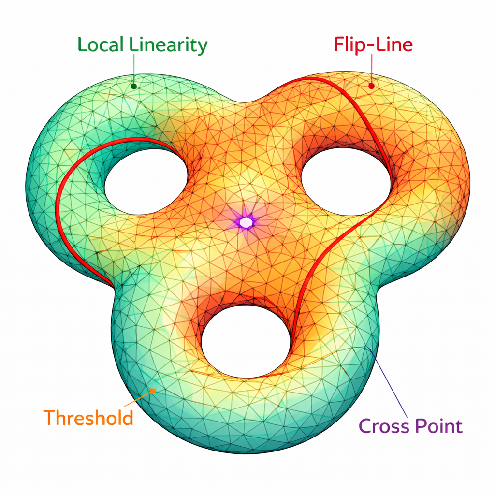
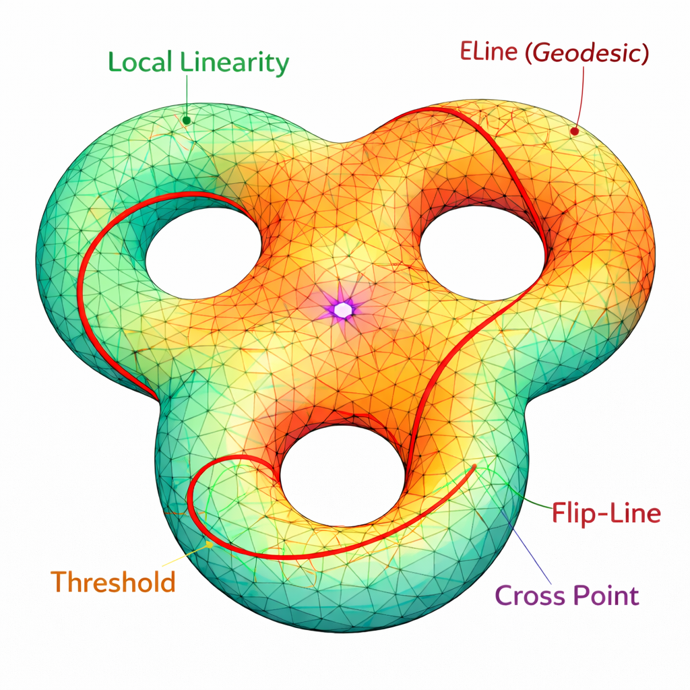
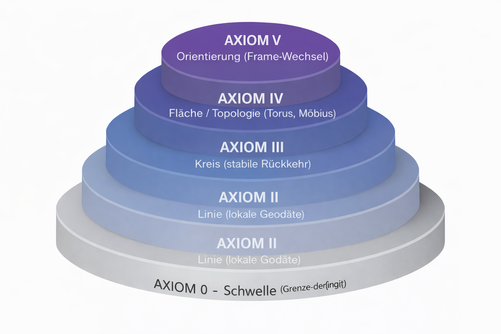

# 🖼️ AXIOM 0 · Visual Gallery

Diese Galerie sammelt **alle kanonischen Visuals** zu **AXIOM 0 – Schwellengeometrie**.  
Sie dient als **visuelle Referenzbasis** für den Übergang von **euklidischer Maßgeometrie**
zu **topologischer Rückbindung**.

> **Hinweis:**  
> Die Visuals sind **keine Illustrationen**, sondern **formale Diagramme**.  
> Jedes Bild repräsentiert eine **strukturelle Aussage**.

---

## 🔷 V0 · Referenzdiagramm (Tri-Torus)

**Bedeutung**
- Geschlossene Fläche
- **Genus 3 (Tri-Torus)**
- Lokale Euklidizität
- Globale Rückkopplung

→ **Visuelle Grundform von AXIOM 0**

---

## 🌈 V1 · Diagramm mit Farblegende

**Zweck**
- Einführung der Codex-Farbcodierung
- Trennung von Linearität, Schwelle, Flip und Kreuzpunkt

→ Vorbereitung der Zustandsoperatoren

---

## 🧭 V2 · Overlay-Legende (kanonisch)

**Kanonische Farblegende**

- 🟢 Local Linearity  
- 🟠 Threshold Zone  
- 🔴 Flip-Line  
- 🟣 Scarab Line / Cross Layer  
- ⚫ Residuum  

→ **Diese Version ersetzt alle früheren Legenden**

---

## ➿ V3 · Erweiterte e-Linien (Geodäten)

**Lesart**
- Geodäten sind lokal gerade
- global jedoch rückgeführt
- keine unbegrenzte Fortsetzung

→ **Definition der eLinie**

---

## 🔁 V4 · Übergangs-Visual (Maß → Struktur)

**Vergleich**

| Klassisch | Nach AXIOM 0 |
|---------|--------------|
| Gerade Linie | Geodäte |
| unbegrenzt | geschlossen |
| Maß dominiert | Struktur dominiert |

→ **Schlüsselvisual für den Übergang zur Topologie**

---

## 🧭 V5 · Orientierung & Flip (AXIOM IV–V)

**Aussage**
- Orientierung ist nicht invariant
- Umlauf kann Frame wechseln
- Beobachterabhängigkeit entsteht

→ Vorbereitung von Möbius- und Nicht-Orientierbarkeit

---

## 🧱 V6 · Axiom-Layer 0–V (Übersicht)

**Struktur**
- AXIOM 0 als Schwelle
- Progression bis Orientierung
- Fundament für Systemübergang

→ **Brücke zwischen System 1 und System 2**

---

## 📌 Navigationshinweis

Empfohlene Leserichtung:

1. `README.md` – formale Definition von AXIOM 0  
2. **Visual Gallery** (dieses Dokument)  
3. `axiom_0_bis_V_kurzfassung.md`  
4. Übergang: `from_axiom0_to_topology.md`  

---

## 🧭 Ausblick

> **Nach AXIOM 0 ist Geometrie nicht mehr linear.**

Die nächsten Module behandeln:
- Torus
- Möbius
- Orientierung
- Rückkopplung
- Topologische Invarianzen

→ **System 2: PHYSICA / TOPOLOGICA**

---

**Status:** vollständig · kanonisch · topologie-bereit
