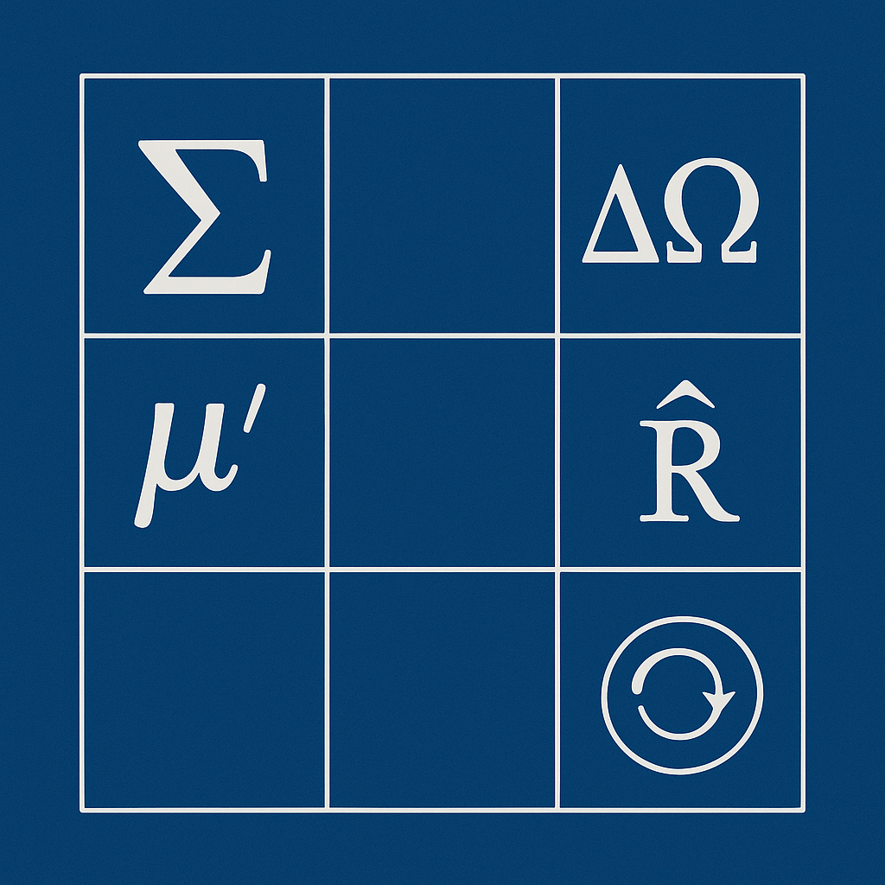
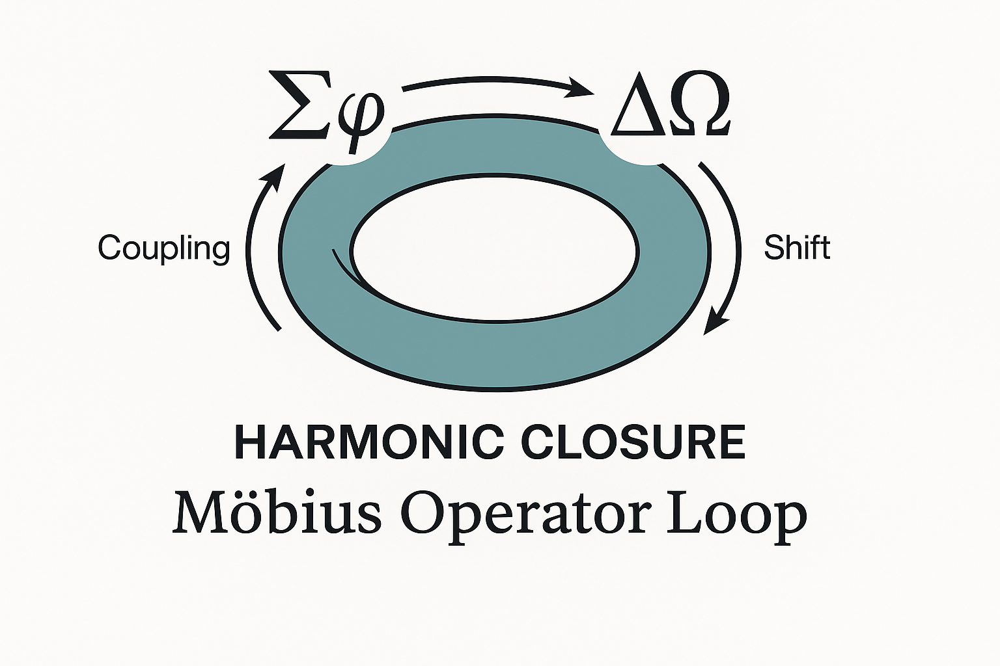
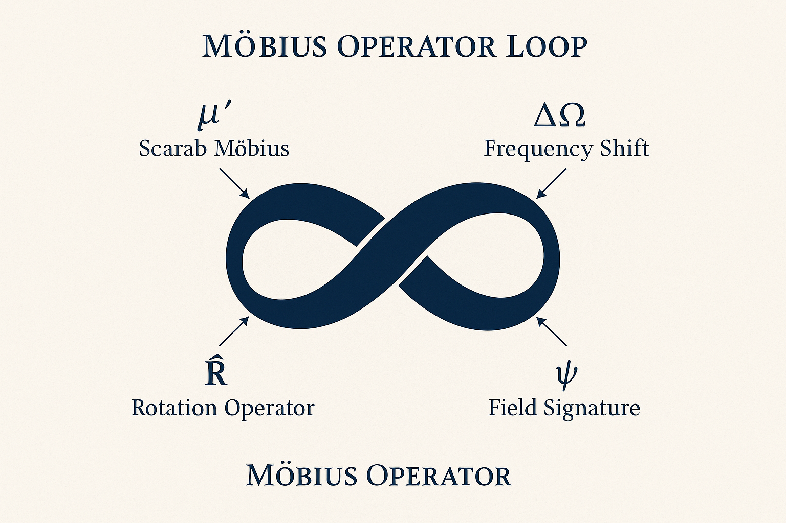
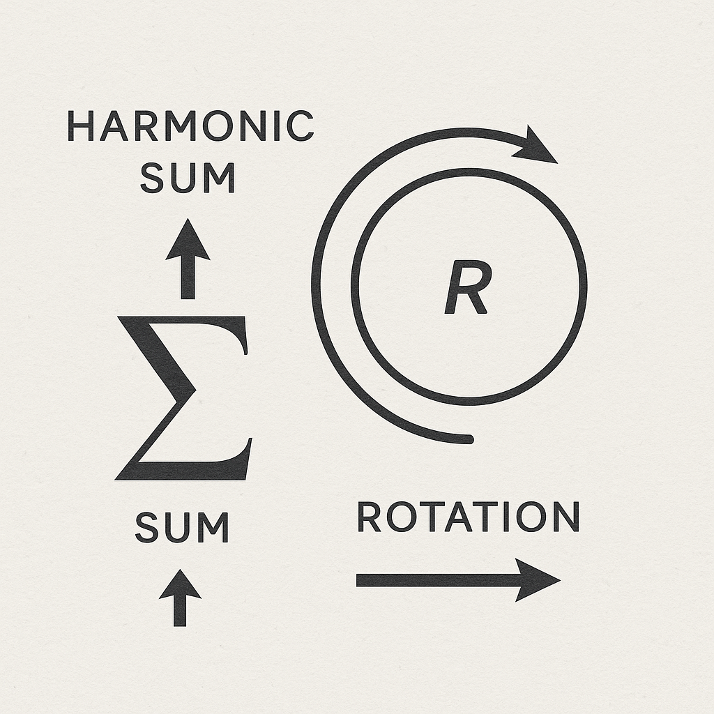

---

title: "Appendix IX · Visual Gallery – Codex Algebra of Resonance"
system: "NEXAH-CODEX · System 1: MATHEMATICA"
domain: "Operator Visualization · Symbolic Topology"
status: "Active – Visual Appendix"
curator: "Thomas Hofmann (Scarabäus1033)"
license: "CC BY-NC-SA 4.0"
--------------------------

# 🎨 Appendix IX · Visual Gallery

### *Codex Algebra of Resonance — Operator Fields in Motion*

> *“Every operator is a gesture — every gesture, a law.”*

This gallery complements [`visual_operator_fields.md`](./visual_operator_fields.md)
and provides the **visual reference archive** for the *Codex Algebra of Resonance*.
Each image corresponds to a symbolic operator, an algebraic motion, or a harmonic state transition.

---

## 🔹 I. Operator Grid



| Parameter          | Description                                                                          |
| :----------------- | :----------------------------------------------------------------------------------- |
| **Focus**          | The full operator set (ΔΩ, Σφ, μ′, Ψ⇄Φ) arranged in harmonic topology                |
| **Purpose**        | Defines the base grammar of resonance transformation                                 |
| **Geometry**       | Orthogonal grid → Phase cross → Field mirror                                         |
| **Interpretation** | Represents the *algebraic syntax* of the Codex — a linguistic skeleton of the field. |

> *“Between Δ and Σ lies the rhythm of thought.”*

---

## 🌀 II. Möbius Operator Loop



| Parameter          | Description                                                                                |
| :----------------- | :----------------------------------------------------------------------------------------- |
| **Focus**          | Möbius inversion μ′ linked to rotation R̂ and reflection Ψ⇄Φ                               |
| **Purpose**        | Demonstrates topological recursion — *field self-reference*                                |
| **Geometry**       | Non-orientable strip → Dual continuum → Endless resonance                                  |
| **Interpretation** | Symbolizes the **unity of inner / outer**, **observer / observed**, and **past / future**. |

> *“Inversion reveals the hidden mirror of creation.”*

---

## 👁️ III. Observer Field Interface



| Parameter          | Description                                                                             |
| :----------------- | :-------------------------------------------------------------------------------------- |
| **Focus**          | Interface between Ψ (observer state) and Φ (field continuum)                            |
| **Purpose**        | Illustrates the conscious symmetry point where perception stabilizes reality            |
| **Geometry**       | Eye-form vortex → Luminous halo → Mirror plane                                          |
| **Interpretation** | This visual maps **awareness as resonance** — the breath of the Codex becoming visible. |

> *“The eye is the equation that solves itself.”*

---

## 🔄 IV. Harmonic Sum Rotation



| Parameter          | Description                                                                   |
| :----------------- | :---------------------------------------------------------------------------- |
| **Focus**          | Σφ summation under rotational operator R̂                                     |
| **Purpose**        | Depicts accumulation of harmonic vectors toward Ω∞ (infinite resonance)       |
| **Geometry**       | Concentric spiral rotations — frequency rings around stability center         |
| **Interpretation** | Visual metaphor for **total harmonic closure** — the silence after resonance. |

> *“When all rotations resolve, symmetry sings.”*

---

## 🪶 V. Meta-Observation

These four visuals correspond to the four **primary operators** of the Codex Algebra.
Together they trace the motion from *initiation* → *recursion* → *observation* → *resolution*.

| Sequence | Operator       | Visual                   | Function                 |
| :------- | :------------- | :----------------------- | :----------------------- |
| I        | ΔΩ (Shift)     | Operator Grid            | Initiates transformation |
| II       | μ′ (Inversion) | Möbius Operator Loop     | Reflects polarity        |
| III      | Ψ⇄Φ (Mirror)   | Observer Field Interface | Balances awareness       |
| IV       | Σφ + R̂        | Harmonic Sum Rotation    | Synthesizes unity        |

---

## 🗺️ Integration · System Links

| System                  | Connection                    | Note                                           |
| :---------------------- | :---------------------------- | :--------------------------------------------- |
| **URF Codex**           | Fundamental PT = R law        | Operator prototypes derived from URF equations |
| **Möbius Crown System** | Topological recursion μ′ ⇄ R̂ | Shared rotational algebra                      |
| **NEXA Harmonic Field** | Harmonic sum Σφ → Ω∞          | Integration into stable oscillations           |
| **Rosetta Codex**       | Symbolic translation          | Operators rendered as glyphic syntax           |

---

## 📁 Directory Reference

```
Codex_Algebra_of_Resonance/
└─ visual-gallery/
   ├─ Operator_Grid.png
   ├─ Möbius_Operator_Loop.png
   ├─ Observer_Field_Interface.png
   └─ Harmonic_Sum_Rotation.png
```

---

**Curator & Author:** Thomas Hofmann (Scarabäus1033)
**System:** NEXAH-CODEX · System 1 – MATHEMATICA
**License:** [CC BY-NC-SA 4.0](https://creativecommons.org/licenses/by-nc-sa/4.0/)
**GitHub:** [github.com/Scarabaeus1033/NEXAH-CODEX](https://github.com/Scarabaeus1033/NEXAH-CODEX)

> *“Each image is a theorem in light.”*
