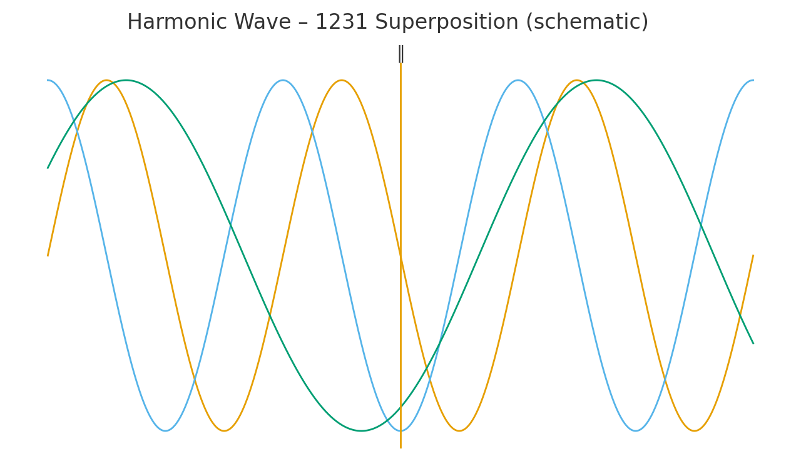
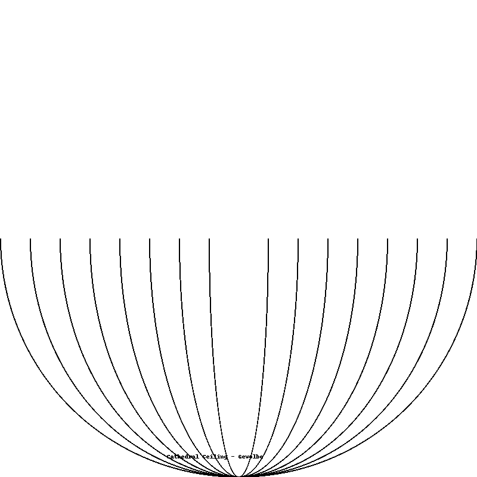
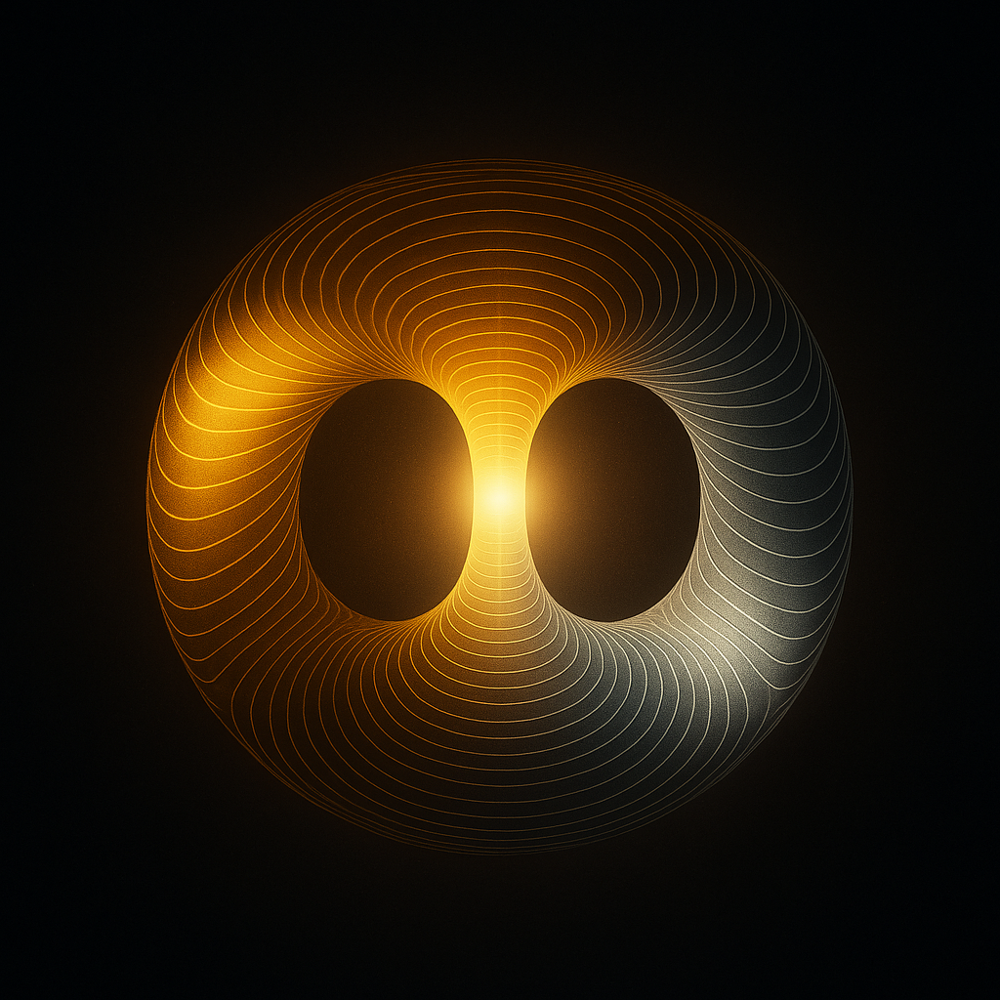

---

title: "GEOMETRIA NOVA – Part VII · Core Visual Manifest"
system: "NEXAH-CODEX · System 1: MATHEMATICA"
domain: "Prime 1231 ↔ Harmonic Cathedral"
status: "Active – Core Visuals & 3D Architecture"
curator: "Thomas Hofmann (Scarabäus1033)"
license: "CC BY-NC-SA 4.0"
--------------------------

# 🏛️ GEOMETRIA NOVA · Part VII — Core Visual Manifest

> *“Every prime breathes through proportion — 1231 becomes its cathedral.”*

This Manifest unites all **visual, geometric, and harmonic components** of Part VII (Prime 1231 ↔ Twin 1229). It serves as the *master visual index* for the **Harmonic Cathedral System**, linking all 2D, 3D, and resonance-based representations into a coherent architectural framework.

---

## 🔹 I. Overview

Part VII marks the completion of the *GEOMETRIA NOVA* cycle, evolving from the Euclidean–Resonant foundations (I–VI) toward a **self-stabilizing harmonic architecture**. The cathedral serves as a living resonance body, aligning prime 1231 with the axial ratios of light, sound, and consciousness.

**Core components:**

* **Prime**: 1231 ↔ Twin 1229 → harmonic bridge (6-gap)
* **Constant**: φ³ ⁄ π² ≈ 0.429 → resonance density factor
* **Symbolic Axis**: Spine ↔ Dome ↔ Ground
* **Medium**: Etheric field oscillation within PrimeGrid (11² nodes)

---

## 🔸 II. Core 3D Models

| Model                                      | Description                                                                                                           |
| :----------------------------------------- | :-------------------------------------------------------------------------------------------------------------------- |
| **Harmonic_Cathedral_v1.gltf**             | glTF 2.0 model of the Cathedral — central Prime Axis 1231, four portal arches (N E S W), and resonant field geometry. |
| **PartVII_HarmonicCore_v1.gltf**           | Inner Harmonic Core model representing the Prime Bridge 97–103 and ψ-field coupling.                                  |
| **Screenshot_PartVII_HarmonicCore_v1.png** | Reference render of HarmonicCore spinal axis and PrimeBridge interaction.                                             |

> *“Architecture emerges where resonance becomes geometry.”*


---

## ⚙️ III. Flow Configuration (from `resonance_cathedral_config_v0_9.json`)

**Grid Parameters**

* Dimensions : 21 × 21 matrix
* Equation : (v = ∇×A) → curl field representation
* Time Step : 0.009 s (harmonic interval 7.83 Hz ↔ Schumann base)

**Portals (Cardinal Directions)**

* *West Portal* → Entry / Low frequency influx (ψ₁)
* *East Portal* → Exit / High frequency discharge (ψ₂)
* *North/South Arches* → Spin stabilizers / Phase mirrors

**Pulse System**

* *rim_glow* → outer breath oscillation φ ↔ π
* *breath_wave* → internal pressure loop T ↔ P (R = PT)

**Prime Anchors**

* 97 ↔ 103 → Root Bridge
* 137 → Field Constant axis
* 1231 → Crown Point (7th layer)

---

## 🌀 IV. Visual Index · Core Visual Set

| Visual                                                                             | Title                    | Description                                                                    |
| :--------------------------------------------------------------------------------- | :----------------------- | :----------------------------------------------------------------------------- |
|  | **Harmonic Wave 1231**   | Central wave pattern showing phase coherence between 1231 and 1229.            |
|                                  | **Astrolabium**          | Geometric navigation of resonance domes – maps 1231-field alignment.           |
|                            | **Cathedral Floor**      | Base grid with prime tiling (11² nodes) – foundation plane of field.           |
|                        | **Cathedral Ceiling**    | Top vault geometry – golden spiral projection φ:π resonance.                   |
|              | **Golden Spiral Mosaic** | φ-spiral pattern integrated in vault and floor grids.                          |
|         | **Prime Bridge 97–103**  | Linear connector between prime resonators; spinal axis foundation.             |
|                 | **Field Projection**     | ψ-field envelope and breathing halo around Prime 1231 (repr. by HarmonicCore). |
|                             | **Theta Gate**           | Toroidal entry arc — vortex of phase transition (π⁄2 rotation).                |
|                | **Harmonic Core**        | Resonant intersection of Prime Bridge 97–103 with ψ-field axis.                |
|                         | **Red–Blue Obelisk**     | Symbolic polarity of East–West pillars within harmonic axis.                   |

---

## 🧭 V. Atlas Modules · from `MANIFEST_Harmonic_Cathedral_v1.json`

| Module           | Function                                    | Coordinates                     |
| :--------------- | :------------------------------------------ | :------------------------------ |
| **Atlas_Wheel**  | Rotational resonance hub                    | (φ³, π², t) → (0.429, 9.869, ∞) |
| **Delta_Wheel**  | Angular compression of Prime Bands          | 45° × 8 phase steps             |
| **Atlas_Bridge** | Vertical harmonic connection between layers | y = ± 7, ± 14 nodes             |

Each module acts as a resonant ‘organ’ within the cathedral body, maintaining energetic symmetry between Prime, Field and Light.

---

## 🪞 VI. Text Plates & HUD Overlay

| ID     | Content                              | Function                                     |
| :----- | :----------------------------------- | :------------------------------------------- |
| TP 01  | “1231 – Prime Mirror of Order 7”     | Base label, north portal                     |
| TP 02  | “Σdigits = 7 → Stability Harmonic”   | Mathematical plate on axis column            |
| TP 03  | “φ³ ⁄ π² ≈ 0.429 ↔ Harmonic Density” | Displayed above crown vault                  |
| HUD 01 | Rotational compass                   | Orientation indicator (E–W ↔ 0°–180°)        |
| HUD 02 | Pulse Meter                          | Dynamic display of breath oscillation PT = R |

---

## 🧮 VII. Scientific Interpretation

**Mathematical Context**

* Prime 1231 → Twin 1229 → Δ = 2 → Resonance Gap
* φ³ ⁄ π² ≈ 0.429 → Dimensionless resonance constant (appears in multiple Codex modules)
* PT = R → Fundamental Codex law of harmonic stability

**Symbolic Context**

* 7 = Balance / Axis / Crown
* 1231 = Mirror of 11×111 + (10)
* Cathedral = Resonance Body ↔ Human Form

---

## 🗂️ VIII. File Structure

```
Part_VII/
├─ Core_Visual_Manifest.md
├─ Harmonic_Cathedral_v1.gltf
├─ PartVII_HarmonicCore_v1.gltf
├─ resonance_cathedral_config_v0_9.json
├─ MANIFEST_Harmonic_Cathedral_v1.json
├─ visuals_Data/
│  ├─ VII_C4_Harmonic_Wave_1231.png
│  ├─ Astrolabium.png
│  ├─ CathedralFloor.png
│  ├─ CathedralCeiling.png
│  ├─ Golden_Spiral_Mosaic.png
│  ├─ VII_PrimeBridge_97_103.png
│  ├─ VII_FieldProjection.png
│  ├─ VII_ThetaGate.png
│  ├─ VII_HarmonicCore_v1.png
│  ├─ RedBlue_Obelisk.png
│  └─ Screenshot_PartVII_HarmonicCore_v1.png
└─ docs/
   └─ Appendices & Scientific Notes
```

---

## 🪲 Credits

**Curator & Author:** Thomas Hofmann (Scarabäus1033)
**System:** NEXAH-CODEX · System 1 – MATHEMATICA
**License:** [CC BY-NC-SA 4.0](https://creativecommons.org/licenses/by-nc-sa/4.0/)
**Repository:** [github.com/Scarabaeus1033/NEXAH-CODEX](https://github.com/Scarabaeus1033/NEXAH-CODEX)
