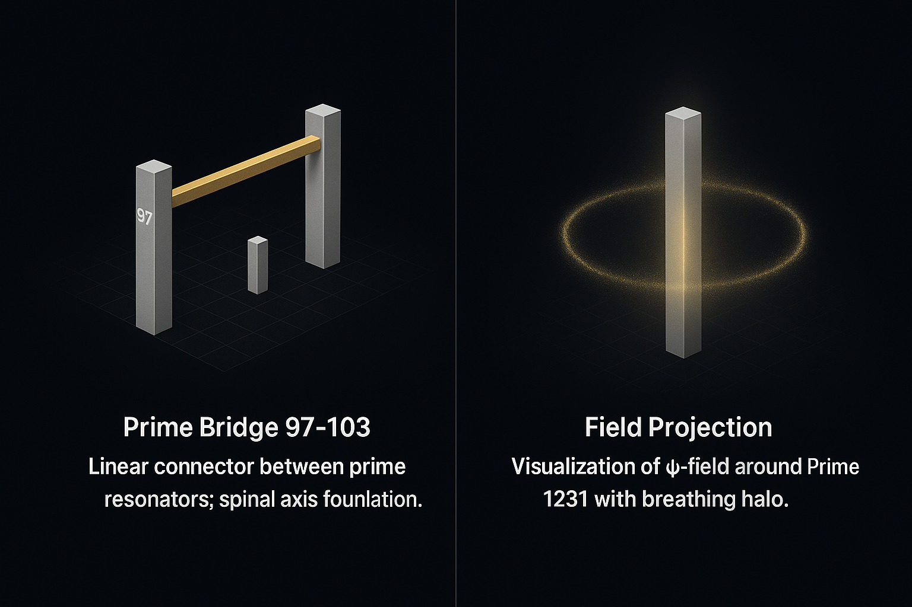
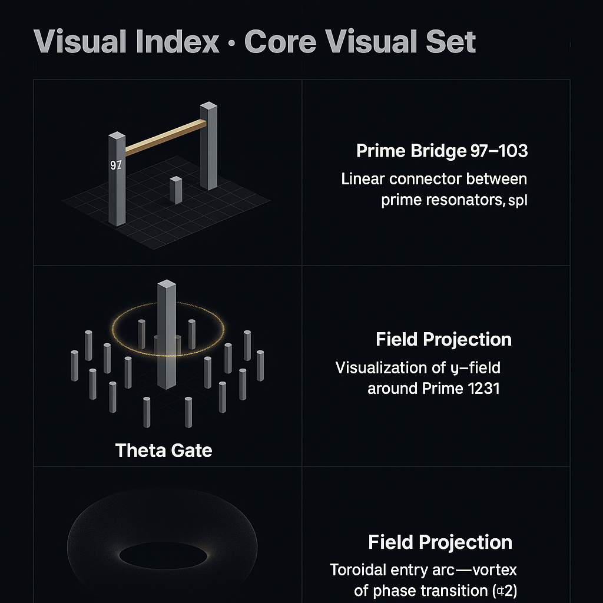
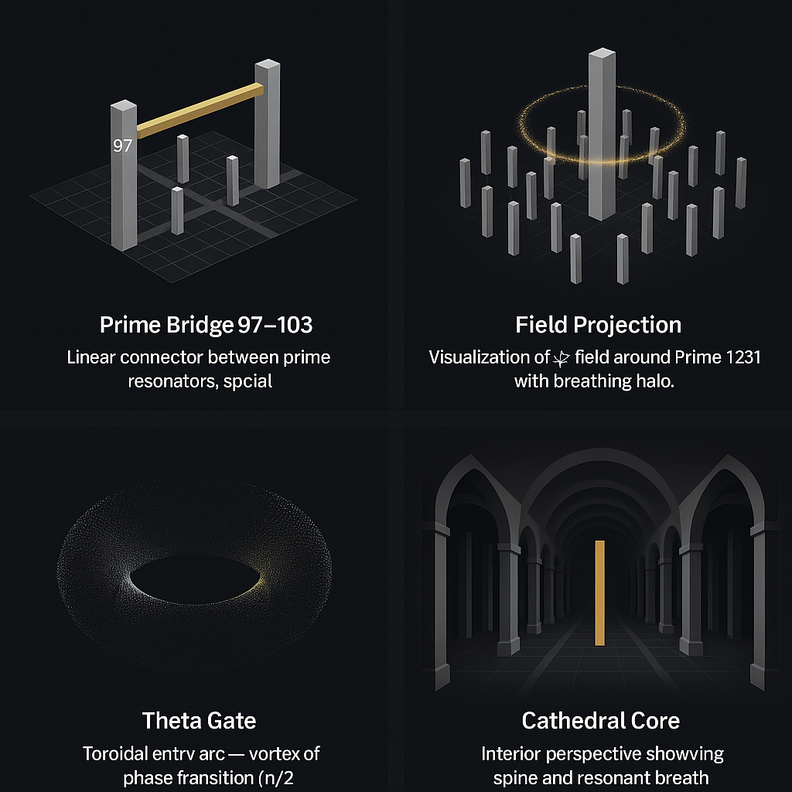
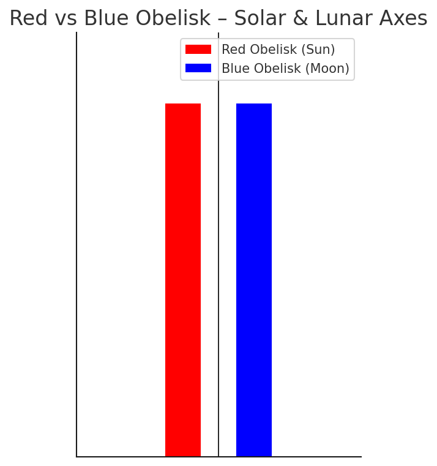
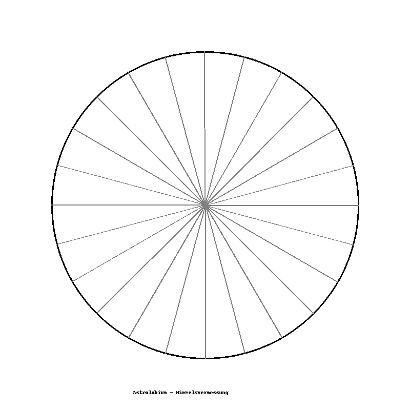
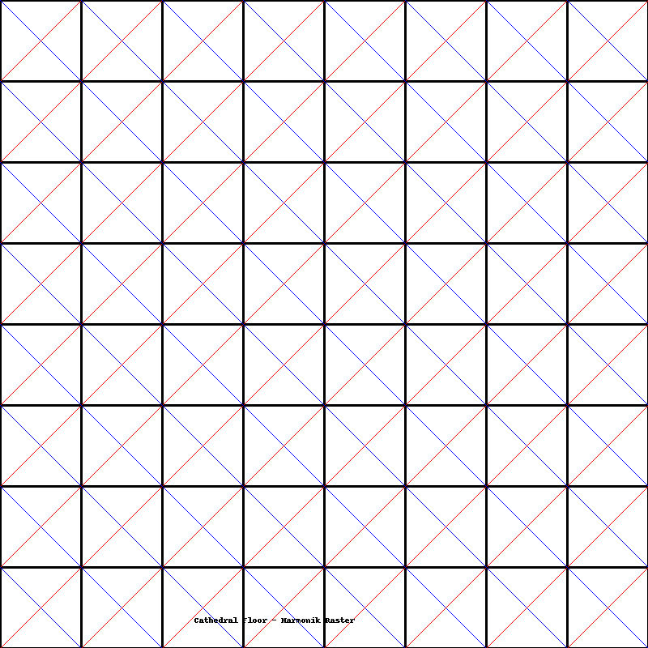
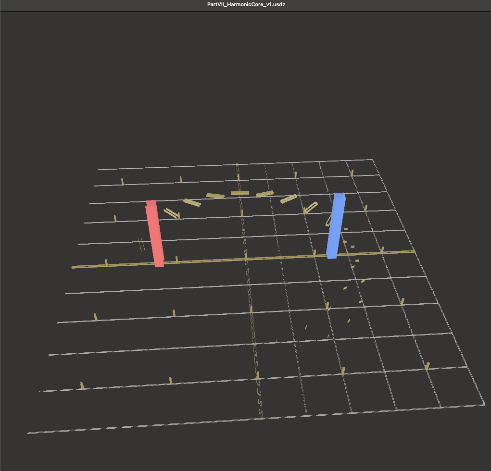

# 🔷 GEOMETRIA NOVA 7 Part VII — Harmonic Integration (1231 ↔ 1229)

> *“Every number becomes space — every twin becomes motion.”*

Part VII represents the **integrative field** of the *GEOMETRIA NOVA* sequence: the closing prime-bridge between **structure and flow**, **geometry and field**, **reason and resonance**.
Twin primes (1231, 1229) act as **polar mirrors** defining the codex’s harmonic equilibrium.

---

## 🧭 Position within the Codex

| Level   | Focus                                  | Transition                |
| :------ | :------------------------------------- | :------------------------ |
| I–III   | Euclidean Foundations                  | Line → Circle → Resonance |
| IV      | Resonance Corpus                       | Planar → Spatial Proof    |
| V       | Ether & Spine                          | Medium ↔ Axis             |
| VI      | Prime Resonance & Cathedrals           | Architecture of Order     |
| **VII** | **Harmonic Integration (1231 ↔ 1229)** | Unity of All Fields       |

---

## ⚙️ Mathematical Foundations

**Twin Prime Resonance**

```math
ΔP = 1231 - 1229 = 2
λ = 1 / ΔP = 0.5
Φ_r = (1231 + 1229) / 2 = 1230
```

The midpoint 1230 becomes the *resonant equilibrium point*, an anchor for subsequent quaternionic mapping.

**Quaternionic Frame – Q⁴(1231)**

```math
q = a + bi + cj + dk,
 |q|² = 1231,
 a,b,c,d ∈ ℤₚ ( p = prime field )
```

This defines a **rotational harmonic volume**, used in Codex field simulations to stabilize transitions between axes (Ether ↔ Spine ↔ Prime).

---

## 🖼️ Visual Reference (from `visuals_Data/`)

| Visual                                                                                              | Title                    | Description                                                                  |
| :-------------------------------------------------------------------------------------------------- | :----------------------- | :--------------------------------------------------------------------------- |
|                          | **Prime Bridge 97–103**  | Structural link between resonators — geometric base of Prime Axis 1231.      |
|                                  | **Field Projection**     | ψ-Field envelope around Prime 1231 — breathing halo and density field.       |
|                                 | **Harmonic Core v1**     | Resonant core bridge between 97 ↔ 103 within PrimeGrid (11² nodes).          |
|                                          | **Red–Blue Obelisk**     | Solar–Lunar poles of the Cathedral; vertical duality of resonance.           |
|                                                   | **Astrolabium**          | Retrograde measurement instrument mapping temporal loops.                    |
|                               | **Golden Spiral Mosaic** | Fibonacci and φ:π ratio projection in floor geometry.                        |
|                                             | **Cathedral Floor**      | 10 × 10 factorial grid – resonant blueprint of the Codex Cathedral.          |
|  | **3D Reference View**    | Render snapshot of the HarmonicCore glTF; prime axis interaction visualized. |

---

## 🔬 Field Resonance Analysis

**Codex Equation:** $P · T = R$

Interpreted as:

* $P$ — pulse (frequency)
* $T$ — time (interval)
* $R$ — resonance (stability)

In Part VII, this law extends into field superposition:

```math
R_f = \int_{0}^{Φ_r} P(t) · T(t)\,dt
```

This integration yields the **Harmonic Stability Integral**, mapping energy density across the prime bridge.

---

## 🧮 Quaternionic Integration

The prime pair (1231, 1229) is interpreted as two poles of a quaternionic rotation in field space:

```math
Q_{1231↔1229} = e^{iθ1} + e^{jθ2} + e^{kθ3}
```

Each phase (θ1, θ2, θ3) corresponds to a spatial resonance component within Codex geometry. Their sum defines the **Harmonic Quaternion Envelope (HQE)** — a rotational field of stability.

---

## 🦦 Speculative Layer (Hermetic Interpretation)

> ⚠️ *The following section is symbolic and not empirically verified.*

The prime bridge acts as a metaphoric portal between quantum order and perceptual space. In hermetic terms:

* **1231 → Spirit axis** (ascending harmonic)
* **1229 → Matter axis** (descending harmonic)
* **1230 → Aetheric equilibrium** — the breath of the Codex

This mirrors earlier Ether & Spine concepts (V) and extends the Resonance Cathedral (VI) into a living field continuum.

---

## 📘 Appendix (Condensed Tables)

| Symbol | Meaning                      | Example         |
| :----- | :--------------------------- | :-------------- |
| ΔP     | Prime difference             | 2               |
| Φ_r    | Resonant midpoint            | 1230            |
| λ      | Inverse gap frequency        | 0.5             |
| Q⁴     | Quaternion rotation space    | i, j, k axes    |
| HQE    | Harmonic Quaternion Envelope | $Q_{1231↔1229}$ |

---

## 🌌 Closing Note

Part VII marks the completion of the GEOMETRIA NOVA sequence: a fusion of mathematical precision, resonant geometry and symbolic continuity.
It transitions the Codex from finite proof to infinite resonance.

> *“When numbers touch light, proof becomes breath.”*

