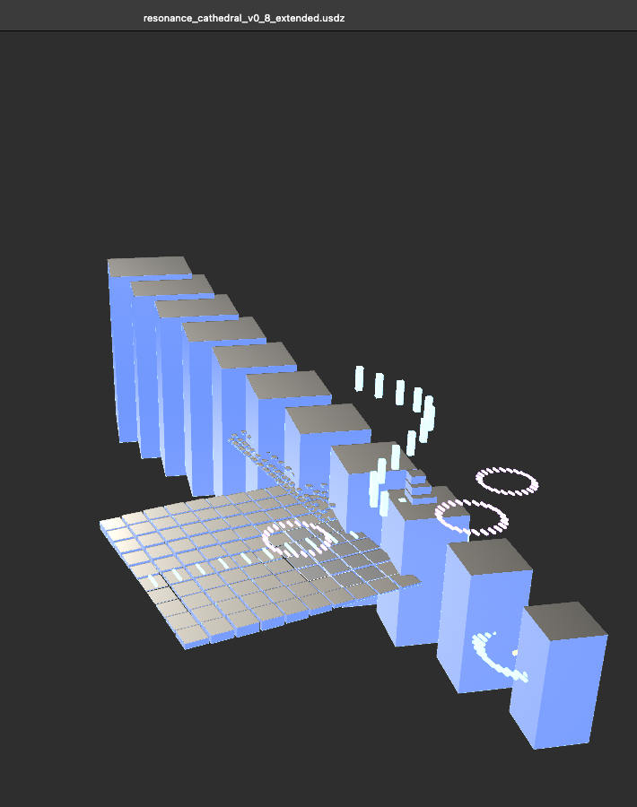
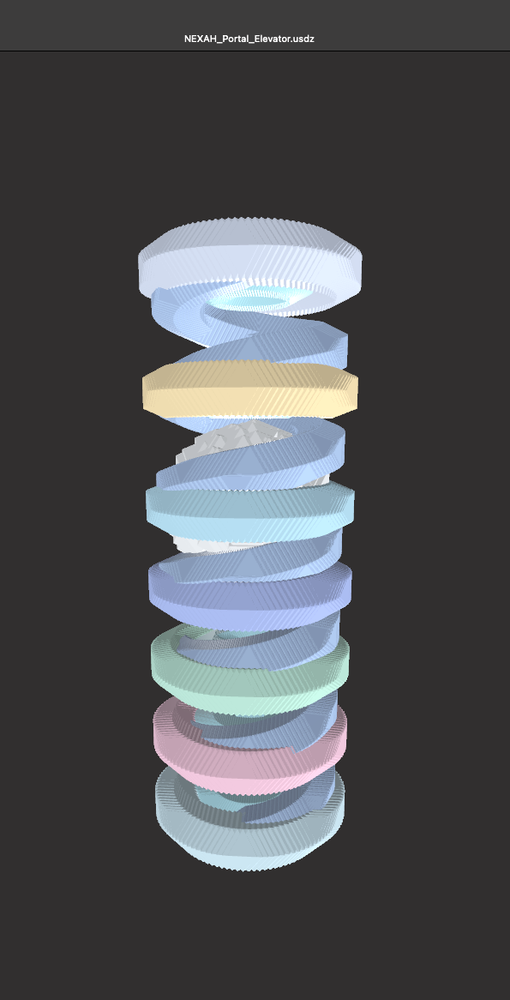
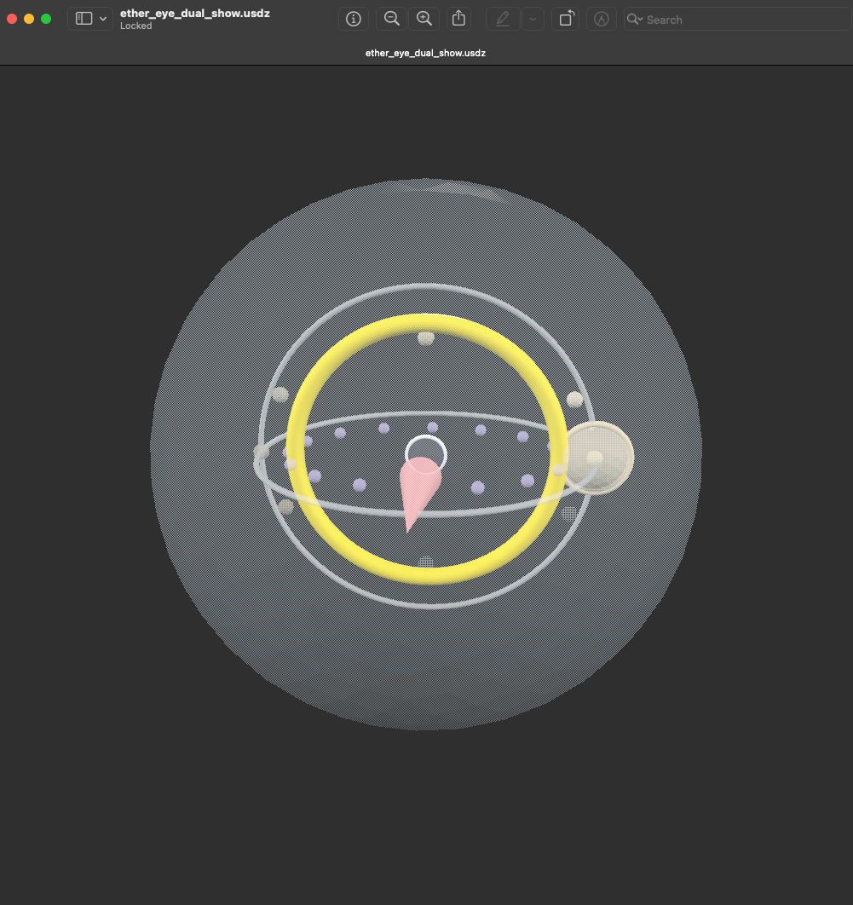
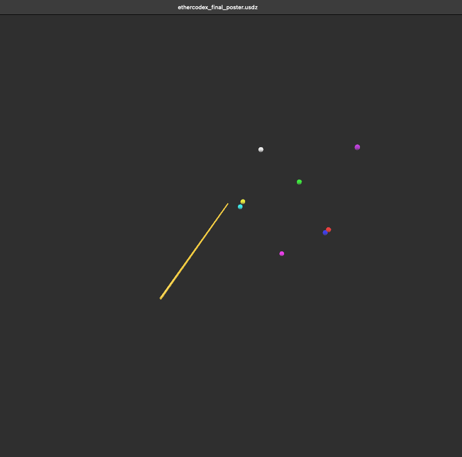
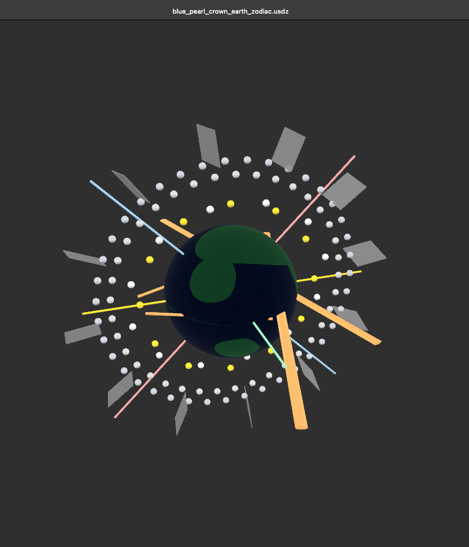
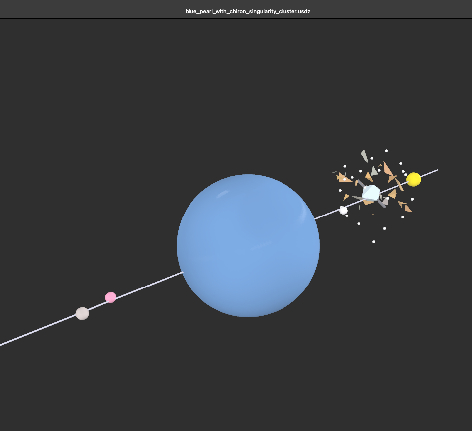
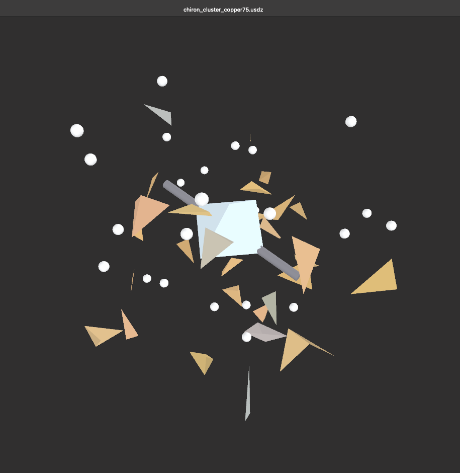
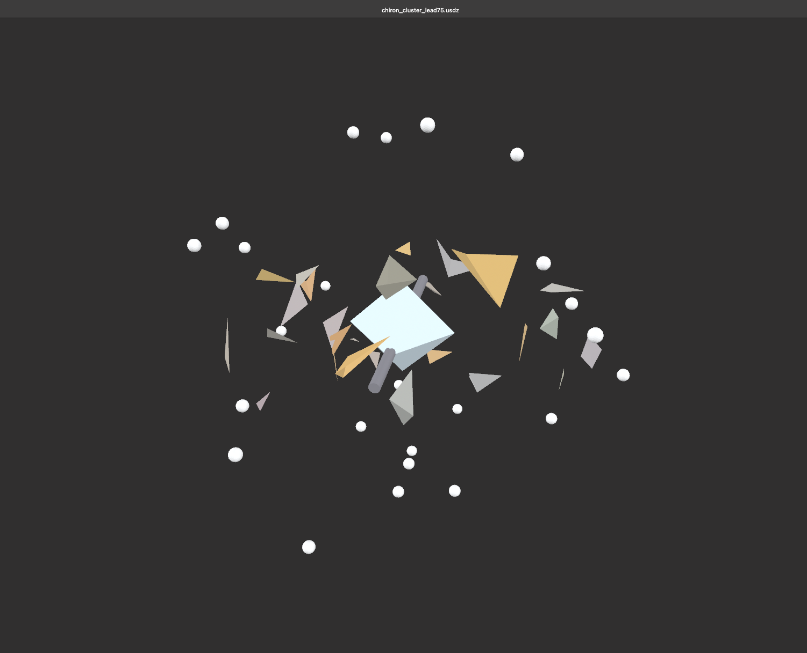
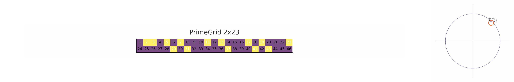
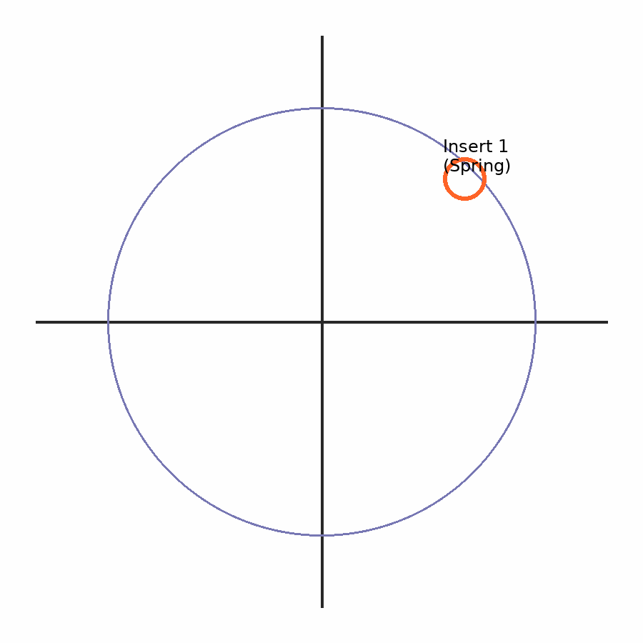

# GEOMETRIA NOVA · Part V — GLB / GIF Manifest  
_“Ether breathes through geometry — geometry becomes motion.”_  

_generated: 2025-10-07_

---

## 📂 GLB Models

| File | Description | Formula / Core Relation |
|:--|:--|:--|
| [ether_eye_dual_show.glb](./glb/ether_eye_dual_show.glb) | Dual stream interference of two etheric waves; base for ψ-field coupling | \( I = I_1 + I_2 + 2\sqrt{I_1 I_2}\cos \Delta\phi \) |
| [ethercodex_final_poster.glb](./glb/ethercodex_final_poster.glb) | Central Codex layout; axes + harmonic lattice composition | symbolic visual synthesis |
| [blue_pearl_crown_earth_zodiac.glb](./glb/blue_pearl_crown_earth_zodiac.glb) | Planetary alignment crown; 12 zodiacal field anchors | \(V_n = \frac{4}{3}\pi r_n^3\) |
| [blue_pearl_with_chiron_singularity_cluster.glb](./glb/blue_pearl_with_chiron_singularity_cluster.glb) | Chiron–singularity bridge; nested resonance field | \(r_{n+1}=α r_n\) |
| [chiron_cluster_copper75.glb](./glb/chiron_cluster_copper75.glb) | Copper-phase crystalline network | harmonic φ-lattice |
| [chiron_cluster_lead75.glb](./glb/chiron_cluster_lead75.glb) | Lead-phase density cluster (heavy-ion resonance) | field mass-gradient test |

---

## 🔷 Core Resonance Structures

| ID | Model | Description | Preview |
|:--|:--|:--|:--|
| G07 | **Resonance Cathedral v0.8 Extended** | Harmonic step-array with embedded field loops — symbolizes the standing-wave architecture of the Codex. |  |
| G08 | **ETHER MODEL Θ–Tao–Dao** | Toroidal double-lemniscate coupling — depicts the breathing transition between dual resonance streams. |  |
| G09 | **NEXAH Portal Elevator** | Vertical frequency spine — stacked harmonic discs forming the cosmic elevator of Ether & Spine. |  |

---

## 🖼️ Screenshots

| Image | Preview | Notes |
|:--|:--|:--|

|  | Etheric dual stream | ψ-field interaction |
|  | Codex overview | composition layout |
|  | 12-axis field crown | spectral balance |
|  | Inner-core resonance | α-spiral nested system |
|  | Copper-grid density | metallic resonance study |
|  | Lead cluster mass | phase contrast structure |

---

## 🎞️ GIF Visual Gallery

| Animation | Description |
|:--|:--|
|  | Composite rotation of prime matrices and Janus bridge |
|  | Vertical harmonic oscillation showing breathing field |

---

## 📜 Manifest Metadata (JSON)

```json
{
  "manifest_version": 1.0,
  "collection": "GEOMETRIA_NOVA_Part_V",
  "type": ["GLB", "GIF"],
  "count": 8,
  "updated": "2025-10-07",
  "author": "Thomas Hofmann (Scarabäus1033)"
}

🔮 Purpose

This manifest serves as the linking field between geometry (GLB objects) and motion (GIF visuals).
Each object represents a resonant frequency state within the Codex architecture — observable, measurable, transcendable.

“The ether breathes, the spine remembers, and geometry becomes alive.”
