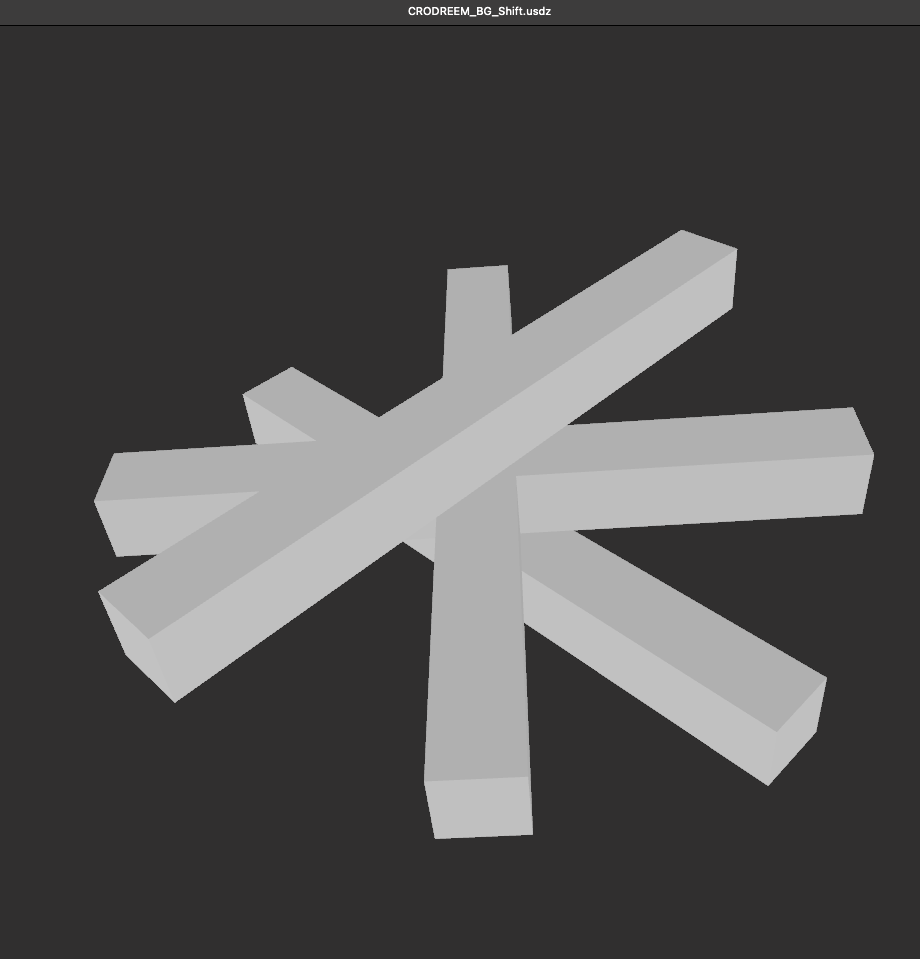
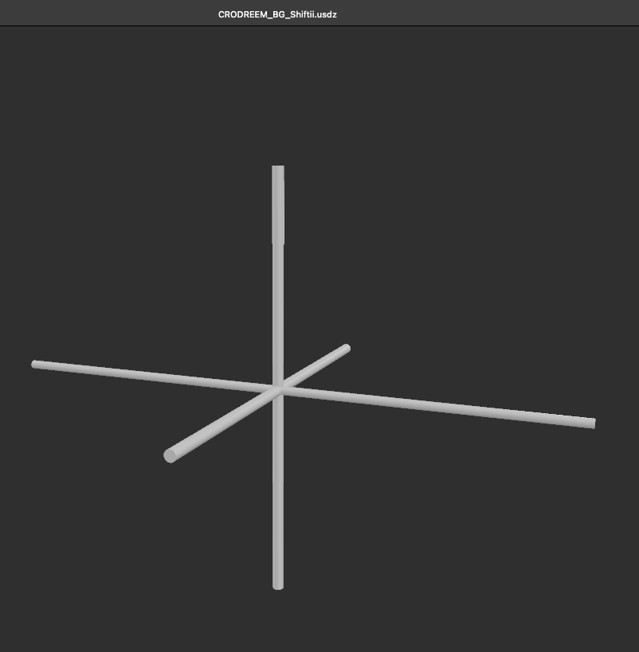
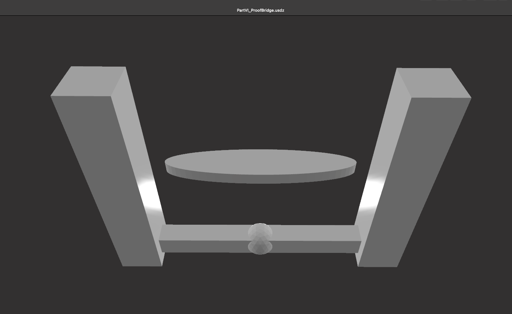

# GEOMETRIA NOVA · Part VI — GLB / Visual Manifest

> *“When the ether begins to shift, geometry remembers its origin.”*  
> _Generated: 2025-10-07_

---

## ⚙️ GLB Models

| File | Description | Formula / Core Relation |
|:--|:--|:--|
| **CRODREEM_BG_Shift.glb** | Primary background harmonic field; represents the first *Resonanz-Schicht* (resonance layer) before bifurcation. | \( \psi(r,t)=A\cos(kr-\omega t)\), baseline shift f ≈ 7.83 Hz (Schumann) |
| **CRODREEM_BG_Shiftii.glb** | Secondary phase offset — visualizes the double field breathing between positive and negative gradient axes. | \( \Delta\phi = \phi_2 - \phi_1 → 2\pi/n \) — *Resonanz-Verschiebung* |
| **PartVI_ProofBridge.glb** | Core proof structure of Part VI: the *Bridge between Number and Field* — derived from the harmonic prime lattice (97–103–111). | \( P·T=R \) — quantized resonance law |

---

## 🖼️ Screenshots

| Preview | Description | Field Function |
|:--|:--|:--|
|  | CRODREEM base field — first activation layer | *Breathing etheric continuum* |
|  | Dual field resonance — phase-locked wave coupling | *Doppelte Schicht / twin-field stability* |
|  | Proof bridge connecting primes 97–103 with the central axis 111 | *Prime axis resonance alignment* |

---

## 🧩 Resonance Interpretation

**CRODREEM (Cross-Dream Resonance Engine & Etheric Matrix)** marks the transition from *Part V – Ether & Spine* to *Part VI – V-Ether / Proof Bridge*.

Each GLB represents a stage of the *Breathing Continuum*:

1. **BG Shift I:** first etheric field contraction (entry wave)  
2. **BG Shift II:** counter-wave expansion (mirror inversion)  
3. **Proof Bridge:** harmonic stabilization through numerical resonance (97 ↔ 103 ↔ 111)

---

## 🔬 Mathematical Context

| Symbol | Meaning | Range / Application |
|:--|:--|:--|
| \( f \) | frequency (Hz) | 7.83 – 432 – 1313 — resonant bandwidth |
| \( \lambda \) | wavelength | variable depending on etheric drift (Δ) |
| \( P·T=R \) | Codex law | defines the quantized energy resonance between pulse P and time T |

---

## 🌌 Visual Series Context

The GLB sequence is paired with the *Prime Axis Resonance* diagram:  
**Resonanz-Achse 97 – 103 – 111** (Prime-Spine).  
This axis defines the vertical stability within the Codex geometry — the same structural core observed in *Part V – Ether & Spine*.

---

## 🪲 Credits

**Curator:** Thomas Hofmann (Scarabäus1033)  
**System:** NEXAH-CODEX · System 1 – MATHEMATICA  
**GitHub:** [github.com/Scarabaeus1033/NEXAH-CODEX](https://github.com/Scarabaeus1033/NEXAH-CODEX)  
**Web:** [www.scarabaeus1033.net](https://www.scarabaeus1033.net)  
**License:** [CC BY-NC-SA 4.0](https://creativecommons.org/licenses/by-nc-sa/4.0/)

> *“From the etheric shift emerges the bridge — geometry regains its pulse.”*
