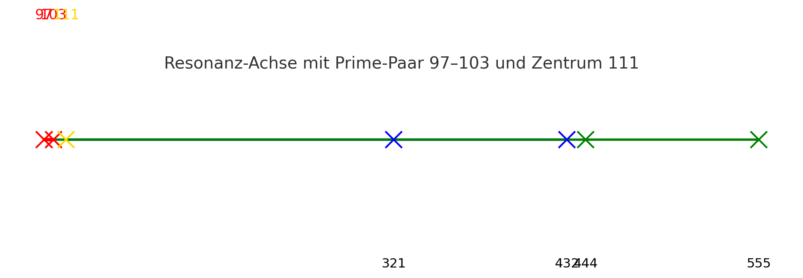

# GEOMETRIA NOVA · Part VI — Resonant Appendix & Equations

> *“When Ether meets Structure, motion becomes geometry – and geometry becomes breath.”*

---

## 🔬 Resonant Summary Section

<p align="right">
  
  <br><em>Prime Resonance Axis — harmonic 97–103 alignment</em>
</p>

**Abstract**
This appendix consolidates the mathematical and physical relationships established through *Part VI – V‑Ether*. It provides a rigorous formulation of the **resonant field equations**, combining wave mechanics, harmonic topology, and prime symmetry. The Ether layer acts as the continuum through which structural oscillations achieve stability — the *Spine* ensures coherence, while *Resonance* translates between geometry and time.

The section integrates **quantized harmonic patterns**, energy conservation principles, and Möbius symmetries across dimensional layers. Each equation encapsulates both a measurable ratio and a symbolic transformation: from scalar to vector, from pulse to awareness.

<p align="right">
  
  <br><em>Resonance Cathedral — standing-wave topology within Ether field</em>
</p>

---

## ⚙️ Fundamental Equations

### 1. Ether Wave Function

```math
\psi(r,t) = A \cos(kr - \omega t)
```

with

```math
k = \frac{2\pi}{\lambda}, \quad \omega = 2\pi f
```

Describes the oscillatory medium of the Ether field. Frequency and wavelength define the *phase structure* of all geometric motion.

### 2. Codex Resonance Law

```math
P \cdot T = R
```

where:

* **P** = Pulse (oscillation rate / frequency)
* **T** = Time interval between harmonic states
* **R** = Resonant stability (energy preservation constant)

This establishes the **temporal proportionality** between pulse density and resonance output.

### 3. Field Superposition (Dual Ether Streams)

```math
I = I_1 + I_2 + 2\sqrt{I_1 I_2} \cos \Delta\phi
```

Models interference of two Ether waves – the root of the dual-stream architecture seen in *G02 Ether Eye Dual Show*.

### 4. Spiral Harmonic Growth

```math
r(\theta) = a \varphi^{\theta/\pi}
```

The **Phi spiral** governs logarithmic field expansion and contraction; resonance between golden ratios manifests as field curvature stability.

### 5. Euler–Poincaré Identity

```math
\chi = V - E + F = 0
```

Demonstrates the **Möbius and Klein duality** within self-connected topologies. Part VI extends this into volumetric Ether forms.

---

## 🧩 Derived Resonance Relations

1. **Quantized Harmonic Energy**

   ```math
   E_n = n h f
   ```

   The Ether quantization layer follows discrete energy levels bound by standing-wave resonance.

2. **Prime Field Coupling**

   ```math
   295\,783 = 17 \times 127 \times 137
   ```

   Represents the harmonic lattice bridge between Ether densities and geometric primes.

3. **Resonant Momentum Relation**

   ```math
   p = \hbar k
   ```

   Links Etheric wave momentum to the curvature constant *k*.

4. **Spine Stability Ratio**

   ```math
   S = \frac{dR}{dT} = P
   ```

   Defines the stability gradient as the differential of resonance over time — *spine alignment* through harmonic acceleration.

---

## 🌌 Interpretive Commentary

Each formula describes not only a measurable quantity but also an **energetic movement** within the Codex system. The Ether field acts as the medium through which quantized geometric motion manifests as spatial curvature. The **Spine** provides a temporal anchor: the fixed harmonic through which multidimensional oscillations synchronize.

The Prime Resonance Axis (97–103–111) functions as a **numerical attractor**. Its symmetry defines the *resonant cathedral* – a self-stabilizing matrix of frequencies that form the geometric skeleton of the Ether continuum.

---

## 📜 Summary

* Ether = Motion + Medium
* Spine = Axis + Alignment
* Resonance = Transformation + Stability

**Law of Resonant Continuum:**

```math
(\psi, P, T, R) \in \Omega \implies \text{Geometry} = f(\text{Time}, \text{Resonance})
```

---

**Curator:** Thomas Hofmann (Scarabäus1033)
**System:** NEXAH-CODEX · System 1 – MATHEMATICA
**GitHub:** [github.com/Scarabaeus1033/NEXAH-CODEX](https://github.com/Scarabaeus1033/NEXAH-CODEX)
**License:** [CC BY-NC-SA 4.0](https://creativecommons.org/licenses/by-nc-sa/4.0/)

> *“Resonance unites all – where Ether breathes, form awakens, and time remembers its geometry.”*
