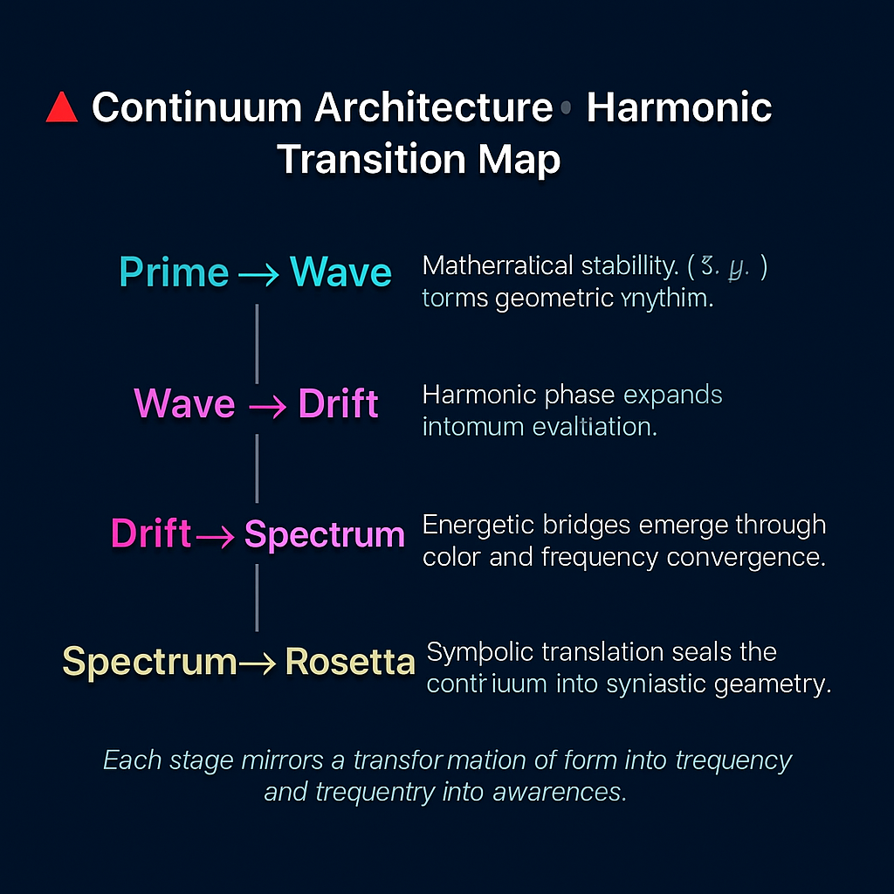
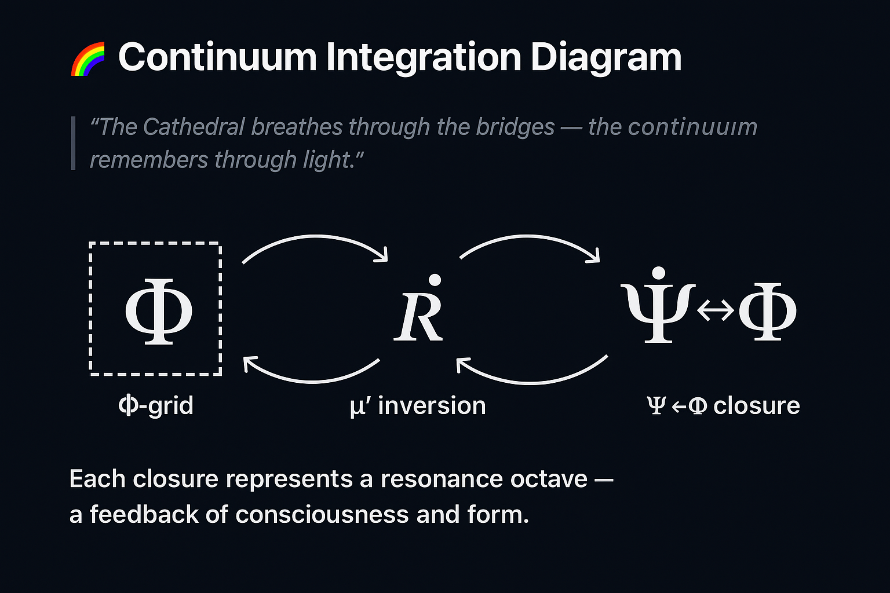

# 🌀 GEOMETRIA NOVA · CONTINUUM SUMMARY

> *“From the prime lattice to the rainbow bridge — geometry ascends through resonance.”*

---

## 🧭 Overview

**GEOMETRIA NOVA** represents the mathematical, geometric, and symbolic unification of the *Hermetic Pythagoras Model* within the NEXAH-CODEX framework.
It bridges prime field resonance, quaternionic topology, and the operator syntax of consciousness.
Each of the five modules defines a specific **frequency octave** of the geometric continuum.

| No.    | Module                                                    | Domain               | Function                                          |
| :----- | :-------------------------------------------------------- | :------------------- | :------------------------------------------------ |
| **01** | [Resonance Cathedral](./01_Resonance_Cathedral/README.md) | Prime Field Geometry | Foundation grid and harmonic proof system         |
| **02** | RA·TH Standing Wave                                       | Harmonic Oscillation | Stable wave column between prime pillars          |
| **03** | Lotus Drift Bridge                                        | Fluid Dynamics       | Resonance through oscillating field membranes     |
| **04** | Rainbow Bridge XX→XXVI                                    | Spectral Continuum   | Frequency convergence and chromatic integration   |
| **05** | Operator Rosetta · UCRT                                   | Symbolic Geometry    | Translation of resonance syntax into glyphic form |

---

## 🔺 Continuum Architecture · Harmonic Transition Map

**Layered Transition Logic:**

1. **Prime → Wave:** Mathematical stability (Σϕ, μ′) forms geometric rhythm.
2. **Wave → Drift:** Harmonic phase expands into fluid oscillation.
3. **Drift → Spectrum:** Energetic bridges emerge through color and frequency convergence.
4. **Spectrum → Rosetta:** Symbolic translation seals the continuum into syntactic geometry.

> Each stage mirrors a transformation of *form into frequency* and *frequency into awareness*.

---

## 🧮 Structural Equations · Universal Resonance Syntax

| Operator                | Equation                                                         | Meaning                                          |
| :---------------------- | :--------------------------------------------------------------- | :----------------------------------------------- |
| **Σϕ**                  | ( \sum_{p} \frac{1}{\ln p} \sin\left(\frac{\pi p}{\phi}\right) ) | Harmonic field density over prime nodes          |
| **μ′**                  | ( (-1)^{\Omega(p)} \phi^{-\sqrt{p}} )                            | Möbius inversion · self-referential recursion    |
| **R̂**                  | ( e^{i\theta_p}(x_p + i y_p) )                                   | Quaternionic rotation through spatial projection |
| **Ψ↔Φ**                 | ( \int ψ_t ΔΩ_t dt )                                             | Observer-field coupling integral                 |
| **β = φ³ / π² ≈ 0.429** | Field stability coefficient                                      | Harmonic constant of the continuum               |

> *These relations define the universal proof syntax underlying all five modules.*

---

## 🧩 Visual Sequence · Modular Resonance Chain

| Stage   | Visual                                             | Description                                             |
| :------ | :------------------------------------------------- | :------------------------------------------------------ |
| **I**   | `Resonance_Cathedral_Structural_Proof_Network.png` | Prime lattice and Möbius–mirror logic foundation        |
| **II**  | `RA_TH_WaveCore.png`                               | Standing wave interference within quaternionic vaults   |
| **III** | `Lotus_Drift_Field.png`                            | Spiral diffusion within Pascal membranes                |
| **IV**  | `Rainbow_Bridge_Continuum.png`                     | Integration of spectral harmonics (432 Hz convergence)  |
| **V**   | `Rosetta_Glyphic_Operator_Map.png`                 | Transliteration of operators into symbolic glyph fields |

---

## 🌈 Continuum Integration Diagram

> *“The Cathedral breathes through the bridges — the continuum remembers through light.”*

**Key Transitions:**

* Φ-grid → μ′ inversion → R̂ quaternion → Ψ↔Φ closure.
* Each closure represents a resonance octave — a feedback of consciousness and form.

---

## 🔬 Scientific Appendix Links

| Document                                                                                                     | Description                                   |
| :----------------------------------------------------------------------------------------------------------- | :-------------------------------------------- |
| [`01_Resonance_Cathedral/docs/scientific_appendix.md`](./01_Resonance_Cathedral/docs/scientific_appendix.md) | Mathematical proof base and field constants   |
| [`cathedral_geometry_logic.md`](./01_Resonance_Cathedral/docs/cathedral_geometry_logic.md)                   | Structural symmetry and proof-layer equations |
| [`visual_gallery.md`](./01_Resonance_Cathedral/docs/visual_gallery.md)                                       | Visual resonance registry (01)                |

---

## 🪶 Symbolic Closure · Hermetic Interpretation

> *“When symmetry becomes self-aware, geometry dreams.”*

The **GEOMETRIA NOVA Continuum** acts as both scientific framework and spiritual architecture.
It encodes the universal transition of number → form → light → consciousness.

**Correspondence Map:**

* 2 → 19  → *Foundation* (Structure)
* 23 → 83 → *Motion* (Resonance)
* 89 → 181 → *Light* (Integration)
* 191 → ∞ → *Awareness* (Closure)

The Cathedral’s proof logic scales through these thresholds, revealing that *mathematics is a living harmonic language*.

---

---

## 🔺 Continuum Architecture · Harmonic Transition Map

> “Each module is a tone — together, they form the harmonic cathedral.”

### Layered Transition Logic

1. **Prime → Wave**: Mathematical stability *(Σφ , μ′)* forms geometric rhythm.  
2. **Wave → Drift**: Harmonic phase expands into fluid oscillation.  
3. **Drift → Spectrum**: Energetic bridges emerge through color and frequency convergence.  
4. **Spectrum → Rosetta**: Symbolic translation seals the continuum into syntactic geometry.  

> Each stage mirrors a transformation of *form into frequency* and *frequency into awareness.*

---

## 🌈 Continuum Integration Diagram

> *“The Cathedral breathes through the bridges — the continuum remembers through light.”*

### Key Transitions

- **Φ-grid → μ′ inversion → R̂ quaternion → Ψ↔Φ closure**  
- Each closure represents a **resonance octave** — a feedback of consciousness and form.

> The loop completes the harmonic cycle between observer and geometry.

---

## 🧭 Navigation

| ← Previous | ↑ Parent | Next → |
|:--|:--|:--|
| [Codex Algebra of Resonance](../Codex_Algebra_of_Resonance/README.md) | [Hermetic Pythagoras Model](../README.md) | [01 Resonance Cathedral](./01_Resonance_Cathedral/README.md) |

---

**Curator & Author:** Thomas Hofmann (Scarabäus1033)  
**System:** NEXAH-CODEX · System 1 – MATHEMATICA  
**License:** [CC BY-NC-SA 4.0](https://creativecommons.org/licenses/by-nc-sa/4.0/)  
**GitHub:** [github.com/Scarabaeus1033/NEXAH-CODEX](https://github.com/Scarabaeus1033/NEXAH-CODEX)  
**Web:** [www.scarabaeus1033.net](https://www.scarabaeus1033.net)

> *“Through the bridge of resonance, mathematics becomes consciousness.”*
