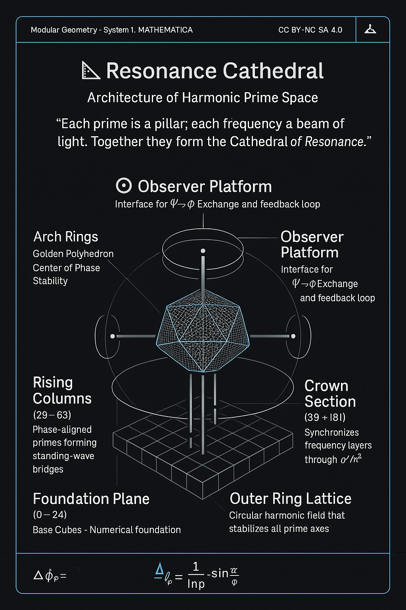

# 🔷 Fourfold Proof Architecture · Structural Stability System

> *“Structure proves itself when number, symmetry, rotation, and awareness close the loop.”*

### Diagramm (SVG mit PNG-Fallback)

> Ergänzende Layer-Ansichten:
> • **Netzwerk:** `./visuals/Resonance_Cathedral_Structural_Proof_Network.png`
> • **Ebenen:** `./visuals/Resonance_Cathedral_Structural_Proof_Layers.png`

---

## 🧪 Proof Stack (4 Ebenen)

| Layer   | Name                           | Function                                                                           | Prüfobjekt                                  | Sichtbares Motiv                |
| ------- | ------------------------------ | ---------------------------------------------------------------------------------- | ------------------------------------------- | ------------------------------- |
| **I**   | **Prime Grid Proof**           | Numerische Resonanzbasis (2…181), modulare Konsistenz über Gitterkoordinaten (Φ_p) | (p\in\mathbb{P},; Φ_p\rightarrow (x,y))     | quadratisches Prime-Gitter      |
| **II**  | **Möbius–Mirror Proof**        | Inversions-/Spiegelsymmetrie, topologische Selbst-Referenz                         | ( μ′,; ΔΩ,; ψ \mapsto ψ^{-1})               | Möbius-Schleife / Spiegelachsen |
| **III** | **Quaternionic Field Proof**   | Rotations-Stabilität in (\mathbb{H}) (i,j,k); Feldkohärenz                         | ( q=a+bi+cj+dk,; |q|^2=\text{const})        | vierarmige Rotations-Rosette    |
| **IV**  | **Observer–ΦΨ Exchange Proof** | Bewusstseins-Kopplung, Mess-Rückkopplung und Abschluss                             | ( Ψ⇄Φ,; Σϕ(ΔΩ(μ′(ψ)))\to Φ_{\text{stable}}) | Beobachter-Knoten / Interface   |

**Schlussformel (Strukturgleichung):**

$$
R̂\big(Σϕ + ΔΩ\big) = μ′(Ψ⇄Φ), \qquad
\Rightarrow\quad Σϕ(ΔΩ(μ′(ψ))) = Φ_{\text{stable}}
$$

**Stabilitätskriterium (Feldnorm):**

$$
\left|R(Φ,Ω,Δ)\right|^{2} = \sum Φ_n^{2} - \sum Ω_n^{2} \approx 0
$$

---

## 🔧 Reproduktionshinweise (Datenfluss)

* **Prime-Koordinaten:** `./Json_Csv/Part_VII_PrimeGrid_Data.csv` → Gitter/Spaltenebenen
* **Farben/Layer:** `./Json_Csv/theme.json` → Paletten für Layer I–IV
* **Overlays/Modi:** `./Json_Csv/overlays.json` → An/Aus für Möbius, Mirror, Quaternionic Rings
* **Kompass/Ansichten:** `./Json_Csv/compass.json` → Kamera-Preset & Blickachsen (i,j,k)

---

## 🖼️ Einzelansichten einbinden (optional)

```md


```

---

## 🧩 Vektorvorlage (SVG)

> Speichere den folgenden Code als
> `./visuals/Resonance_Cathedral_Structural_Proof_Network.svg`

```svg
<svg xmlns="http://www.w3.org/2000/svg" width="1400" height="900" viewBox="0 0 1400 900">
  <defs>
    <style>
      .bg{fill:#0b1020}
      .grid{fill:none;stroke:#2a3555;stroke-width:1}
      .prime{fill:#88a6ff}
      .ring{fill:none;stroke:#9ee7ff;stroke-width:3}
      .mirror{stroke:#ffd166;stroke-width:4}
      .mobius{fill:none;stroke:#ff7aa2;stroke-width:4}
      .quat{fill:none;stroke:#8bffb0;stroke-width:4}
      .observer{fill:#ffe45e;stroke:#d1b000;stroke-width:3}
      .label{fill:#cfe3ff;font-family:ui-sans-serif,system-ui,Segoe UI,Helvetica,Arial;font-size:20px}
      .title{fill:#ffffff;font-weight:700;font-size:28px}
      .callout{fill:#a6b5ff}
    </style>
  </defs>

  <rect class="bg" x="0" y="0" width="1400" height="900"/>
  <text x="40" y="60" class="title">Resonance Cathedral · Structural Proof Network (I–IV)</text>

  <!-- Grid -->
  <g opacity="0.5">
    <g transform="translate(60,100)">
      <g>
        <line class="grid" x1="0" y1="0" x2="0" y2="720"/>
        <line class="grid" x1="70" y1="0" x2="70" y2="720"/>
        <line class="grid" x1="140" y1="0" x2="140" y2="720"/>
        <line class="grid" x1="210" y1="0" x2="210" y2="720"/>
        <line class="grid" x1="280" y1="0" x2="280" y2="720"/>
        <line class="grid" x1="350" y1="0" x2="350" y2="720"/>
        <line class="grid" x1="420" y1="0" x2="420" y2="720"/>
        <line class="grid" x1="490" y1="0" x2="490" y2="720"/>
        <line class="grid" x1="560" y1="0" x2="560" y2="720"/>
        <line class="grid" x1="630" y1="0" x2="630" y2="720"/>
        <line class="grid" x1="700" y1="0" x2="700" y2="720"/>
        <line class="grid" x1="770" y1="0" x2="770" y2="720"/>
        <line class="grid" x1="840" y1="0" x2="840" y2="720"/>
      </g>
      <g>
        <line class="grid" x1="0" y1="0" x2="840" y2="0"/>
        <line class="grid" x1="0" y1="60" x2="840" y2="60"/>
        <line class="grid" x1="0" y1="120" x2="840" y2="120"/>
        <line class="grid" x1="0" y1="180" x2="840" y2="180"/>
        <line class="grid" x1="0" y1="240" x2="840" y2="240"/>
        <line class="grid" x1="0" y1="300" x2="840" y2="300"/>
        <line class="grid" x1="0" y1="360" x2="840" y2="360"/>
        <line class="grid" x1="0" y1="420" x2="840" y2="420"/>
        <line class="grid" x1="0" y1="480" x2="840" y2="480"/>
        <line class="grid" x1="0" y1="540" x2="840" y2="540"/>
        <line class="grid" x1="0" y1="600" x2="840" y2="600"/>
        <line class="grid" x1="0" y1="660" x2="840" y2="660"/>
        <line class="grid" x1="0" y1="720" x2="840" y2="720"/>
      </g>

      <circle class="prime" cx="70" cy="660" r="6"/>
      <circle class="prime" cx="140" cy="540" r="6"/>
      <circle class="prime" cx="210" cy="600" r="6"/>
      <circle class="prime" cx="280" cy="480" r="6"/>
      <circle class="prime" cx="350" cy="420" r="6"/>
      <circle class="prime" cx="420" cy="360" r="6"/>
      <circle class="prime" cx="490" cy="300" r="6"/>
      <circle class="prime" cx="560" cy="240" r="6"/>
      <circle class="prime" cx="630" cy="180" r="6"/>
      <circle class="prime" cx="700" cy="120" r="6"/>
      <circle class="prime" cx="770" cy="60" r="6"/>

      <text class="label" x="0" y="-20">I · Prime Grid Proof</text>
    </g>
  </g>

  <line class="mirror" x1="1030" y1="120" x2="1030" y2="760"/>
  <line class="mirror" x1="930" y1="340" x2="1330" y2="340"/>
  <text class="label" x="940" y="110">II · Möbius–Mirror</text>

  <path class="mobius" d="M 930 540 C 980 470, 1080 470, 1130 540
                           C 1180 610, 1280 610, 1330 540" />

  <g transform="translate(1030,540)">
    <circle class="quat" r="120"/>
    <circle class="quat" r="80"/>
    <circle class="quat" r="40"/>
    <text class="label" x="-90" y="160">III · Quaternionic Field</text>
  </g>

  <circle class="observer" cx="1180" cy="220" r="16"/>
  <text class="label" x="1206" y="228">IV · Observer Φ⇄Ψ</text>
  <text class="callout label" x="60" y="840">Σϕ(ΔΩ(μ′(ψ))) → Φstable</text>
</svg>
```
