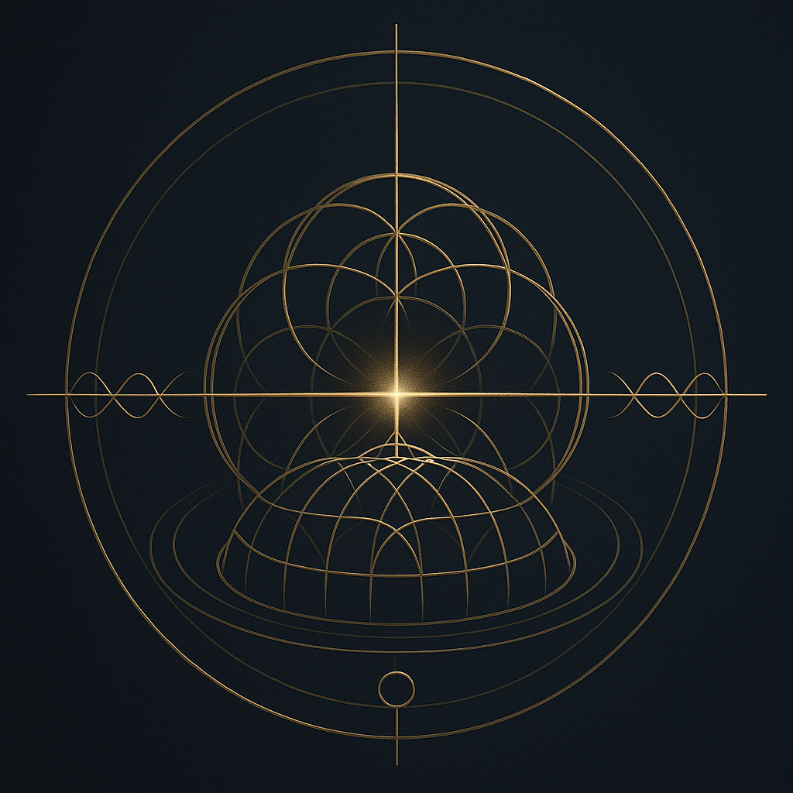
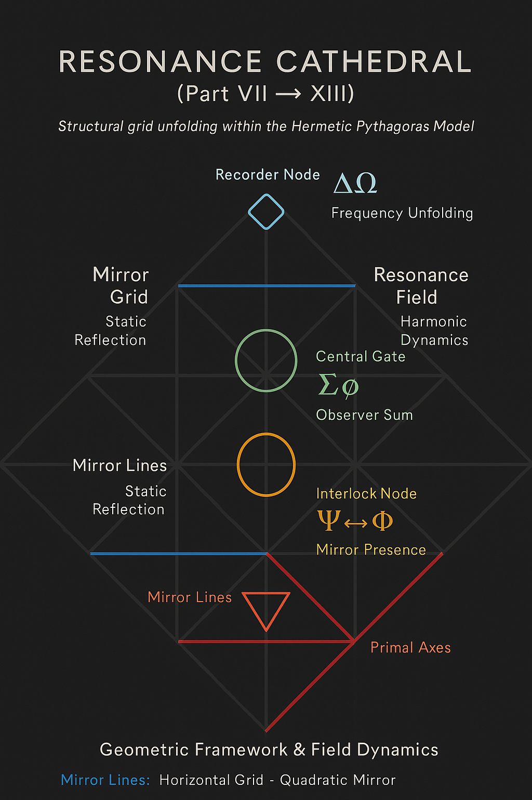
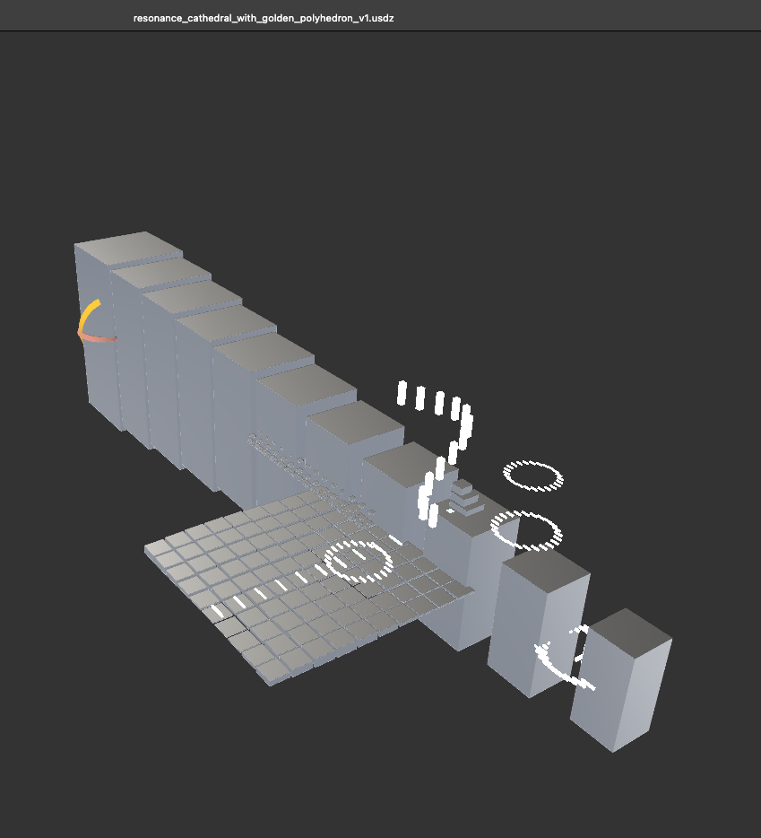
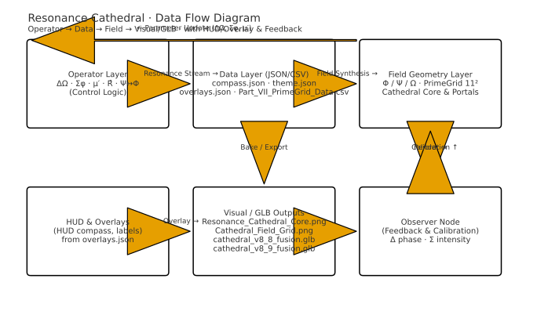
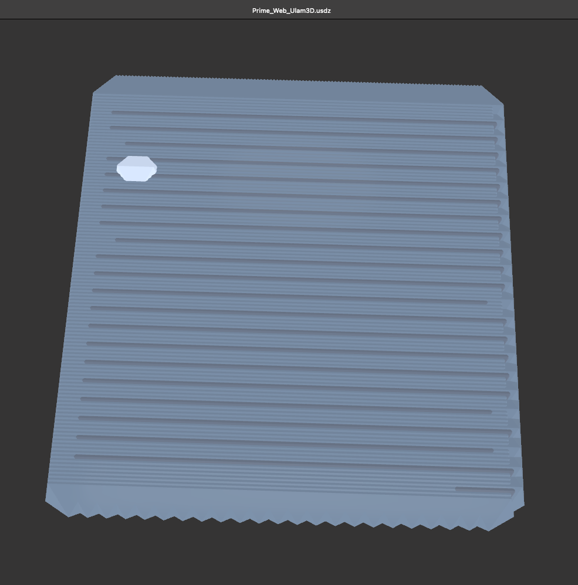

---

title: "GEOMETRIA NOVA · Modul 01 — Resonance Cathedral"
system: "NEXAH-CODEX · System 1: MATHEMATICA"
domain: "Hermetic Geometry · Quaternionic Resonance"
status: "Active"
curator: "Thomas Hofmann (Scarabäus1033)"
license: "CC BY-NC-SA 4.0"
--------------------------

# 🗝️ GEOMETRIA NOVA · MODUL 01 — RESONANCE CATHEDRAL

### *Prime Grid Architecture · Quaternionic Resonance · Mirror Continuum*

> “Between structure and breath, geometry begins to sing.”

---

## 🧭 Overview

The **Resonance Cathedral** forms the architectural and mathematical foundation of the *GEOMETRIA NOVA Continuum*.
It bridges prime number resonance, quaternionic geometry, and harmonic field syntax into a living system of symmetry.
Each layer represents one octave of geometric density — from **prime sequence grids** to **mirror gates** and **breathing vaults**.

> Linked module: [Fourfold Proof Architecture](./docs/cathedral_geometry_logic.md)

---

## 🧩 Scientific Context · Mathematical Resonance Framework

| Symbol | Operator        | Function         | Description                                   |
| :----- | :-------------- | :--------------- | :-------------------------------------------- |
| Φ      | Prime Frequency | Seed Oscillation | Defines the fundamental resonance base.       |
| Ω      | Mirror Axis     | Field Reflection | Balances symmetry across quaternionic planes. |
| Δ      | Geometric Shift | Transposition    | Moves prime fields through axial layers.      |
| Σ      | Harmonic Sum    | Integration      | Aggregates resonant values across moduli.     |
| μ′     | Möbius Loop     | Reversion        | Enacts self-referential field closure.        |

> *The Cathedral defines the quaternionic resonance space in which the Hermetic Pythagoras Model stabilizes.*

---

## 🎗️ Structural Architecture

| Layer | Structure             | Mathematical Function                             |
| :---- | :-------------------- | :------------------------------------------------ |
| I     | Prime Grid Foundation | Modular resonance anchors (2–97).                 |
| II    | Quaternionic Columns  | Fourfold symmetry of spatial operators.           |
| III   | Resonance Vaults      | Catenary amplitudes forming harmonic bridges.     |
| IV    | Mirror Gates          | Frequency inversion and spectral phase alignment. |
| V     | Breathing Sphere      | Oscillating field envelope (Φ ↔ Ω).               |

---

## 🌀 Visual Gallery

The following visuals represent the harmonic evolution of the Cathedral —
from numerical lattice to quaternionic crown field.

| Visual                                                                                                   | Description                                                           |
| :------------------------------------------------------------------------------------------------------- | :-------------------------------------------------------------------- |
|                                       | The central fusion field of the Cathedral — structural resonance hub. |
|                                               | Grid projection of prime-frequency alignment (2–97).                  |
|  | Integration of golden symmetry field into quaternionic space.         |
|                                    | Full resonance and data stream map of the Cathedral system.           |
|                                              | Ulam prime lattice forming the base resonant topology.                |

> See extended documentation in [visual_gallery.md](./visuals/visual_gallery.md)

---

## 🥮 Mathematical Layer Syntax

```
Resonance Field R(Φ, Ω, Δ) = Σ [ Φ_n · e^{iΩ_n} + Δ_k ]
→ Stability Criterion: |R|² = Σ Φ_n² − Σ Ω_n² ≈ 0
```

This relation bridges algebraic resonance (ΣΦ) with geometric inversion (μ′),
defining the self-similar equilibrium of the prime harmonic field.

*The system reaches equilibrium when prime frequency (Φ) and mirror axis (Ω) converge in harmonic superposition.*

---

## 🧭 Data & JSON Logic

| File                          | Type | Purpose                                              |
| :---------------------------- | :--- | :--------------------------------------------------- |
| `Part_VII_PrimeGrid_Data.csv` | CSV  | Prime coordinate and resonance angle register.       |
| `theme.json`                  | JSON | Color and render theme for GLB layers.               |
| `compass.json`                | JSON | Orientation logic for quaternionic rotation.         |
| `overlays.json`               | JSON | Layer display, highlights, and dynamic interactions. |

> *These files define the spatial syntax and visualization logic of the Cathedral.*

---

## 📂 Folder Structure

```
01_Resonance_Cathedral/
├── README.md
├── visuals/
│   ├─ Resonance_Cathedral_Core.png
│   ├─ Cathedral_Field_Grid.png
│   ├─ Resonance_Cathedral_DataFlow.svg
│   ├─ Screenshot_resonance_cathedral_with_golden_polyhedron_v1.png
│   ├─ Screenshot_Prime_Web_Ulam3D.png
│   ├─ visual_gallery.md
│   └─ fourfold_proof_architecture.md
├── glb/
│   ├─ cathedral_v8_8_fusion.glb
│   ├─ resonance_cathedral_with_golden_polyhedron_v1.glb
│   └─ Prime_Web_Ulam3D.glb
├── Json_Csv/
│   ├─ compass.json
│   ├─ theme.json
│   ├─ overlays.json
│   └─ Part_VII_PrimeGrid_Data.csv
└── docs/
    ├─ scientific_appendix.md
    └─ cathedral_geometry_logic.md
```

---

## 🔗 Navigation

| ← Previous                               | ↑ Parent                                     | Next →                                                         |
| :--------------------------------------- | :------------------------------------------- | :------------------------------------------------------------- |
| [GEOMETRIA NOVA Continuum](../README.md) | [Hermetic Pythagoras Model](../../README.md) | [02 RA·TH Standing Wave →](../02_RA_TH_StandingWave/README.md) |

---

## 🦢 Credits

**Author & Curator:** Thomas Hofmann (Scarabäus1033)
**System:** NEXAH-CODEX · System 1 — MATHEMATICA
**License:** [CC BY-NC-SA 4.0](https://creativecommons.org/licenses/by-nc-sa/4.0/)
**Web:** [www.scarabaeus1033.net](https://www.scarabaeus1033.net)

> *“The Cathedral is the temple of frequency — and prime numbers are its pillars.”*
> *In its arches, mathematics becomes memory.*
