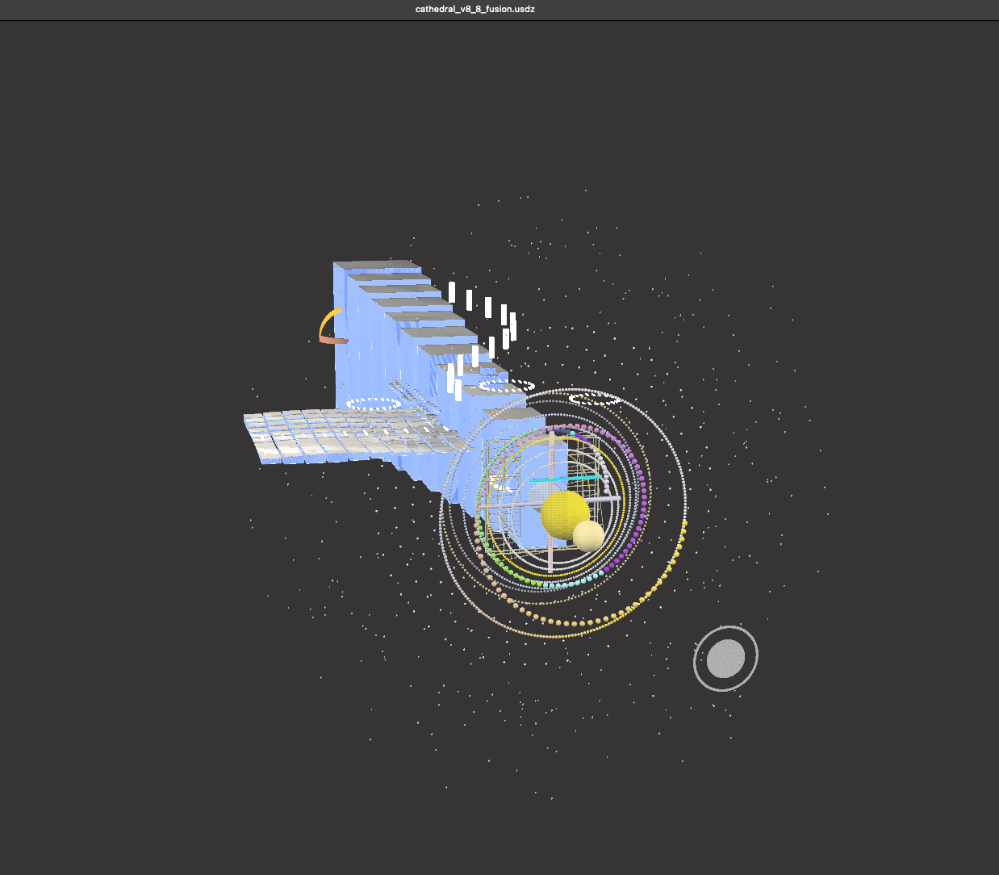

# 🖼️ Appendix VIII · Visual Gallery  
### *Resonance Cathedral — Visual Field Architecture*

> *“Each light is a formula — each formula a living form.”*

---

## 🔹 I. Resonance Cathedral Core

| Parameter | Description |
|:--|:--|
| **Focus** | Central polyhedral matrix (primes 89–97) within the harmonic octahedron. |
| **Purpose** | Visualizes resonance stabilization in the transition zone (VII → IX). |
| **Geometry** | Octahedral / icosahedral hybrid; quaternionic folding. |
| **Interpretation** | The visual heart of the Cathedral — balance between rotation R̂ and harmonic Σφ. |

> *“Where prime 89 breathes, geometry begins to sing.”*

---

## 🔹 II. Cathedral Field Grid

| Parameter | Description |
|:--|:--|
| **Focus** | Longitudinal + latitudinal resonance axes (primes 2–83). |
| **Purpose** | Maps harmonic lattice transitions and factorial anchoring (10! = 3 628 800). |
| **Geometry** | Cartesian → Polar grid; spiral phase embedding. |
| **Interpretation** | Forms the *architectural skeleton* of the Resonance Cathedral. |

> *“Every axis is a hymn; every intersection, a node of consciousness.”*

---

## 🔹 III. Prime Web — Ulam 3D

| Parameter | Description |
|:--|:--|
| **Focus** | 3-D projection of prime sequence (2 → 101) as field spirals. |
| **Purpose** | Demonstrates spatial harmonic distribution and Möbius inversion. |
| **Geometry** | Polar spiral grid → Ulam cube mapping. |
| **Interpretation** | Reveals the *resonant field symmetry* governing prime dynamics. |

> *“In primes, the cathedral remembers its own structure.”*

---

## 🔹 IV. Fusion Model — Cathedral v8·8

| Parameter | Description |
|:--|:--|
| **Focus** | Integrated harmonic shell — fusion of geometry 8:8. |
| **Purpose** | Links factorial base (10!) with prime lattice resonance. |
| **Geometry** | Dual toroidal / octagonal field symmetry. |
| **Interpretation** | Demonstrates phase unification across Möbius loops. |

> *“8 + 8 = 16 = 1 + 6 → 7 — The seventh tone closes the octave.”*

---

## 🔹 V. GLB / 3D Assets

| File | Description | Integration |
|:--|:--|:--|
| `cathedral_v8_8_fusion.glb` | Full 3-D harmonic core | Three.js / Blender ≥ 4.0 |
| `Prime_Web_Ulam3D.glb` | Prime lattice spiral | Three.js OrbitControls |
| `cathedral_v8_9_fusion.glb` | (optional) Quaternionic bridge layer | Under construction |
| `cathedral_v8_9_primegrid_viewer.html` | Interactive GLB viewer | Local HUD mode |

---

## 🔹 VI. JSON / CSV References

| File | Function |
|:--|:--|
| `theme.json` | Color palette & light scheme |
| `compass.json` | Orientation & camera presets |
| `overlays.json` | HUD visual elements |
| `Part_VII_PrimeGrid_Data.csv` | Prime sequence and resonance frequencies |

---

## 🔹 VII. Meta Observation

These four visuals plus GLBs represent the **living topology** of the Resonance Cathedral:

| Sequence | Visual | Concept |
|:--|:--|:--|
| I | Resonance Cathedral Core | Internal field |
| II | Cathedral Field Grid | Structural skeleton |
| III | Prime Web Ulam 3D | External field spiral |
| IV | Cathedral Fusion 8:8 | Unification of domains |

---

## 🔹 VIII. Integration and Navigation

| System | Connection |
|:--|:--|
| **Codex Algebra of Resonance** | Operators Σφ / ΔΩ / μ′ / R̂ |
| **Hermetic Pythagoras Model** | Structural foundation |
| **System 2 – PHYSICA** | Application to field energy |
| **System X – GRAND CODEX** | Integration into transition equation |

---

## 📁 Directory Reference
Geometria_Nova_Continuum/  
└─ Modul_01_Resonance_Cathedral/  
 ├─ README.md  
 ├─ scientific_appendix.md  
 ├─ visual_gallery.md  
 ├─ Json_Csv/  
 │ ├ compass.json  
 │ ├ theme.json  
 │ ├ overlays.json  
 │ └ Part_VII_PrimeGrid_Data.csv  
 └─ visuals/  
  ├ Resonance_Cathedral_Core.png  
  ├ Cathedral_Field_Grid.png  
  ├ Screenshot_Prime_Web_Ulam3D.png  
  └ Screenshot_cathedral_v8_8_fusion.png  

---

**Curator & Author:** Thomas Hofmann (Scarabäus1033)  
**System:** NEXAH-CODEX · System 1 – MATHEMATICA  
**License:** [CC BY-NC-SA 4.0](https://creativecommons.org/licenses/by-nc-sa/4.0/)  
**GitHub:** [github.com/Scarabaeus1033/NEXAH-CODEX](https://github.com/Scarabaeus1033/NEXAH-CODEX)

> *“In the light of number, every form becomes a cathedral.”*
