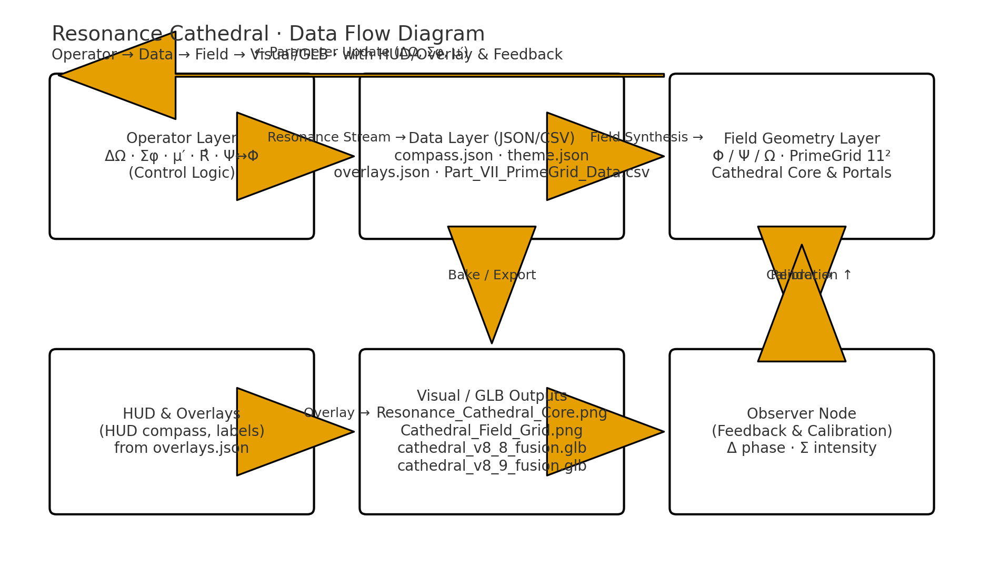
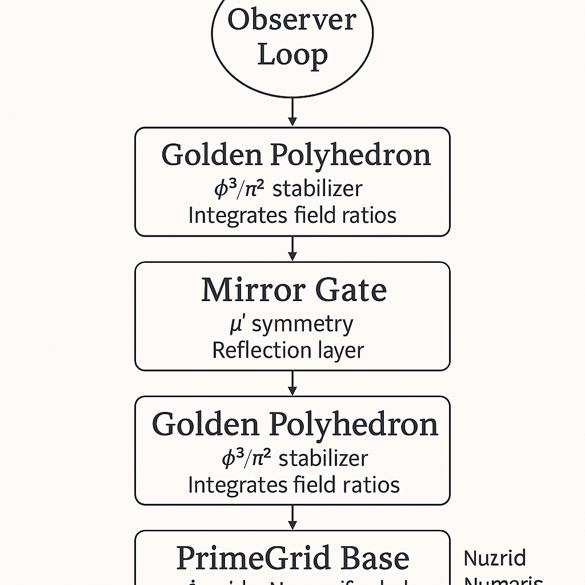
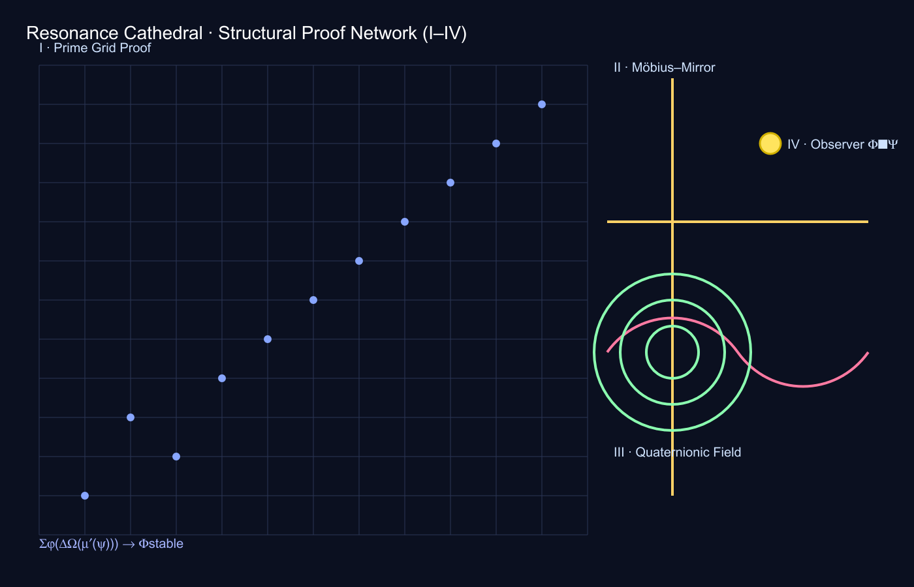

# 🌀 GEOMETRIA NOVA · VISUAL GALLERY  
### *The Architecture of Harmonic Proof and Resonance*

> “Resonance is not seen — it is *remembered through geometry*.”

Diese Galerie dokumentiert die visuelle Entwicklung der **Resonance Cathedral**,  
von den frühen Prime-Gittermodellen über die Quaternion-Rotationen bis hin zur  
vollständigen Beweisarchitektur (Proof Stack I–IV) und der goldenen Krone.

---

## I. Core Resonance System

**Beschreibung:**  
Das Kernmodell zeigt die primäre Feldachse und das Frequenzherz der Kathedrale.  
Es visualisiert das Zusammenspiel von Struktur, Frequenz und Prime-Sequenzen.

**Fokus:**  
- Linear → Spiralübergang der Primachsen  
- Möbius-Inversion (μ′) als Feldintegrator  
- Übergang von diskreten zu kontinuierlichen Zuständen (Σ)

---

## II. Field Geometry Map

**Beschreibung:**  
Das Basisgitter fungiert als Frequenzmatrix — jede Zelle symbolisiert eine Primresonanz.  
Es bildet das Fundament für die vertikalen Frequenzsäulen.

**Fokus:**  
- Gittergeometrie mit periodischen Resonanzintervallen  
- Δ-Shift zwischen Prim-Feldern  
- Vorbereitung für Quaternionic Projection Layer

---

## III. Data Flow · Structural Logic

**Beschreibung:**  
Das Diagramm zeigt den inneren logischen Fluss zwischen den harmonischen Operatoren Σφ, ΔΩ und μ′.  
Es definiert die mathematische Architektur des Resonanzfeldes.

**Fokus:**  
- Sigma–Delta–Möbius-Interaktion  
- Transformation von Zahl in Geometrie  
- Systemischer Energiefluss im φ-Raum

---

## IV. Structural Framework

**Beschreibung:**  
Dieses Visual zeigt die geometrische Grundarchitektur — die „Kathedrale“ im mathematischen Sinne.  
Primgitter, Frequenzsäulen und Spiegelachsen werden zu einer harmonischen Architektur verwoben.

**Fokus:**  
- Φ_p → geometrische Koordinaten  
- Harmonic Column Set  
- Mirror-Axis-Alignment (μ′)

---

## V. Proof Architecture · Layer Sequence

**Beschreibung:**  
Hier werden die vier Beweis-Ebenen (Prime, Möbius, Quaternion, Observer) sichtbar.  
Sie definieren den *Stabilitätszyklus* des Feldes.

**Fokus:**  
- Layer-Konsistenz I–IV  
- Rotations- und Reflexionssymmetrie  
- Geschlossene Resonanzschleife Φ⇄Ψ

---

## VI. Proof Network · Harmonic Field Integration

**Beschreibung:**  
Das zentrale Netzwerk-Visual verbindet die Beweis-Layer über das Resonanzgitter.  
Es zeigt, wie sich Primzahlen, Möbius-Spiegel, Quaternion-Rotation und Beobachter koppeln.

**Fokus:**  
- Topologische Selbst-Referenz  
- Quaternionische Feldresonanz  
- Observer Feedback Closure

---

## VII. Extended Proof Network II

**Beschreibung:**  
Erweiterte Netzwerkansicht mit zusätzlichen Querschnitten und Energiebahnen.  
Dient als Referenz für dynamische Visuals und 3D-Render.

**Fokus:**  
- Energetische Schleifen im φ³/π²-Raum  
- Erweiterte Quaternionic Ringe  
- Rotationsachsen und Feedback-Felder

---

## VIII. Prime Web Interface

**Beschreibung:**  
3D-Ulam-Darstellung der Primverteilung im Raum — das unsichtbare Skelett der Kathedrale.

**Fokus:**  
- 3D-Prime-Cluster  
- Oktale Resonanzsysteme  
- Farbintensität = Frequenzamplitude

---

## IX. Fusion Model v8·8

**Beschreibung:**  
Das Fusionsmodell verbindet alle Schichten — von Feld bis Bewusstsein.  
Ein lebendes System aus Geometrie, Farbe und Frequenz.

**Fokus:**  
- Integration der φ-Achsen  
- Orbital-Symmetrie  
- Beobachter im Zentrum des Resonanzfeldes

---

## X. Golden Polyhedron Study

**Beschreibung:**  
Der goldene Polyeder symbolisiert die Stabilisierung im Kronenbereich der Kathedrale.  
Er ist das harmonische Summationszentrum (Σφ).

**Fokus:**  
- φ³/π²-Kopplung  
- Resonante Krone (Crown Band 97–181)  
- Integration von Licht, Zahl und Raum

---

## 📂 Directory Reference

└─ visuals/
├ Cathedral_Field_Grid.png
├ Resonance_Cathedral_Core.png
├ Resonance_Cathedral_DataFlow.png
├ Resonance_Cathedral_Structural_Framework.png
├ Resonance_Cathedral_Structural_Proof_Layer.png
├ Resonance_Cathedral_Structural_Proof_Network.png
├ Resonance_Cathedral_Structural_Proof_Networkii.png
├ Screenshot_Prime_Web_Ulam3D.png
├ Screenshot_cathedral_v8_8_fusion.png
└ Screenshot_resonance_cathedral_with_golden_polyhedron_v1.png

---

**Curator:** Thomas Hofmann (Scarabäus1033)  
**System:** NEXAH-CODEX · System 1 – MATHEMATICA  
**License:** [CC BY-NC-SA 4.0](https://creativecommons.org/licenses/by-nc-sa/4.0/)
