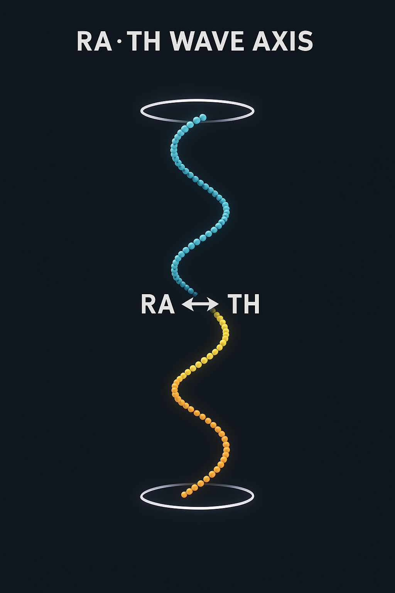
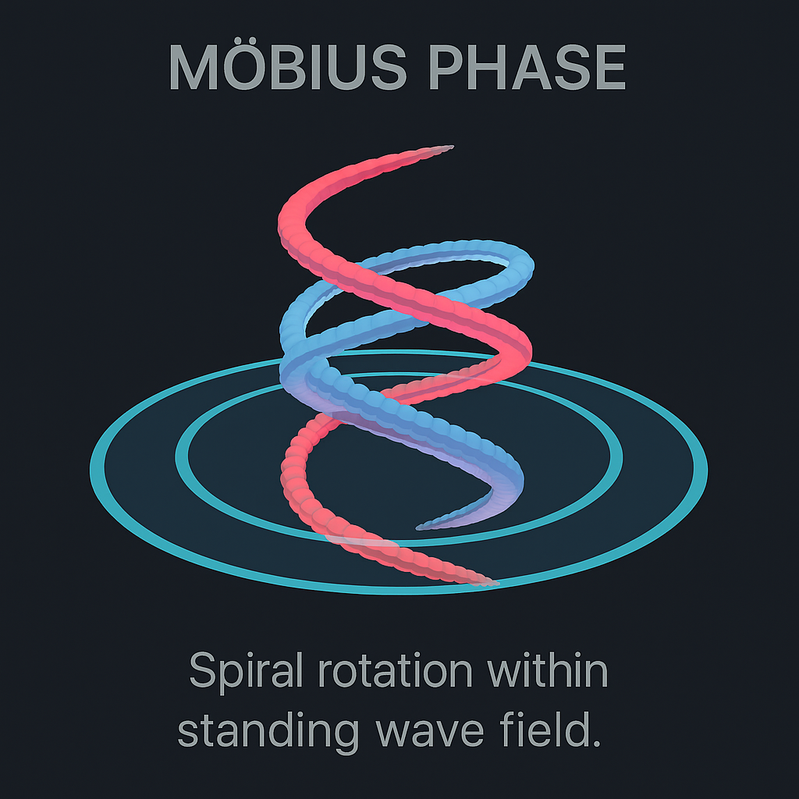
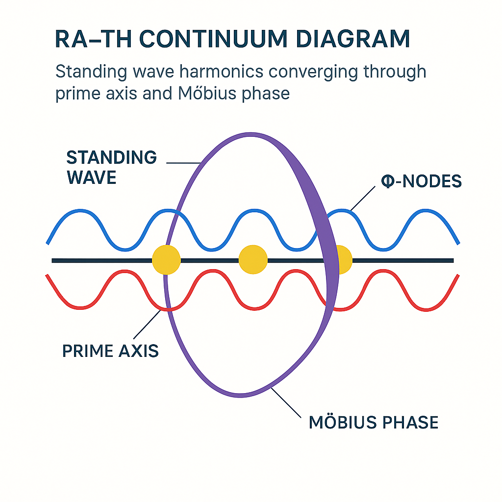
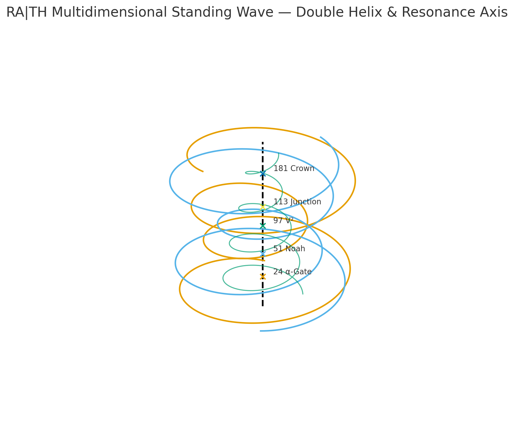
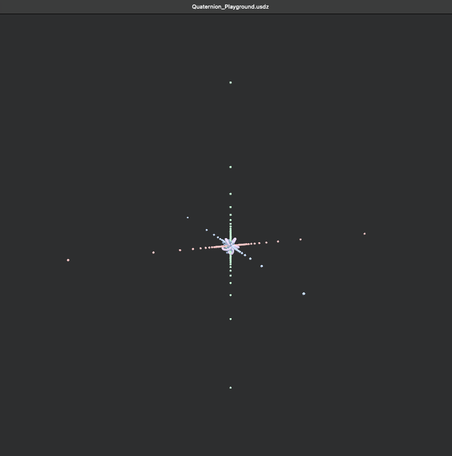
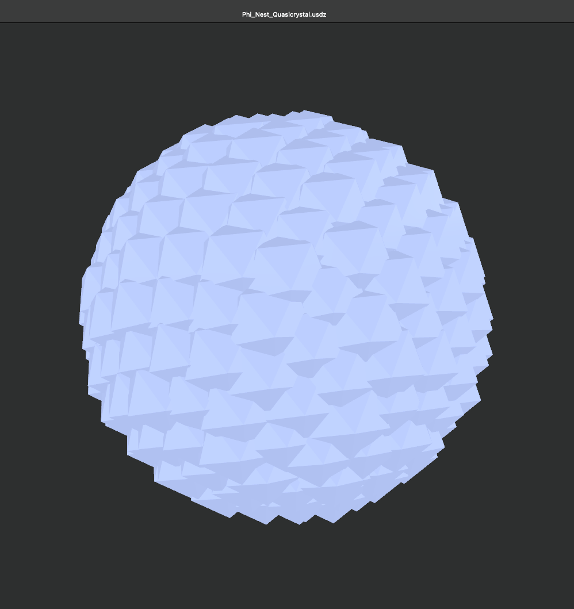

# 🜂 GEOMETRIA NOVA · MODUL 02 — RA·TH STANDING WAVE

### *Prime Oscillation · Harmonic Columns · Quaternionic Vaults*

> *“Between the pillars of number, the wave stands still — breathing through symmetry.”*

---

## 🧭 Overview

The **RA·TH Standing Wave** represents the second harmonic module of the *GEOMETRIA NOVA Continuum*, extending the **Resonance Cathedral** into a dynamic equilibrium between **motion** and **structure**.  
Here, prime frequency columns oscillate within quaternionic chambers, forming standing waves that encode both **field coherence** and **conscious rhythm**.

This system acts as the *breathing vault* of the continuum — where vibration becomes geometry, and geometry becomes awareness.

---

## ⚛️ Section A – Scientific Field Architecture

| Symbol | Operator | Function | Mathematical Role |
| :------ | :-------- | :-------- | :---------------- |
| **Φₚ** | Prime Frequency | Base node | Defines harmonic anchor positions |
| **Ω** | Wave Phase | Rotational loop | Governs standing-wave motion |
| **ΣΩₚ** | Harmonic Sum | Superposition | Integrates wave harmonics across primes |
| **Δψ** | Field Shift | Phase modulation | Generates interference stability |
| **R̂(θ)** | Quaternionic Rotation | Axis transformation | Ensures resonance symmetry across 4D vaults |

### Standing Wave Equation

\[
Ψ(x,t) = Φₚ·e^{iΩt} + Φₚ·e^{-iΩt} = 2Φₚ\cos(Ωt)
\]

This defines the *harmonic stillness point* of the RA·TH Vault — where counter-rotating wavefields converge into structural coherence.

**Stability Criterion:**

\[
|Ψ|^2 = |Φₚ|^2 + |Ω|^2 - |Δψ|^2 \approx 0
\]

---

## 🜍 Section B – Hermetic Interpretation

| Aspect | Symbolic Principle | Description |
| :------ | :---------------- | :----------- |
| **RA** | Solar Polarity | Outward, radiant frequency impulse |
| **TH** | Lunar Reflection | Inward harmonic return and containment |
| **RA·TH** | Equilibrium State | Still-point between expansion and return |
| **Standing Wave** | Breath of the Continuum | Harmonic axis uniting consciousness and geometry |

> *“The Cathedral breathes through RA·TH: expansion in RA, contraction in TH — the pulse of form itself.”*

### Symbolic Equation

\[
RA : TH = e^{iΩ} : e^{-iΩ} → \cos(Ω)
\]

The cosine term represents the *balance of opposites* — the midpoint between projection and reflection, a state of **resonant awareness**.

---

## 🖼️ Section C – Visual & Data Reference

### Visual Highlights
| Visual | Description |
| :------ | :----------- |
|  | Resonant axis of the standing wave system. |
|  | Golden Φ-nodes defining symmetry centers. |
|  | Möbius-phase rotation of the standing wave. |
|  | Diagrammatic overview of RA·TH continuum fields. |
|  | Dual helical resonance columns within the field. |
|  | Quaternionic orientation space for rotational symmetry. |
|  | Quasicrystalline field of golden mean oscillators. |

➡ **Full Gallery:** [visual_gallery.md](./visual_gallery.md)

---

### 3D GLB Models

| Model | Description |
| :----- | :----------- |
| [RA_TH_StandingWave.glb](./glb/RA_TH_StandingWave.glb) | Core resonance column and field axis. |
| [RA_TH_StandingWave_phiNodes.obj](./glb/RA_TH_StandingWave_phiNodes.obj) | Harmonic node structure with prime axes. |
| [RA_TH_StandingWave_phiNodes_SaturnIo_Mobius.obj](./glb/RA_TH_StandingWave_phiNodes_SaturnIo_Mobius.obj) | Möbius-phase with planetary reference field. |
| [Quaternion_Playground.glb](./glb/Quaternion_Playground.glb) | Quaternionic coordinate framework. |
| [Phi_Nest_Quasicrystal.glb](./glb/Phi_Nest_Quasicrystal.glb) | Nested φ-polyhedron in resonant packing. |

---

## 🧩 Section D – Integration with Resonance Cathedral

| Relation | Description |
| :--------- | :------------ |
| **From Module 01 → 02** | Transition from static lattice (Cathedral) to oscillating field (Standing Wave). |
| **Mathematical Continuum** | Σϕ (static sum) evolves into ΣΩ (dynamic sum). |
| **Hermetic Continuum** | Φ ↔ Ω as masculine/feminine oscillation principle. |
| **Physical Analogy** | Equivalent to two phase-locked laser cavities in coherence. |

> *Where the Cathedral was form, RA·TH becomes motion — the harmonic breath of the Codex.*

---

## 🧭 Navigation

| ← Previous | ↑ Parent | Next → |
| :----------- | :--------- | :------ |
| [01 Resonance Cathedral](../01_Resonance_Cathedral/README.md) | [GEOMETRIA NOVA Continuum](../README.md) | [03 Lotus Drift Bridge](../03_Lotus_Drift_Bridge/README.md) |

---

**Curator & Author:** Thomas Hofmann (Scarabäus1033)  
**System:** NEXAH-CODEX · System 1 – MATHEMATICA  
**License:** [CC BY-NC-SA 4.0](https://creativecommons.org/licenses/by-nc-sa/4.0/)  
**Web:** [www.scarabaeus1033.net](https://www.scarabaeus1033.net)

> *“Through RA·TH, the light stands still — and the field remembers its breath.”*
