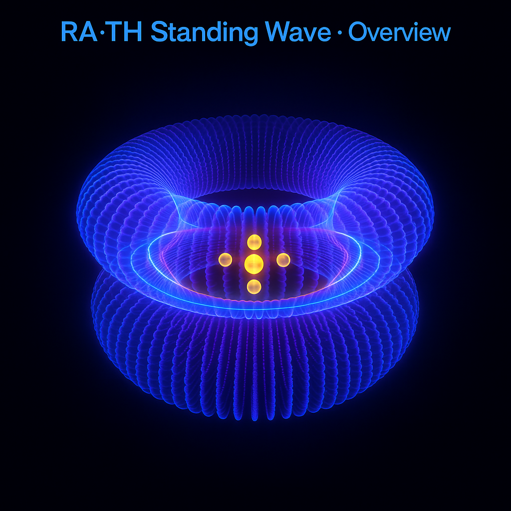
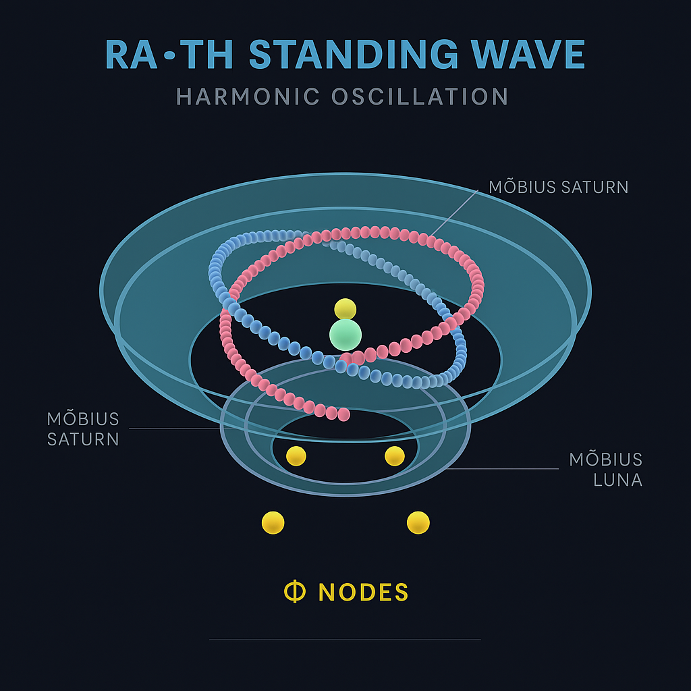

# 🌊 RA·TH Standing Wave · Visual Gallery

> “Between Phi and the Möbius phase — the standing wave becomes a temple of equilibrium.”

Diese Galerie dokumentiert die geometrisch-resonante Entwicklung der **RA·TH Standing Wave**,  
vom zentralen Helix-Feld bis zum quaternionischen Kontinuum.  
Jedes Visual bildet eine **Phase des harmonischen Aufbaus** ab — von stabilen Knotenpunkten bis zur  
transdimensionalen Rückkopplung (*resonant feedback loop*).

---

## I. Core Overview · Feldübersicht

**Beschreibung:**  
Das Kernmodell der stehenden Welle (*Standing Wave Core*) zeigt das harmonische Gleichgewicht zwischen  
axialer Stabilität und zirkularer Ausbreitung.  
Die goldene Mitte repräsentiert den Punkt der **Phaseninversion** – das Auge des Resonators.

**Fokus:**  
- Duale Wellenstruktur (Rot / Blau) als Basis für modulare Frequenzachsen  
- Resonanzzentrum als geometrische **Φ-Nullstelle**  
- Translation von linearer zu zirkularer Bewegung (*linear → helical transition*)

---

## II. Field Vault · Resonanzkammer

**Beschreibung:**  
Die *Field Vault* zeigt die energetische Kuppel über dem RA·TH-Resonanzsystem.  
Sie dient als “stehende Welle im Raum” – ein geschlossener harmonischer Raum (*vaulted field*).  

**Fokus:**  
- Toroidale Feldstabilität (Φ ↔ Ω)  
- Innere Ringrotationen erzeugen stehende Knotenlinien  
- Spiegelachsen definieren Resonanzgrenzen (*boundary harmonics*)

---

## III. Φ-Nodes · Goldene Knotenpunkte

**Beschreibung:**  
Die *Φ-Nodes* (goldene Knoten) markieren harmonische Schnittpunkte der RA·TH-Welle.  
Jeder Knoten repräsentiert eine stabile Resonanzfrequenz innerhalb des Quaternionenfelds.

**Fokus:**  
- Goldene Schnittpunkte (*Φ = 1.618…*) entlang der Hauptachse  
- Primzahlen als diskrete Frequenzanker (z. B. 13, 51, 97, 181)  
- Bildung von stehenden Interferenzmustern (*interference stability field*)

---

## IV. Möbius Phase · Spiralfeld-Resonanz

**Beschreibung:**  
Diese Visualisierung zeigt die spiralförmige Rotation der stehenden Wellen entlang einer  
*Möbius-Phase* — der Übergang von Dualität zu Selbstinversion.  
Die Struktur steht symbolisch für **RA ↔ TH** als oszillierende Polarität.

**Fokus:**  
- Spiralform → Toroidphase → Selbstinversion  
- Goldene und planetare Achsen (*Saturn–Io–Korrelation*)  
- Harmonische Rotation im Quaternionenraum  

---

## V. Continuum Diagram · Harmonische Kopplung

**Beschreibung:**  
Das Diagramm beschreibt die vollständige Architektur der RA·TH Standing Wave im  
harmonischen Kontinuum – das Zusammenspiel von Frequenz, Symmetrie und Bewusstsein.  

**Fokus:**  
- Integration aller Feldachsen (Φ, μ′, R̂, Ψ ↔ Φ)  
- Darstellung der resonanten Rückkopplung (*resonant feedback*)  
- Schlüsseldiagramm für das **README** und den wissenschaftlichen Anhang  

---

## VI. Quaternion & Φ-Nest Extensions

| Visual | Beschreibung |
|:--|:--|
|  | **Φ-Nest Quasicrystal:** Quasikristalline Ordnung der goldenen Feldprojektion; beschreibt 5-fach Symmetrie im Prime-Orbit-System. |
|  | **Quaternion Playground:** Testmodell für 4D-Feldtransformationen (x, y, z, w) mit zentraler Resonanzachse. |

**Fokus:**  
- Φ-Nest → inneres Resonanzgitter (quasikristalline Architektur)  
- Quaternion → vierdimensionale Rotationsfelder  
- Integration von Raum-, Frequenz- und Bewusstseinsachsen  

---

## VII. Dynamische Animationen (GIF-Archiv)

| Datei | Beschreibung |
|:--|:--|
| `RA_TH_StandingWave_DoubleHelix.gif` | Doppelhelix-Modell – rotierende Wellen mit Primfrequenzen |
| `RA_TH_StandingWave_preview.gif` | Vorschau des kompletten Feldraums – 360° Rotation |
| `Dynamic_Mobius_Harmonics_with_Symmetry_Nodes.gif` | Bewegung der Symmetrieachsen im Möbius-Raum |

> *Bewegte Visualisierungen illustrieren die Resonanzdynamik zwischen den Achsen und ermöglichen eine immersive geometrische Interpretation.*

---

## 📂 Directory Reference

└─ visuals/
├─ RA_TH_StandingWave_Overview.png
├─ RA_TH_FieldVault.png
├─ RA_TH_PhiNodes.png
├─ RA_TH_MobiusPhase.png
├─ RA_TH_ContinuumDiagram.png
├─ Screenshot_Phi_Nest_Quasicrystal.png
├─ Screenshot_Quaternion_Playground.png
├─ RA_TH_StandingWave_DoubleHelix.gif
├─ RA_TH_StandingWave_preview.gif
└─ Dynamic_Mobius_Harmonics_with_Symmetry_Nodes.gif

---

**Curator:** Thomas Hofmann (Scarabäus1033)  
**System:** NEXAH-CODEX · System 1 – MATHEMATICA  
**License:** CC BY-NC-SA 4.0  

> *“Every harmonic form is a breath between dimensions.”*
