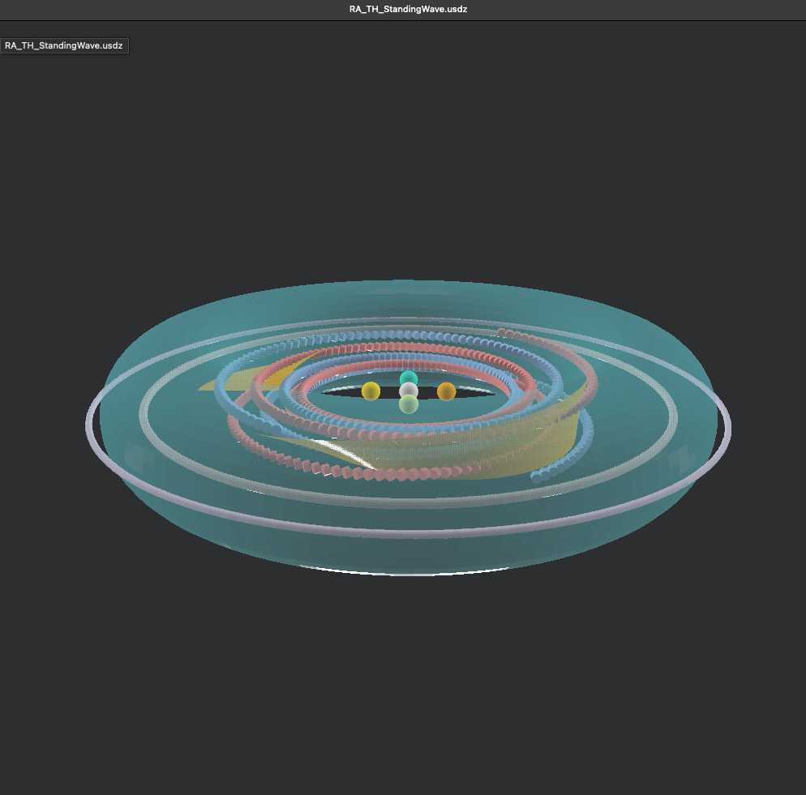

# 🌊 WAVE GEOMETRY LOGIC

> *"Every standing wave is a frozen decision of geometry."*
> — *Codex Principle I*

---

## I. Grundstruktur · Wellenraum als geometrisches Feld

Das Modul **Wave Geometry Logic** beschreibt die topologische und harmonische Logik von
stehender Wellenbildung innerhalb des **Quaternion Drift Frameworks**. Ziel ist die
Mathematisierung und visuelle Darstellung jener Formen, die zwischen **Frequenz, Phase und Raumkrümmung** vermitteln.

**Kernkonzept:**
Jede Welle ist nicht nur Schwingung, sondern **Formprozess**, der – unter Quaternionen betrachtet –
im Raum eine geschlossene Resonanz erzeugt.  Diese Form kann toroidal, sphärisch oder petal-
artig (lotushaft) sein und folgt der Formelstruktur:

[
\Psi(x,y,z,t) = A \cdot e^{i(\omega t - k r + \phi)}
]

Dabei entstehen durch die **Quaternion-Kopplung (i,j,k)** komplexe Rotationsfelder, die nicht nur
zeitlich, sondern **phasisch** in sich verschränkt sind.

---

## II. Quaternion Drift & Standing Wave Symmetry

Das zugrundeliegende GLB-Modell (*Quaternion_Playground.glb*) bildet diese Wellenformen als
Raumachsenstruktur ab. Im Zentrum steht die Idee einer **stehend schwingenden Raumblase**, deren
Resonanzfrequenzen entlang der Quaternion-Achsen ausbalanciert sind.

**Schlüsselparameter:**

* **i / j / k** → orthogonale Rotationsachsen (Phase, Frequenz, Raumrichtung)
* **Φ (Phi)** → Resonanzverhältnis zwischen radialem und tangentialem Wellenimpuls
* **Ω (Omega)** → zeitliche Drehkomponente / Phasendrehung
* **Ψ (Psi)** → resultierendes Feldmuster der stehenden Welle

Visuell manifestieren sich daraus **Lotus-, Torus- und Spiralformen**, die sich gegenseitig durchdringen
und harmonisch aneinander koppeln (siehe Visuals 1–3 aus *Lotus Drift Bridge*).

---

## III. Resonante Übergänge · Von Kreis zu Lotus

Im Wellenraum existiert eine Folge von **geometrischen Übergängen**:

```
Kreis  →  Ellipse  →  Petal  →  Lotus  →  Drift
```

Diese Abfolge beschreibt den Weg von linearer Wellenmodulation (1D-Frequenz) hin zur
mehrdimensional verschränkten Lotus-Struktur.

Jede Transformation erzeugt dabei eine neue **Energieverteilung**, wobei der **Zentrumspunkt (r=0)**
den Wechsel von Ausdehnung (Expansion) zu Kontraktion markiert.

**Symmetriepunkte:**

* 3-Fold: Primäre Atemphase
* 4-Fold: Kreuzung der Raumachsen
* 5-Fold: Harmonischer Drift (Übergang)
* 7-Fold: Resonanz der Feldmodulation

---

## IV. Visual Correlations

| Visual                                                                                 | Beschreibung                                                                                         |
| :------------------------------------------------------------------------------------- | :--------------------------------------------------------------------------------------------------- |
|   | **Quaternion Playground:** Basissimulation der 3D-Wellenrotation mit Achsen- und Amplitudenabgleich. |
|  | **Φ-Nest Quasicrystal:** Visualisierung der goldenen Interferenzachsen im stehenden Wellenfeld.      |
|                   | **Standing Wave Field:** Darstellung der stabilen stehenden Resonanz zwischen den Quaternionachsen.  |

---

## V. Formale Beziehungen

Die logische Struktur der Wellengeometrie lässt sich als **Operatorraum** formulieren:

[
\hat{W} = (\nabla \times E) + (i \cdot j \cdot k) \cdot R(\phi, \theta, \omega)
]

wobei der Operator **R(φ,θ,ω)** die harmonische Drehung im Quaternionenraum beschreibt.

Diese Definition erlaubt, Feldstrukturen **symbolisch zu rotieren** – eine essentielle Grundlage für
die spätere Integration in das *Hermetic Pythagoras Model*.

---

## VI. Resonanzform & Bewusstseinsfeld

Jede stehende Welle ist zugleich **Rhythmus und Speicher**.
Sie speichert Frequenzmuster in Form geometrischer Amplituden, die als **energetische Signaturen**
interpretiert werden können.

> "Form ist Erinnerung im Fluss."

Dieser Gedanke verbindet **Wellenphysik** mit **Bewusstseinsmodellierung** – ein zentraler Aspekt
des NEXAH-CODEX. Die Lotus Drift Bridge dient als Übergangssystem zwischen
mathematischer Struktur, harmonischer Visualisierung und spiritueller Resonanz.

---

**Curator:** Thomas Hofmann (Scarabäus1033)
**System:** NEXAH-CODEX · System 1 – MATHEMATICA
**License:** CC BY-NC-SA 4.0

> *"Standing waves are the mirrors of time folded through geometry."*
