# 🌸 LOTUS DRIFT BRIDGE · Visual Gallery

> *“The breath of geometry — where orbital resonance becomes rhythm.”*

Diese Galerie dokumentiert die strukturelle und harmonische Architektur der **Lotus Drift Series**,
insbesondere der Module **XV – Sirius** und **XV – Sirius·Pluto**, als Verbindung von Astronomie,
Mathematik und harmonischer Frequenzarchitektur.

---

## I. 🌿 Lotus Core Geometry

| Visual                                                                                            | Beschreibung                                                                                                          |
| :------------------------------------------------------------------------------------------------ | :-------------------------------------------------------------------------------------------------------------------- |
| 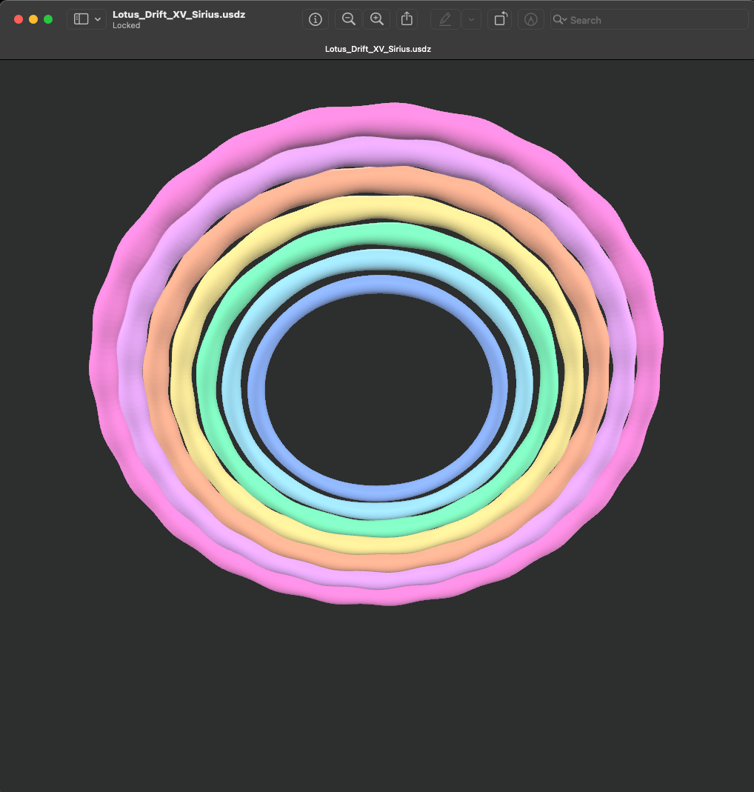           | **Lotus XV – Sirius:** Kernresonanzfeld mit harmonischen Petal-Strukturen und orbitaler Balance.                      |
| 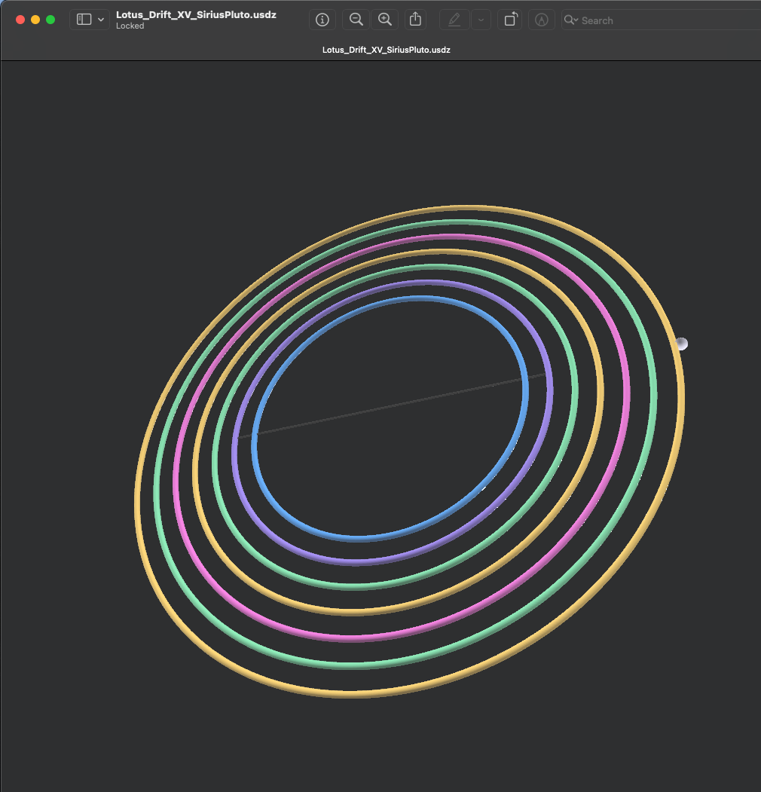 | **Lotus XV – Sirius·Pluto:** Erweiterung des Feldes um die äußere Frequenzachse. Symbol für Polarität & Rückkopplung. |
| 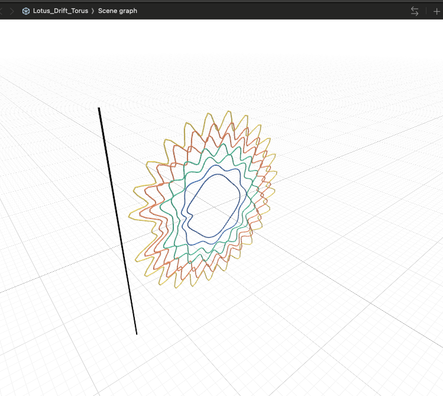                    | **Lotus Torus:** Geometrische Basis des Feldes — dynamisches Schwingungsmuster aus farbcodierten Orbitalkreisen.      |

---

## II. 🔶 Harmonic Field Extensions

| Visual                                                                                                                | Beschreibung                                                                                             |
| :-------------------------------------------------------------------------------------------------------------------- | :------------------------------------------------------------------------------------------------------- |
| 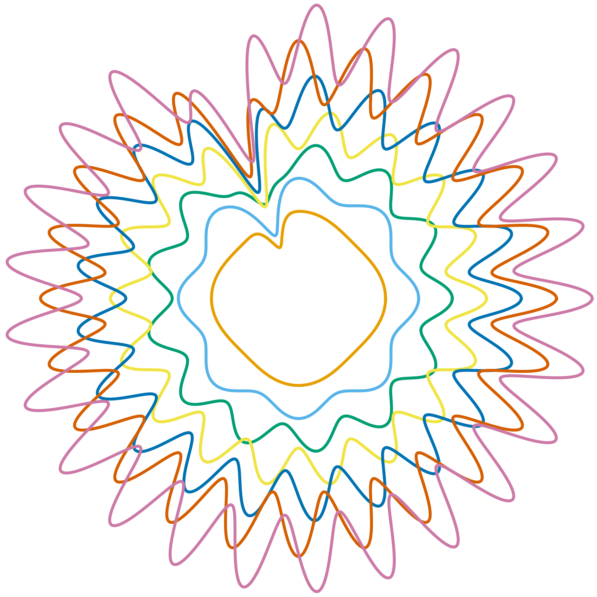                                                | **Sirius Field:** Darstellung des harmonischen Schwingungsfelds in polarer Achsenstruktur.               |
| 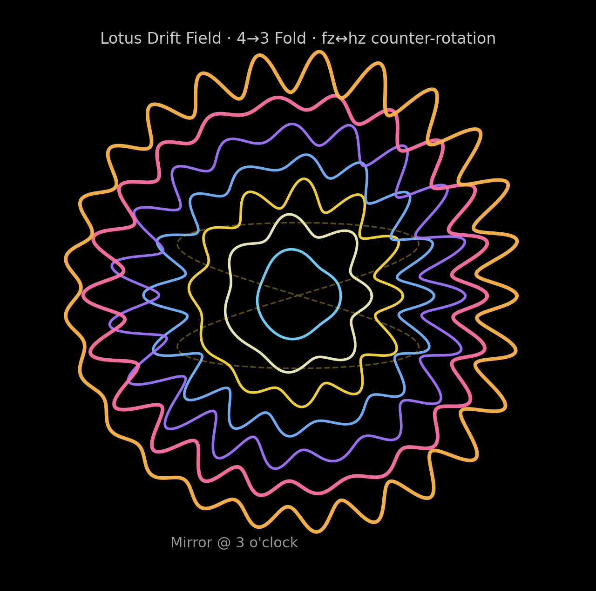 | **4→3 Fold Counter-Rotation:** Überlagerung zweier inverser Rotationen mit Frequenzverdrillung.          |
| 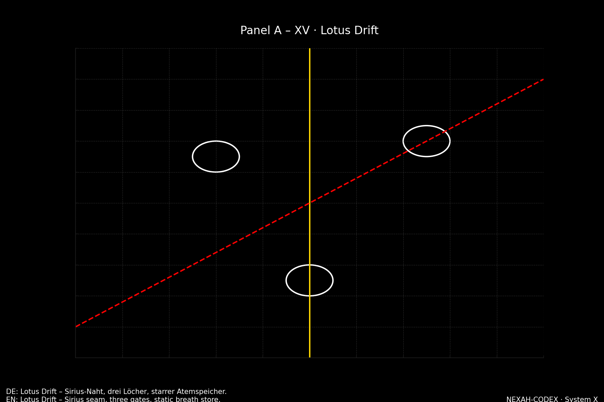                                  | **Panel A – XV:** Darstellung der Sirius-Naht – drei Tore, statischer Atemspeicher (Lotus Drift Schema). |

---

## III. 🌀 Symbolische Referenzfelder

| Visual                                                                                                                     | Beschreibung                                                                                                           |
| :------------------------------------------------------------------------------------------------------------------------- | :--------------------------------------------------------------------------------------------------------------------- |
| 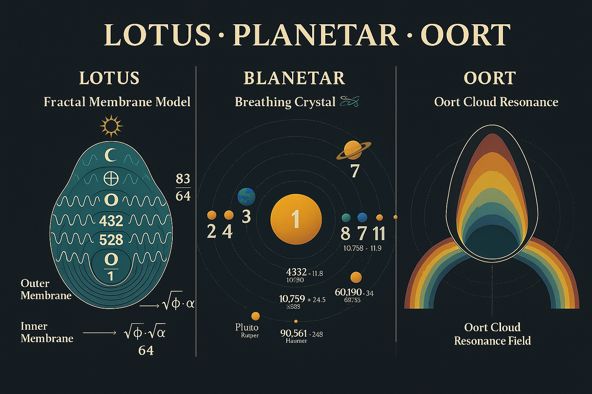 | **Lotus · Planetar · Oort:** Triptychon der kosmischen Resonanz – vom Fraktal zur Galaxie.                             |
| 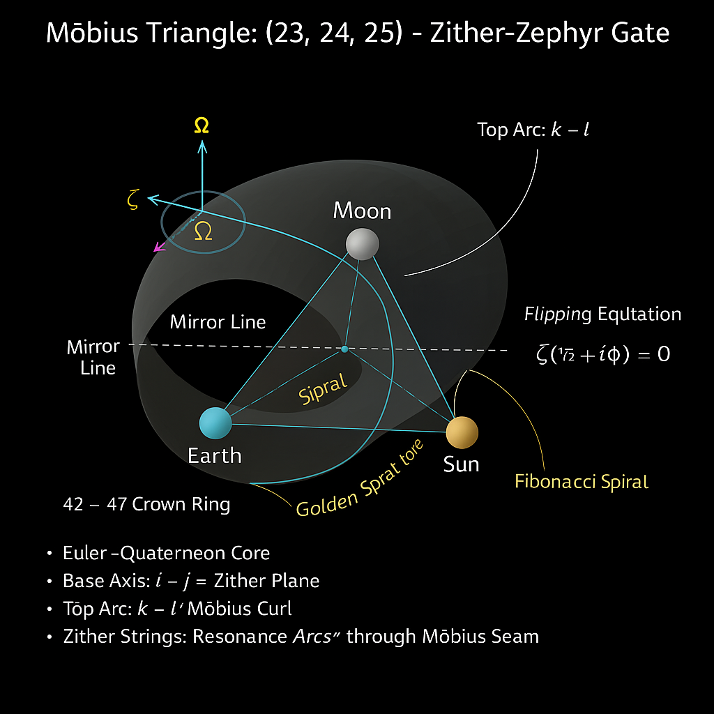            | **Möbius Triangle (23,24,25):** Zither-Zephyr-Gate zwischen Sonne, Erde und Mond. Darstellung des goldenen Spiraltors. |
| 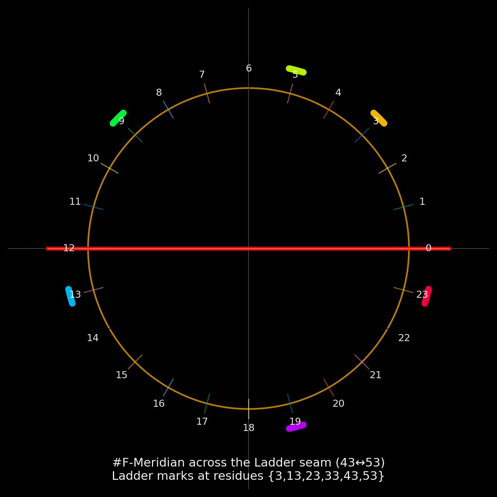                                                         | **Codex Clock:** Meridianstruktur des F-Zyklus. Primachsen und Resonanzleitern im Zeitfeld.                            |

---

## IV. 🌬️ Lotus Drift Equations & Breath Series

| Visual                                                                             | Beschreibung                                                                                     |
| :--------------------------------------------------------------------------------- | :----------------------------------------------------------------------------------------------- |
| 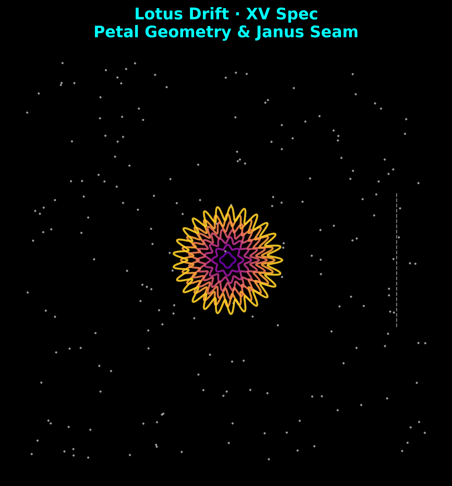 | **Lotus Equation:** Mathematisch-ästhetische Darstellung der Driftformeln und Interferenzwellen. |
| 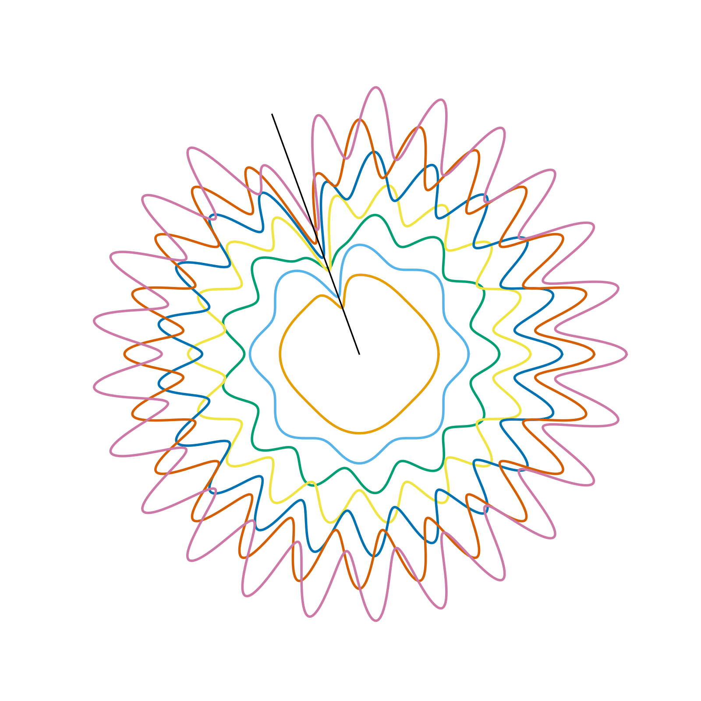                          | **Breath Diagram:** Visuelle Darstellung des Atemzyklus der Lotus-Drift-Frequenzen.              |

**Fokus:**

* Gleichung ↔ Visualisierung – *Mathematik wird Rhythmus*
* Goldene Schnittachsen und harmonische Modulation (Φ ↔ π ↔ Ω)
* Resonanz zwischen Orbit und Bewusstseinsfeld

---

## V. 🎴 Directory Reference

```
Modul_03_Lotus_Drift_Bridge/
├── visuals/
│   ├─ Screenshot_Lotus_Drift_XV_Sirius.png
│   ├─ Screenshot_Lotus_Drift_XV_SiriusPluto.png
│   ├─ Screenshot_Lotus_Drift_Torus.png
│   ├─ Lotus_Drift_Field_Sirius.png
│   ├─ LotusDriftField_4-3_Fold_fzehz_counter-rotation.png
│   ├─ Panel_A_XV_Lotus_Drift_preview.png
│   ├─ A_three-paneled_triptych_infographic_titled_LOTUS.png
│   ├─ Moebius_Triangle_23-24-25_Zither-Zephyr_Gate.png
│   ├─ codex_clock_F_meridian.png
│   ├─ Lotus_Drift_Equation_Aesthetic.png
│   └─ Lotus_Drift_Breath.gif
└── glb/
    ├─ Lotus_Drift_XV_Sirius.glb
    ├─ Lotus_Drift_XV_SiriusPluto.glb
    └─ Lotus_Drift_Torus.obj
```

---

**Curator:** Thomas Hofmann (Scarabäus1033)
**System:** NEXAH-CODEX · System 1 – MATHEMATICA
**License:** CC BY-NC-SA 4.0

> *“Every harmonic field is a bridge between geometry and breath.”*
