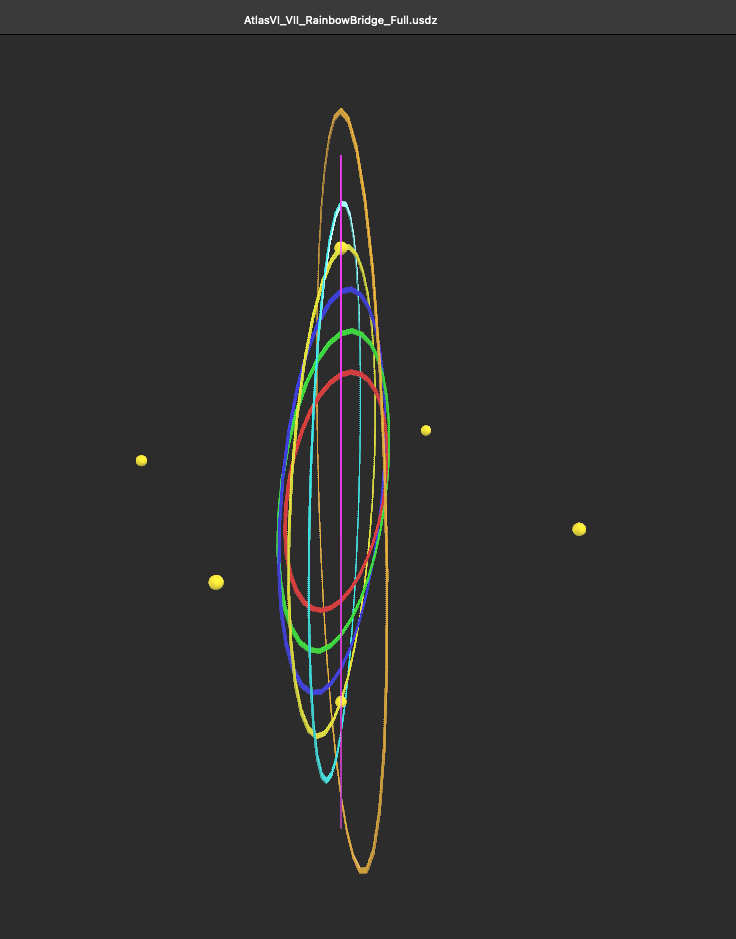
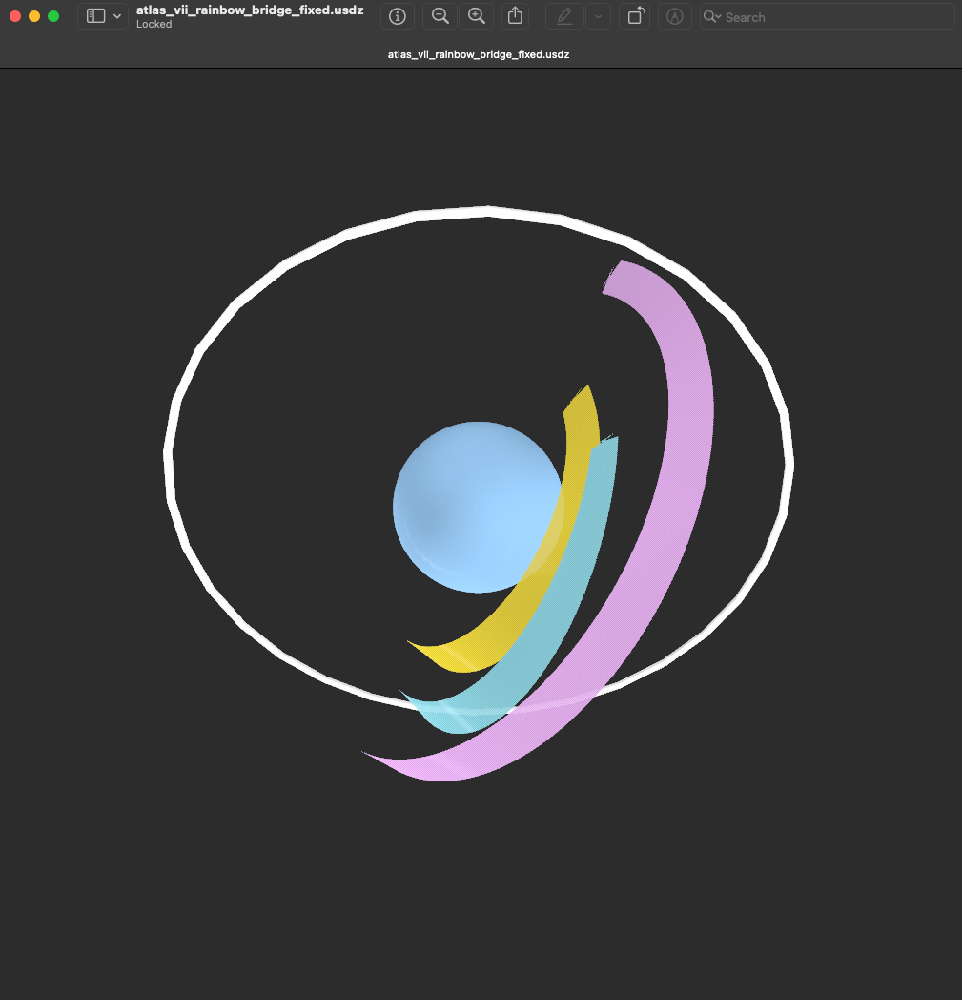
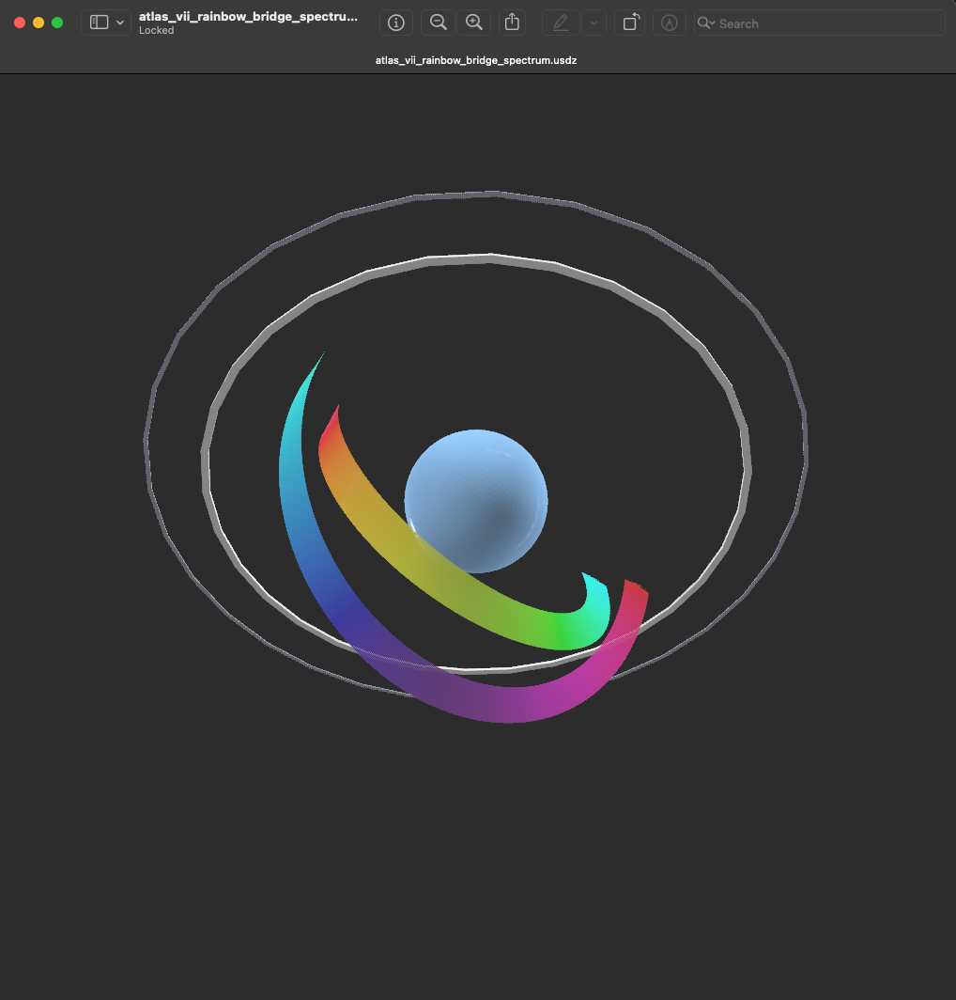
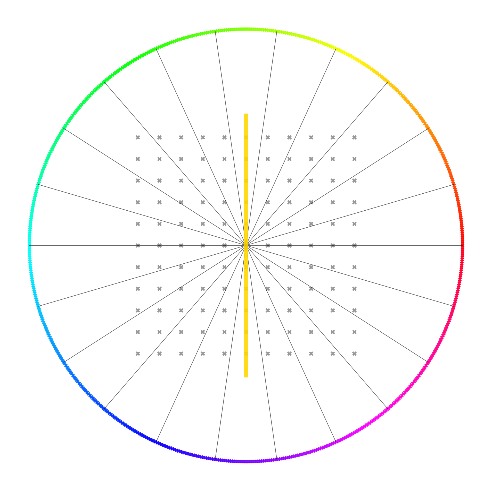
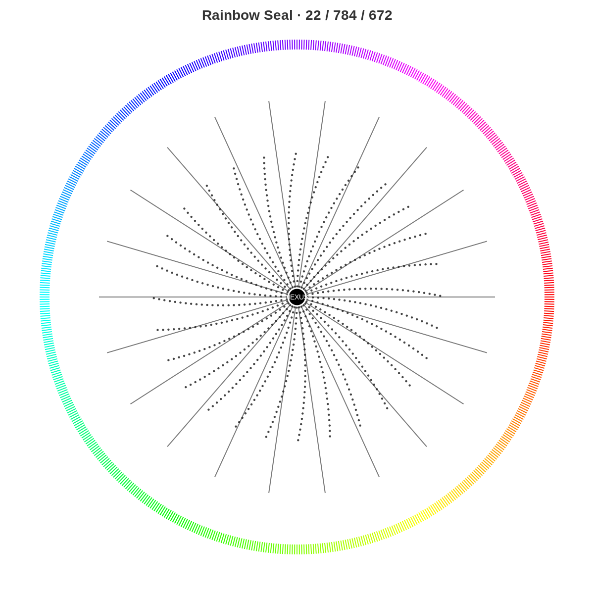
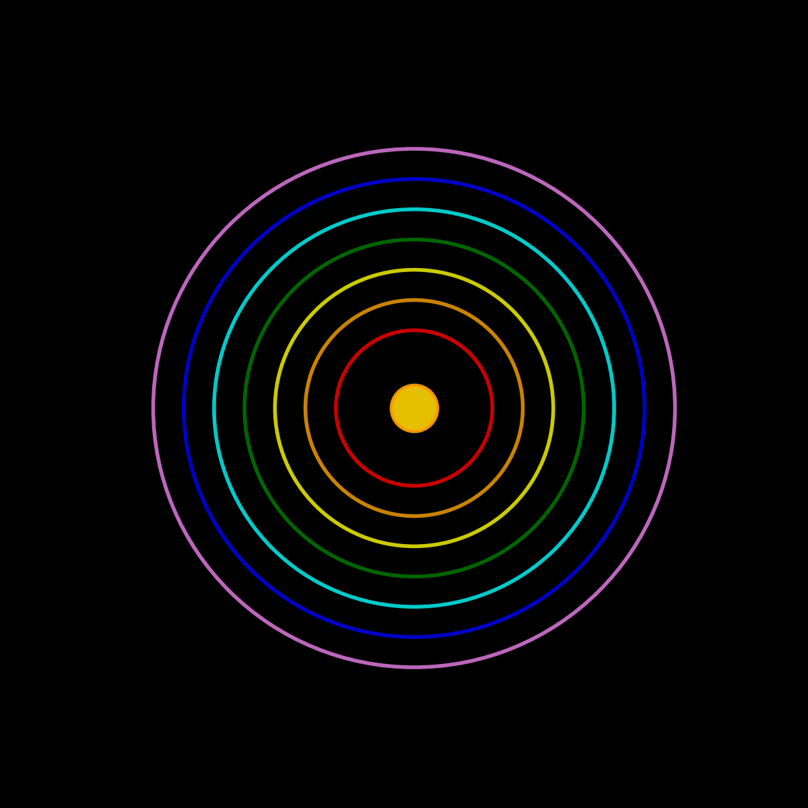

# 🌈 RAINBOW BRIDGE · Visual Gallery

> *“From grayscale to prismatic awareness — the bridge seals the spectrum.”*

Diese Galerie sammelt die aktuellen Visuals und GLB-Screenshots für **Modul 04 – Rainbow Bridge**. Alle Pfade sind auf den Ordner `./visuals/` bezogen; 3D-Dateien liegen in `./glb/`.

---

## I. ☀️ Atlas VI–VII · Rainbow Bridge Core

| Visual                                                                                                         | Beschreibung                                                                                                                    |
| :------------------------------------------------------------------------------------------------------------- | :------------------------------------------------------------------------------------------------------------------------------ |
|             | **Atlas VI–VII Bridge (Full View):** Zentrale Brückenstruktur zwischen 6. und 7. Atlas-Ebene — spektrale Ellipse über Ω‑Knoten. |
|  | **GLB‑Screenshot:** Arbeitsansicht der Brücke (V‑Perspektive) zur Dokumentation der 3D‑Geometrie.                               |

---

## II. 🔁 Varianten · Fixed & Spectrum

| Visual                                                                                    | Beschreibung                                                                      |
| :---------------------------------------------------------------------------------------- | :-------------------------------------------------------------------------------- |
|        | **Fixed Variant:** Festgelegte Farb-/Geometriezuordnung für stabile Präsentation. |
|  | **Spectrum Variant:** Vollständige Spektraldarstellung mit farbdynamischem Bogen. |

---

## III. 🎨 Hermetic Color System · Chromatic Resonance

| Visual                                                                                                                                                                 | Beschreibung                                                                 |
| :--------------------------------------------------------------------------------------------------------------------------------------------------------------------- | :--------------------------------------------------------------------------- |
|                                                                                                           | **Hermetic Color Wheel:** Grundordnung der Farb‑Oktaven (φ↔π↔Ω‑Bezüge).      |
|                                                 | **Möbius Transition:** Farbresonanz‑Matrix (Makro → Quantenfeld).            |
|                                                                             | **96‑Tone System:** Tesla‑Ausrichtung (3‑6‑9) über den Farbkreis.            |
|  | **239‑Tone Expansion:** Erweiterte Ton‑/Farbteilung mit *White Singularity*. |

> **CSV (Datenbasis):** `./Json_Csv/Hermetic_Color_Wheel___Nexah_15-Tone_Alignment.csv` — 15‑Ton‑Ausrichtung für Atlas‑Mapping.

---

## IV. 🧭 GLB Legend & UI Panels

| Visual                                                                       | Beschreibung                                                             |
| :--------------------------------------------------------------------------- | :----------------------------------------------------------------------- |
|                       | **GLB‑Legend:** Farbcodes & Modellklassen für 3D‑Assets.                 |
|                         | **UI Panel:** Farbbalken vom B/W‑Gradienten zum Vollspektrum.            |
|  | **Star Overlays:** Von Schwarzweiß‑Gittern zu Regenbogen‑Überlagerungen. |

---

## V. 🌀 Seals, Gates & Animations

| Visual                                                                | Beschreibung                                                    |
| :-------------------------------------------------------------------- | :-------------------------------------------------------------- |
|        | **Elevator Seal:** Spektrales Siegel (Gate‑Marke).              |
|  | **Seal 22·784·672:** Feintuningsiegel für Brücken‑Kalibrierung. |

**GIF‑Animationen**

* 
* 

> *Hinweis:* GIFs als leichte „Breath‑Loops“ einsetzen (Landing‑/Intro‑Panels).

---

## VI. 📂 Ordnerreferenz

```
Modul_04_Rainbow_Bridge/
├── visuals/
│   ├─ AtlasVI_VII_RainbowBridge_Poster_vinyl.png
│   ├─ Screenshot_AtlasVI_VII_RainbowBridge_Full_V.png
│   ├─ atlas_vii_rainbow_bridge_fixed.png
│   ├─ atlas_vii_rainbow_bridge_spectrum.png
│   ├─ Hermetic_Color_Wheel.jpg
│   ├─ Hermetic_Color_Wheel-Möbius_Harmonic_Transition.png
│   ├─ Hermetic_Tesla96_Tone_Color_System.png
│   ├─ 239-Tone_Hermetic_Color_System_with_Tesla_3-6-9_and_White_Singularity.png
│   ├─ NEXAH_GLTF_Legend.png
│   ├─ wp_rainbow_panel.png
│   ├─ wp_double_triangles_rainbow.png
│   ├─ rainbow_elevator_seal.png
│   ├─ rainbow_seal_22_784_672.png
│   ├─ perle_yinyang_rainbow.gif
│   └─ rainbow_universe_heartbeat.gif
├── glb/
│   ├─ AtlasVI_VII_RainbowBridge_Full.glb
│   ├─ atlas_vii_rainbow_bridge_fixed.glb
│   ├─ atlas_vii_rainbow_bridge_spectrum.glb
│   └─ pillar_serpent_egg_rainbowii.glb
└── Json_Csv/
    └─ Hermetic_Color_Wheel___Nexah_15-Tone_Alignment.csv
```

---

**Curator:** Thomas Hofmann (Scarabäus1033)
**System:** NEXAH‑CODEX · System 1 – MATHEMATICA
**License:** CC BY‑NC‑SA 4.0

> *“The rainbow is the cathedral’s breath made visible.”*
