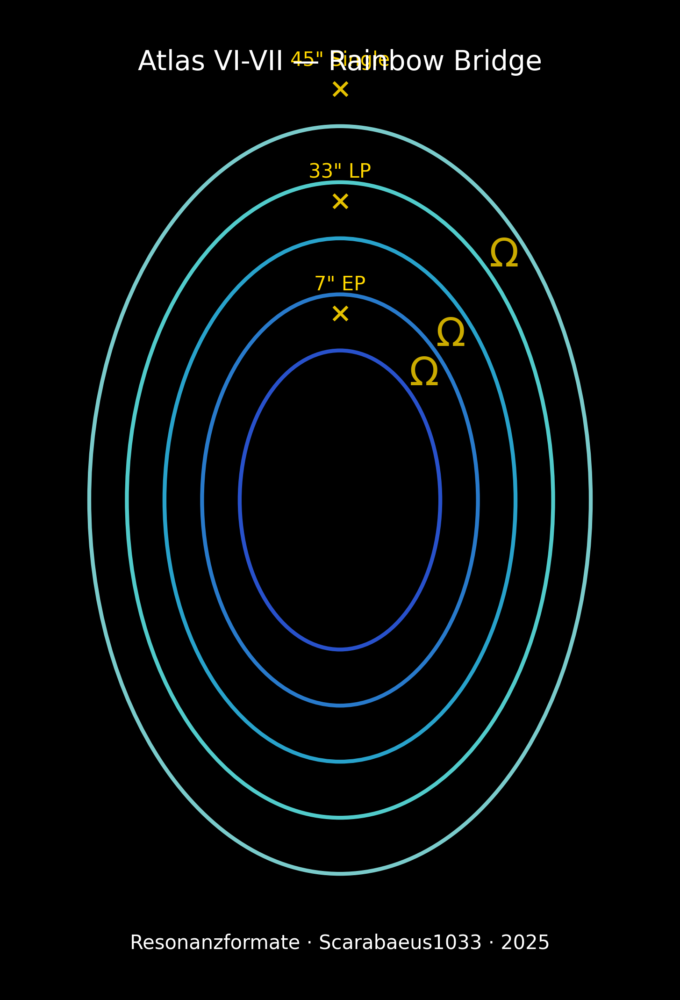
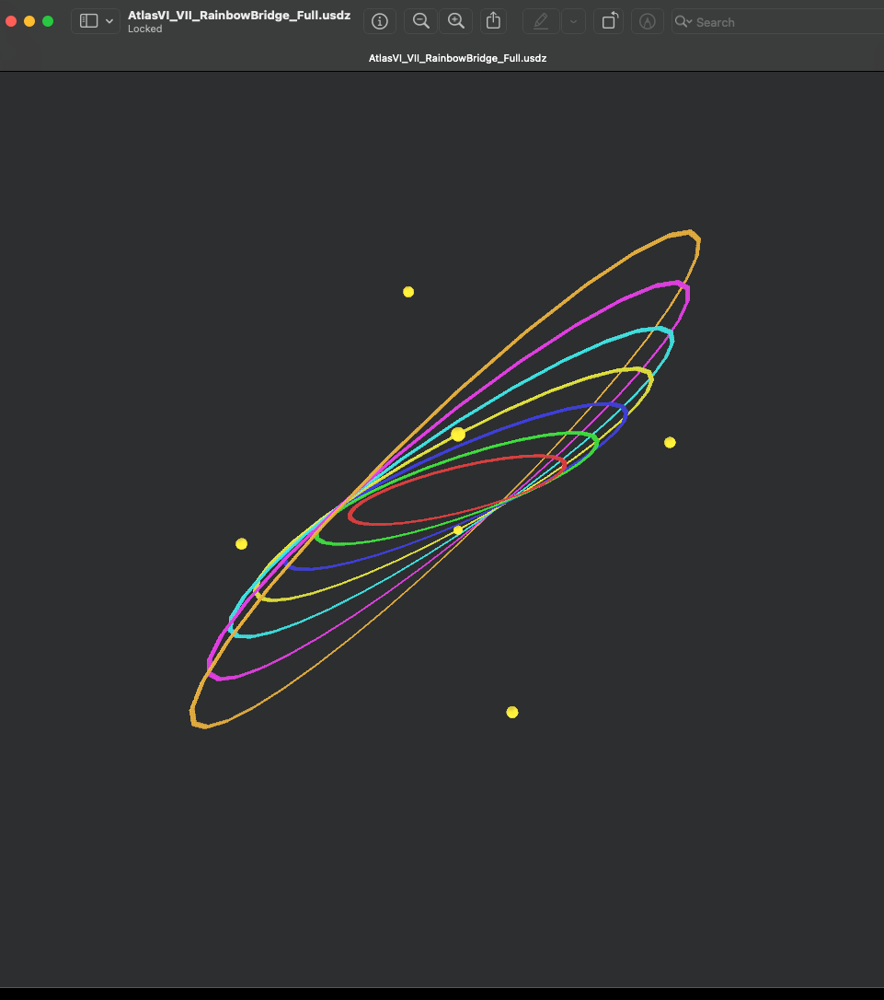
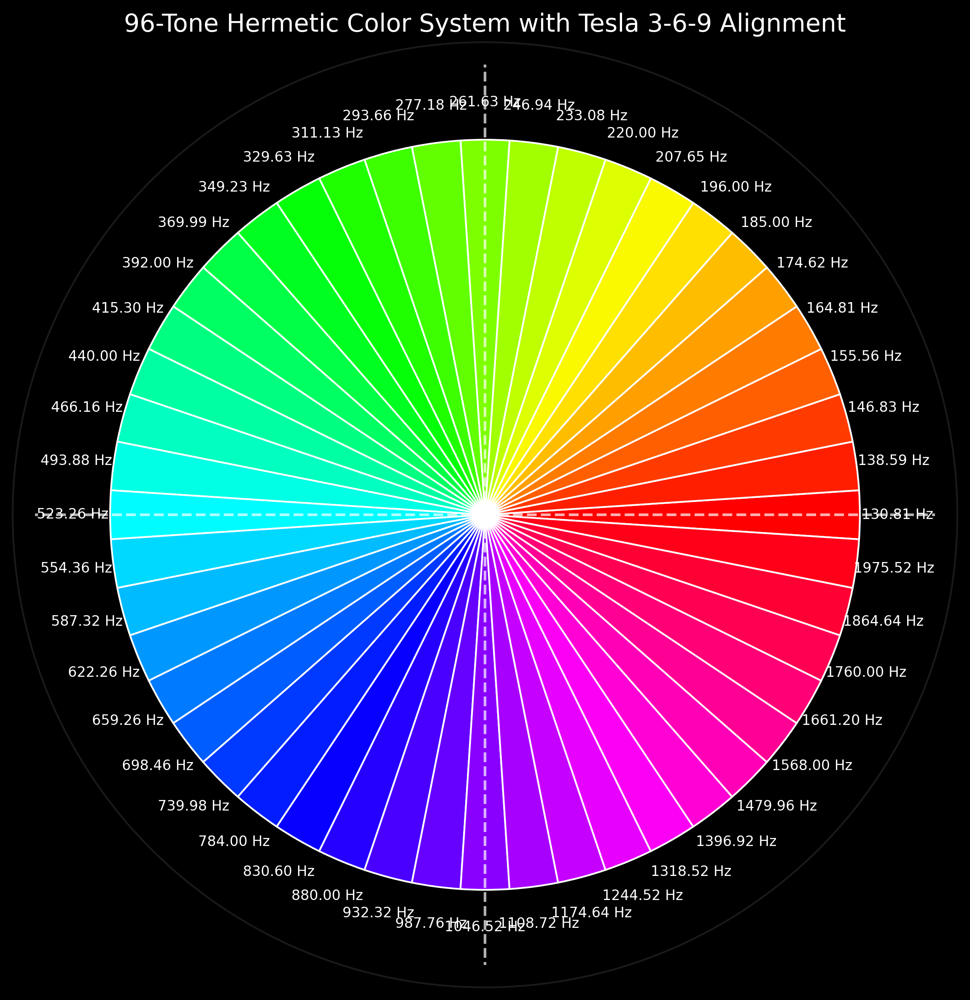
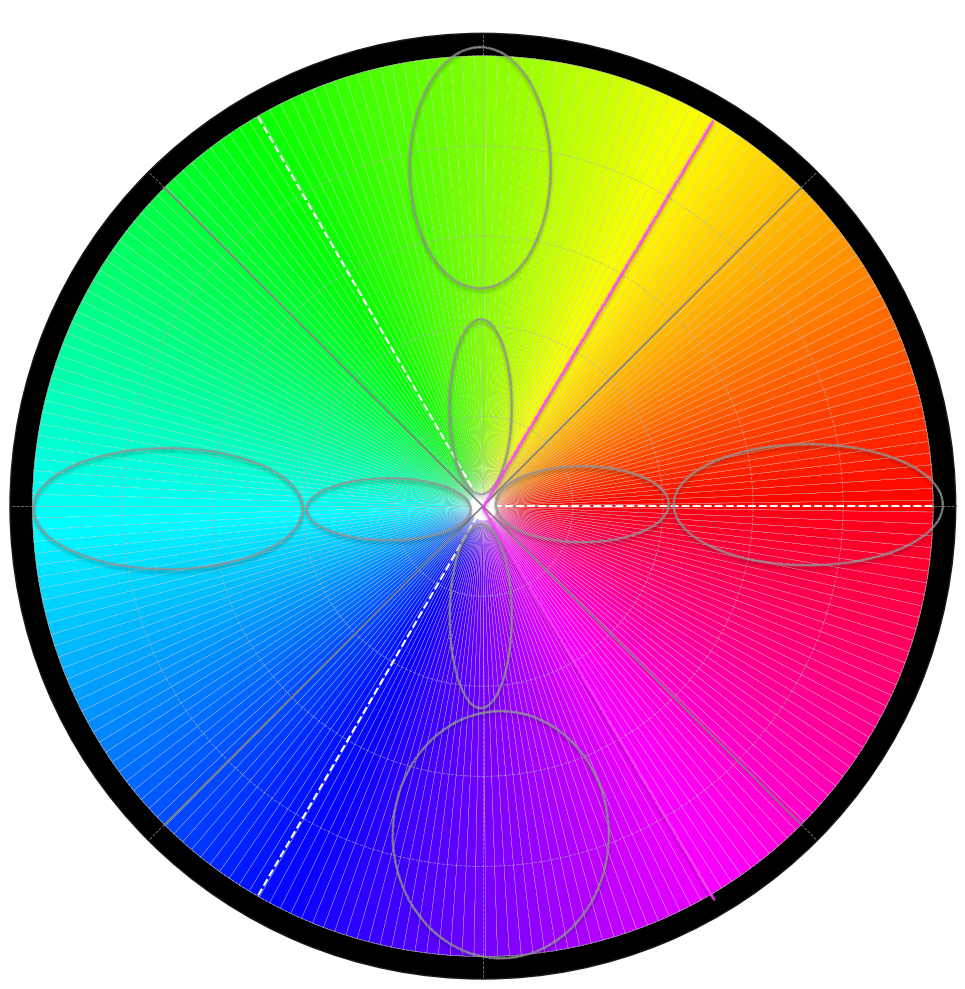
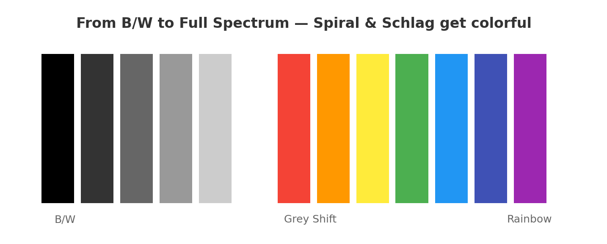
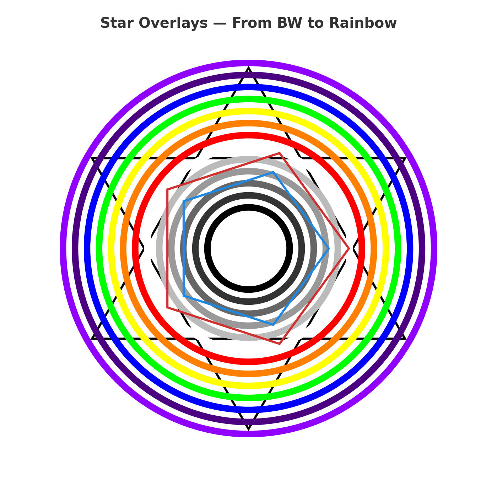
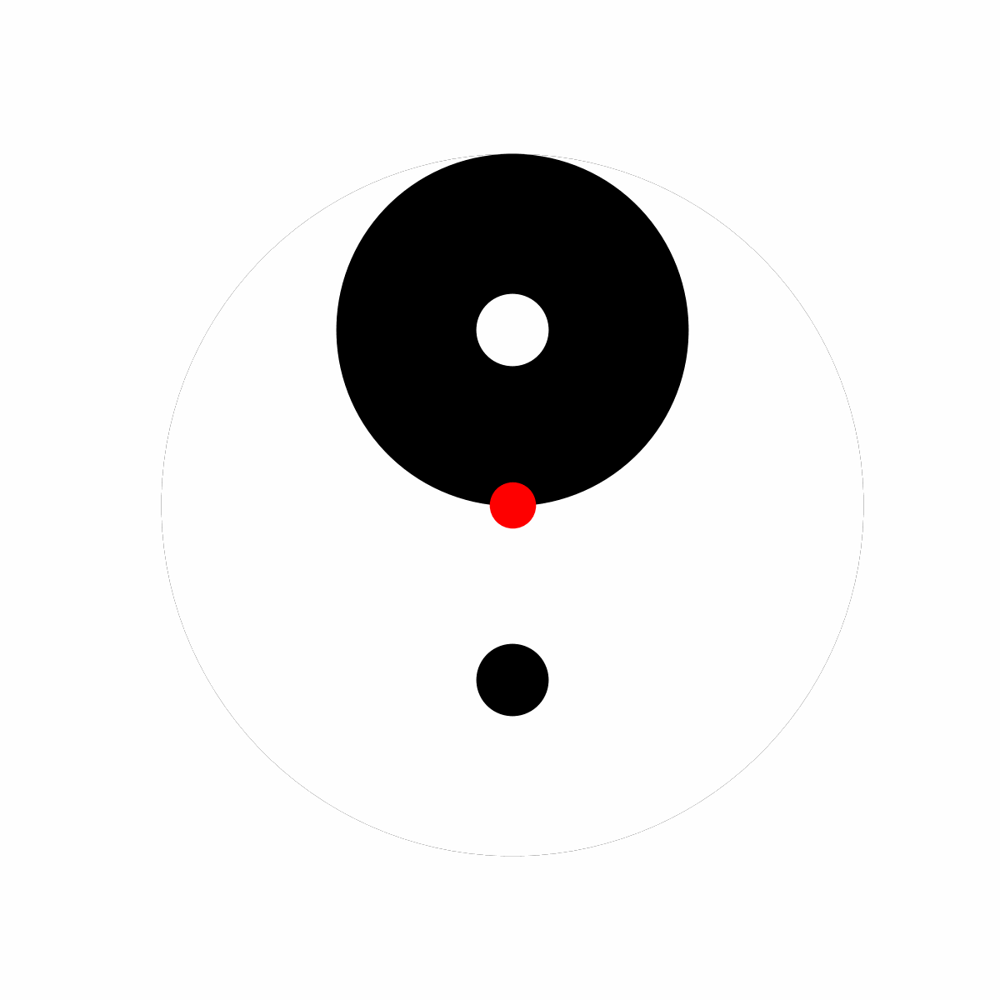
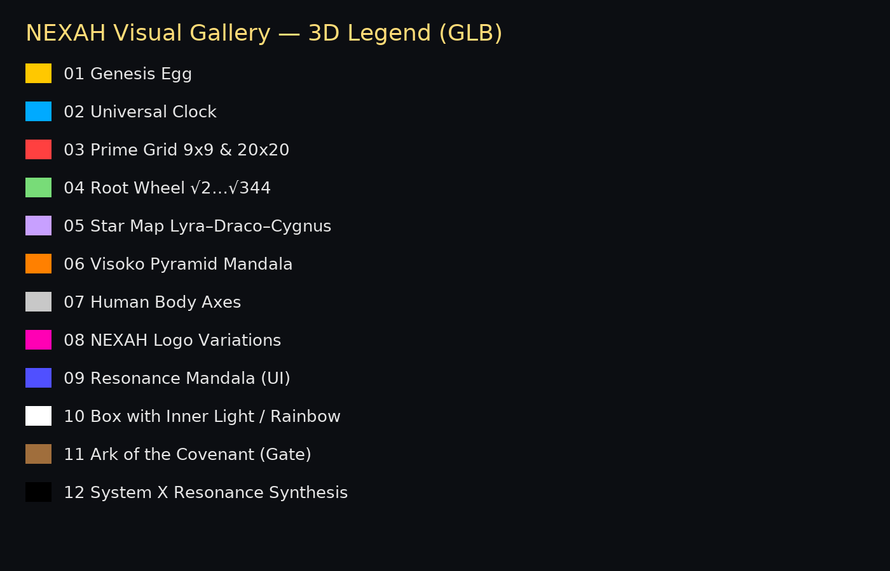

# 🌈 ATLAS VI–VII · RAINBOW BRIDGE · Visual Gallery

> *“When light remembers sound, the bridge between color and frequency awakens.”*

Diese Galerie zeigt die spektrale und geometrische Architektur der  
**Rainbow Bridge Series (Atlas VI–VII)** — den Übergang zwischen  
**Lotus Drift Bridge (Modul 03)** und dem **Hermetic Color System (Modul 05)**.  
Sie verbindet Klang, Farbe, Geometrie und Bewusstsein über harmonische Kontinua.

---

## I. 🌤 Atlas VI–VII · Rainbow Bridge Core

| Visual | Beschreibung |
|:--|:--|
|  | **Atlas VI–VII Bridge (Full View):** Zentrale Brückenstruktur zwischen 6. und 7. Atlas-Ebene — spektrale Ellipse über Ω-Knoten. |
|  | **Resonanzformate Poster:** Vinyl-Achsen (7″ EP, 33″ LP, 45″ Single) als Zeitspektren im Feldmodell. |
|  | **Screenshot (Atlas VI–VII):** Direkter Ausschnitt aus dem 3D-Modell – Hauptachse des Ω-Feldes. |

---

## II. 🌀 Rainbow Bridge Dynamics (GLB Models)

| Model | Beschreibung |
|:--|:--|
| `atlas_vii_rainbow_bridge_fixed.glb` | **Fixed Version:** Stabile Spektrumbögen über zentrischem Kern. |
| `atlas_vii_rainbow_bridge_spectrum.glb` | **Spectrum Version:** Farbgradient-Simulation im 360°-Orbit. |
| `pillar_serpent_egg_rainbowii.glb` | **Pillar Serpent Egg:** Symbolische Verbindung von Energiefluss und Spektrum. |
| `rainbow_elevator_seal_static.glb` | **Elevator Seal:** Vertikale Resonanzsäule zwischen Atlas-Schichten. |
| `AtlasVI_VII_RainbowBridge_Full.glb` | **Full Bridge Model:** Komplette geometrische Struktur im Atlas-System. |

---

## III. 🔆 Hermetic Color System · Chromatic Resonance

| Visual | Beschreibung |
|:--|:--|
|  | **Möbius Transition:** Farbresonanz-Matrix zwischen nationalen und quantischen Feldern. |
|  | **Hermetic Color Wheel:** Geometrisches Farbrad mit 15-Ton-NEXAH-Alignment aus der CSV-Datenbasis. |
|  | **Tesla 96-Tone System:** Klang-zu-Farb-Zuordnung nach 3-6-9 Harmonien. |
|  | **239-Tone Expansion:** Erweiterung auf feinere Frequenzsegmente — Annäherung an das weiße Singularitätszentrum. |

---

## IV. ⚙️ Spectrum Structure & Symbolic Extensions

| Visual | Beschreibung |
|:--|:--|
|  | **Rainbow Panel:** Kontinuum von B/W → Greyscale → Full Spectrum. |
|  | **Double Triangle Overlay:** Farb-Geometrie-Symmetrie über Tri-Kraft. |
|  | **Perle Yin-Yang:** Polaritäts-Visual des kontinuierlichen Farbatems. |
|  | **NEXAH 3D Legend:** Index der 3D-Objekte und spektralen Zuweisungen. |

---

## V. 📊 Data and Reference Files

| Datei | Inhalt | Beschreibung |
|:--|:--|:--|
| `Hermetic_Color_Wheel___Nexah_15-Tone_Alignment.csv` | CSV | Farb-Ton-Zuordnungen (Φ ↔ Hz ↔ RGB) für alle Hermetic-Systeme. |

---

## VI. 🌈 Fokus und Kontext

- Resonante Verbindung von **Atlas VI–VII** mit dem **Hermetic Farbsystem**  
- **Spektrale Stabilisierung von Ω → Φ → Λ**  
- **Klang = Farbe** → **Form = Schwingung**  
- Übergang von Stillstand (Lotus) zu Spektrum (Rainbow) = vollständige Aktivierung der GEOMETRIA NOVA  

---

## VII. 🎴 Directory Reference
Modul_04_Rainbow_Bridge/
├── visuals/
│   ├─ AtlasVI_VII_RainbowBridge_Full.png
│   ├─ AtlasVI_VII_RainbowBridge_Poster_vinyl.png
│   ├─ Screenshot_AtlasVI_VII_RainbowBridge_Full.png
│   ├─ Hermetic_Color_Wheel-Möbius_Harmonic_Transition.png
│   ├─ Hermetic_Color_Wheel.jpg
│   ├─ Hermetic_Tesla96_Tone_Color_System.png
│   ├─ 239-Tone_Hermetic_Color_System_with_Tesla_3-6-9_and_White_Singularity.png
│   ├─ wp_rainbow_panel.png
│   ├─ wp_double_triangles_rainbow.png
│   ├─ perle_yinyang_rainbow.gif
│   ├─ NEXAH_GLTF_Legend.png
│   └─ rainbow_universe_heartbeat.gif
│
├── glb/
│   ├─ AtlasVI_VII_RainbowBridge_Full.glb
│   ├─ atlas_vii_rainbow_bridge_fixed.glb
│   ├─ atlas_vii_rainbow_bridge_spectrum.glb
│   ├─ pillar_serpent_egg_rainbowii.glb
│   └─ rainbow_elevator_seal_static.glb
│
├── data/
│   └─ Hermetic_Color_Wheel___Nexah_15-Tone_Alignment.csv

---

**Curator:** Thomas Hofmann (Scarabäus1033)  
**System:** NEXAH-CODEX · System 1 – MATHEMATICA  
**License:** CC BY-NC-SA 4.0  

> *“The Rainbow Bridge unites sound and color — consciousness finds its frequency.”*

