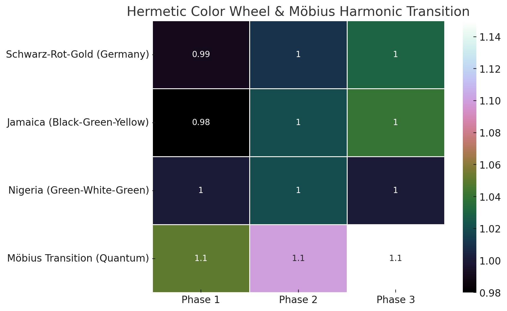
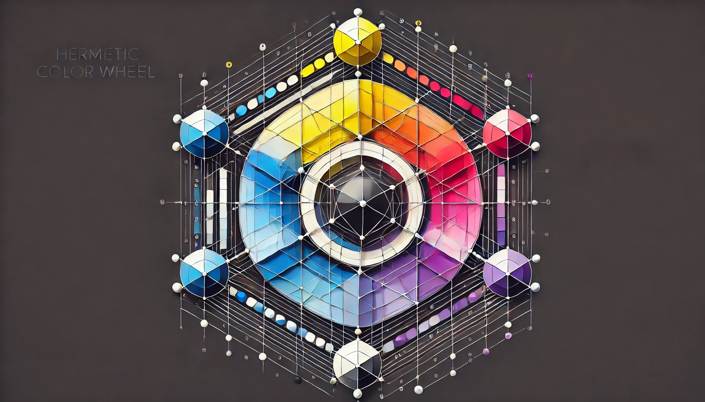
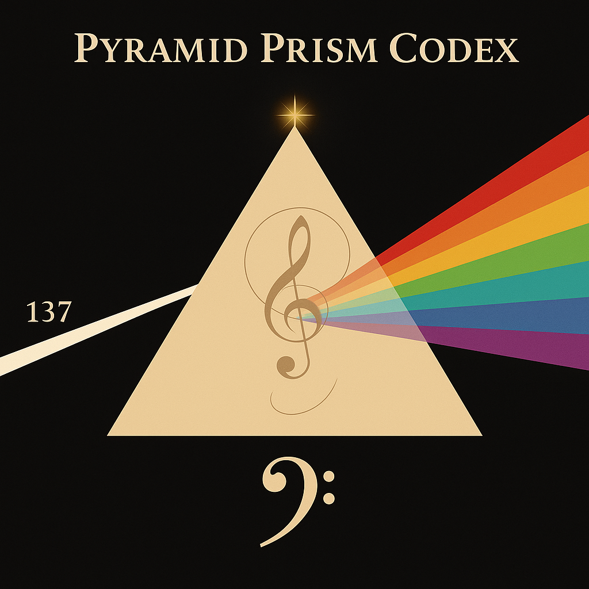
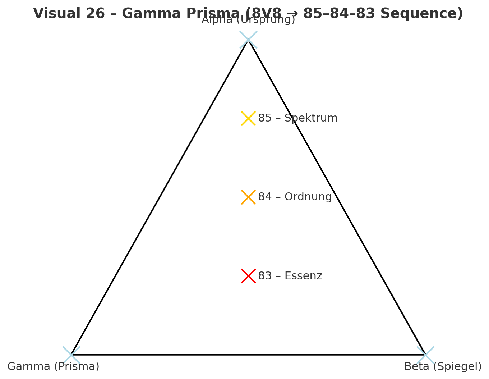
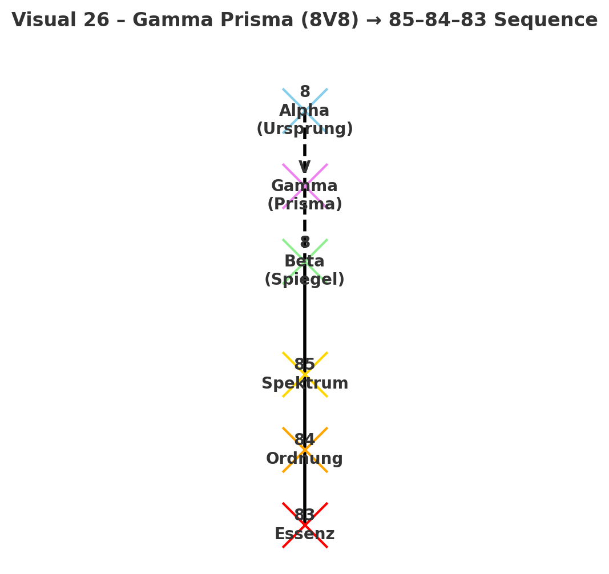
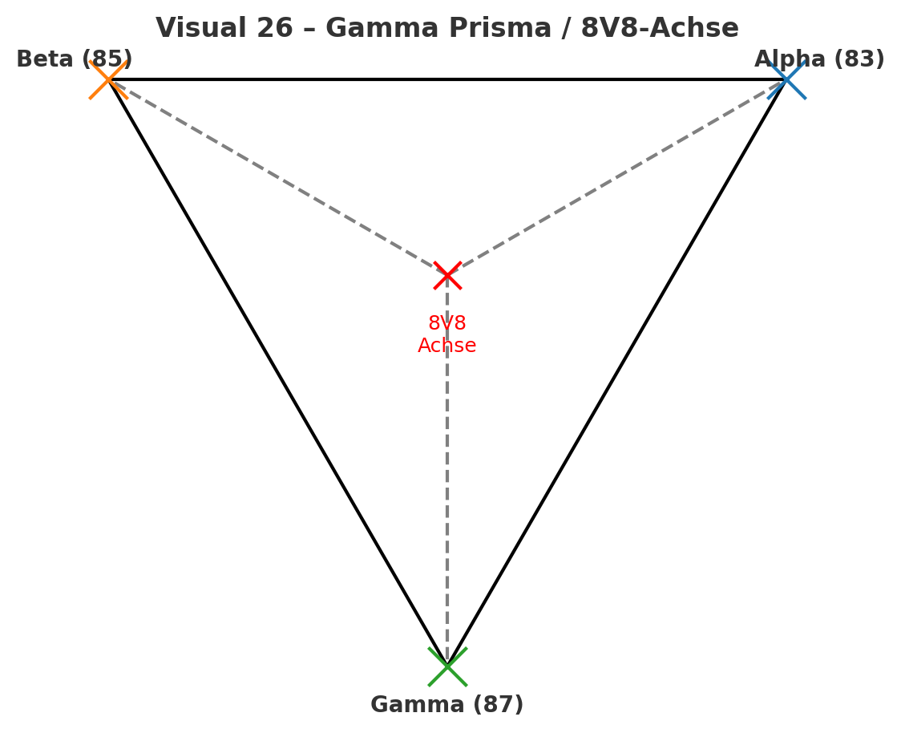
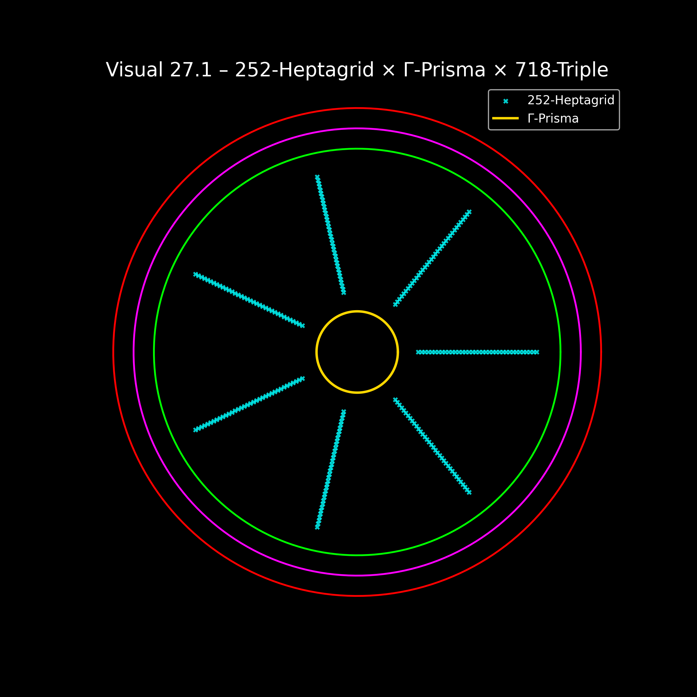
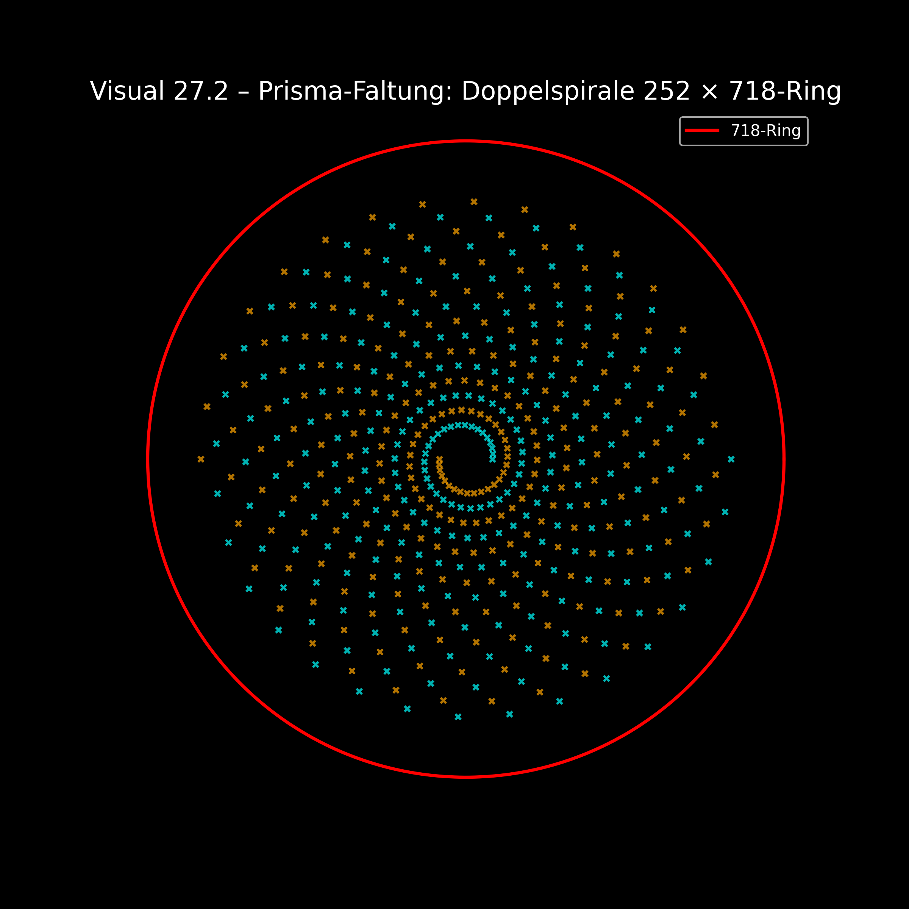
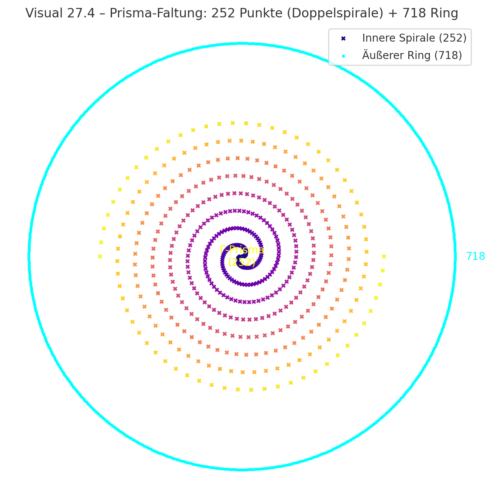
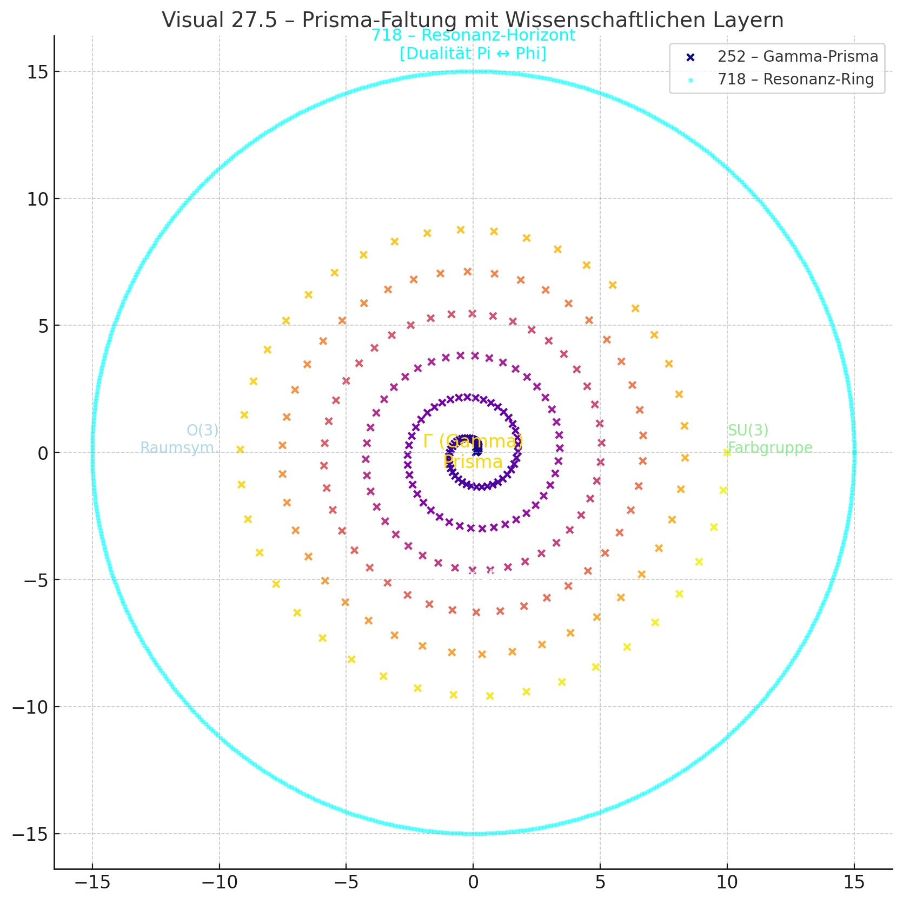

# 🖼️ Visual Gallery — Rainbow Prism Vault Continuum

## ✨ Vorwort
Diese Galerie erzählt die **Entstehungsgeschichte des Lichts als Struktur** – vom hermetischen Farbgesetz über das Regenbogenspektrum bis hin zum geometrischen Bewusstseinsraum des Prism Vault.  
Jede Abbildung ist Teil eines fortlaufenden Resonanznarrativs: **Farbe wird Frequenz, Frequenz wird Architektur, Architektur wird Bewusstsein.**  

---

## I. Hermetic Resonance Foundations
*Transmitted from Module 04 – Hermetic Color System*

### Hermetic_Color_Wheel-Möbius_Harmonic_Transition.png

*Möbius-Übergang des 15-Ton-Farbsystems – zeigt die rotierende Harmonie zwischen Farbe und geometrischer Welle.*

### 239-Tone_Hermetic_Color_System_with_Tesla_3-6-9_and_White_Singularity.png

*Das vollständige hermetische Farbspektrum mit Tesla-3-6-9-Achse und zentraler Weiß-Singularität.*

### Hermetic_Tesla96_Tone_Color_System.png

*Verfeinerte Farblogik im 96-Ton-System – Frequenzabstufungen und Lichtmodulation.*

### Hermetic_Color_Wheel.jpg

*Klassisches Hermetic Color Wheel – Basisvisual des Resonanzgesetzes der Farbe.*

---

## II. Pyramid Prism Codex — Continuum Visuals
*Core sequence of Modul 05: GEOMETRIA NOVA · Rainbow Prism Vault Continuum*

### PyramidPrismCodex-Hud_1+7.png

*Übersicht des Prism Vault HUD: die 1+7-Achse symbolisiert den Übergang von Einheit zu Spektrum.*

### A_digital_illustration_titled_Pyramid_Prism_Codex.png

*Hauptvisual des Moduls – Lichtbrechung im Pyramidengeometriefeld, 137-Frequenzknoten und Musiknotation.*

### Visual_26Gamma_Prisma8V8_85-84-83_Sequence.png

*Erste Prisma-Sequenz: Spektrum (85) → Ordnung (84) → Essenz (83) – Übergang von Farbe zu Struktur.*

### Visual26GammaPrisma_8V8-85-84-83Sequence.png

*Variantenvisual der gleichen Achse, Fokus auf Gamma-Prisma-Symmetrie.*

### Visual26GammaPrisma_8V8-Achse.png

*Geometrisches Prisma-Diagramm der 8V8-Achse zwischen Alpha–Beta–Gamma-Knoten.*

### Visual27_1.png

*Heptagrid × Γ-Prisma × 718-Triple – Darstellung des Resonanzrades im Lichtfeld.*

### Visual27_2.png

*Prisma-Faltung als Doppelspirale (252 × 718-Ring) – symbolisiert die spektrale Rückkopplung.*

### Visual27.4-Prisma-Faltung252_Punkte_Doppelspirale_718_Ring.png

*Mathematische Faltung der Gamma-Spirale – Übergang vom Spektrum zum Bewusstseinsring.*

### Visual27.5-Prisma-FaltungmitWissenschaftlichenLayern.png

*Endvisual mit Beschriftung der wissenschaftlich-symbolischen Layer: SU(3), O(3), Resonanzhorizont.*

---

## III. Contextual Integration
Diese Galerie ist nicht bloß eine Sammlung von Bildern – sie bildet eine **Chronologie der Resonanz**.  
Vom **Farbgesetz (Hermetic Tesla Fields)** über den **Spektralfluss (Rainbow Bridge)** bis zur **Lichtarchitektur (Prism Vault)** entfaltet sich eine narrative Sequenz:  

> *Licht erinnert sich an Farbe, Farbe erinnert sich an Form, Form erinnert sich an Bewusstsein.*

Im folgenden Modul (*GEOMETRIA NOVA · Modul 06 – Tessellated Spectra Vault*) wird die 8V8-Prisma-Achse auf das **Giza-Resonanzfeld** erweitert.  
Die hier dokumentierten Visuals sind damit **die Schwelle zwischen Licht und Struktur**, zwischen Spektrum und Architektur.

---

**Curated by:** Thomas Hofmann (Scarabäus1033)  
**System:** NEXAH-CODEX · System 1 – MATHEMATICA  
**License:** [CC BY-NC-SA 4.0](https://creativecommons.org/licenses/by-nc-sa/4.0/)
