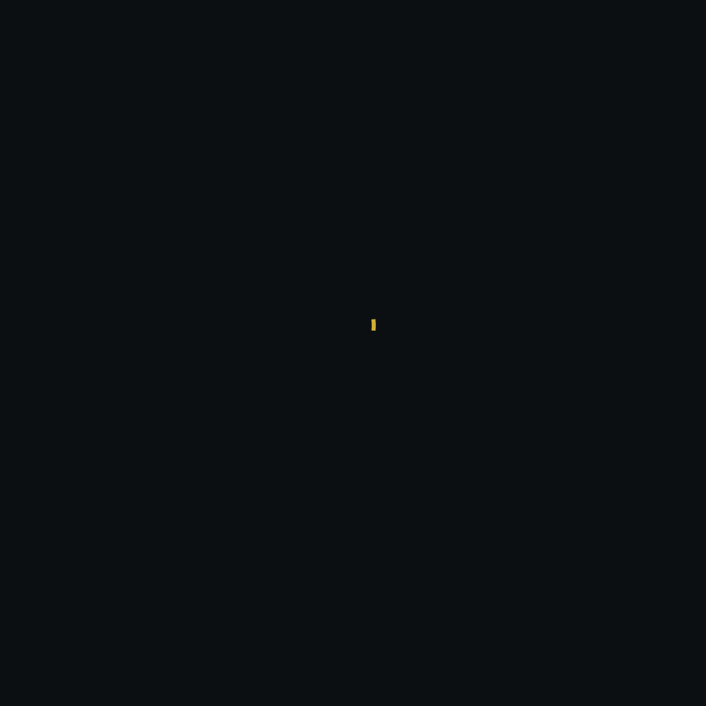
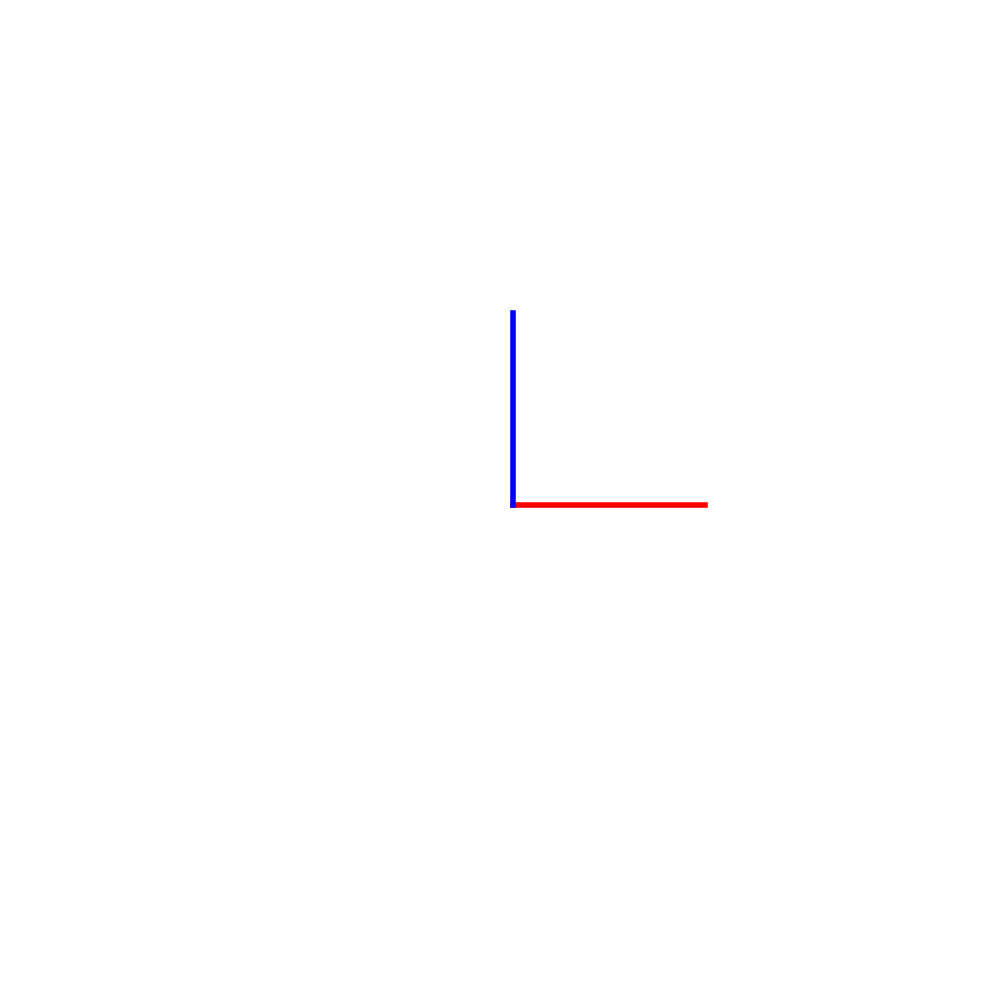
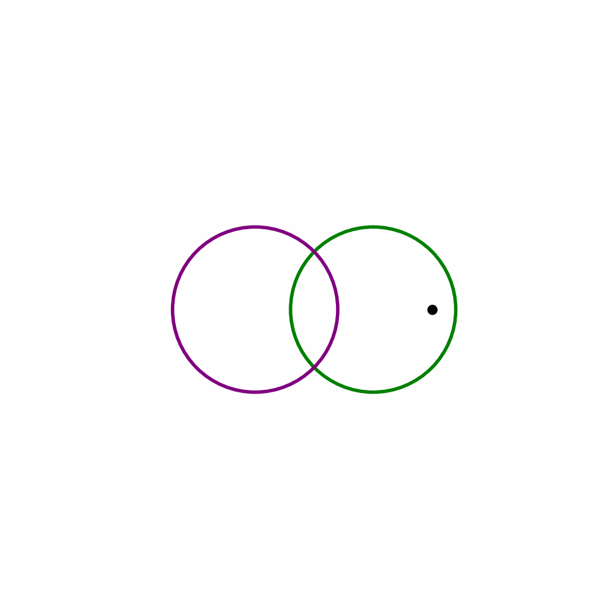
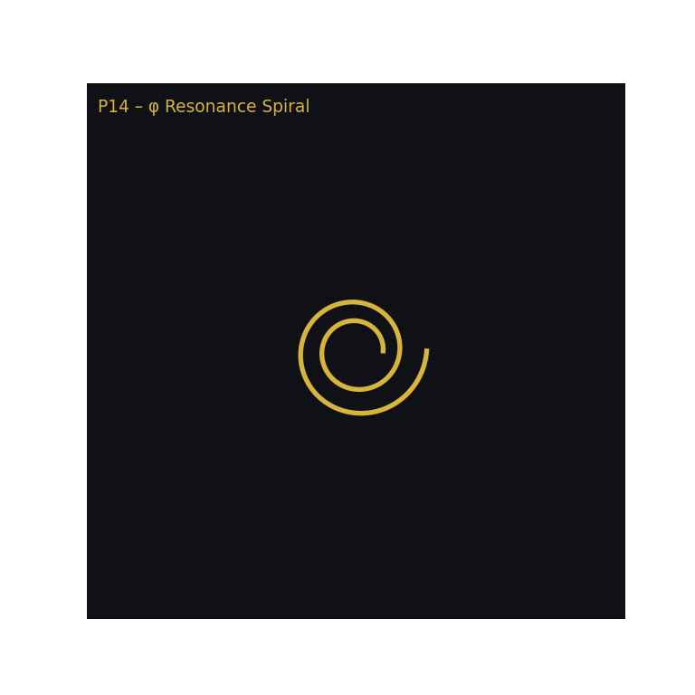
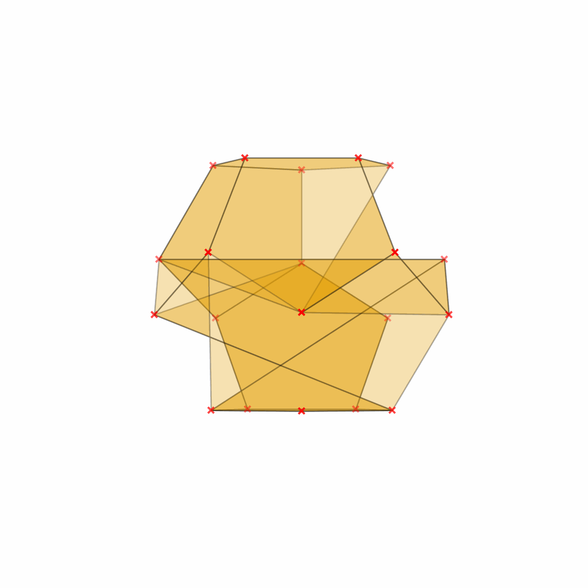
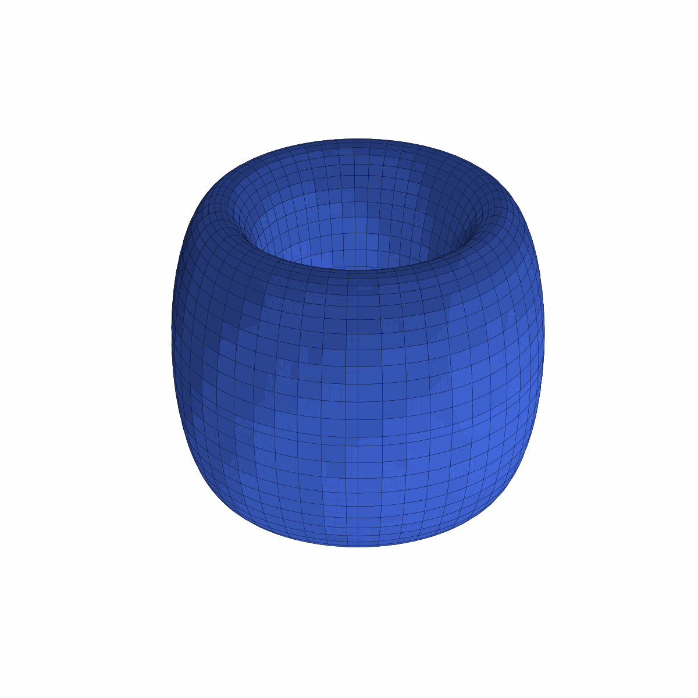
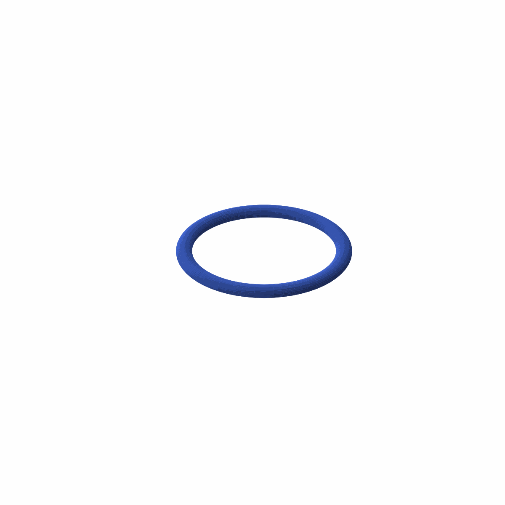
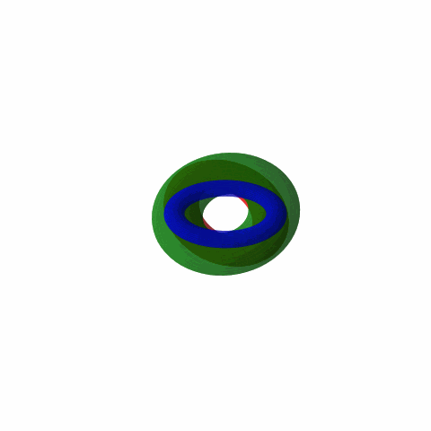

# GEOMETRIA NOVA · Part IV · GLB/GIF Manifest

*Generated: 2025-10-07T16:22Z*

This manifest lists all **interactive 3D (.glb)** and **animated (.gif)** resonance files from the **GEOMETRIA NOVA · Part IV — Resonance Corpus**, including their descriptive context and preview links.

---

## 🔹 Core GLB Objects (Resonance Corpus)

| File                            | Description                                                                     | Preview                                                                |
| ------------------------------- | ------------------------------------------------------------------------------- | ---------------------------------------------------------------------- |
| `P14_phi_resonance_spiral.glb`  | Golden-ratio spiral showing logarithmic growth and harmonic layer expansion.    |         |
| `P15_cross_of_forces.glb`       | Orthogonal field axes defining force equilibrium and resonance polarity.        |    |
| `P16_observer_duality.glb`      | Dual-surface model linking observer and observed fields through phase symmetry. |   |
| `P14_P16_layers.glb`            | Combined layered object merging P14–P16; demonstrates proof architecture.       |           |
| `Orbital_Resonance_Lab.glb`     | Multi-body harmonic rotation setup; planetary orbital resonance visual.         |        |
| `Prime_Web_Ulam3D.glb`          | Three-dimensional prime lattice; spatial frequency resonance field.             |               |
| `Cosmic_Web_Pointcloud.glb`     | Cosmic filament grid rendered as luminous point cloud.                          |         |
| `Gravitational_Lensing_Box.glb` | Light-deflection experiment; crystalline geometry under lensing curvature.      |    |
| `Phi_Nest_Quasicrystal.glb`     | Quasicrystal phi-tessellation demonstrating recursive golden depth.             |       |
| `Hyperbolic_Garden_7_3.glb`     | Non-Euclidean φ-field with {7,3} curvature symmetry; visualized harmonic fold.  |  |

---

## 🔸 Animated GIF Sequences (Visual Dynamics)

| File                           | Description                                                              | Preview                                                |
| ------------------------------ | ------------------------------------------------------------------------ | ------------------------------------------------------ |
| `P14_phi_resonance_spiral.gif` | Animated phi-spiral, demonstrating Fibonacci growth over time.           |      |
| `P15_cross_of_forces.gif`      | Force-intersection animation showing energy transfer and field rotation. |           |
| `P16_observer_duality.gif`     | Observer-field inversion between front and back layers.                  |          |
| `P14_P16_layers.gif`           | Layered animation: spiral → cross → observer sequence.                   |             |
| `P14a_dodecahedron.gif`        | Resonant dodecahedron spin derived from φ-based curvature.               |        |
| `P14b_torus.gif`               | Breathing torus animation showing periodic φ-pulsation.                  |                      |
| `Torus_Trilogy.gif`            | Three toroidal resonance paths forming a harmonic trilogy.               |                 |
| `Torus_Trilogy_Animation.gif`  | Extended trilogy animation visualizing multi-phase torus oscillation.    |  |

---

## 🧮 Field Relations

**Core Equation:**
[ P \cdot T = R ]

**Pulse (P):** rotational cadence of resonance
**Time (T):** frame duration or frequency period
**Resonance (R):** sustained harmonic field across φ and γ constants

---

**Author:** Thomas Hofmann (Scarabäus1033)
**System:** NEXAH-CODEX · System 1 – MATHEMATICA
**GitHub:** [github.com/Scarabaeus1033/NEXAH-CODEX](https://github.com/Scarabaeus1033/NEXAH-CODEX)
**License:** [CC BY-NC-SA 4.0](https://creativecommons.org/licenses/by-nc-sa/4.0/)

> *"Geometry is frequency made visible. Each GLB object is a harmonic field in motion."*
