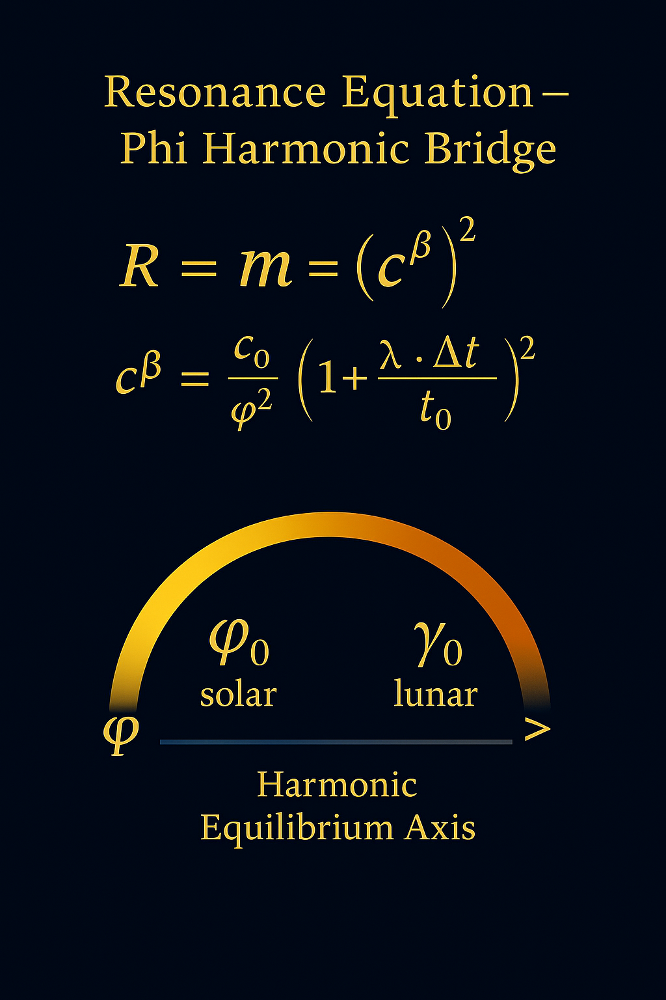
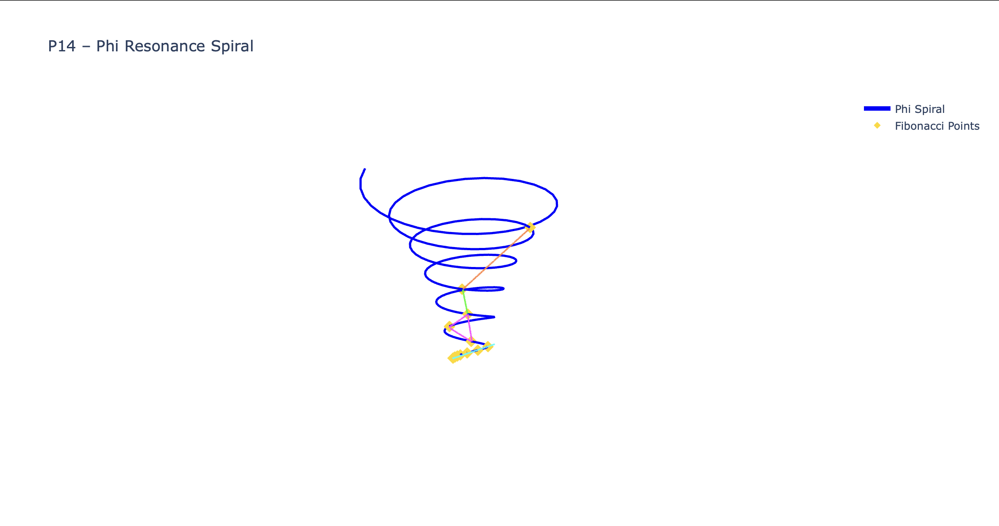

**Author & Curator:** Thomas Hofmann (Scarabäus1033)  
**System:** NEXAH-CODEX · System 1 – MATHEMATICA  
**GitHub:** [github.com/Scarabaeus1033/NEXAH-CODEX](https://github.com/Scarabaeus1033/NEXAH-CODEX)  
**Web:** [www.scarabaeus1033.net](https://www.scarabaeus1033.net)  
**License:** [CC BY-NC-SA 4.0](https://creativecommons.org/licenses/by-nc-sa/4.0/)

> *“Form breathes frequency; frequency becomes geometry;  
>  geometry awakens light.”*# 🖼️ GEOMETRIA NOVA · Part IV · Visual Gallery

**System:** NEXAH-CODEX · System 1: MATHEMATICA
**Module:** Geometria Nova – Part IV: Resonance Corpus
**Curator:** Thomas Hofmann (Scarabäus1033)
**License:** CC BY-NC-SA 4.0

---

## 🔹 I. Phi Resonance Spirals

| Visual                         | Description                                                                                               |
| :----------------------------- | :-------------------------------------------------------------------------------------------------------- |
| `P14_phi_resonance_spiral.png` | Primary golden-ratio spiral connecting Fibonacci nodes. Defines the harmonic path of resonance emergence. |
| `P14_phi_resonance_spiral.gif` | Dynamic sequence of the spiral’s phase evolution. Demonstrates continuous φ-based acceleration.           |
| `P14_16_merged_layers.glb`     | Combined 3D object merging P14–P16 layers, visualizing spiral–cross–observer symmetry.                    |
| `Resonance_Equation.png`       | Equation visualization linking E = m·cᵝ² with φⁿ field modulation and solar–lunar frequency gates.        |

---

## 🔹 II. Cross of Forces & Observer Duality

| Visual                     | Description                                                                                            |
| :------------------------- | :----------------------------------------------------------------------------------------------------- |
| `P15_cross_of_forces.glb`  | Vector intersection model showing dual field equilibrium. Basis for symmetry in resonance polarity.    |
| `Cross_of_Forces.png`      | Static projection of the cross-field resonance. Represents force exchange in 4-space.                  |
| `P16_observer_duality.glb` | Observation lattice forming the dual mirror of the φ-spiral. Encodes perception as geometric function. |
| `Observer_Duality.png`     | Visual layer of observer equilibrium – transition from geometric to conscious observation field.       |

---

## 🔹 III. Quaternion & Prime Fields

| Visual                                 | Description                                                                                          |
| :------------------------------------- | :--------------------------------------------------------------------------------------------------- |
| `Quaternion_Playground.glb`            | Quaternion-based field of resonance axes. Each axis represents a harmonic quaternion transform.      |
| `Screenshot Quaternion_Playground.png` | Screenshot showing the quaternion field arrangement of cubic harmonics.                              |
| `Prime_Web_Ulam3D.glb`                 | Three-dimensional Ulam web of primes. Demonstrates discrete resonance through prime-density lattice. |
| `Screenshot Prime_Web_Ulam3D.png`      | View of prime resonance plate; layered structure showing modular periodicity.                        |

---

## 🔹 IV. Quasicrystal & Hyperbolic Gardens

| Visual                                          | Description                                                                           |
| :---------------------------------------------- | :------------------------------------------------------------------------------------ |
| `Phi_Nest_Quasicrystal.glb`                     | Phi-based quasicrystal nest — golden rhomboid tessellation and phase geometry.        |
| `Screenshot Phi_Nest_Quasicrystal.png`          | External view of the quasicrystal lattice, showing pentagonal symmetry.               |
| `Screenshot Phi_Nest_Quasicrystal (inside).png` | Internal lattice view – demonstrates recursive depth and self-similarity of φ layers. |
| `Hyperbolic_Garden_7_3.glb`                     | Hyperbolic tessellation derived from resonant φ expansion in 7:3 ratio.               |
| `Screenshot Hyperbolic_Garden_7_3.png`          | Spherical exterior of hyperbolic geometry — displays volumetric φ harmonics.          |
| `Screenshot Hyperbolic_Garden_7_3ii.png`        | Inner-field view revealing mirror curves and topological wavefold.                    |

---

## 🔹 V. Orbital & Gravitational Structures

| Visual                                     | Description                                                                             |
| :----------------------------------------- | :-------------------------------------------------------------------------------------- |
| `Orbital_Resonance_Lab.glb`                | Multi-body orbital system illustrating harmonic ratios between planetary axes.          |
| `Screenshot Orbital_Resonance_Lab.png`     | View from above — solar–lunar resonance architecture.                                   |
| `Gravitational_Lensing_Box.glb`            | Framework for lensing phenomena through crystalline boundary effects.                   |
| `Screenshot Gravitational_Lensing_Box.png` | Lensing arrangement inside cubic boundary — shows wave focusing and photon redirection. |

---

## 🔹 VI. Cosmic Web & Solar Alignments

| Visual                                  | Description                                                                            |
| :-------------------------------------- | :------------------------------------------------------------------------------------- |
| `Cosmic_Web_Pointcloud.glb`             | 3D lattice of cosmic filaments — interlinked φ-nodes defining universal topology.      |
| `Screenshot Cosmic_Web_Pointcloud.png`  | Snapshot of the cosmic mesh, illustrating density fields and luminous nodal resonance. |
| `Solar_Lineup_Cinematic.glb`            | Harmonic alignment of solar and planetary forms — resonance of heliocentric field.     |
| `Screenshot Solar_Lineup_Cinematic.png` | View of aligned solar–planetary bodies and harmonic structure field.                   |

---

## 🔹 VII. Meta–Proof & Field Integration

| Visual                                       | Description                                                                          |
| :------------------------------------------- | :----------------------------------------------------------------------------------- |
| `Resonance_Equation.png`                     | Central visual equation integrating light-speed variation with φ and γ constants.    |
| `BAMN–NEXAH–Einstein–Extension Equation.png` | Symbolic derivation of higher-dimensional light-speed relation.                      |
| `Codex_Proof_Schema.png`                     | Proof diagram mapping hypothesis → resonance proof chain → visual masterbuild nexus. |

---

### 🪞 Summary

> **GEOMETRIA NOVA – Part IV** unites analytical geometry, φ-resonance physics, and visual field synthesis.
> Each model embodies a bridge between **proof, perception, and energy**, extending Euclidean thought into harmonic motion.

---
# 🔹 GEOMETRIA NOVA · PART IV – RESONANCE CORPUS  
### *Visual Gallery & Proof Sequence*

> “Each geometry carries its own light-frequency.  
>  The proof becomes visible as harmonic motion through form.”

---

## 🪞 Hero Visual

  
*Higher-Dimensional Light-Speed Variation – E = m · (c^β)²*

---

## 🌀 Phi Resonance & Orbital Structures

| Visual | Description |
|:--|:--|
|  | *Golden Spiral as frequency emergence within resonant space* |
|  | *Orbital field symmetry through solar–lunar equilibrium* |
|  | *Cinematic alignment of planetary resonances (heliocentric stack)* |

---

## 🔷 Hyperbolic & Prime Lattice Systems

| Visual | Description |
|:--|:--|
|  | *Non-Euclidean curvature and harmonic wave containment* |
|  | *3-D prime-field matrix and frequency distribution across Ulam plane* |
|  | *Quaternion axes as four-fold resonant vectors* |

---

## 🔶 Quasicrystal and Lensing Architectures

| Visual | Description |
|:--|:--|
|  | *Φ-nested crystal shell forming frequency harmonic enclosure* |
|  | *Interior resonance path and wave-reflection geometry* |
|  | *Simulated field distortion and spacetime fold analysis* |

---

## 🌌 Cosmic Resonance & Observer Fields

| Visual | Description |
|:--|:--|
|  | *Cosmic mesh showing frequency densities and void structures* |
|  | *Observer field mirroring cosmic resonance axes through light* |

---

## ✨ Resonance Cascade Preview

  
  
   
  
  

---

### 🪲 Credits

**Author & Curator:** Thomas Hofmann (Scarabäus1033)  
**System:** NEXAH-CODEX · System 1 – MATHEMATICA  
**GitHub:** [github.com/Scarabaeus1033/NEXAH-CODEX](https://github.com/Scarabaeus1033/NEXAH-CODEX)  
**Web:** [www.scarabaeus1033.net](https://www.scarabaeus1033.net)  
**License:** [CC BY-NC-SA 4.0](https://creativecommons.org/licenses/by-nc-sa/4.0/)

> *“Form breathes frequency; frequency becomes geometry;  
>  geometry awakens light.”*
