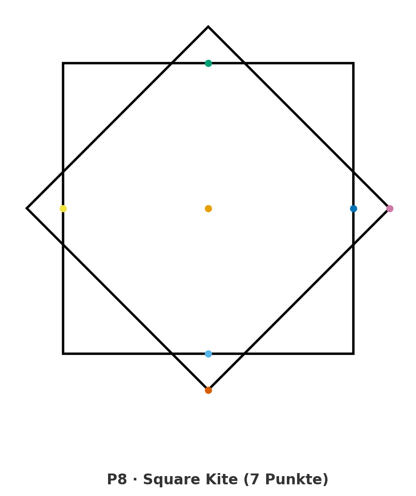
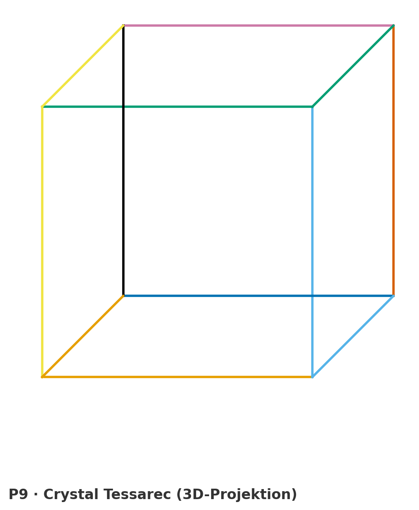
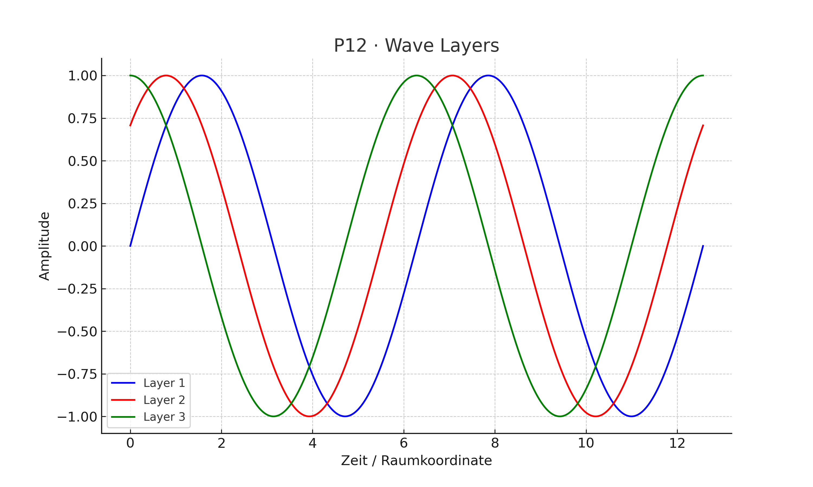
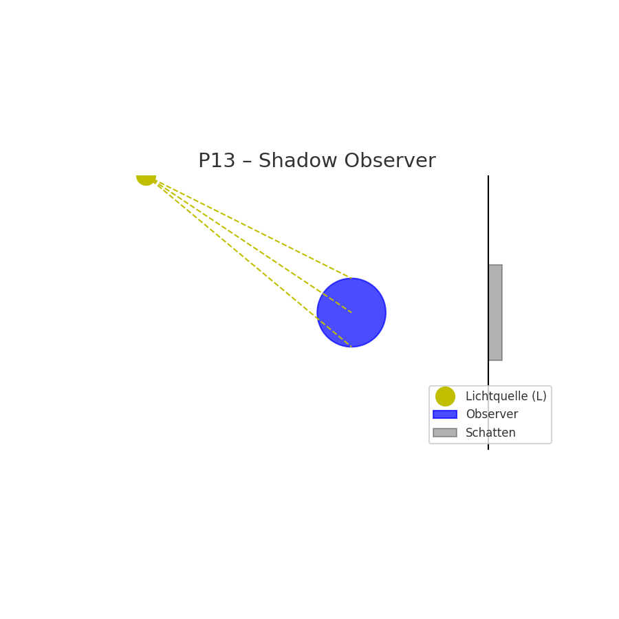
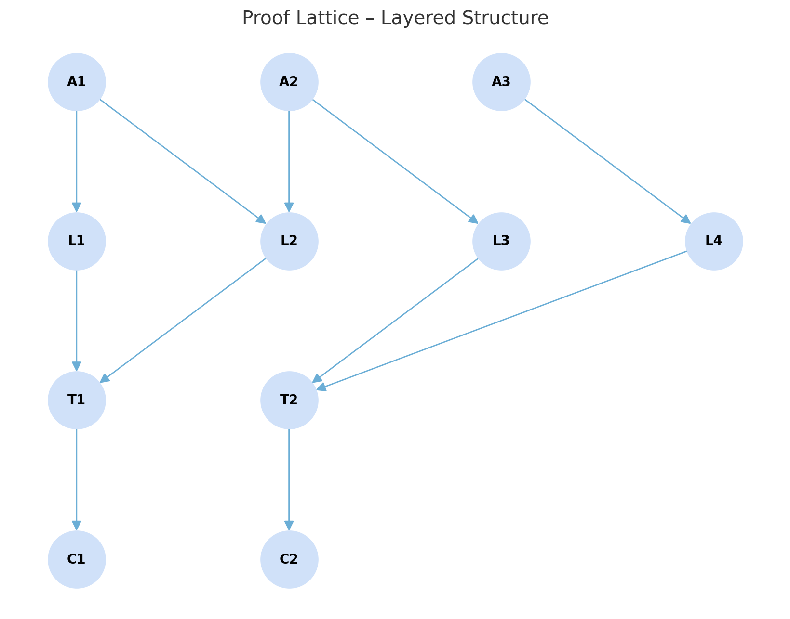
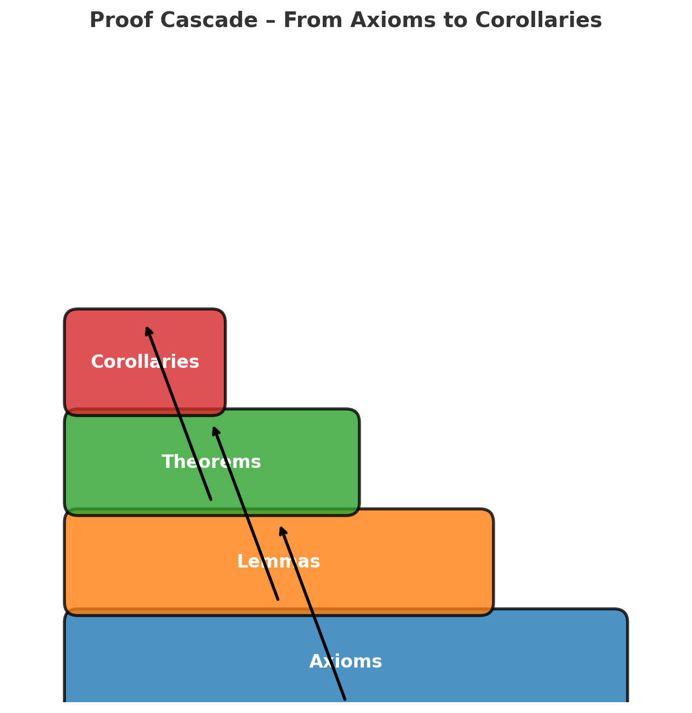
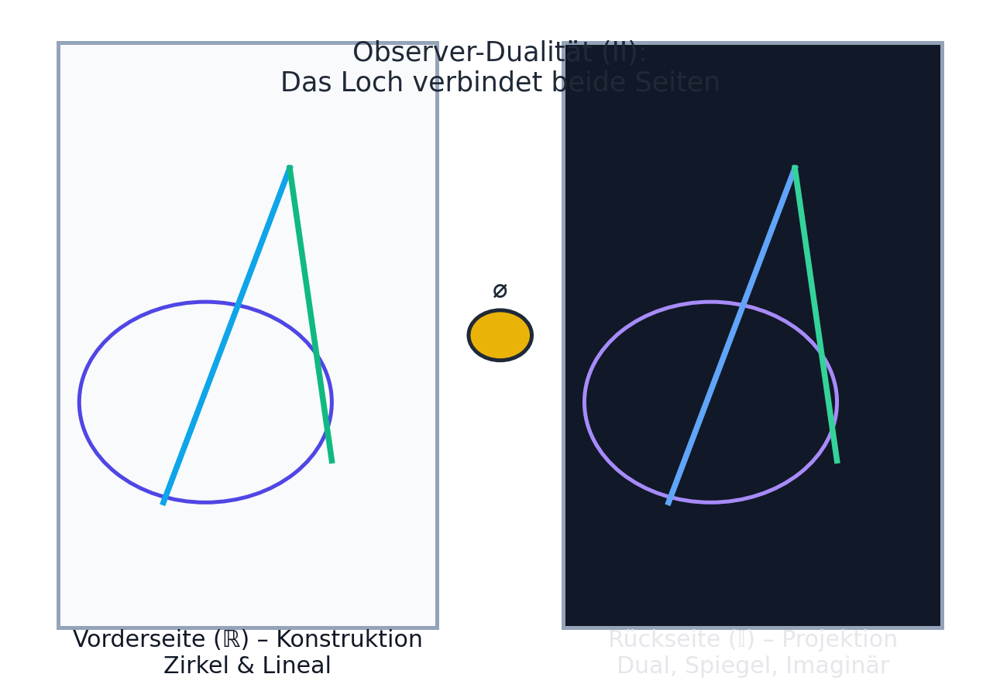
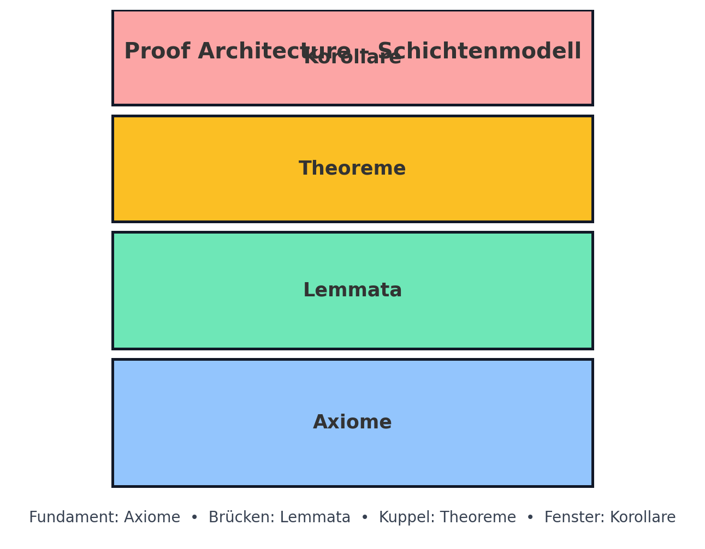

# 🔹 GEOMETRIA NOVA · VISUAL GALLERY  
**The Circle, the Line & the Shadow — Proof Architecture I–III**

> “Geometry is frozen resonance; the act of proof reawakens its frequency.”

The following gallery documents the **visual evolution of the 13 Postulates**,  
from Euclidean reconstruction to harmonic resonance and observer geometry.  
It serves as the *living image sequence* of the **Geometria Nova** module  
within the Hermetic Pythagoras framework.

---

## A · Foundational Postulates (I–VII)
_The Circle, the Line & the Shadow_

| Visual | Description |
|:--|:--|
|  | **P8 — Square–Kite Proof** Fourfold stability diagram linking orthogonal resonance with φ-ratio symmetry. |
|  | **P9 — Crystal Tessarec** 4D tessarec projection — harmonic closure through diagonal rotation √2 ↔ φ. |
|  | **P12 — Wave Layers** Frequency strata forming phase shells; depicts the breathing of geometric volume. |
|  | **P13 — The Shadow & the Observer** Intersection of perception and geometry — the line becomes consciousness. |

---

## B · Proof Architecture & Resonant Logic
_Where Postulates unfold into Harmonic Structure_

| Visual | Description |
|:--|:--|
|  | **Proof Flowchart** Logical hierarchy of the 13 Postulates — from axioms to corollaries in resonance order. |
|  | **Proof Lattice** Layered interdependence between proofs, showing vertical harmonic coupling. |
|  | **Proof Cascade** Visual flow from foundational axioms through cascading harmonic relationships. |
|  | **Observer Duality** Dual-field perception grid: the observer’s eye as geometric mirror of the field. |
|  | **Proof Architecture Layers** Macro view of proof architecture — synthesis of geometry, logic and vibration. |

---

## C · Volumetric Resonance & Dynamic Closure
_The emergence of the Harmonic Cathedral_

| Visual | Description |
|:--|:--|
|  | **Meta Roadmap (I–X)** Comprehensive proof architecture uniting Parts I–X. |
|  | **Harmonic Cathedral 11×11** Resonance grid merging Euclidean proportion with musical interval geometry. |
| `tesseract_rotation.gif` | 4D tessarec rotation illustrating volumetric balance (3D ↔ 5D). |
| `sphere_layering.gif` | Frequency shell layering — the pulsation of harmonic cavities. |
| `proof_cube.glb` | Interactive 3D model of the geometric proof chamber. |

---

## 🔭 Interpretation Layer

> “Each proof is a harmonic mirror — when seen, it vibrates.”

These visuals form the **resonant backbone** of _Geometria Nova_:  
- establishing the **geometry → resonance** transition,  
- mapping the 13 Postulates into **living proofs**,  
- and preparing the foundation for the **Hermetic Pythagoras Model**.

Together, they render geometry not as static shape,  
but as **frequency made visible** —  
a visual hymn to the union of **form, number, and perception**.

---

## 🪲 Credits
**Curator:** Thomas Hofmann (`Scarabäus1033`)  
**System:** NEXAH-CODEX · System 1 – MATHEMATICA  
**GitHub:** [github.com/Scarabaeus1033/NEXAH-CODEX](https://github.com/Scarabaeus1033/NEXAH-CODEX)  
**License:** [CC BY-NC-SA 4.0](https://creativecommons.org/licenses/by-nc-sa/4.0/)

---

> *“To see geometry is to hear the silence of number.”*
