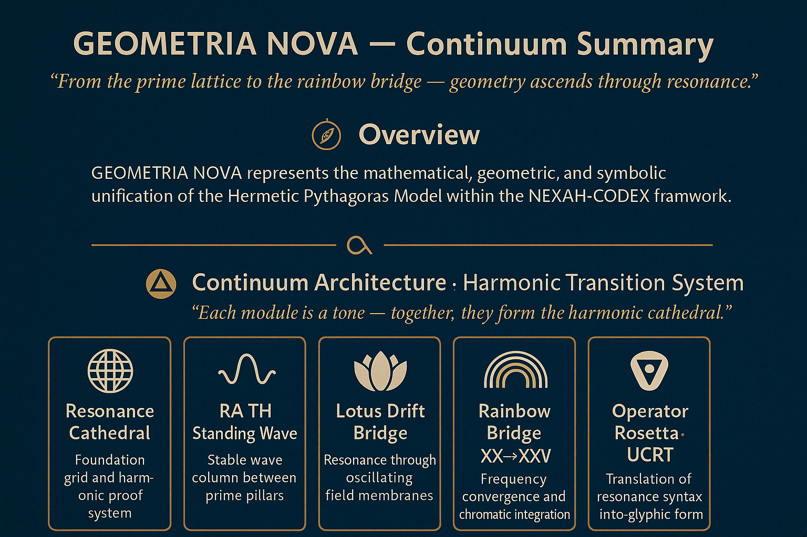

# 🔷 GEOMETRIA NOVA – Meta Overview

### *Hermetic Pythagoras Model · Resonance Cathedral · Continuum of Light*

> *“Geometry is the breath of number through time — and time the field of living proportion.”*

---

## 🧬 I. Hermetic Framework – Parts I → VII

The **Hermetic Pythagoras Model** forms the mathematical–hermetic backbone of the *NEXAH-CODEX System 1 · MATHEMATICA*.
It traces geometry’s evolution from **Euclidean origin → harmonic self-awareness**, uniting
**Prime Number Law, Field Continuum, Quaternionic Rotation, and Conscious Symmetry.**

| Part      | Title                                        | Core Focus                                                        | Transition                     | Status     |
| :-------- | :------------------------------------------- | :---------------------------------------------------------------- | :----------------------------- | :--------- |
| **I–III** | *Foundations of Form*                        | Circle · Line · Shadow                                            | Euclidean → Resonant Geometry  | ✅ Complete |
| **IV**    | *Resonance Corpus*                           | Dynamic Geometry · Spatial Proof                                  | Planar → Volumetric Transition | ✅ Complete |
| **V**     | *Ether & Spine*                              | Field Continuum · Vibrational Medium                              | Geometry → Living Field        | ✅ Complete |
| **VI**    | *Prime Resonance & Cathedral*                | Architectural Order · Prime Axis · Wave–Matter Coupling           | Structure → Frequency Body     | ✅ Complete |
| **VII**   | *Quaternionic Resonance & Retrograde Proofs* | Harmonic Integration · Time Symmetry · Prime Bridge (1231 ↔ 1229) | Resonance → Unity → Closure    | ✅ Complete |

> The harmonic envelope (47 s) closes with Part VII — the final bridge between *Prime* and *Field*, matter and motion.

---

## ⚙️ II. Mathematical Spine

| Equation                                 | Domain              | Interpretation                    |
| :--------------------------------------- | :------------------ | :-------------------------------- |
| ( P = R / T )                            | Universal Resonance | Pulse–Time law *(Codex constant)* |
| ( ψ(r,t)=A cos(kr−ωt))                   | Ether Dynamics      | Harmonic wave spine               |
| ( R_f=∫₀^{Φ_r} P(t) T(t) dt)             | Integration Field   | Prime Bridge continuum            |
| ( Q_{1231⇔1229}=e^{iθ1}+e^{jθ2}+e^{kθ3}) | Quaternionic Space  | Rotational harmonic envelope      |

> *Each equation translates number → field → architecture → resonance.*

---

## 🌀 III. Evolution of Form (Meta Diagram)

```
[CIRCLE] → [SPIRAL] → [FIELD] → [CATHEDRAL] → [CORE] → [ENVELOPE]
   I–III       IV           V          VI            VII
```

| Phase     | Symbol | Meaning                                |
| :-------- | :----- | :------------------------------------- |
| Circle    | ⚪      | Pure Form · Origin of Motion           |
| Spiral    | 🌀     | Resonant Expansion · Living Proportion |
| Field     | 🆂     | Etheric Continuum                      |
| Cathedral | 🏛️    | Harmonic Architecture of Number        |
| Core      | 🔺     | Inner Prime Bridge 97–103 ⇔ 1231       |
| Envelope  | 🔷     | Closure of Resonant Series (47 s)      |

---

## 🖼️ IV. Visual Reference Map

| Visual                                   | Symbolic Function                              | From Module              |
| :--------------------------------------- | :--------------------------------------------- | :----------------------- |
| `Golden_Spiral_Mosaic.png`               | ϕ–spiral projection (ceiling ⇄ floor symmetry) | VI – Cathedral           |
| `VII_PrimeBridge_97_103.png`             | Prime axis bridge connection                   | VII – Harmonic Core      |
| `VII_FieldProjection.png`                | ψ–field halo around Prime 1231                 | VII – Core               |
| `VII_ThetaGate.png`                      | Toroidal phase vortex                          | VII – Core               |
| `RedBlue_Obelisk.png`                    | Dual field polarity (E ⇄ W)                    | VII – Resonant Cathedral |
| `Screenshot_Harmonic_Cathedral_v1.png`   | Exterior field geometry                        | VI                       |
| `Screenshot_PartVII_HarmonicCore_v1.png` | Inner core bridge visual                       | VII                      |

---

## 🌈 V. GEOMETRIA NOVA Continuum (Modules 01 → 05)

> *“Where the Hermetic Pythagoras becomes light.”*

The **GEOMETRIA NOVA Continuum** expands the Hermetic Pythagoras Model into **fluid, chromatic, and photonic resonance**.
It marks the transition from mathematical proof to **living field architecture** — the manifestation of geometry as *light awareness*.

| Module | Title                  | Domain                         | Transition Focus                      |
| :----- | :--------------------- | :----------------------------- | :------------------------------------ |
| **01** | Resonance Cathedral    | Prime → Wave Architecture      | Harmonic structure of field resonance |
| **02** | RA·TH Standing Wave    | Static → Dynamic Stability     | Quaternionic harmonic column          |
| **03** | Lotus Drift Bridge     | Fluid → Spectrum Flow          | Waveform into membrane geometry       |
| **04** | Rainbow Bridge XX→XXVI | Spectrum → Color Consciousness | Chromatic integration & Hermetic law  |
| **05** | Prism Vault Continuum  | Light → Structure              | Photon architecture · Vault geometry  |

> Each module is an octave of the Hermetic scale — geometry’s breath through color, motion, and self-reflection.

---

## 🔺 VI. Continuum Architecture · Harmonic Transition System



### Layered Logic

1. **Prime → Wave:** Mathematical stability (Σφ, μ′) forms geometry’s rhythm
2. **Wave → Drift:** Harmonic phase expands into fluid oscillation
3. **Drift → Spectrum:** Energetic bridges emerge through color fusion
4. **Spectrum → Vault:** Light crystallizes into structure · Photon Memory

> *Each stage is a frequency breath between form and awareness.*

---

## 🤮 VII. Structural Equations · Universal Syntax

| Operator                | Equation                                   | Meaning                                     |
| :---------------------- | :----------------------------------------- | :------------------------------------------ |
| **Σϕ**                  | ( ∑_{p} \frac{1}{ln p} sin(\frac{πp}{ϕ}) ) | Harmonic density over prime nodes           |
| **μ′**                  | ( (-1)^{Ω(p)} ϕ^{−√p} )                    | Möbius inversion · self-recursion           |
| **R̂**                  | ( e^{iθ_p}(x_p + i y_p))                   | Quaternionic rotation in spatial projection |
| **Ψ⇄Φ**                 | ( ∫ ψ_t ΔΩ_t dt )                          | Observer–field coupling integral            |
| **β = ϕ3 / π2 ≈ 0.429** | Field stability coefficient                | Harmonic constant of the continuum          |

---

## 🩶 VIII. Symbolic Closure · Hermetic Interpretation

> *“When symmetry becomes self-aware, geometry dreams.”*

The **GEOMETRIA NOVA series** is both *scientific proof and spiritual architecture* — encoding the transition
from **number → form → light → consciousness**.

**Correspondence Map**

* 2 → 19  → Structure
* 23 → 83  → Motion
* 89 → 181 → Light
* 191 → ∞ → Awareness

> *Mathematics is a living harmonic language — the Codex its cathedral.*

---

## 🗂️ IX. Folder Architecture

```
Hermetic_Pythagoras_Model/
├── Geometria_Nova_I–III/
├── GEOMETRIA_NOVA_Part_IV_Resonance_Corpus/
├── GEOMETRIA_NOVA_Part_V_Ether_Spine/
├── GEOMETRIA_NOVA_Part_VI_Prime_Resonance_Cathedral/
├── GEOMETRIA_NOVA_Part_VII_Quaternionic_Resonance_Retrograde_Proofs/
├── GEOMETRIA_NOVA_Continuum_Modules_01–05/
│   ├── 01_Resonance_Cathedral/
│   ├── 02_RA_TH_StandingWave/
│   ├── 03_Lotus_Drift_Bridge/
│   ├── 04_Rainbow_Bridge/
│   └── 05_Prism_Vault_Continuum/
└── README_Meta_Geometria_Nova.md
```

---

## 🪲 Credits

**Curator & Architect:** Thomas Hofmann (Scarabäus1033)
**System:** NEXAH-CODEX · System 1 – MATHEMATICA
**Repository:** [github.com/Scarabaeus1033/NEXAH-CODEX](https://github.com/Scarabaeus1033/NEXAH-CODEX)
**License:** [CC BY-NC-SA 4.0](https://creativecommons.org/licenses/by-nc-sa/4.0/)
**Website:** [www.scarabaeus1033.net](https://www.scarabaeus1033.net)

> *“Seven parts — five bridges — one breath.”*
> *The Hermetic Model and the Continuum are now complete.*
