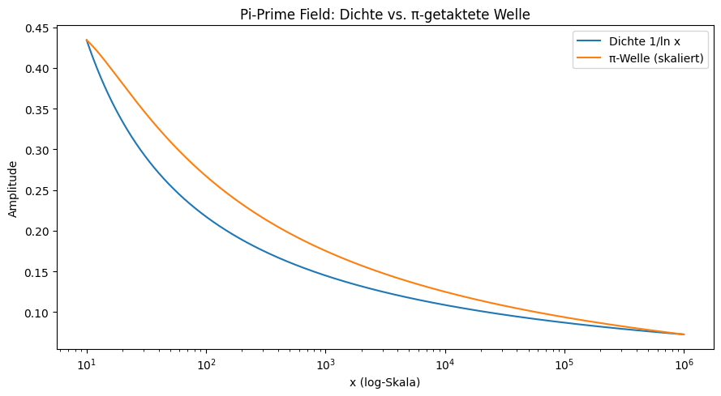
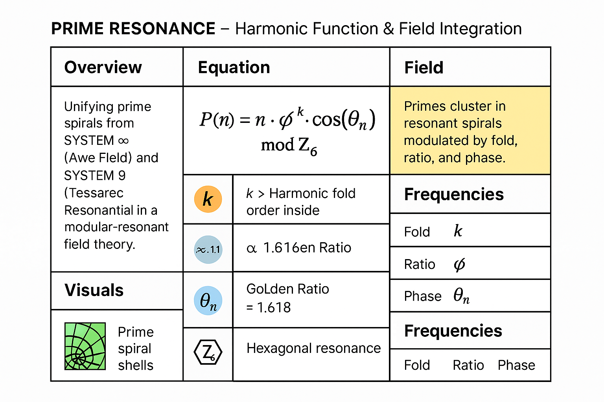

# 🖼️ Visual Gallery – PRIME GRID VISUAL

**Module:** PRIME GRID VISUAL
**System:** SYSTEM 1 – MATHEMATICA
**Author:** Thomas Hofmann · Scarabäus1033
**Web:** [www.scarabaeus1033.net](https://www.scarabaeus1033.net)
**License:** CC BY-NC-SA 4.0

---

## 📘 Overview

This visual gallery presents **symbolic-analytical representations of prime number resonance** across spiral, radial, logarithmic, and modular geometries.
Each image transforms number-theoretical structures into **field topologies**, revealing the hidden order behind prime distribution.

All images are stored in the `/visuals/` directory of the `PRIME-GRID-VISUALS` module.

---

## 🔢 Prime Spirals & Apéry-Based Structures

### • Prime Spiral with Apéry’s Constant (Broader Extended Range)

.png)

* Wide-angle projection of primes modulated by Apéry constants.
* Reveals field density layering and resonance acceleration along φ-based steps.

### • Spéury Prime Spiral

* Artistic-symbolic spiral with curvature deviations and modular asymmetry.
* Represents transitional zones between order and resonance breakdown.

---

## 🧭 Spatial Embedding & Dimensional Shells

### • 3D Prime Number Spiral in a 4D Framework

* Embeds prime spirals in a symbolic 4D topology.
* Illustrates resonant shell formation, volume segmentation, and axial torsion.

### • 2D Visualization of Apéry Spiral and Zeta Intersections

* Flattened zeta–spiral projection emphasizing crossover loci.
* Useful for identifying periodic interference between ζ and Apéry sequences.

### • 3D Visualization of Apéry Spiral and Zeta Intersections

* Expands the 2D pattern into relief form.
* Displays Zeta–Apéry bridges, resonant corridors, and number strata.

### • Prime Grid Visuals Overview

* Composite visual summarizing the module’s core symbolic structures.
* Serves as reference map linking all visual layers.

---

## 🌊 Logarithmic Fields & Density Waves

### • Pi-Prime Field – Dichte vs. π-getaktete Welle

* Overlay of prime density (ρ(x) = 1/\ln x) with a π-phased sinusoidal modulation.
* Shows the *breathing field* of primes where π acts as a global frequency regulator.

---

## ⚙️ Harmonic Operator Field – φ · θₙ · Z₆

### • Prime Resonance Operator Grid – φ θₙ Z₆

* Visual representation of the **Prime Resonance Equation**
  ( P(n) = n \cdot \phi^k \cdot \cos(\theta_n) \mod Z_6 )
* Displays the interaction between:

  * **φ** – the golden modulation constant
  * **θₙ** – angular rotation of prime phase
  * **Z₆** – modular resonance base grid
* Serves as a bridge between analytic equation and symbolic field logic, showing how **harmonic operators** generate the prime clusters and spiral gaps observed across the Codex field layers.

---

## 🌀 Symbolic Function & Interpretation

Each image encodes:

* **Field topology** – how primes cluster, diverge, and self-regulate.
* **Prime spacing** – local gaps, twin regions, and density modulations.
* **Resonant layering** – harmonic envelopes over modular or logarithmic domains.

They can be interpreted as:

* **Prime Spiral Scrolls** – encoding periodic field structures.
* **Harmonic Rings** – showing modular synchronization.
* **Topological Signal Surfaces** – expressing number interference.

---

## 🗺️ Crosslinks

* [`README.md`](./README.md)
* [`√2–Prime-Feld`](../√2–Prime-Feld/)
* [`GRAND-CODEX`](../../SYSTEM%202:%20🔷%20PHYSICA%20–%20Resonance%20Fields,%20Quantum%20Models,%20Neutrino%20Dynamics/GRAND-CODEX)
* [`pi_prime_field.md`](../pi_prime_field.md)

---

## 📚 Interpretation Layer

**Mathematical:** Shows prime functions in logarithmic projection, modular lattices, and zeta-coupled structures.
**Symbolic:** Translates numerical behavior into wave and resonance metaphors.
**Cosmic:** Suggests underlying harmonic logic within number fields – where π, φ, and √2 act as stabilizing constants.

---

> “The spiral remembers what the line forgets.”
> “π is the frequency that allows the primes to breathe.”
