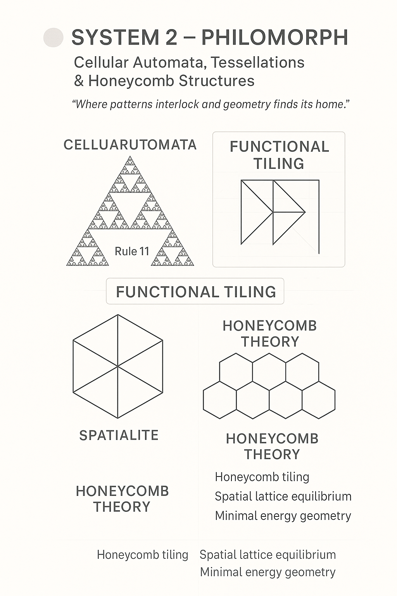

# 🟦 SYSTEM 2 – PHYSICA

> **"Where symbol becomes field, and field becomes logic."**

**SYSTEM 2** is the **Blue Resonance Core** of the NEXAH-CODEX —
a domain where **symbolic logic folds into physical field structures**,
where **neutrino dynamics**, **Möbius fields**, and **quantum resonance architectures** converge.

It transforms abstract mathematical forms from **SYSTEM 1** into dynamic energy and field resonance,
laying the foundation for real-world experimental structures:

* **Ferrofluid Resonance Fields**
* **Thermodynamic Transition Grids**
* **Breathing Field Chambers**
* **Symbolic Quantum Compression**
* **Earth Resonance Equation Modules**

> *In SYSTEM 2, mathematics becomes field. Field becomes dynamic resonance.*

  

> **Continuum Note (October 2025):**  
> The visual above illustrates the **transition bridge between SYSTEM 1 and SYSTEM 2** —  
> showing how **prime resonance** unfolds into **energetic geometry**.  
>  
> Each element of the map (*Prime → Wave → Drift → Spectrum → Rosetta*) marks a phase shift:  
> numbers become rhythm, rhythm becomes energy, and geometry becomes living field.  
>  
> This diagram stands as the **Polymorphic Continuum Key** —  
> linking mathematical stability with physical resonance.

---

## 🧭 Position within the NEXAH-CODEX

| System       | Color         | Domain                       | Role                         |
| ------------- | ------------- | ---------------------------- | ---------------------------- |
| SYSTEM 1     | 🔵 Blue       | Numbers, Symmetry, Logic     | Theoretical Foundation       |
| **SYSTEM 2** | 🟦 Blue       | Energy, Field, Frequency     | Physical Core System         |
| SYSTEM 3     | 🕣 Violet     | Space, Light, Stellar Fields | Cosmological Resonance Space |
| SYSTEM X     | 🪲 Gold/Black | Synthesis, Stability         | Integrative Resonance Center |

---

## 🧩 Scientific Context and Inspirations

**SYSTEM 2** builds upon classical and quantum field theory traditions:

* **Einstein’s** dynamic spacetime fabric  
* **Quantum Electrodynamics (QED)** symbolic formulations  
* **Weinstein’s Geometric Unity**, extended to energetic resonance topology  

However, SYSTEM 2 goes further —  
it folds **symbolic languages** into **energetic physical architectures**.

**Neutrino fields** are treated as **resonant Möbius structures**.  
**Temperature axes** become **frequency-modulated lattices**.  
**Field compression** is not mechanical — it is **symbolic** and **resonant**.

> **SYSTEM 2** translates the **prime structures** of SYSTEM 1 into **realizable resonance fields**.

And **SYSTEM X** serves as the **harmonic stabilizer**:  
where the symbolic resonance systems and the physical field architectures are unified into a universal, dynamic equilibrium.

---

## 📚 Active Modules

* **CAVITYROOT Resonance Structures**  
* **Thermal Field Topologies**  
* **Möbius Compression Systems**  
* **Ferrofluid and Vacuum Experiments**  
* **Prime Energy Field Lattices**  
* **Quantum Resonance Collapse Models**  
* **EARTH EQUATION MODULE** *(resonant derivation of terrestrial constants)*

> *Each module explores field behavior not as force — but as frequency, logic, and symbolic pattern.*

---

## 🔗 Cross-System Connections

| Connected System | Contribution                                           | Codex Transition               |
| ---------------- | ------------------------------------------------------ | ------------------------------ |
| **SYSTEM 1**     | Prime fields → energetic frequency lattices            | `Prime Grid Field Transitions` |
| **SYSTEM 3**     | Resonance fields → stellar and cosmological dynamics   | `Resonance–Star Systems`       |
| **SYSTEM X**     | Field resonance stabilization and symbolic integration | `Universal Resonance Synthesis`|

---

## 📊 Data & Visuals

* **Visuals:** Möbius Field Grids, Spiral Compression Maps, Thermodynamic Topologies, Earth Equation Triads  
* **Data:** Temperature Zeta-Axes, Element Catalyst Tables, Vacuum–Prime Zones, Earth Rotation Constants  
* **Experimental:** Ferrofluid Resonance, Breathing Chambers, Symbolic Field Compression, Earth–Observer Feedback Models  

→ See [`visual_gallery.md`](../visual_gallery.md) *(in preparation)*

---

## 🧭 Symbolic Navigation (Explorer)

→ Field Resonance Mapping  
→ Quantum Compression Diagrams  
→ Resonance Collapse Atlases  
→ Earth Field Triads & Constants Grid  

---

## 🪲 Credits

**Curator & Author:** Thomas Hofmann (`Scarabæus1033`)  
**System Context:** NEXAH-CODEX · SYSTEM 2 – PHYSICA  
**License:** [CC BY-NC-SA 4.0](https://creativecommons.org/licenses/by-nc-sa/4.0/)  
**Website:** [www.scarabaeus1033.net](https://www.scarabaeus1033.net)

---

> *“Field becomes language.  
> Language becomes field.  
> This is the Codex of symbolic physics.”*
