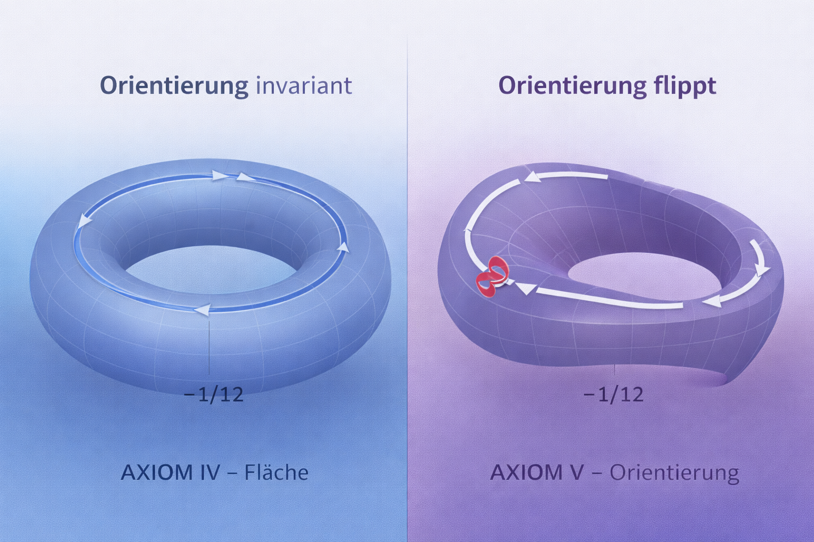

# 🟣 B2 · The Möbius Strip  
## Orientation as a Geometric Event

> *Orientation is not a property of space —  
it is an event along a closed path.*

This module formalizes the **second unavoidable consequence** after **AXIOM 0**  
and **B1 (Torus)**:

👉 **Orientation can no longer be assumed invariant.**

The Möbius strip appears **not as a construction**,  
but as a **necessary geometric response** to global continuation under AXIOM 0.

---

## 📍 Position in the Codex Sequence

| Stage | Role |
|----:|------|
| GEOMETRIA NOVA | Local Euclidean geometry |
| AXIOM 0 | Global linearity fails |
| B1 · Torus | Closed surface, orientation preserved |
| **B2 · Möbius Strip** | **Orientation breaks under traversal** |
| Post-B2 | Topology becomes unavoidable |

B2 completes the **geometric phase**  
before any formal topology is introduced.

---

## 🔁 From Torus to Möbius

In **B1**, closure is achieved without changing orientation:

- paths return
- directions remain consistent
- “left” stays left

However, AXIOM 0 does **not** guarantee orientation preservation.

If a closed path includes a **frame flip**, then:

- local smoothness remains intact
- global orientation reverses

This is exactly the Möbius condition.

---

## 🧠 Formal Insight

**Definition (Codex):**

A surface is Möbius-type if a closed geodetic traversal causes  
a **global orientation reversal** while remaining locally continuous.

Key properties:

- single-sided surface
- no global orientation
- no boundary required
- local Euclidean validity preserved

The Möbius strip is therefore **not exotic** —  
it is the **minimal geometry of orientation instability**.

---

## 🖼️ Canonical Transition Visual

**Left:**  
- AXIOM IV — surface (Torus)  
- orientation invariant  
- closure without inversion  

**Right:**  
- AXIOM V — orientation  
- frame flips under traversal  
- closure with inversion  

The **−1/12 marker** indicates the same threshold offset  
as introduced in AXIOM 0.

---

## 🔍 Why This Is Still Geometry (Not Topology)

This module:

- defines no manifolds
- introduces no invariants
- uses no classification theory

It shows only this:

> *Once orientation can flip under a closed path,  
metric geometry alone is insufficient.*

Topology is **not applied yet** —  
but it is now **unavoidable**.

---

## 🔑 One-Sentence Result

> **A space in which orientation can flip under a closed path  
cannot be described by metric geometry alone.**

That is the full result of **B2**.

---

## 🔗 Connections

- ← [`B1 · Torus`](../B1_TORUS/README.md)
- ← [`AXIOM 0 – Schwellengeometrie`](../AXIOM_0_SCHWELLENGEOMETTRIE/README.md)
- → `From Geometry to Topology` (next transition module)

---

## 🪲 Status

- B2: complete  
- Geometry phase: closed  
- Topology: logically enforced, not yet formalized

> *The Möbius strip is not a curiosity.*  
> *It is what geometry becomes when orientation is allowed to fail.*

---
