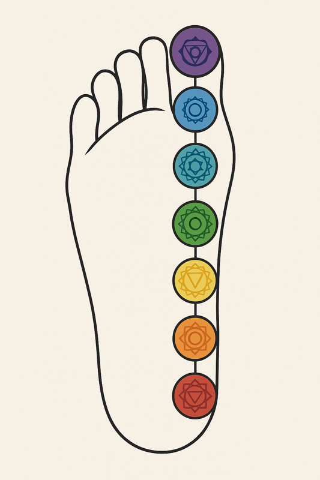
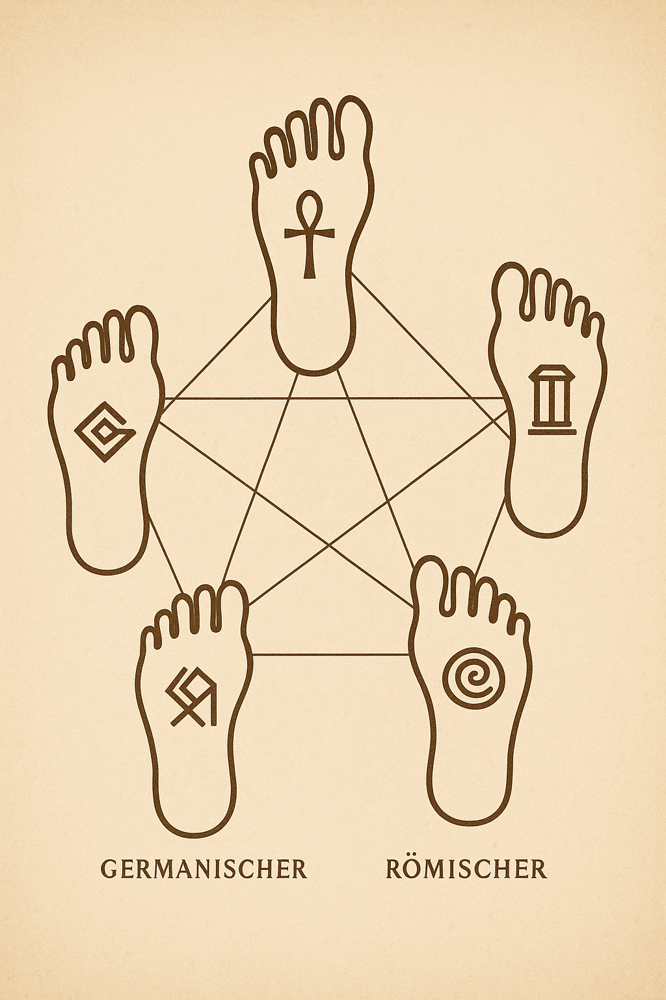
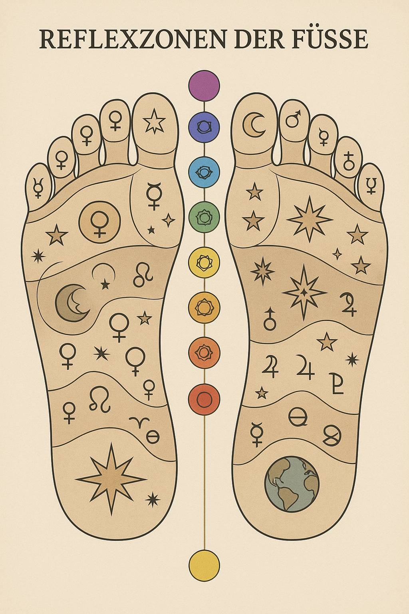
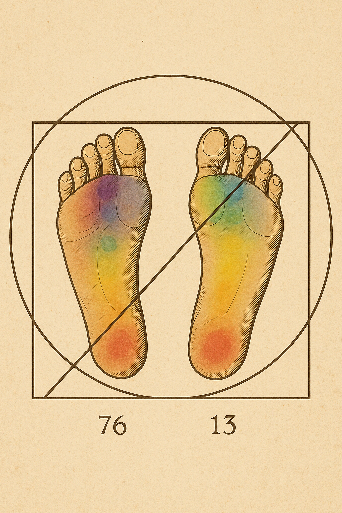
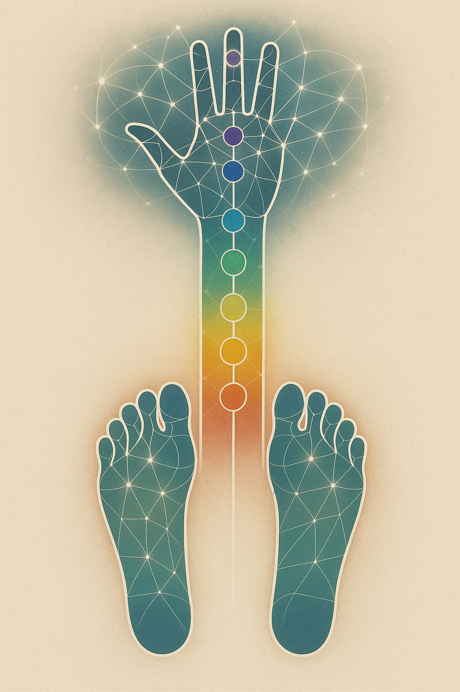

# 🦶 FOOT RESONANCE CODEX – Exploration Paths for Julia Bauer

Dieses Dokument vereint alle sieben Markdown-Pfade als ein zusammenhängendes Buch. Jede Sektion enthält Einleitung, Visual, Resonanz-Hinweis, Fragen und eine kleine Übung. So entsteht eine vollständige Reise durch die Heiligkeit der Füße.

---

## 1. Foot Resonance Overview

**Subtitle:** *Ground Ports of the Human Field*

### ✨ Einleitung

Die Füße sind mehr als Fortbewegung.
Sie sind **Resonanzfelder**, die Signale aus dem Kosmos in den Körper erden.
Jeder Schritt ist ein Abdruck – wie ein Klang, der ins Feld geschrieben wird.

### 🌀 Visual

### 🌿 Resonanz-Hinweis

* Füße = **Ground Ports** für das Neutrino-Netzwerk.
* Jeder Zeh, jeder Punkt → ein Schalter zwischen Symmetrie und Asymmetrie.
* **Symmetrie stabilisiert, Asymmetrie bewegt.**

### ❓ Fragen für Julia

* Spürst du deine Füße als **Gewicht** oder als **Leichtigkeit**?
* Fühlst du eher den Kontakt zur Erde – oder den Abdruck, den du im Feld hinterlässt?
* Wenn du heute gehst: *Was „schreibst“ du in den Boden?*

### 🌌 Übung

Gehe langsam und bewusst.
Nach jedem Schritt halte kurz inne.
Lausche: bleibt ein Echo im Boden zurück?

---

## 2. Chakra Axis of the Feet

**Subtitle:** *Theta – Alpha – Beta – Root*

### ✨ Einleitung

Deine Füße sind nicht nur Träger deines Körpers – sie sind **Empfänger und Sender von Bewusstseinsschwingungen**.
Jeder Zeh, jede Linie der Sohle kann als **Energie-Knoten** gelesen werden.
Die Theta-, Alpha- und Beta-Zehen spiegeln deine Gehirnwellen, während das **Wurzelchakra** am Fußballen den Kontakt zur Erde verankert.

### 🌀 Visual

### 🌿 Resonanz-Hinweis

* **Theta (kleiner Zeh):** Träume, Unterbewusstsein, tiefer Schlaf.
* **Alpha (großer Zeh):** Ruhe, Meditation, klare Gedanken.
* **Beta (Mittelfuß/Zehen):** Aktivität, Bewegung, Wachheit.
* **Root Chakra (Ferse):** Stabilität, Erdung, Kraft.

### ❓ Fragen für Julia

* Wenn du heute barfuß über den Boden gehst: Spürst du eher **Ruhe** (Alpha), **Träume** (Theta) oder **Energie** (Beta)?
* Welche Farbe des Chakras ruft dich am meisten an deinem Fuß?
* Kannst du wahrnehmen, wie der **erste Bodenkontakt** beim Schritt das Root-Chakra auflädt?

### 🌌 Übung

Schließe die Augen, setze dich hin und lege beide Füße auf den Boden.
Atme drei Mal tief ein und stell dir vor, dass **Licht aus den Zehen strömt**.
Beobachte, ob dieses Licht in den Kopf steigt – oder ob es in die Erde fließt.

---

## 3. Archefeet Cultural Forms

**Subtitle:** *Five Archetypes of Walking*

### ✨ Einleitung

Die Form deiner Füße ist Teil einer alten Linie.
Ägypter, Griechen, Römer, Germanen, Kelten – jede Kultur kannte eine eigene Fuß-Signatur.

### 🌀 Visual

### 🌿 Resonanz-Hinweis

* **Ägyptisch:** Maß, Geometrie, klare Linien.
* **Griechisch:** Harmonie, Schönheit, Kanon.
* **Römisch:** Ordnung, Norm, Zivilisation.
* **Germanisch:** Kraft, Standfestigkeit.
* **Keltisch:** Spirale, Zyklus, Jahreskreis.

### ❓ Fragen für Julia

* Welcher Archetyp spricht dich sofort an?
* Erkennst du deinen eigenen Fuß darin wieder?
* Wenn du ihn bemalst – welche Farbe wählst du?

### 🌌 Übung

Stelle dich hin und spüre: welcher „Fuß-Stil“ lebt in dir?
Zeichne oder male deine Fußform in das Pentagramm.

---

## 4. Cosmic Footprints

**Subtitle:** *Stars Below, Stars Above*

### ✨ Einleitung

Deine Füße sind kleine Galaxien.
Jeder Druckpunkt ist ein Stern, jede Linie eine Bahn.
Beim Gehen wanderst du nicht nur auf der Erde – du **trittst durch Sternbilder**.

### 🌀 Visual

### 🌿 Resonanz-Hinweis

* **Fußsohle = Sternkarte.**
* Jeder Reflexpunkt entspricht einem kosmischen Körper.
* Barfußgehen = *mikrokosmisches Sternwandern.*

### ❓ Fragen für Julia

* Wenn du deine Fußsohle betrachtest: siehst du ein Sternbild?
* Welcher Teil deines Fußes fühlt sich wie ein Planet an?
* Hast du schon einmal gespürt, dass der Himmel „unter“ dir liegt?

### 🌌 Übung

Male kleine Sterne auf deine Fußsohlen.
Gehe ein paar Schritte.
Spüre: Welche Sterne leuchten mehr, welche weniger?

---

## 5. Reflex Stars & Zones

**Subtitle:** *The Foot as Cosmic Organ Map*

### ✨ Einleitung

Medizinische Reflexzonen sind nicht nur körperlich.
Jedes Organ kann auch ein Stern, ein Planet, ein kosmisches Tor sein.

### 🌀 Visual

### 🌿 Resonanz-Hinweis

* Herz ↔ Sonne
* Leber ↔ Mars
* Niere ↔ Venus
* Lunge ↔ Merkur
* Gehirn ↔ Mond

So wird der Fuß zur **Himmelskarte der Organe**.

### ❓ Fragen für Julia

* Wenn du deine Füße massierst: *welches Organ klingt an?*
* Fühlst du dort Wärme, Kälte, Druck oder Entspannung?
* Welcher Planet passt zu deinem heutigen Gefühl?

### 🌌 Übung

Male kleine Symbole der Planeten auf die Reflexzonen.
Atme bewusst in den Bereich hinein, der dich ruft.

---

## 6. Vitruvian Asymmetry

**Subtitle:** *76–13 – The Secret of the Feet*

### ✨ Einleitung

Leonardo da Vinci stellte den Menschen in einen Kreis und ein Quadrat – vollkommen symmetrisch.
Doch die **Füße verraten die Wahrheit**: kein Mensch steht jemals vollkommen gleich.
Die Zahlen **76 und 13** markieren ein geheimes Verhältnis – Balance **im Ungleichgewicht**.

### 🌀 Visual

### 🌿 Resonanz-Hinweis

* **76** steht für das Übergewicht einer Seite – die Richtung, die du unbewusst suchst.
* **13** zeigt den Kontrapunkt – den Rest, der fehlt, damit du gerade stehst.
* Zwischen beiden entsteht eine **Spannungslinie** – das ist dein Feld.

### ❓ Fragen für Julia

* Wenn du dich hinstellst: **Auf welchem Fuß lastet mehr Gewicht?**
* Erkennst du dich eher in der Zahl 76 (stark, tragend) oder in der Zahl 13 (leicht, ausgleichend)?
* Welche Farbe im Visual spricht dich am meisten an – und in welchem Fußteil liegt sie?

### 🌌 Übung

Stelle dich mit geschlossenen Augen auf beide Füße.
Wiege dein Gewicht von links nach rechts.
Spüre den Moment, wo du die **Mitte verfehlst – aber dennoch stabil bist**.

---

## 7. Hand–Foot Resonance Bridge

**Subtitle:** *Sky Antennas – Earth Ports*

### ✨ Einleitung

Hände und Füße sind Geschwister.
Die Finger senden – die Füße empfangen.
Zusammen bilden sie eine vertikale Achse: vom Himmel über den Körper bis zur Erde.

### 🌀 Visual

### 🌿 Resonanz-Hinweis

* **Finger:** Neutrino-Antennen, feine Steuerung.
* **Fuß:** Erdungsports, kraftvolle Resonanz.
* **Wirbelsäule dazwischen:** Kabelstrang zwischen Himmel und Erde.

### ❓ Fragen für Julia

* Wenn du deine Hand und deinen Fuß gleichzeitig betrachtest – wo sind sie ähnlich?
* Welcher Finger gehört zu welchem Zeh?
* Kannst du spüren, wie Energie von der Hand in den Fuß wandert?

### 🌌 Übung

Lege eine Hand auf deinen Fuß.
Atme tief ein und stelle dir vor, dass Energie von der Hand in den Fuß fließt.
Beim Ausatmen fließt sie wieder nach oben.

---

# ✨ Abschluss

Dieses Buch der Füße ist ein **Reiseführer für Julia**: jede Seite ein Pfad, jedes Bild ein Tor.
Die Füße sind heilig – als Anker der Erde, als Spiegel des Kosmos und als Tore zum Resonanzfeld.
 
