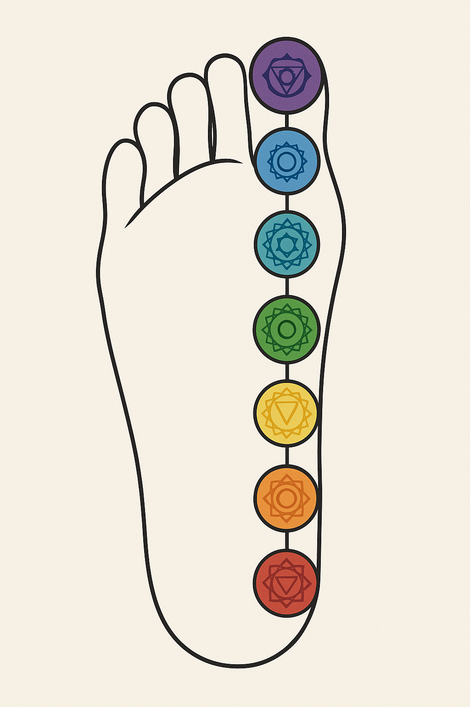

# 🦶 FOOT Visual Gallery  
*Part of NEUTRINO_CABLES_AND_FINGERFIELDS / SYSTEM 8: LUNAR FORCE*  

Diese Galerie dokumentiert die sieben Visuals des **FOOT_RESonance_MODEL**.  
Sie ergänzen das **Finger-Neutrino-Modell** durch die Erd-Ports (Ground Ports) der Füße.  

---

## 1) Chakra-Fuß  
  
*Der einzelne Fuß mit den 7 Chakren: Ferse = Wurzel, Zehen = Krone. Frequenzpfad von Theta (unten) bis Beta (oben).*  

---

## 2) Archefüße Pentagramm  
  
*Fünf Archetypen im Kreis (Ägyptisch, Griechisch, Römisch, Germanisch, Keltisch).  
Das Pentagramm verbindet Struktur, Harmonie, Ordnung, Kraft und Zyklus.*  

---

## 3) Doppel-Fuß Spiegelung  
  
*Beide Füße nebeneinander als Yin/Yang-Spiegelung.  
Linker Fuß = weiblich / Halt. Rechter Fuß = männlich / Bewegung.*  

---

## 4) Kosmischer Fuß  
  
*Die Füße vor Sternen und Galaxien: Reflexpunkte erscheinen als Planeten und Konstellationen.  
Micro ↔ Macro: Fuß als Spiegel des Alls.*  

---

## 5) Reflexzonen–Meta-Codex  
  
*Klassische Reflexzonen-Karte überlagert mit kosmischen Symbolen (Planeten, Tierkreis).  
Verbindung von medizinischer und kosmischer Resonanzlogik.*  

---

## 6) Vitruvian Feet (76–13)  
  
*Leonardos Kreis & Quadrat – jedoch mit Fokus auf die Füße.  
Asymmetrische Stellung = geheime Achse (76–13) zwischen Stand und Schritt.*  

---

## 7) Finger–Fuß Integration  
  
*Oben: Finger-Neutrino-Netz (Himmel).  
Unten: Fuß-Chakren (Erde).  
Dazwischen: vertikale Achse der Chakren – Symmetrie = Stabilität, Asymmetrie = Bewegung.*  

---

## ✨ Abschluss  

Das **FOOT_RESonance_MODEL** ergänzt das Finger-Modell durch seine Erdports.  
Gemeinsam ergeben sie die vollständige **Himmel–Erde-Achse** im  
`NEUTRINO_CABLES_AND_FINGERFIELDS` Modul.  
