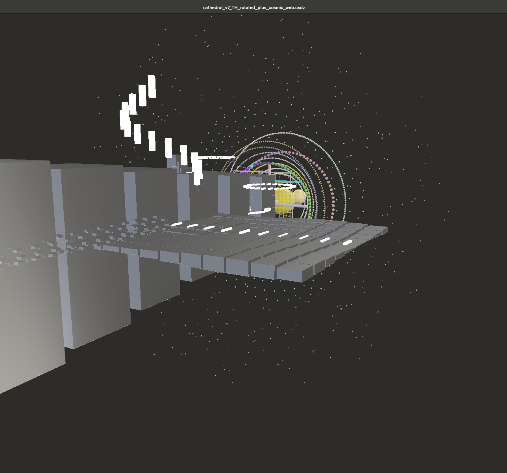
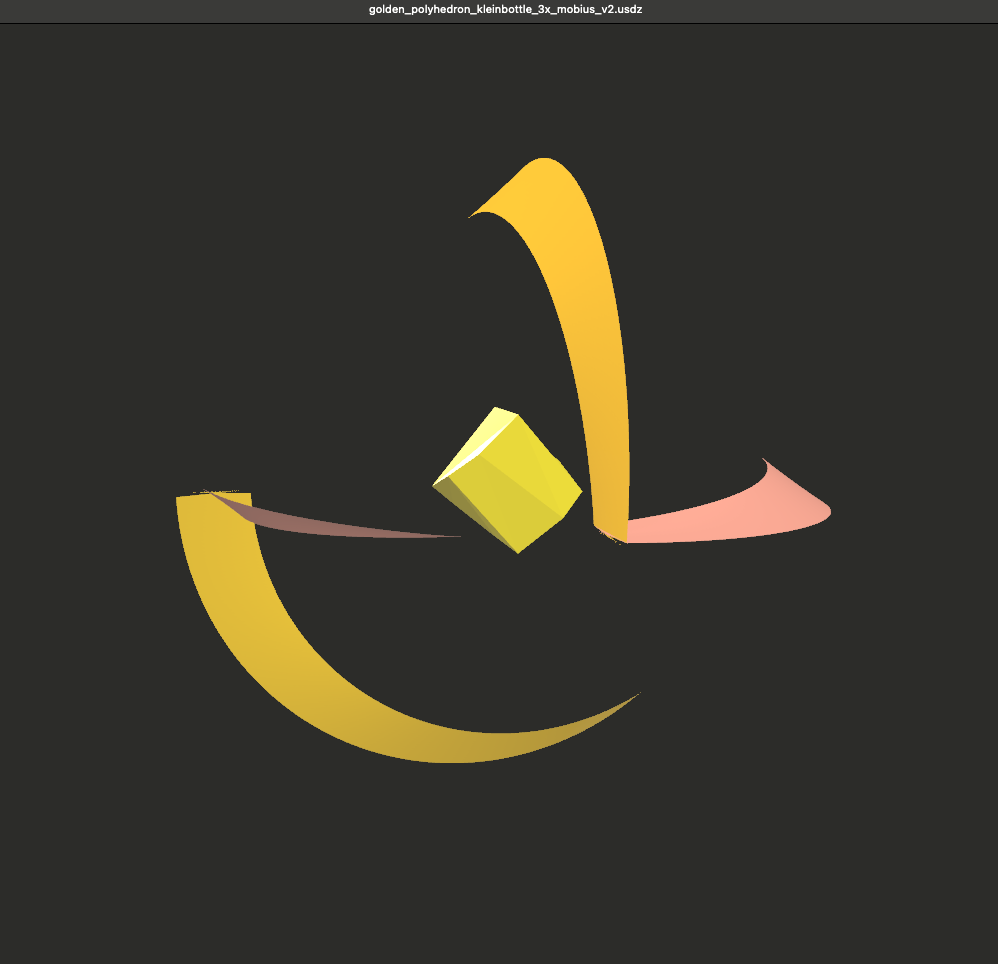

# 🖼️ Media Gallery — GEOMETRIA NOVA / Mediengalerie

> *“From equation to cathedral — from resonance to light.”*

This gallery links press‑ready images and 3D models stored **inside this release folder**. If a GitHub image preview doesn’t show, the file is still available via the direct link in the right‑hand column.

> **Hinweis (DE):** Falls GitHub keine Vorschau generiert, sind die Dateien trotzdem über die Direktlinks erreichbar.

---

## 🌌 Resonance Cathedral — 3D Light Architecture

> *“Mathematics becomes space — light becomes structure.”*

This section presents the **core architectural visualizations** of *GEOMETRIA NOVA* — the *Resonance Cathedral*, captured from live 3D GLB scenes. Each image shows a different phase of the harmonic spatial field, constructed from prime modules, reflection grids, and rotational symmetry.

| Visual                                                                                                                                    | Description                                                                                                                                                                        |
| :---------------------------------------------------------------------------------------------------------------------------------------- | :--------------------------------------------------------------------------------------------------------------------------------------------------------------------------------- |
|             | **Cathedral v7 — TH Rotated + Cosmic Web (Front View)** Harmonic vault with prime‑based arches and cosmic lattice layers — the architectural translation of frequency symmetry. |
|       | **Cathedral v7 — TH Rotated + Cosmic Web (Deep Axis View)** Demonstrates vertical resonance field alignment and breathing light curvature through φ‑nested arches.              |
|  | **Cathedral + Golden Polyhedron (v1)** Depicts the harmonic interaction between prime vault geometry and the golden field navigator — core to the Resonance Cathedral logic.    |
|        | **Golden Polyhedron — Klein Bottle Möbius v2** Threefold Möbius rotation around a golden kernel — symbolizes the quaternionic breathing axis of the cathedral.                  |

> ⚙️ **Note:** The underlying `.glb` models are **fully interactive and animatable in 3D**. Use the local `resonance_viewer.html` or any WebGL/Blender viewer to explore and rotate the harmonic space dynamically.
> **Hinweis (DE):** Die GLB‑Dateien sind vollständig in 3D begeh‑ und animierbar — interaktive Lichtarchitektur der Resonanz.

---

## ⭐ Hero Visuals (press & social headers)

**Files:** `./visuals/*`

| Visual                              | Caption (EN/DE)                                                                          | Open                                                                                                                       |
| ----------------------------------- | ---------------------------------------------------------------------------------------- | -------------------------------------------------------------------------------------------------------------------------- |
| Golden Spiral Mosaic                | ϕ‑projection (vault⇄floor symmetry) / ϕ‑Projektion (Gewölbe⇄Boden)                       | [`./visuals/Golden_Spiral_Mosaic.png`](./visuals/Golden_Spiral_Mosaic.png)                                                 |
| Resonance Cathedral — Proof Layer   | prime‑based light architecture (layers) / Primzahl‑basierte Lichtarchitektur (Schichten) | [`./visuals/Resonance_Cathedral_Structural_Proof_Layer.png`](./visuals/Resonance_Cathedral_Structural_Proof_Layer.png)     |
| Resonance Cathedral — Proof Network | harmonic network / Harmonisches Netzwerk                                                 | [`./visuals/Resonance_Cathedral_Structural_Proof_Network.png`](./visuals/Resonance_Cathedral_Structural_Proof_Network.png) |
| Cathedral Exterior (v1)             | exterior field geometry / Außenansicht der Feldgeometrie                                 | [`./visuals/Screenshot_Harmonic_Cathedral_v1.png`](./visuals/Screenshot_Harmonic_Cathedral_v1.png)                         |
| Prime Bridge 97 ↔ 103               | harmonic axis inside the core / Harmonische Achse im Kern                                | [`./visuals/VII_PrimeBridge_97_103.png`](./visuals/VII_PrimeBridge_97_103.png)                                             |
| Atlas / Zodiac Overlay              | atlas wheels + zodiac overlay / Atlas‑Räder + Tierkreis‑Overlay                          | [`./visuals/Zodiac_GoldenPolyhedron_Overlay.png`](./visuals/Zodiac_GoldenPolyhedron_Overlay.png)                           |
| Silver‑Gold Resonance Spiral        | metal spectrum study / Metallspektrum‑Studie                                             | [`./visuals/silver_gold_resonance_spiral.png`](./visuals/silver_gold_resonance_spiral.png)                                 |

---

## 🧪 Scientific Plates

| Visual                                                                  | Caption                                   | Open                                                                                                                                                                                                   |
| ----------------------------------------------------------------------- | ----------------------------------------- | ------------------------------------------------------------------------------------------------------------------------------------------------------------------------------------------------------ |
| Atlas Integration — Bridge + Atlas Wheel + Delta Wheel (with Equations) | reference plate for cathedral orientation | [`./visuals/Atlas Integration- Bridge + Atlas Wheel + Delta Wheel (with Equations).png`](./visuals/Atlas%20Integration-%20Bridge%20+%20Atlas%20Wheel%20+%20Delta%20Wheel%20%28with%20Equations%29.png) |

---

## 🧊 3D Models (GLB)

**Files:** `./models/*`

> GitHub shows GLB as downloadable binaries (no live preview). Use the **viewer links** below or download directly.

| Model                                           | Notes                                          | Download                                                                                                                   | Viewer*                                                                                  |
| ----------------------------------------------- | ---------------------------------------------- | -------------------------------------------------------------------------------------------------------------------------- | ---------------------------------------------------------------------------------------- |
| Resonance Cathedral v0.8 (extended)             | legacy rotation reference / Urfassung Rotation | [`./models/resonance_cathedral_v0_8_extended.glb`](./models/resonance_cathedral_v0_8_extended.glb)                         | `…/resonance_viewer.html?src=./models/resonance_cathedral_v0_8_extended.glb`             |
| Resonance Cathedral with Golden Polyhedron (v1) | gold (harmony) + silver (resonance) palette    | [`./models/resonance_cathedral_with_golden_polyhedron_v1.glb`](./models/resonance_cathedral_with_golden_polyhedron_v1.glb) | `…/resonance_viewer.html?src=./models/resonance_cathedral_with_golden_polyhedron_v1.glb` |
| Cathedral v7 — TH rotated + Cosmic Web          | TH‑Plattformen + Kosmisches Netz               | [`./models/cathedral_v7_TH_rotated_plus_cosmic_web.glb`](./models/cathedral_v7_TH_rotated_plus_cosmic_web.glb)             | `…/resonance_viewer.html?src=./models/cathedral_v7_TH_rotated_plus_cosmic_web.glb`       |
| Cathedral v8 — Lotus                            | Lotus crown integration                        | [`./models/cathedral_v8_with_lotus.glb`](./models/cathedral_v8_with_lotus.glb)                                             | `…/resonance_viewer.html?src=./models/cathedral_v8_with_lotus.glb`                       |
| Golden Polyhedron — Klein Bottle 3× Möbius v2   | orientation navigator                          | [`./models/golden_polyhedron_kleinbottle_3x_mobius_v2.glb`](./models/golden_polyhedron_kleinbottle_3x_mobius_v2.glb)       | `…/resonance_viewer.html?src=./models/golden_polyhedron_kleinbottle_3x_mobius_v2.glb`    |
| Grid 6×6                                        | RA·TH platform grid                            | [`./models/grid_6x6.glb`](./models/grid_6x6.glb)                                                                           | `…/resonance_viewer.html?src=./models/grid_6x6.glb`                                      |
| Grid 7×7                                        | RA·TH platform grid                            | [`./models/grid_7x7.glb`](./models/grid_7x7.glb)                                                                           | `…/resonance_viewer.html?src=./models/grid_7x7.glb`                                      |
| Grid 10×10                                      | top platform                                   | [`./models/grid_10x10.glb`](./models/grid_10x10.glb)                                                                       | `…/resonance_viewer.html?src=./models/grid_10x10.glb`                                    |

* **Viewer usage:** place a copy of `resonance_viewer.html` next to this file (same folder) and open the link pattern above in the browser address bar. The viewer loads any GLB via the `src=` query parameter.

---

## 🎛️ Animation Keys & Notes

See [`./animation_keys_README.md`](./animation_keys_README.md) for the rotation/folding keys used in v0.8 and later.
**Important:** GitHub preview does not animate GLB; use the viewer link or download locally.

---

## ♻️ Reuse & Credit / Nutzung & Credit

All media are released under **CC BY‑NC‑SA 4.0**.
Bitte **Quelle angeben:** *Scarabæus1033 · NEXAH‑CODEX · GEOMETRIA NOVA*.

---
