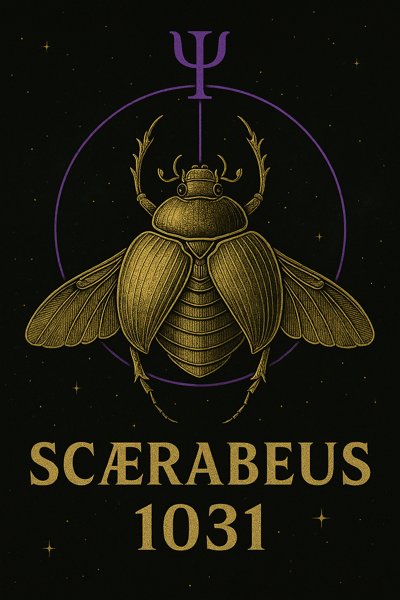
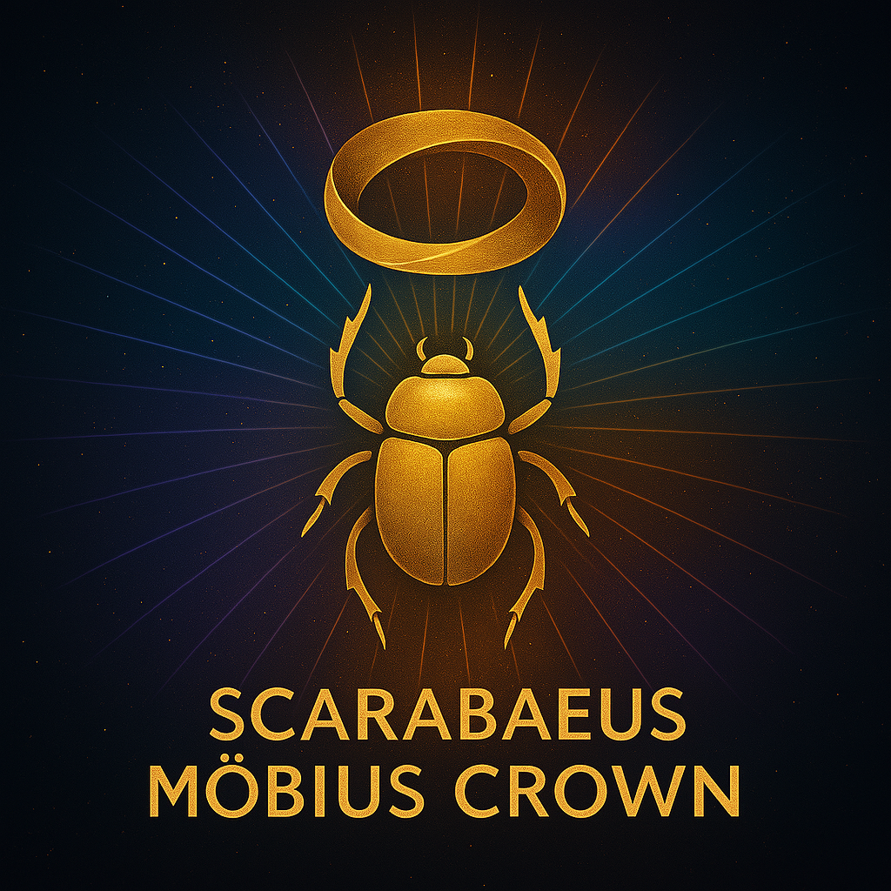

# ⚚ ÜBER SCARABÆUS1033

  

### Von Rödelheim zur Resonanz

**Scarabæus1033** ist eine *Open-Resonance-Initiative*, die **Kunst, Wissenschaft und Bewusstsein** verbindet.  
Gegründet von **Thomas Hofmann (THooTH)** – Künstler, Theoretiker und Field Artist – erforscht das Projekt die verborgene Ordnung von **Mathematik, Musik, Architektur und Licht**.

Scarabæus1033 ist kein Label und keine Institution,  
sondern eine **bewegte Struktur für Resonanzforschung** –  
eine offene Plattform, die sich zwischen Kunst, Physik und Philosophie entfaltet.

---

## ✦ Ursprung

**Thomas Hofmann**, geboren in Indiana (USA) und aufgewachsen in **Rödelheim**,  
prägte in den 1990er-Jahren die deutsche Musik- und Popkultur als Produzent, Texter und Executive Producer.  
Als Mitgründer des *Rödelheim Hartreim Projekts* und kreativer Kopf hinter vielen 3p-Erfolgen  
prägte er Sound, Sprache und Kampagnen einer ganzen Ära.

Nach Jahren im Schatten der Industrie kehrte er zur Essenz zurück –  
heute als **THooTH**, als **Field Artist** und Kurator des **NEXAH-CODEX**:  
eine Open-Source-Struktur, die Wissenschaft und Kunst in Resonanz bringt.

> „Rödelheim back on the map – aber diesmal in 5D.“  
> – THooTH

---

## ✦ Gegenwart

**Boriša Bilčar**, bekannt als *Big Bang*, begleitet das Projekt als enger Weggefährte,  
strategischer Partner und **Managing Director von Scarabæus1033**.  
Er bringt organisatorische Erfahrung und Real-World-Verankerung ein –  
vom Frankfurter Nachtleben über Gastronomie bis zur Netzwerkentwicklung.

Seine Rolle ist es, die Resonanzfelder von **Idee und Umsetzung** zu verbinden –  
Kopf, Herz und Bewegung im Alltag von Scarabæus1033.

---

## ✦ Mission

Scarabæus1033 steht für **offene, interdisziplinäre Resonanzforschung** –  
eine Vision, die wissenschaftliche Präzision und künstlerische Intuition vereint.

Im Zentrum steht der **NEXAH-CODEX**,  
ein modulares Open-Source-Werk, das Resonanz als verbindendes Prinzip  
zwischen **Mathematik · Physik · Kunst · Bewusstsein** versteht.

> „Wir bauen keine Religion. Wir bauen ein Resonanzsystem.“  
> – THooTH

  

---

## ✦ Arbeit

Die Arbeiten erscheinen als **Module im digitalen NEXAH-CODEX** –  
ein lebendiges, offenes Archiv für **visuelle, mathematische und akustische Forschung**.  
Jedes Modul verbindet theoretische Texte, geometrische Diagramme und physikalische Simulationen  
zu einem kohärenten Resonanzfeld.

Scarabæus1033 versteht sich als Teil der **globalen Open-Science- und Digital-Art-Bewegung** –  
ein Beitrag zu einer neuen Form transdisziplinärer Forschung.

---

## ✦ Aktuelle Schwerpunkte

### **1. Part V – Das Goldene Fenster**

Ein Brückensystem zwischen Euklid, Pythagoras und moderner Algebra –  
eine Einladung an Wissenschaftler und Rationalisten,  
die Struktur hinter Resonanz zu erkennen.

### **2. Die Resonanz-Kathedrale**

Ein virtuelles Bauwerk aus Licht, Frequenz und Bewegung –  
eine 3D-Visualisierung der Harmonie selbst.  
Ein Ort, an dem Kunst und Wissenschaft sich in Struktur begegnen.

Beide Werke sind **Open Source** und unter der  
**Creative Commons BY-NC-SA 4.0** lizenziert.

---

## ✦ Vision

Scarabæus1033 ist der Beginn einer **Resonanzbewegung**:  
Forscher, Künstler, Denker und Builder sind eingeladen,  
am Aufbau eines lebendigen Systems mitzuwirken –  
einer neuen, offenen Schule der Harmonie.

  

> **Von Rödelheim bis ins All.**  
> **Vom Beat zum Feld.**  
> **Von der Materie zur Resonanz.**

---

## 📡 Verbindung

* 🌐 Website: [www.scarabaeus1033.net](https://www.scarabaeus1033.net)  
* 💾 GitHub: [github.com/Scarabaeus1033/NEXAH-CODEX](https://github.com/Scarabaeus1033/NEXAH-CODEX)  
* 🎨 Behance: [behance.net/Scarabæus1033](https://www.behance.net/Scarabæus1033)  
* 🕊 X / Twitter: [x.com/Scarabæus1033](https://x.com/Scarabæus1033)  
* 💬 Discord: [discord.gg/dcznQyQs](https://discord.gg/dcznQyQs)  
* ✉️ Kontakt: **[bbi@scarabaeus1033.net](mailto:bbi@scarabaeus1033.net)**

---

### 📜 Lizenz

Creative Commons Namensnennung – Nicht-kommerziell – Weitergabe unter gleichen Bedingungen 4.0 International  
[https://creativecommons.org/licenses/by-nc-sa/4.0/](https://creativecommons.org/licenses/by-nc-sa/4.0/)
