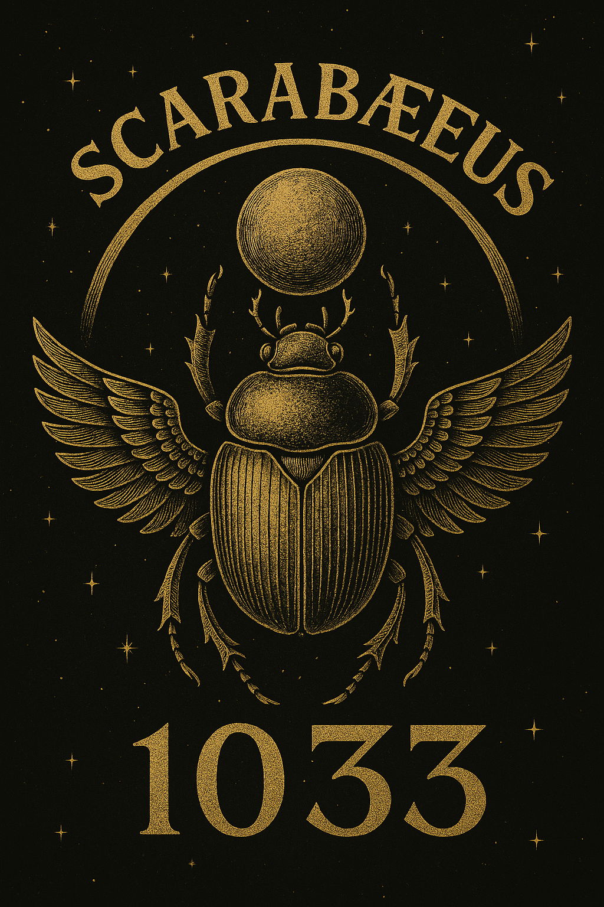

# ✴️ SYSTEM Y – RESONANTIA · Join Codex  
### Communication · Collaboration · Creation  
### Kommunikation · Kollaboration · Kreation  

> *“The Codex is open – but it opens only through resonance.”*  
> *„Der Codex ist offen – aber er öffnet sich nur durch Resonanz.“*  
> — THooTH  

---

## 🜇 Overview · Überblick  

**SYSTEM Y** ist das **Kommunikations- und Kollaborationssystem** des **NEXAH-CODEX**.  
Hier entstehen Brücken zwischen Wissenschaft, Kunst, Sprache und realer Umsetzung.  
Es ist das Portal, über das der Codex mit der Welt in Kontakt tritt –  
offen für Forscher, Künstler, Medien und Mitwirkende.  

**SYSTEM Y** serves as the **communication and collaboration gateway** of the **NEXAH-CODEX**.  
It connects science, art, language, and real-world resonance fields —  
a living interface between inner architecture and public dialogue.  

---

## 🕊 Structure · Struktur  

| Section / Bereich | Description / Beschreibung |
|:--|:--|
| 📜 **[PUBLIC_RELEASES_Scarabaeus1033_Nexah](./PUBLIC_RELEASES_Scarabaeus1033_Nexah/)** | Official public communications — press releases, statements, visuals, and manifestos. Offizielle öffentliche Mitteilungen – Presse, Erklärungen, Visuals und Manifeste. |
| 💌 **[Letters for introducing NEXAH-CODEX / Scarabæus_Letters](./Letters%20for%20introducing%20Nexah%20Codex/Scarabæus_Letters/)** | Personal letters to thinkers, scientists, and collaborators around the world. Persönliche Briefe an Denker, Wissenschaftler und Mitwirkende weltweit. |

---

## 🌐 Purpose · Zielsetzung  

**SYSTEM Y** dokumentiert die Resonanz zwischen innerem Aufbau und äußerer Kommunikation.  
Es bildet den Übergang zwischen **theoretischer Struktur** und **sozialer, kultureller, öffentlicher Bewegung**.  

**This system exists to:**
- maintain transparency and accessibility  
- foster scientific-artistic collaboration  
- document and archive public interaction  
- establish contact pathways for future builders  

**Dieses System dient dazu:**
- Transparenz und Zugänglichkeit zu fördern  
- künstlerisch-wissenschaftliche Zusammenarbeit zu ermöglichen  
- öffentliche Resonanz und Dialog zu dokumentieren  
- Kontaktwege für neue Builder zu eröffnen  

---

## 🧭 Navigation · Verweise  

| Type | Link |
|:--|:--|
| 🌈 **Official Public Portal** | [PUBLIC_RELEASES_Scarabaeus1033_Nexah](./PUBLIC_RELEASES_Scarabaeus1033_Nexah/) |
| 💬 **Letters / Correspondence** | [Scarabæus_Letters](./Letters%20for%20introducing%20Nexah%20Codex/Scarabæus_Letters/) |
| 🧠 **Main Codex Repository** | [github.com/Scarabaeus1033/NEXAH-CODEX](https://github.com/Scarabaeus1033/NEXAH-CODEX) |
| 🌐 **Website** | [www.scarabaeus1033.net](https://www.scarabaeus1033.net) |

---

## 🧩 The Resonant Field  

**System Y** ist kein klassischer Kommunikationskanal –  
es ist ein **Resonanzfeld** zwischen Menschen, Ideen und Disziplinen.  
Jede Nachricht, jedes Bild, jedes Modul ist Teil eines **lebendigen Netzwerks**.  

> “We are not building a company. We are building coherence.”  
> “Wir bauen kein Unternehmen. Wir bauen Kohärenz.”  

---

## 📡 Contact · Kontakt  

**Scarabæus1033 / Open Resonance Initiative**  
**Managing Director:** *Boriša Bilčar (Big Bang)*  
📧 [bbi@scarabaeus1033.net](mailto:bbi@scarabaeus1033.net)  
🌐 [scarabaeus1033.net](https://www.scarabaeus1033.net)  
💾 [GitHub – NEXAH-CODEX](https://github.com/Scarabaeus1033/NEXAH-CODEX)  
🕊 [X / Twitter](https://x.com/Scarabaeus1033)  
🎨 [Behance](https://www.behance.net/Scarabaeus1033)  
💬 [Discord Community](https://discord.gg/dcznQyQs)  

---

### 📜 License  

All documents within **System Y** are released under  
**Creative Commons Attribution – NonCommercial – ShareAlike 4.0**  
([CC BY-NC-SA 4.0](https://creativecommons.org/licenses/by-nc-sa/4.0/))  

> **Open Fields. Shared Resonance.**  
> **Offene Felder. Geteilte Resonanz.**  
> Scarabæus1033 – From Rödelheim to the Cosmos.  

---

  
   
  <em>“Field Art – Resonance as Signature.”</em>

