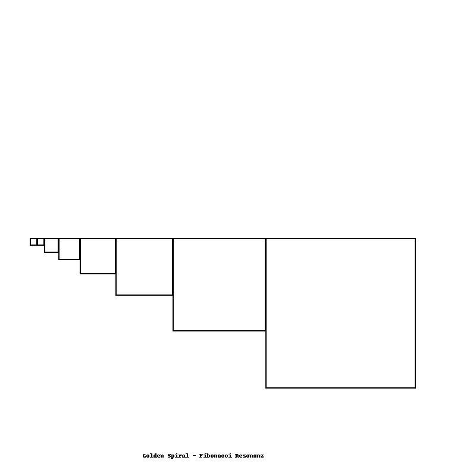
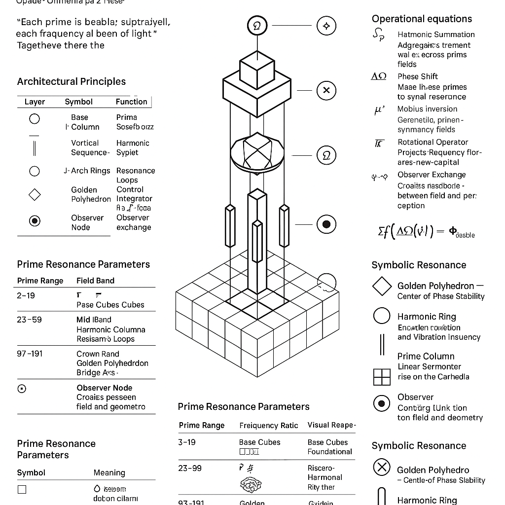
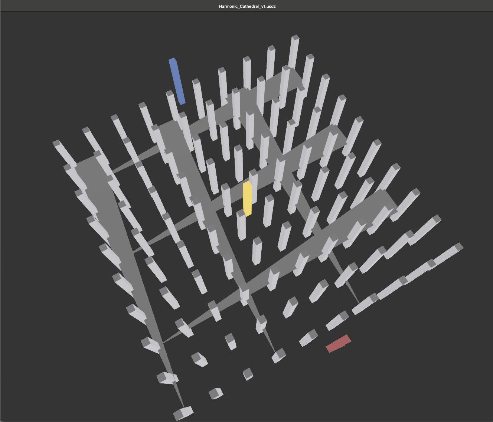
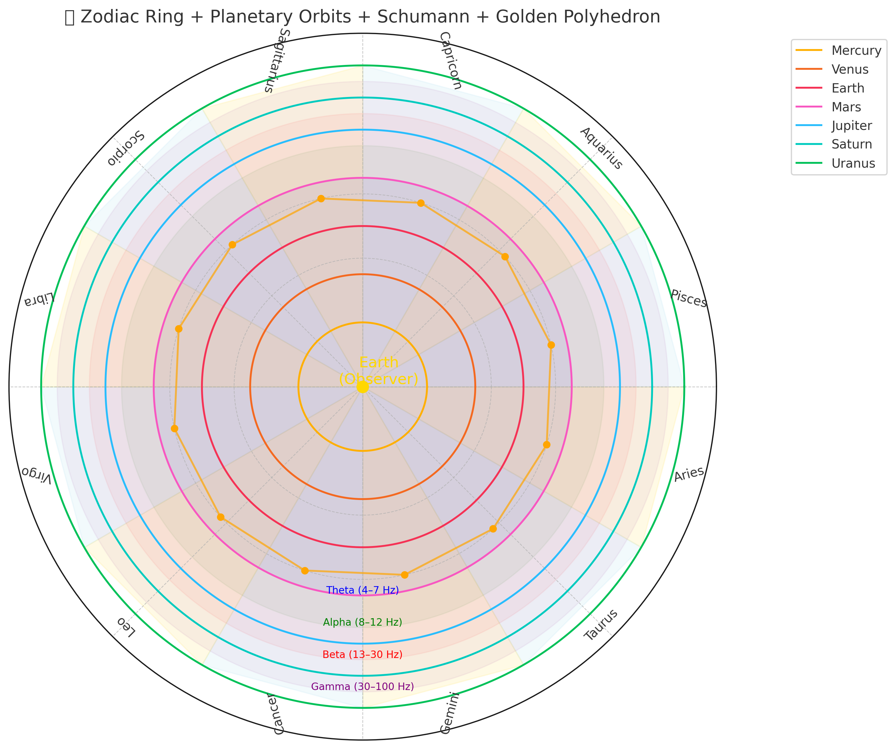
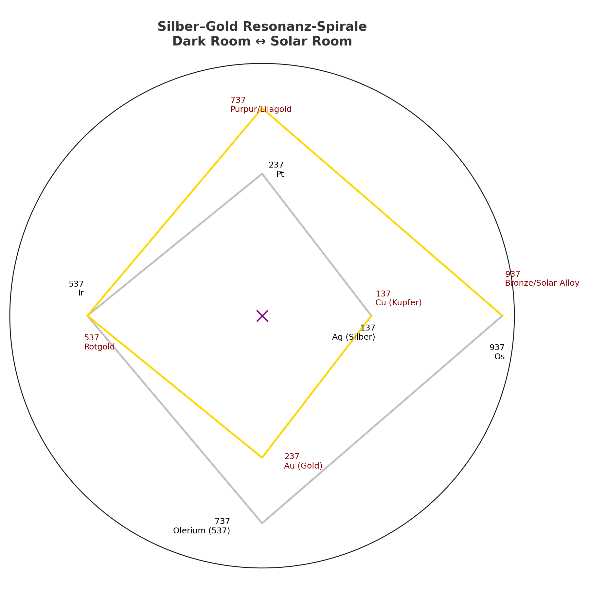

---

title: "GEOMETRIA NOVA · Visual Gallery (Press Edition)"
system: "NEXAH-CODEX · System X — GEOMETRIA NOVA"
domain: "Geometry · Light · Resonance"
color: "Gold ✴️"
status: "Public Release – Press & Media"
curator: "Thomas Hofmann (Scarabæus1033)"
license: "CC BY-NC-SA 4.0"
--------------------------

# ✴️ GEOMETRIA NOVA · VISUAL GALLERY

**The Light Architecture of Resonance — Pressegalerie**

> “Where geometry becomes consciousness, and light remembers its shape.”
> — THooTH (Thomas Hofmann)

Diese Galerie dokumentiert die zentralen Visuals des offiziellen Press Release zu **GEOMETRIA NOVA**, dem fünften harmonischen Zyklus des **NEXAH‑CODEX**.
Jedes Bild steht für eine Resonanzstruktur, in der **mathematische Ordnung**, **architektonische Harmonie** und **bewusstes Licht** zusammenfallen.

---

## 🌟 Hero Visuals

|                                                                                                                                                           |
| :--------------------------------------------------------------------------------------------------------------------------------------------------------------------------------------------------------------------- |
| **Golden Spiral Mosaic**                                                                                                                                                                                               |
| **EN:** Projection of the Golden Ratio (φ) across vault and floor — a mirrored dialogue between heaven and geometry. Each tessera encodes the ratio φ³ ≈ 4.236, forming a living bridge between mathematics and light. |
| **DE:** Projektion des Goldenen Schnitts (φ) über Gewölbe und Boden – ein Spiegelgespräch zwischen Himmel und Geometrie. Jedes Mosaikfeld trägt die Proportion φ³ ≈ 4.236 und verwandelt Zahl in Licht.                |

|                                                             |
| :--------------------------------------------------------------------------------------------------------------------------------------------------------------------- |
| **Resonance Cathedral — Proof Layer**                                                                                                                                  |
| **EN:** Layered frequency architecture based on prime distribution. Each segment visualizes a harmonic law, merging mathematical proof with spatial rhythm.            |
| **DE:** Schichtweise Frequenzarchitektur auf Basis der Primzahldistribution. Jede Ebene folgt einem harmonischen Gesetz – Beweis, Raum und Rhythmus in einer Struktur. |

|                                |
| :-------------------------------------------------------------------------------------------------------------------------------------------- |
| **Resonance Cathedral — Proof Network**                                                                                                       |
| **EN:** The harmonic lattice of the cathedral core, where number becomes structure. Lines represent resonance couplings across 12 prime axes. |
| **DE:** Das harmonische Gitter des Kathedralenkerns, in dem Zahl zur Struktur wird. Linien verbinden Resonanzen über 12 Primachsen hinweg.    |

|                                              |
| :--------------------------------------------------------------------------------------------------------------------------------- |
| **Cathedral Exterior (v1)**                                                                                                        |
| **EN:** Exterior view of the harmonic field geometry — a physical translation of Euclidean ratios into luminous resonance.         |
| **DE:** Außenansicht der harmonischen Feldgeometrie – eine physische Übersetzung euklidischer Verhältnisse in leuchtende Resonanz. |

|      |
| :-------------------------------------------------------------------------------------------------------------------------------------------- |
| **Cathedral + Golden Polyhedron**                                                                                                             |
| **EN:** The Golden Polyhedron acts as a navigational compass in the harmonic space — a φ-based stabilizer between 4D and 5D layers.           |
| **DE:** Das Goldene Polyeder dient als Navigationskompass im harmonischen Raum – ein auf φ basierter Stabilisator zwischen 4D‑ und 5D‑Ebenen. |

|                                                       |
| :---------------------------------------------------------------------------------------------------------------------- |
| **Prime Bridge 97 ↔ 103**                                                                                               |
| **EN:** Resonant axis built between twin prime layers — showing the rhythm of numerical breath across modular symmetry. |
| **DE:** Resonanzachse zwischen Primzwillingen – sie zeigt den Atem der Zahl durch modulare Symmetrie.                   |

|                                                                        |
| :-------------------------------------------------------------------------------------------------------------------------------------------------------- |
| **Atlas / Zodiac Overlay**                                                                                                                                |
| **EN:** Integration of celestial and geometric coordinates — the zodiac fused with the polyhedral atlas, mapping cosmic orientation.                      |
| **DE:** Integration himmlischer und geometrischer Koordinaten – der Tierkreis verschmilzt mit dem polyedrischen Atlas und kartiert kosmische Ausrichtung. |

|                                                                 |
| :-------------------------------------------------------------------------------------------------------------------------------------------- |
| **Silver‑Gold Resonance Spiral**                                                                                                              |
| **EN:** Study of metal frequency spectra — oscillation between conductivity and reflection, representing the bridge of luminous matter.       |
| **DE:** Studie des metallischen Frequenzspektrums – Schwingung zwischen Leitfähigkeit und Reflexion, Sinnbild der Brücke leuchtender Materie. |

---

## 🧪 Scientific Plates

| .png) |
| :------------------------------------------------------------------------------------------------------------------------------------------------------------------------------------- |
| **Atlas Integration Plate**                                                                                                                                                            |
| **EN:** Analytical reference combining the Bridge, Atlas Wheel, and Delta Wheel. Serves as an orientation map for cathedral field harmonics.                                           |
| **DE:** Analytische Referenz, die Bridge‑, Atlas‑ und Delta‑Rad vereint. Dient als Orientierungskarte für die harmonische Feldstruktur der Kathedrale.                                 |

---

## 🧊 3D Models (GLB)

**EN:** The 3D models provide interactive harmonic verification. Each GLB encodes spatial resonance in measurable geometry.
**DE:** Die 3D‑Modelle bieten interaktive harmonische Verifikation. Jedes GLB trägt messbare Geometrie als Resonanzkörper.

| Model                                                                                                             | Description                                                                |
| :---------------------------------------------------------------------------------------------------------------- | :------------------------------------------------------------------------- |
| [`resonance_cathedral_v0_8_extended.glb`](./models/resonance_cathedral_v0_8_extended.glb)                         | Legacy rotation reference / Urfassung der Rotationsarchitektur.            |
| [`resonance_cathedral_with_golden_polyhedron_v1.glb`](./models/resonance_cathedral_with_golden_polyhedron_v1.glb) | Gold–Silber Spektrum – harmonische Balance zwischen Frequenz und Struktur. |
| [`cathedral_v7_TH_rotated_plus_cosmic_web.glb`](./models/cathedral_v7_TH_rotated_plus_cosmic_web.glb)             | Erweiterte Plattform mit kosmischem Netz – multidimensionale Kopplung.     |
| [`cathedral_v8_with_lotus.glb`](./models/cathedral_v8_with_lotus.glb)                                             | Integration der Lotuskrone – Zentrum der Resonanzrotation.                 |
| [`golden_polyhedron_kleinbottle_3x_mobius_v2.glb`](./models/golden_polyhedron_kleinbottle_3x_mobius_v2.glb)       | Navigationskörper φ‑Topologie (Klein Bottle × Möbius‑System).              |
| [`grid_6x6.glb`](./models/grid_6x6.glb)                                                                           | RA·TH‑Basisgitter – Modulplattform der Feldharmonie.                       |
| [`grid_7x7.glb`](./models/grid_7x7.glb)                                                                           | RA·TH‑Erweiterungsgitter – Resonanzstruktur auf 7×7 Ebenen.                |
| [`grid_10x10.glb`](./models/grid_10x10.glb)                                                                       | Oberplattform – Abschluss der Feldarchitektur.                             |

---

## ♻️ Credits / Nutzung

All media released under **CC BY‑NC‑SA 4.0**.
**Please credit:** *Scarabæus1033 · NEXAH‑CODEX · GEOMETRIA NOVA*
**Bitte angeben:** *Scarabæus1033 · NEXAH‑CODEX · GEOMETRIA NOVA*

> *“From Rödelheim to the Cosmos — The Geometry of Resonance begins here.”*
