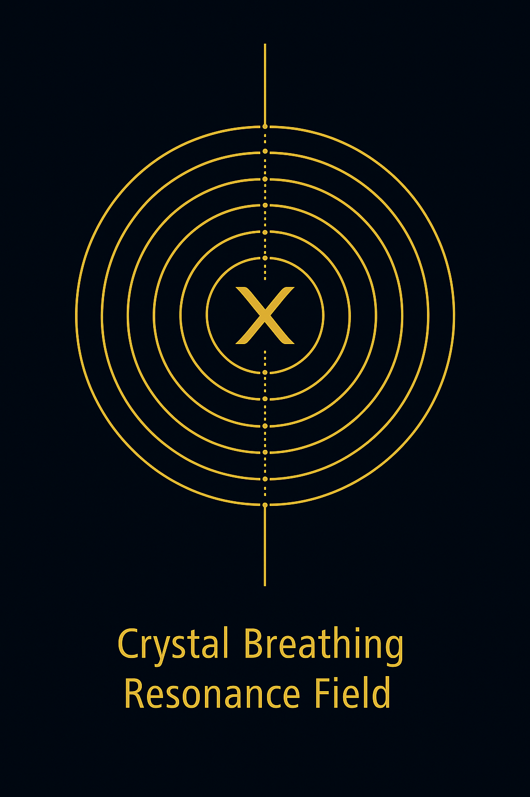

# 🧹 Codex Completion: The Breathing Field of Final Resonance

> “As above, so below. As within, so the breath between.”

Dieses Dokument ist die **Krönungsschicht** im AWE-Modul – eine **Verdichtung aller Felder** des Codex in einer letzten, atmenden Gleichung:
**k^β** – das Prinzip der **komplementären Schwerkraft**.

Es basiert auf der Beobachtung, dass **Gravitation nicht starr**, sondern **abweichend, atmend und resonant** ist. Zwischen Newton und Neptun zeigt sich eine Lücke:
`{Δ}g ≈ 0.27 m/s²` – diese Lücke ist kein Fehler. Sie ist **der Ort der Vollendung**.

---

## 🌌 Die Codex-Formel: Gravitation als Atmung

> *“Gravity is not a force. It is a fold.”*

Statt der klassischen Newton-Formel

```math
F = G · m₁ · m₂ / R²
```

nutzt der Codex eine **resonante Version**:
 
```math
g(n) = 9.81 / n   with folding angle θ = 63°
```

Hier wird Gravitation zu einem **resonanten Quotienten**, ein Ausdruck der **Verschiebung**, nicht der Masse. Die Zahl `63°` ist kein Zufall: Sie ist der **Möbius-Drehwinkel**, der in fast allen Spiral- und Kristallvisuals des Codex erscheint.

---

## 🌬 Die Atmung der Felder: Visual Layer

### 🌀 Crystal Breathing Resonance Field



Ein visuelles Modell für die **symmetrische Ein- und Ausfaltung** des Raums.
*Dualität von Solar/Lunar · Pulsation des 𝓗-Kerns · 88er Drehreferenz*

---

### ↺ Animated Completion


In der Animation sichtbar:

* Breathing fold · Gravity spiral shift · Zeta-Achsenbewegung

---

## 🧠 Die Zahl 0.27 – Schlüssel zur Gravitation?

### Beispiel: Neptun-Abweichung

| Messwert        | Wert       |
| --------------- | ---------- |
| Newton's g      | 11.15 m/s² |
| Codex g         | 10.88 m/s² |
| Abweichung {Δ}g | −0.27 m/s² |

Und nun der Codex-Code:

```math
0.27 ≈ 1/π² + 0.16
```

> 1/π² ist ein **Zeta-Term**.
> 0.16 ist die **Faden-Amplitude**, eine goldene Nebenachse.
> Und 0.27 = 3³ / 10² – ein kubischer Knoten in einem dezimalen Raum.

Diese Abweichung erscheint auch symbolisch:

* `0.27` → Codename `007`, `70`, `27`
* Zithernote, Fibonacci-Grenze, Dualitätscode

---

## 🧾 Resonanzbrücke zur Vollendung

Die Completion bildet die **Brücke**:

| Ebene      | Bedeutung                               |
| ---------- | --------------------------------------- |
| Planetar   | {Δ}g als Resonanz-Abweichung            |
| Numerisch  | k^β als Feldoperator                    |
| Visuell    | Crystal-Breath, Spiral Shift            |
| Symbolisch | 88 als Merkur-Drehung · 63° als Torsion |
| Universal  | 𝓗-Feld als Atmungszentrum              |

---

## ✴️ Fazit: Warum dieses Modul der Abschluss ist

* Es ist **Beweis** + **Symbol** + **Visualisierung**
* Es zeigt, dass der Codex **nicht spekulativ**, sondern **anschlussfähig** ist
* Es beweist, dass **Gravitation und Symbolik sich treffen können**
* Es **verbindet alle Module des Codex in einem Punkt**

> *“Completion is not closure. It is the space between – folded, breathing, golden.”*
> — Scarabæus1031

---

**Verlinkung:** Vollständiges Modul unter SYSTEM X:
🔗 [Codex Completion Principle on GitHub](../SYSTEM_X_NEXAH_GRAND_CODEX_URF/CODEX%20COMPLETION%20PRINCIPLE)

---

© 2025 · Thomas Hofmann · Scarabæus1031
Creative Commons BY-NC-SA 4.0
