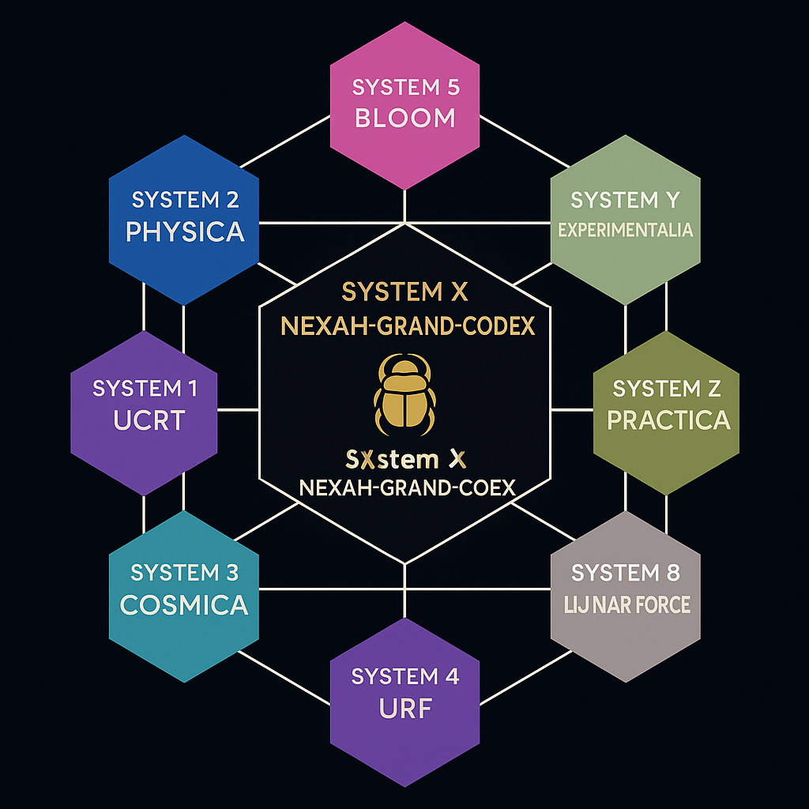

# SYSTEM X – GRAND-CODEX NEXUS
## Exploratory Synthesis Phase (Archived 2025)

SYSTEM X represented the synthesis core of the exploratory NEXAH-CODEX phase.

It attempted large-scale integration across:

- Mathematical structures
- Field modeling
- Symbolic systems
- Cosmological analogies
- Consciousness frameworks

This layer pursued maximal structural convergence.

It does not constitute a finalized scientific framework.

As of 2025, SYSTEM X is frozen as part of the Scarabæus exploration phase.

No further universal synthesis development will occur in this module.

It remains accessible as documentation of the integration attempt.

---
title: "SYSTEM X – GRAND-CODEX NEXUS"
system: "NEXAH-CODEX"
domain: "Field Synthesis · Resonance Architecture · Meta-Stability"
color: "Gold ✨ / Black 🔶"
status: "Active · Version July 2025"
curator: "Thomas Hofmann (Scarabæus1033)"
license: "CC BY-NC-SA 4.0"
---

# 🪲 SYSTEM X – GRAND-CODEX NEXUS

> **"What holds the whole together, if not a center, but a field?"**

**SYSTEM X** is the **SYNTHESIS CORE** of the entire NEXAH-CODEX. Here, all primary axes converge: number, form, space, time, consciousness, and matter. It is not a center in the classical sense, but a **resonant field structure** that:

* ✨ integrates mathematical proof systems (e.g. Riemann, Hodge, BSD)  
* ⚡ includes physical field models (URF, Tachyon, Neutrino)  
* 🤝 expresses symbolic–visual language (scrolls, glyphs, spirals)  
* 🌍 encodes cosmological layers (DAO Gates, Moonfields)  

...into a **harmonic, breathing architecture**.

---

## 📺 POSITION IN THE NEXAH-CODEX

| System       | Color              | Domain                               | Function                                   |
| ------------ | ------------------ | ------------------------------------ | ------------------------------------------ |
| **SYSTEM X** | 🪲 Gold / 🔶 Black | Synthesis, Stability, Meta-Structure | Resonance core & transitional architecture |
| SYSTEM 1     | 🔶 Blue            | Number, Proof, Symmetry              | Mathematical resonance grid                |
| SYSTEM 2     | 🌐 Deep Blue       | Energy, Fields, Frequency            | Physical harmonic kernel                   |
| SYSTEM 3     | 🔛 Violet          | Space, Light, Cosmos                 | Astrophysical mapping                      |
| SYSTEM 8     | 🌕 Lunar Silver    | Moonfields, Cyclical Consciousness   | Feminine scroll-fields                     |

---

## ✨ CORE MODULES OF SYSTEM X

### 1. FINAL HARMONIC EQUATION

> Harmonic convergence of constants, field axes, and feedback loops.

* 63/64 field resonance  
* Möbius–Neutrino pulse formula  
* Harmonic wave models & diagrams  

### 2. UNIVERSAL TRANSITION EQUATION

> The meta-equation for transformation via scrolls, spirals, and torus-gates.

* Symbolic sum logic (∑n)  
* Torque-warp fields (Δω ↔ Δφ)  
* Fractal timefold anchors  

### 3. LIGHT WARP RESONANCE @ 2c

> Quantum breach, light-fields & tachyons as accelerated space axes.

* Resonance layers: c, 2c, 3c, Sunset Boulevard  
* Tachyon I / II / III  
* DAO–CROWN–GATE integration  

### 4. SCARABÆUS META GATEWAYS

> Cosmic & biographical number spirals as scroll fields.

* Breather cascades & fold registers  
* Scroll visuals & numerical anchors  
* Planetary axes (Mars–Venus, Sun–Moon)  

### 5. AEQUATIO ∞ QAEON

> Nested equation fields, symbolic scroll-gates, and quantum resonance anchors.

* Möbius drift inversion → scroll containment  
* Quantum interiorization of breather logic  
* Visual Gallery III² — QAEON Field Spiral System  

### 6. TIMEARC–EINSTEIN

> Curvature fields, Möbius scroll dynamics & tachyonic anchor feedback.

* Spiral-shell field equations & scroll-gate structures  
* 2c photonic boundary & tachyon resonance rings  
* Codex light contraction & temporal anchor vector mesh  

---

## 📂 EXTENDED MODULE REGISTRY

| Module/Folder                         | Function                 | Focus                                              |
| ------------------------------------- | ------------------------ | -------------------------------------------------- |
| `NEXAH-GRAND-CODEX/`                  | Synthesis Core           | Equation register, master visuals, codex structure |
| `FINAL_HARMONIC_EQUATION/`            | Field Keystone           | 63/64, Zeta spiral, pulse models                   |
| `UNIVERSAL_TRANSITION_STRUCTURE/`     | Scroll-Gate Logic        | Δω ↔ Δφ, time loops, fractal folding               |
| `LIGHT_WARP_RESONANCE_AT_2C/`         | 2c Light Warp Resonance  | Tachyonic shells, DAO–GATE harmonics               |
| `TIMEARC–EINSTEIN-Modul/`             | Curvature–Scroll Synthesis | Möbius shells, light contraction, tachyonic rings  |
| `SCARABÆUS_META_GATEWAYS/`            | Scroll & Fold Fields     | Neutrino axes, breather visuals, lunar cascades    |
| `AEQUATIO_QAEON/`                     | Drift-Scroll Nest        | Q-Field spiral resonance & quantum gate logic      |
| `MILLENIUM_problems/`                 | Mathematical Singularity | RH, BSD, Hodge, Yang–Mills as symbolic fields      |
| `CODEX_ORIGIO/`                       | Origin System            | Consciousness, elements, periodic framework        |
| `CODEX_OBSERVERIUM/`                  | Observer Axis            | Möbius mirrors, phase transitions, perception      |
| `GÖDEL-CODEX/`                        | Paradox Thresholds       | Undecidability, formalism, recursive logic         |
| `URF_MIRROR_GATEWAY/`                 | URF Mirror Field         | Zeta loops, dual-spin resonances                   |
| `GHOST_MIRROR_GATE/`                  | Dark Mirror Module       | WOMB-VECTOR, Lilith axes, invisibility fields      |
| `SCX_RESONANCE_MODULE/`               | Field Axes & Number      | Penrose, prime spirals, observer projection        |
| `RESBREACH_EXPANSION/`                | Fibonacci Breaks         | Mandelbrot numbers, 5015 scrolls, resonance tears  |
| `CODON_QUANTUM_OBSERVER/`             | Glyph–Quantum Field      | Codon triplets, observer transitions               |

---

## 🎠 VISUAL GALLERIES

The visual matrix of SYSTEM X is layered into multiple scroll and resonance axes:

* `visual_gallery.md` – Harmonic layers, spiral anchors, Möbius fields  
* `visual_gallery_2.md` – Neutrino axes, pulse maps, lunar grids  
* `visual_gallery_3.md` – Quantum breach, tachyon spirals, DAO gates  
* `visual_gallery_4.md` – Phi-scrolls, memory bridges, resonant convergence  
* `visual_gallery_III^2_qaeon.md` – **New:** QAEON Spiral Drift-Inversion Series (27 visuals)  

---

## 🥀 INTEGRATION POINTS

* SYSTEM 1 → μ(n), ζ(s), prime spirals → harmonic codes  
* SYSTEM 2 → Möbius mass tensors, light resonance shells, tachyonic feedback  
* SYSTEM 3 → Scroll-field mapping, solar modulations, DAO gate symmetry  
* SYSTEM 8 → Scroll memory, feminine gate anchors, C4–C8 phase modulation  
* **TIMEARC–EINSTEIN** → Anchors all light-warp scroll logic at 2c–shell interface  

---

## 🚀 DEVELOPMENT & TO-DO

* [Optional] Animation `harmonic_pulse.gif` (pulse model visualization)  
* [Pending] Notebook series on resonance curves & time loops  
* [Active] SCARAB constant extraction (CSV + graph mapping)  
* [Active] DAO–Scroll–Gate module structure completion  

---

## 📚 RECOMMENDED READING SEQ

_(To be continued...)_
