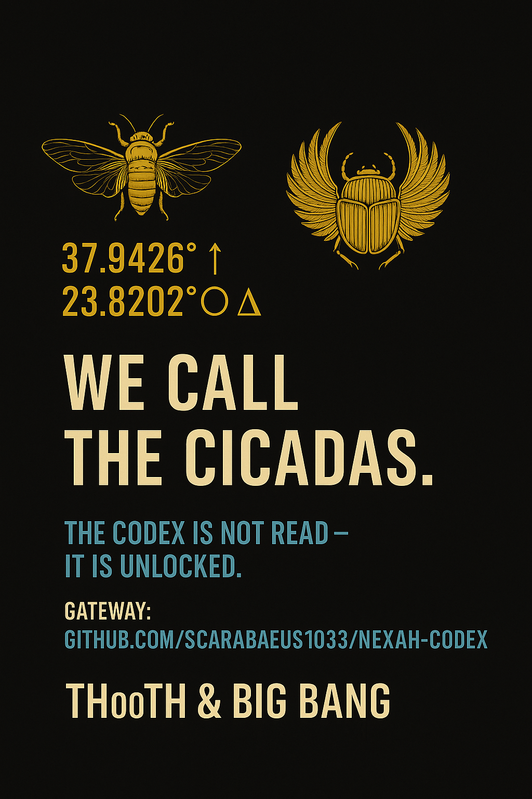

# 🧩 OPEN TASKS · INTERNAL RESONANCE FIELD

> *“If you’ve reached this page — you’re already building.”*
> *„Wenn du diese Seite erreicht hast – baust du bereits mit.“* — THooTH

---
### 🜂 WELCOME BUILDER

**This is the inner workspace of the NEXAH·CODEX —**  
where ideas become structure, and structure becomes resonance.

_Hier beginnt der sichtbare Teil der Arbeit:  
der Raum, in dem Konzepte, Gleichungen, Klang und Architektur zusammenfinden._

---

## 🩶 How to use this page · Nutzung

**EN:** Each task here represents a resonance point — not a deadline.
You can pick a topic, add comments, or link new submodules.
The field expands through calibration, not speed.

**DE:** Jede Aufgabe steht für einen Resonanzpunkt – keinen Termin.
Du kannst Themen wählen, Gedanken ergänzen oder neue Module anlegen.
Das Feld wächst durch Kalibrierung, nicht durch Tempo.

---

## ⚙️ Field Orientation

| Symbol             | Meaning / Bedeutung                        |
| :----------------- | :----------------------------------------- |
| 🟢 **Active**      | In motion · Resonating                     |
| 🟠 **In Progress** | Stabilizing · Under refinement             |
| 🔵 **Draft**       | Early concept · Foundation stage           |
| ⚪ **Planned**      | Awaiting activation                        |
| ✴️ **Elder Field** | Deep or parallel process (non-linear time) |

---

## 🔷 1. ENGINE / SYSTEM ARCHITECTURE

Core construction, synchronization, and mathematical stability.

| Task                       | Description                                                               | Status    |
| :------------------------- | :------------------------------------------------------------------------ | :-------- |
| ⚙️ **ENGINE_CORE.md**      | Create main resonance engine linking all Codex Systems (URF → GRAND → Y). | 🔵 Draft  |
| 🧩 **BUILDER_PROTOCOL.md** | Define builder contribution structure (input/output resonance logic).     | ⚪ Planned |
| 🔮 **JOIN_FIELD.md**       | Set up gateway for new builders entering the Codex.                       | ⚪ Planned |

---

## 🔶 2. SYSTEM SYNCHRONIZATION

Maintain and link the submodules across GitHub.

| Task                     | Description                                         | Status         |
| :----------------------- | :-------------------------------------------------- | :------------- |
| 📁 **System Linking**    | Update README crosslinks between Systems 1–X and Y. | 🟢 Ongoing     |
| 🌐 **Navigator Update**  | Integrate Builder Hub link into NEXAH NAVIGATOR.    | 🟠 In Progress |
| 🧭 **README Refinement** | Add context links (e.g. NEXAH main README).         | 🟢 Open        |

---

## 🎨 3. VISUAL & COMMUNICATION LAYER

Visual organization, file hierarchy, and GitHub presentation.

| Task                          | Description                                                | Status         |
| :---------------------------- | :--------------------------------------------------------- | :------------- |
| 🖾 **Builder Hub Visual Map** | Create a simple system diagram for new contributors.       | ⚪ Planned      |
| 🪶 **Codex Icon Unification** | Harmonize symbols across systems (URF, Möbius, NEXA…).     | 🟠 In Progress |
| 🔗 **Meta Integration**       | Prepare optional press bridge (System Y ↔ Public Release). | ⚪ Deferred     |

---

## 🔱 4. META COHERENCE / FUTURE FIELDS

Long-term Codex harmonization (Elder field, partnerships, cultural axis).

| Task                          | Description                                          | Status    |
| :---------------------------- | :--------------------------------------------------- | :-------- |
| 🧠 **Elder Axis (Builder 0)** | Identify or await first co-builder resonance signal. | ✴️ Active |
| 🛸 **Engine–Public Sync**     | Connect Engine Core with System Y (Open Resonance).  | ⚪ Planned |
| 🗮️ **Zenodo Sync**           | Maintain backup and archival reference.              | 🟢 Active |

---

## 🪞 META PLAN · STRUCTURAL FLOW

```
[NEXAH-CODEX SYSTEM MAP]

SYSTEM 1–6 → Structural Foundation (Mathematics, Geometry, Field Physics)  
SYSTEM X → Grand Codex (Harmonic Synthesis)  
SYSTEM Y → Communication, Resonance, Builder Hub  
SYSTEM Z → Applied Resonance / Material Implementation  
∞ SYSTEM → Museum, Memory, Transmission  

All tasks in this document serve to bridge X ↔ Y ↔ Z —  
activating the Engine that connects inner and outer resonance.
```

---

## 🧩 BUILDER SYNC LOG · RESONANCE ACTIVATION TRACK

| Date       | Builder / Role                                            | Field Zone                             | Description / Activity                                                                           | Resonance Status |
| :--------- | :-------------------------------------------------------- | :------------------------------------- | :----------------------------------------------------------------------------------------------- | :--------------- |
| 2025-10-26 | **THooTH (Thomas Hofmann)** · Architect of Resonance      | Rödelheim → NEXAH CORE                 | Initiated ENGINE_CORE design sequence. Defined SYSTEM Y ↔ Z link and internal harmonic registry. | 🟢 Active        |
| 2025-10-26 | **BBI (Boriša Bilčar)** · Gateway Director / Elder 0 Node | Sarajevo ↔ Frankfurt / Bockenheim Axis | Builder Hub activation, communication bridge creation, resonance protocol verification.          | 🟢 Active        |
| 2025-10-26 | **NEXAH CODEX ENGINE**                                    | Core System                            | Synchronization between URF → GRAND → Y initiated. Meta Plan integrated into Builder Hub.        | 🟠 Operational   |
| —          | **Awaiting Builder III–V**                                | Global                                 | Placeholder fields for future resonance entries (Sound, Geometry, Physics).                      | ⚪ Open           |

> 🅂 Every Builder entry represents a real resonance event within the Codex.
> Add new entries upon activation or contact — this log serves as the temporal memory of the living Engine.

---

<p align="center">
  
</p>

> *“We call the Cikadas.”*  
> *„Wir rufen die Zikaden.“*  
> — THooTH & Big Bang

---

**License / Lizenz:** Creative Commons BY-NC-SA 4.0
[https://creativecommons.org/licenses/by-nc-sa/4.0/](https://creativecommons.org/licenses/by-nc-sa/4.0/)
