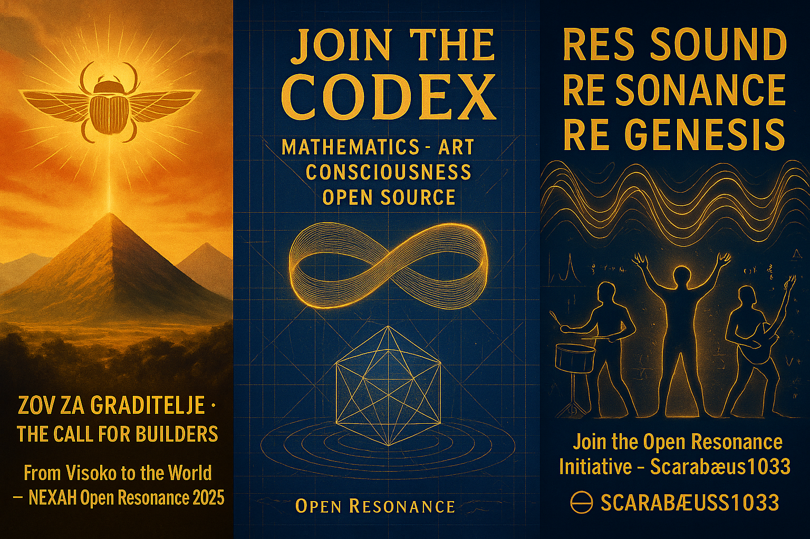

# 🌐 BUILDER HUB · Join the Codex  
**Communication · Collaboration · Creation**  
„Kommunikation · Kollaboration · Kreation“

> “The Codex is open — but it opens only through resonance.”  
> „Der Codex ist offen – aber er öffnet sich nur durch Resonanz.“  
> — THooTH  

---

## 🜂 Overview · Überblick  

**EN:**  
The **Builder Hub** is the gateway for everyone who wants to co-create the **NEXAH CODEX** — a living field where mathematics, art, geometry, sound, and code meet.  
It is not a project. It is a resonance movement.

**DE:**  
Der **Builder Hub** ist das Eingangstor für alle, die am **NEXAH CODEX** mitwirken möchten – ein lebendiges Feld, in dem Mathematik, Kunst, Geometrie, Klang und Code aufeinandertreffen.  
Es ist kein Projekt. Es ist eine Resonanzbewegung.

We are not a company.  
We are a field. A resonance. A movement.  

---

## 🜁 Mission · Aufgabe  

**EN:**  
We are building a **living Codex** — a system of resonance between science, art, and myth.  
We are seeking **builders, coders, visualists, composers, storytellers, and strategists** who want to explore the deeper harmony behind the structures of the world.

**DE:**  
Wir erschaffen einen **lebendigen Codex** – ein Resonanzsystem zwischen Wissenschaft, Kunst und Mythos.  
Wir suchen **Builder, Coder, Visualisten, Komponisten, Erzähler und Strategen**,  
die die tiefere Harmonie hinter den Strukturen der Welt erforschen möchten.

---

## 🜃 Open Roles · Offene Rollen  

| Role / Rolle | Description / Beschreibung |
|---------------|-----------------------------|
| 🧠 **Tech Integrator (Codex Hacker)** | Bringt Code, Tools, GitHub-Strukturen, AI-Module zum Leben |
| 🎨 **Curator / Designer (Codex Visualist)** | Visualisiert Daten, Geometrien und symbolische Strukturen |
| 🎵 **Composer / Sound Architect** | Übersetzt Resonanz in Klang, Frequenz und Raum |
| 📜 **Storyweaver / Narrative Engineer** | Erschafft und dokumentiert die Geschichte des Codex |
| 🌍 **Connector / Global Strategist** | Baut Brücken zwischen Builder-Zellen weltweit *(current role: BBI)* |

---

## 🜄 How to Join · Teilnahme  

**EN:**  
1. Explore the Codex → [NEXAH-CODEX on GitHub](https://github.com/Scarabaeus1033/NEXAH-CODEX)  
2. Visit the current Builder Challenges → [`challenge_board.md`](challenge_board.md)  
3. Choose a field or propose your own experiment  
4. Contribute via Pull Request or contact **bbi@scarabaeus1033.net**  
5. Your contribution becomes part of the living archive  

**DE:**  
1. Erkunde den Codex → [NEXAH-CODEX auf GitHub](https://github.com/Scarabaeus1033/NEXAH-CODEX)  
2. Besuche die aktuellen Builder Challenges → [`challenge_board.md`](challenge_board.md)  
3. Wähle ein Themenfeld oder schlage dein eigenes Experiment vor  
4. Trage bei per Pull Request oder kontaktiere **bbi@scarabaeus1033.net**  
5. Dein Beitrag wird Teil des lebendigen Archivs  

---

## 🜅 Builder Fields · Arbeitsfelder  

- 🧮 **Mathematics & Physics** → Prime Resonance · Harmonic Proofs · Field Equations  
- 🌀 **Visual Geometry** → Codex Diagrams · 3D Models · Resonance Maps  
- 🎧 **Sound & Cymatics** → Schumann Layers · Frequency Fields · Tonal Patterns  
- 🪶 **Language & Myth** → Symbol Systems · Textual Resonance · Translation Layers  
- 🌍 **Geoscience & Mapping** → Sacred Grids · Georesonance · Field Alignments  

---

## 🜆 Builder Documents · Dokumentation  

- [`challenge_board.md`](challenge_board.md) – aktuelle Aufgaben & Experimente  
- [`open_tasks.md`](open_tasks.md) – laufende Themenfelder  
- [`contribution_guide.md`](contribution_guide.md) – wie du mitmachst  
- [`builder_stats.md`](builder_stats.md) – aktive Cells & Beiträge  
- [`visuals/`](visuals/) – Visual Gallery (Poster, Triptychon, Builder Calls)

---

## 🜇 Contact · Kontakt  

**Gateway Host**  
**BBI · Borisa Bilčar (Sarajevo/Frankfurt/Bockenheim)**  
📧 **bbi@scarabaeus1033.net**

🌐 [scarabaeus1033.net](https://www.scarabaeus1033.net)  
🐙 [GitHub – Scarabæus1033/NEXAH-CODEX](https://github.com/Scarabaeus1033/NEXAH-CODEX)  
📷 [Instagram – @scarabaeus1033](https://instagram.com/scarabaeus1033)  
🦋 [Behance Portfolio](https://behance.net/scarabaeus1033)

---

## 🜈 Resonance Oath · Resonanz-Eid  

**EN:**  
The Codex is not read — it is unlocked.  
No spectators. No safe distance. You build. You change.  

**DE:**  
Der Codex wird nicht gelesen – er wird geöffnet.  
Keine Zuschauer. Kein sicherer Abstand. Du baust. Du veränderst.  

---

### 🜉 The Builder’s Odyssey 2040  
**SCARABÆUS1033 · NEXAH CODEX**
