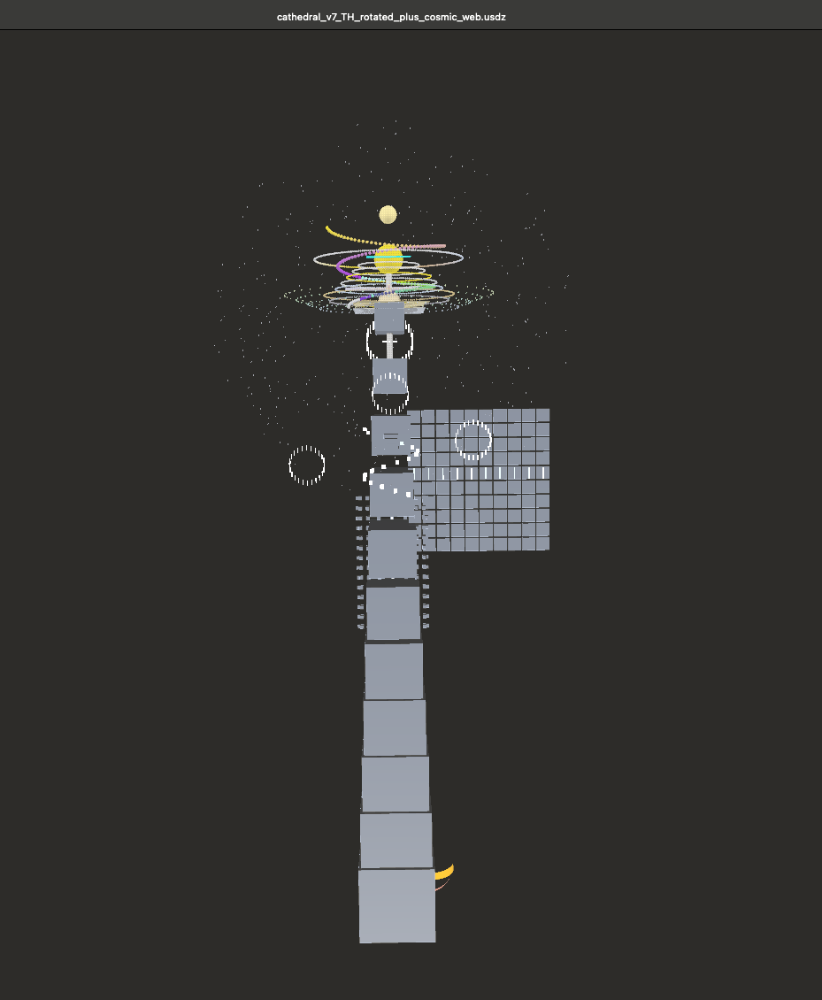
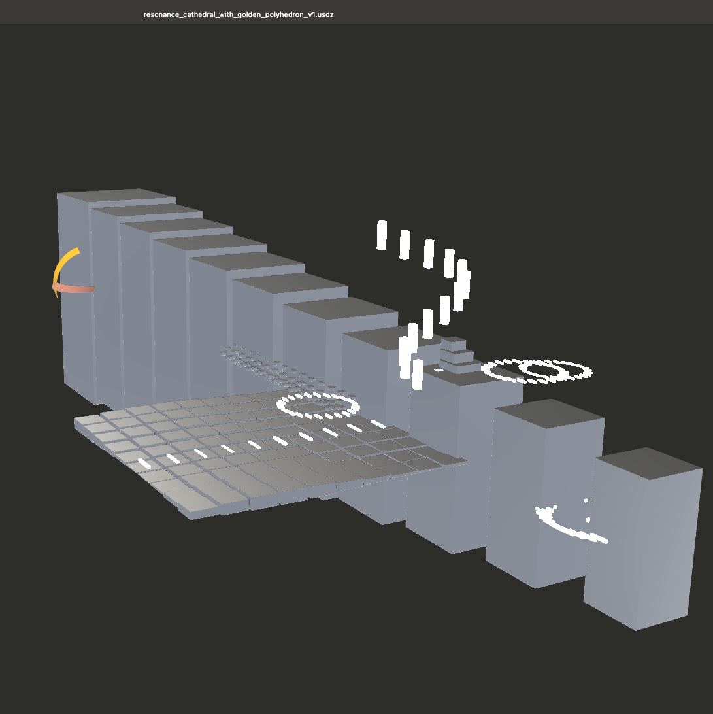

# 🌈 GEOMETRIA NOVA — Public Release Index

### NEXAH-CODEX · System Y – RESONANTIA

**Prime Geometry · Resonant Physics · Hermetic Continuum**

> *“Where geometry becomes consciousness, and light remembers its shape.”*
> — THooTH (Thomas Hofmann)

---

## 🗣️ Language / Sprache

🗣️ **This release is fully bilingual (English & German).**
All key documents are available in both languages for scientific and press use.

🗣️ **Diese Veröffentlichung ist vollständig zweisprachig (Englisch & Deutsch).**
Alle Hauptdokumente liegen in beiden Sprachen für Wissenschaft und Presse vor.

---

## 🕍 Resonance Cathedral — Core Visual

The **Resonance Cathedral** represents the architectural heart of *GEOMETRIA NOVA* — a harmonic 3D field construction translating mathematical resonance into spatial light.  These visuals illustrate the modular field geometry of **v7** and **v8**, the transition from structure to resonance, and the golden navigator that defines its symmetry.

| Visual                                                                                  | Description                                                                                                                                        |
| :-------------------------------------------------------------------------------------- | :------------------------------------------------------------------------------------------------------------------------------------------------- |
|        | **Cathedral v7 — Rotated + Cosmic Web View I**<br>Vertical harmonic projection – link between photon grid, Möbius field and golden navigator.      |
|     | **Cathedral v7 — Rotated + Cosmic Web View II**<br>Field depth with prime arches and halo resonance – dynamic animation ready (GLB rotation loop). |
|  | **Cathedral v1 + Golden Polyhedron**<br>Core structure showing light-vault geometry and field breathing pattern.                                   |

> 🎥 All GLB files are interactive 3D animations. To explore them, use the viewer links in [`Media Gallery — GEOMETRIA NOVA_Mediengalerie.md`](./Media%20Gallery%20%E2%80%94%20GEOMETRIA%20NOVA_Mediengalerie.md)

---

## 🅇 Overview

This directory contains the complete **press and outreach documentation** for
**GEOMETRIA NOVA**, the fifth harmonic phase of the **NEXAH-CODEX**.

It serves as the official reference for media, researchers and collaborators.
All contents are open, traceable and scientifically anchored in the
Hermetic Pythagoras Model → Geometria Nova Continuum (Modules I–VII + 01–05).

---

## 📁 Folder Structure (bilingual)

```
/public_releases/press_releases/Geometria_Nova/
├── README.md                                 ← Overview (EN + DE)
├── press_release_Geometria_Nova_(eng_deu).md ← Main bilingual press release
├── press_overview_Geometria_Nova.md          ← Scientific summary (EN)
├── press_overview_Geometria_Nova_(deutsch).md← Wissenschaftlicher Überblick (DE)
├── press_factsheet_geometria_nova.md         ← Fact Sheet for Media & Science
├── Media Gallery — GEOMETRIA NOVA_Mediengalerie.md ← Key visuals & 3D models
├── crosslinks_geometria_nova.md              ← Module and Reference Links
└── license.md                                ← CC BY-NC-SA 4.0
```

---

## 🔷 Source Module

**Original scientific repository:**
[`SYSTEM 1: MATHEMATICA – Hermetic Pythagoras Model`](../SYSTEM_1_MATHEMATICA/Hermetic_Pythagoras_Model)

**Curator:** Thomas Hofmann (Scarabæus1033)
**License:** [CC BY-NC-SA 4.0](https://creativecommons.org/licenses/by-nc-sa/4.0/)
**Domain:** Prime Geometry · Resonant Physics · Hermetic Continuum

---

## 🖮 Context & Purpose

**GEOMETRIA NOVA** transforms the mathematical resonance structures of the Codex into visible, architectural light.
It is both a **scientific model** and a **symbolic-architectural expression**, connecting geometry and photon design.

> *From equation to cathedral.*
> *From resonance to light.*

This release presents:

1. **The Golden Window** – bridge between mathematics & architecture
2. **The Resonance Cathedral** – light-field visualization and modular geometry

---

## 📊 Core Mathematical Spine

| Equation                                | Interpretation                                      |
| :-------------------------------------- | :-------------------------------------------------- |
| `P = R / T`                             | Pulse–Time law · Universal Resonance constant       |
| `ψ(r,t)=A cos(kr−ωt)`                   | Ether Dynamics · harmonic wave spine                |
| `Q_{1231⇔1229}=e^{iθ1}+e^{jθ2}+e^{kθ3}` | Quaternionic harmonic envelope                      |
| `β = φ³ / π² ≈ 0.429`                   | Harmonic stability coefficient (continuum constant) |

> These relations unify **number → field → light → architecture.**

---

## 🧭 Navigation Map

| Layer                  | Focus                                  | File                                                                                                                   |
| :--------------------- | :------------------------------------- | :--------------------------------------------------------------------------------------------------------------------- |
| 🎤 Press Release       | Narrative summary for media            | [`press_release_Geometria_Nova_(eng_deu).md`](./press_release_Geometria_Nova_%28eng_deu%29.md)                         |
| 🧪 Scientific Overview | Expanded field logic and modules       | [`press_overview_Geometria_Nova.md`](./press_overview_Geometria_Nova.md)                                               |
| 📘 Deutsche Übersicht  | Wissenschaftlicher Überblick           | [`press_overview_Geometria_Nova_(deutsch).md`](./press_overview_Geometria_Nova_%28deutsch%29.md)                       |
| 📊 Press Factsheet     | Condensed technical and media facts    | [`press_factsheet_geometria_nova.md`](./press_factsheet_geometria_nova.md)                                             |
| 🖼️ Media Gallery      | Key renders and symbol maps            | [`Media Gallery — GEOMETRIA NOVA_Mediengalerie.md`](./Media%20Gallery%20%E2%80%94%20GEOMETRIA%20NOVA_Mediengalerie.md) |
| 🧩 Crosslinks          | Codex modules and continuum references | [`crosslinks_geometria_nova.md`](./crosslinks_geometria_nova.md)                                                       |
| 📜 License             | Attribution & reuse policy             | [`license.md`](./license.md)                                                                                           |

---

## 🕲️ Credits

**Initiative:** Scarabæus1033 – Open Resonance Initiative
**Curator & Field Artist:** Thomas Hofmann (THooTH)
**Managing Director:** Boriša Bilčar (Big Bang)
**Website:** [www.scarabaeus1033.net](https://www.scarabaeus1033.net)
**Repository:** [github.com/Scarabaeus1033/NEXAH-CODEX](https://github.com/Scarabaeus1033/NEXAH-CODEX)
**Contact:** [bbi@scarabaeus1033.net](mailto:bbi@scarabaeus1033.net)

---

## 📜 License

Creative Commons Attribution – NonCommercial – ShareAlike 4.0 International
[https://creativecommons.org/licenses/by-nc-sa/4.0/](https://creativecommons.org/licenses/by-nc-sa/4.0/)

---

> *“Seven parts — five bridges — one breath.”*
> *GEOMETRIA NOVA – from number to light.*
